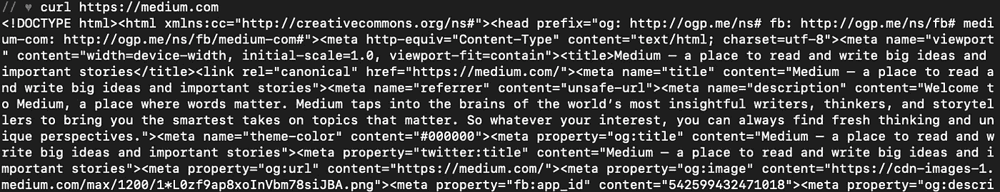
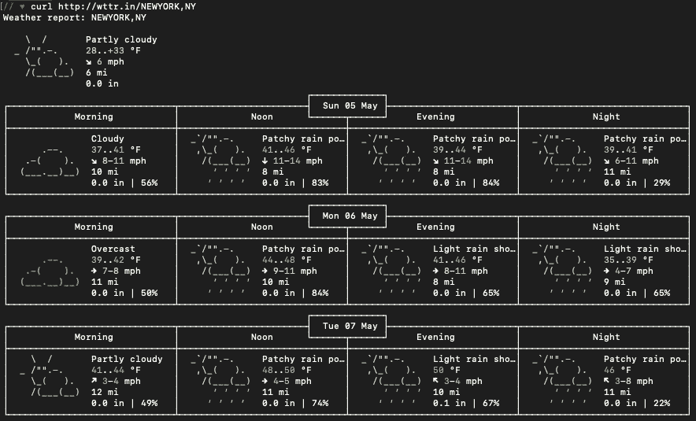
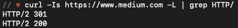

# 卷发只是想找乐子

> 原文：<https://itnext.io/curls-just-want-to-have-fun-9267432c4b55?source=collection_archive---------1----------------------->

## 命令行工具简介`cURL`

我最近接受了一个定时代码挑战，要创建一个 Ruby on Rails 后端，作为 RESTful API。除了所有的技术需求，我被告知用户与这个 API 交互的唯一方式是使用`curl`。

在这次挑战之前，我从未见过也没用过`curl`。因此，我需要快速研究并熟悉`curl`，以确保我的 API 能够按预期运行。

# 什么是卷曲？

最简单地说，`curl`是一个“通过 URL 传输数据的命令行工具和库”( [cURL 文档](https://curl.haxx.se/))。cURL 代表“客户端 URL 请求库”它是免费的，开源的，源代码可以在 [GitHub/curl](https://github.com/curl/curl) 上找到。

你应该注意到，cURL 作为一个组织实际上生产两种产品，`curl`和`libcurl`。第一个是命令行工具，我将更详细地探讨，而`libcurl`是一个开发库，供其他程序使用。

# 我如何使用卷曲？

我当然不可能涵盖所有使用`curl`的方法，因为`curl`命令有大约 170 种变化。也就是说，我将提供一些关于如何从命令行使用`curl`的有用例子。

## 获取请求

要发出一个简单的 GET 请求，只需使用`curl` +网站 URL。例如，`curl [https://medium.com](https://medium.com)`将产生以下结果:

请注意，这个 GET 请求返回 HTML。

您还可以随 GET 请求一起传递附加项。例如，如果网站有受保护的内容`curl`允许您传递认证凭证。为此，请使用以下语法:

`curl --user "USERNAME:PASSWORD" [https](https://api.github.com/gists/starred)://www.domain.com`。

“用户名”必须用引号中的实际用户名替换。如果您不想在命令行历史中包含您的密码，您可以简单地使用下面的请求:`curl --user "USERNAME" [https](https://api.github.com/gists/starred)://www.domain.com`，系统会提示您输入登录凭证。

## 发布请求

在我的代码挑战中，我的 RESTful API 正确处理发送给它的信息是很重要的。要发布到网站/API，请使用以下语法:

`curl --data -X POST "param1=value1&param2=value2" https://medium.com`

`--data`标志确实意味着 POST 请求，因此您可以省略`-X POST`标志。您发布的 URL 会跟随您发送的数据。

## 删除请求

如果您的 API 遵循 RESTful 约定，那么您将能够通过向正确的 route/:id 发送删除请求来删除特定的实例。例如，如果我有一个计划 API，并且我想删除其中一个计划，我将使用下面的命令:`curl -X "DELETE" http://localhost:3000/schedules/:id`其中`:id`是一个现有计划的 ID。

## 改变内容类型

使用`curl`发送的标准数据使用`application/x-www-form-urlencoded`数据类型发送。这种类型的请求的主要目的是向服务器发送名称/值对的列表。虽然这是`curl`的默认设置，但您并不局限于以这种方式发送数据。这也不是发送数据的最有效方式，如果您要发送大量数据，您可能不想使用默认方式。

浏览器还必须支持以`multipart/form-data`的形式发送数据。这需要一些额外的信息，主要是 MIME(多用途互联网邮件扩展)头。

此外，您可以选择以 JSON 的形式发送信息。为此，我们将使用`-H “Content-Type: application/json”`标志来表示我们正在添加一个标题。作为 JSON 发送的 POST 请求示例如下所示:

`curl -H "Content-Type: application/json" --data '{"name": "Sample Schedule Name"}' [http://localhost:3000/schedules](http://localhost:3000/schedules)`

上面的`curl`帖子将为我们假想的 RESTful API 创建一个新的调度，新调度的名称是:“Sample Schedule Name”。

# 你可以用`curl`做一些有趣的事情

*   **获取天气**。
    通过运行命令:`curl [http://wttr.in/LOCATION](http://wttr.in/LOCATION)`并添加所需位置，您将获得所需位置的预测。

发送 curl 请求后返回的天气报告示例:`http://wttr.in/NEWYORK,NY`

*   **测试一个网站的状态。** 通过运行命令:`curl -Is [https://www.medium.com](https://www.medium.com) -L | grep HTTP/`您将能够看到来自所请求 URL 的 HTTP 响应代码。

从中型 HTTP 请求返回的示例响应代码

*   **查找您的外部 IP 地址。** 您可以通过运行命令来定位您的外部 IP 地址:
    `curl ifconfig.me`
    您的外部 IP 地址与您的本地 IP 地址不同。

> 外部或公共 IP 地址用于在整个互联网上定位计算机系统和设备。本地或内部 IP 地址用于在专用网络中查找连接到该网络的计算机和设备。
> 
> - [外部和本地 IP 地址有什么区别？](https://www.h3xed.com/web-and-internet/whats-the-difference-between-external-and-local-ip-addresses)

# 资源

如果你对`curl`有兴趣，你可以参考`curl`文档找到更多信息。

cURL 电子书及背景资料:[https://ec.haxx.se/](https://ec.haxx.se/)

卷发手册:【https://curl.haxx.se/docs/manual.html 