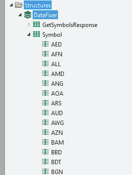
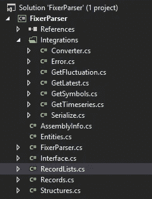
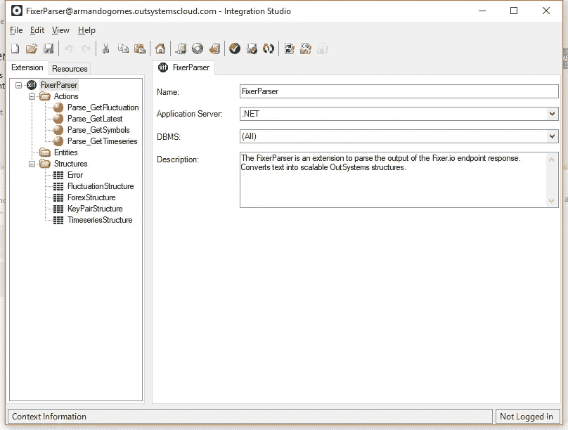
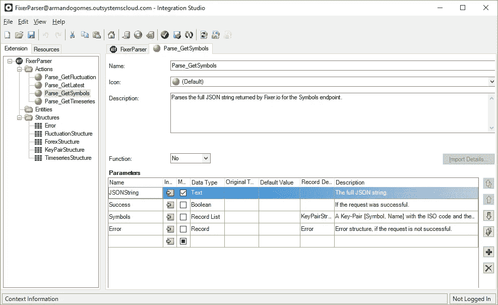
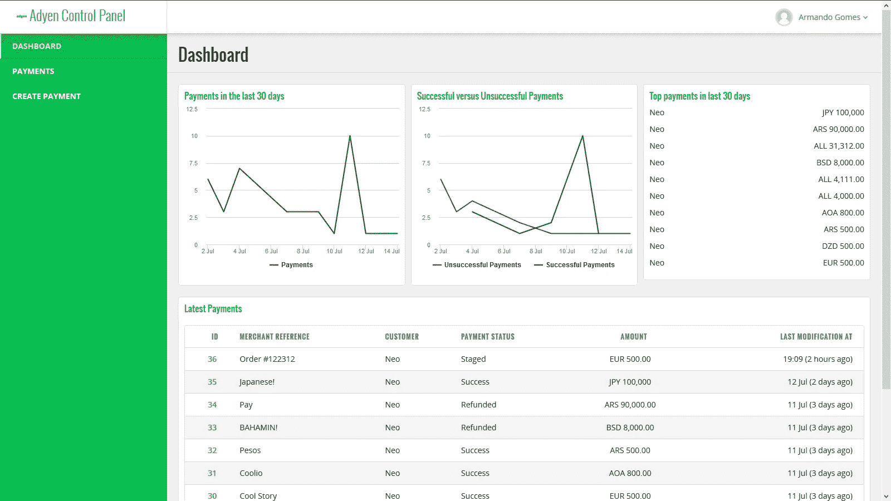
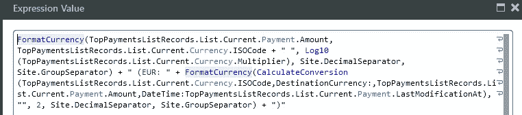

# “实践中的货币”——或者在外部系统中实现货币转换器的故事

> 原文：<https://itnext.io/currencies-in-practice-or-the-story-of-implementing-a-currency-converter-in-outsystems-367c90723aa3?source=collection_archive---------7----------------------->

H **ello** 各位！我又回来了，带来了与 OutSystems 平台的另一个令人惊叹的集成。这一次，我们将集成 Fixer，这是一个简单的轻量级 API，用于当前和历史外汇(forex)汇率。

**在继续之前，我想公开感谢 Andreas 和所有 Fixer 团队，感谢他们为构建这个集成所给予的支持。谢谢您们。**

此外，在深入研究货币、Fixer API 以及如何使用它的技术细节之前，我想提出两点意见:

*   第一个是我被任命为 **OutSystems MVP** ！我为这一成就感到骄傲，我要感谢所有人——当然还有 OutSystems！—我曾经遇到过的人。没有你，这一切都不可能。

*   第二个是保证我会尽我所能，以确保我值得被认可。我为成为这个社区的一员而自豪，你知道，分享就是关爱！

[欢迎访问我的网站](https://armandogom.es)——它一直在不断发展——看看我都做了些什么，更重要的是，看看我能为你做些什么。此外，感谢所有的反馈！如果你找不到你要找的东西，请随时联系我，我会尽可能地帮助你。

所以我们不要再说我了，开始说你吧。或者，在这种情况下，你可以得到的东西，完全免费！

# 免费时间

到目前为止，你可能已经意识到 OutSystems 已经被认为是一只独角兽，因为他们是一群好人，他们正在回馈开发者——就像，谁需要 3.6 亿美元呢？你真诚的。好吧，但这不关我的事。这是关于尼奥的。因此，你有独特的机会获得一个非常有限的手工制作的新形象。听起来很棒，对吧？你唯一需要做的就是点击下面的链接，用你的邮箱注册。博客上有更详细的说明，但你会很快掌握它的窍门。

 [## 对于我们新的 3.6 亿美元投资，我们首先要做的事情是什么？感谢我们的…

### 没有你们，我们忠诚而专注的开发人员，我们不可能取得今天的成就。以下是我们打算如何感谢…

www.outsystems.com](https://www.outsystems.com/blog/posts/thanking-our-developers-first/?r=r2bL4) 

**免责声明**:是的，如果你通过了这个链接，我就会晋升，我会先得到一个 Neo。不过，我会贴一些它的照片。

在不太可能的情况下，你和我一样，你想知道类似这样的事情:“当他们可以把所有的钱都花在披萨和蛋糕上时，为什么还要制作活动人偶？”对此，我也有一个答案: [Meetups。加入下一个。](https://www.meetup.com/pt-BR/Lisbon-Outsystems-Community-Meetup/)

# 情节正精彩，当然要继续。

既然我已经谈到了我自己——**该死的自恋狂**——**以及你可以赢得的东西，是时候回到我们的主题了——fixer . io API 的外部系统包装器。**

**那么，货币在实践中，是吧？如果你想知道，答案是肯定的:这篇文章的标题灵感来自于我个人喜欢的一本名为**软件** **实践中的架构**的书。这是一本好书，你应该看看。这不是一篇常规的“从头到尾阅读”，而是关于质量属性和实现这些属性的策略的非常有趣的主题。如果你对软件架构感兴趣，我认为它值得一看。**

**让我们回到主题。现在您可能已经知道，OutSystems 支持多语言和多租户。但是……多币种呢？是的，OutSystems 不支持多币种，至少不直接支持。**而且，需要明确的是，我们不会为您的多种货币需求创建一个通用的解决方案**。我将提出一个使用 Fixer 的 API 的可能性列表，以便支持一组场景。**

**而现在，万能的问题:**哪些场景？****

**在进入场景列表之前，我想快速介绍一下这个主题，并澄清一组从现在开始将非常非常常见的术语。**

## **那么，什么是货币呢？**

> **A **货币**(来源于中古英语:*curra num*，“流通中”，来源于拉丁语: *currens，-entis* )，在这个词最具体的用法中，是指作为交换媒介实际使用或流通时的任何形式的货币，尤其是流通的纸币和硬币。更一般的定义是，货币是一种通用的货币体系(货币单位)，尤其是在一个国家。在这个定义下，美元、英镑、澳元、欧洲欧元和俄罗斯卢布都是货币的例子。这些不同的货币是公认的价值储存手段，并在外汇市场上进行交易，外汇市场决定了不同货币的相对价值。这种意义上的货币是由政府定义的，每种货币的接受范围都是有限的。**

**以上摘录摘自免费百科全书 [Wikipedia](https://en.wikipedia.org/wiki/Currency) 。但是，我们大多数人都很清楚货币是什么——因为我们几乎每天都在使用它——对吗？因此，相关的问题——也是绝大多数人可能不知道的问题——是:为什么一种货币的价值会变化？**

**据 Investopedia 称，有六个主要因素会影响一种货币的价值。同样，货币的价值不是一个绝对值，而是**总是**相对于不同货币的相对值。截至 2018 年 8 月 21 日，一(1)欧元相当于一美元十五美分(1.15)。**的绝对值**将永远是 1——一欧元将永远是一欧元。**

**这些主要因素是:**

*   **通货膨胀的差异**
*   **利率差异**
*   **经常账户赤字**
*   **国债**
*   **进出口交换比率**
*   **政治稳定和经济绩效**

**对这些因素的全面描述以及更多信息可以在下面的文章中看到:[影响汇率的 6 个因素](https://www.investopedia.com/articles/basics/04/050704.asp)，来自 Investopedia。**

**现在我们已经看到了影响货币价值的因素的冰山一角，让我们在本文的剩余部分讨论一些将被广泛使用的术语。**

*   ****符号**:符号是给定货币的代码。EUR 是欧元的符号，而 USD 是美元的符号。**
*   ****基础**:计算值所依据的基础货币/符号。如果以欧元为基础的美元价值是 1.20，这意味着€1 将得到 1.2 美元。**
*   ****EOD** :日终。在本文的上下文中，EOD 值将是某一天的参考值。**

**还记得关于场景的终极问题吗？所以:我们将每小时检索一组符号相对于一个基数的当前值。默认情况下，我们的基础将是欧元。如果您需要另一个基地，比如说您的业务以美元为基础，我们可以:**

**a)从 API 中检索新值**

**b)使用公共基数计算该值。**

**就可能的选择而言，一个有潜在的成本(API 限制)，另一个…没有那么多。不仅如此，我们还将通过提供一组函数来支持这两者，以在给定的时间点检索一个值(如果您在金融交易中处理多种货币，这是一件好事)，并使用基本货币 C 从货币 A 转换为货币 B(通常称为交叉货币汇率)。**

**我不打算讨论如何获得一个 API 密钥，因为，嗯… [在 Fixer 的网站上这是非常简单的。](https://fixer.io/product)一旦有了 API 密匙，就可以开始集成可用的端点了。**

****现在，技术细节。****

**默认情况下，Fixer 提供了六个不同的端点:一个用于支持的符号，五个用于货币值本身。在这五个与货币相关的端点上，我们有一个用于最新值，一个用于历史值，一个用于货币转换，一个用于两个日期之间的货币波动，一个用于时间序列值。**

**虽然前三个似乎很清楚它们的目的，但让我简单解释一下最后两个端点。仅仅为了这个例子，考虑两个日期:1 月 1 日和 1 月 5 日。当您调用波动端点时，您将检索 1 月 5 日和 1 月 1 日的 **EOD** 值之间的差异——因此，只有一个结果。如果您调用这两个日期的时间序列值，您将收到这五天之间给定符号的每日 **EOD** 值——因此，有五个结果。一旦我们到达实现和响应本身，这将更容易理解。**

**关于可用的端点，我想在这里做一个非常重要的声明:**并非所有端点都包括在免费层中。**只有**符号**、**最新**和**历史**数据包含在自由层中，这并没有什么问题，因为我们可以使用自由端点来获取与付费端点相关的数据，只要我们在自由层本身的限制范围内这样做。这就是为什么当您查看 REST 集成时，您会看到两个“不同”的条目:一个名为 **FixerFree** 而另一个名为 **FixerPaid** 。它们每个都包含各自的端点，而 BaseURL 属性是相同的。**

# **整合**

**如前所述，我们将实现所有六个可用的端点。所有端点的实现逻辑都非常相似:我们获得完整的请求和响应，粘贴到 Service Studio 中，然后它就创建了与所有结构的集成。我们将通过数据模型存储所有信息来支持这种集成。简单吧？**

**嗯…没那么多。让我解释一下为什么，用端点这个符号。让我们对端点做一个 GET 请求:[【http://data.fixer.io/api/symbols?access_key=】T21<API KEY>](http://data.fixer.io/api/symbols?access_key=)。这是您将看到的结果:**

****图 1 —符号端点输出****

****

****图 2 —生成的结构。****

**看起来像是一个简单的输出，对吗？不对！当您使用 OutSystems 的默认功能来导入 REST 方法/端点时，您将得到如图 2 所示的结果。比如，一个结构上有 168 个属性。正如杰西·文图拉所说，*我没有时间检查一个结构的 168 个属性，我必须手动迭代*** 。此外，在任何人对我说“也许 [ardoJSON](https://www.outsystems.com/forge/component/413/ardojson/) 可以做到这一点”之类的话之前，我要说一次，而且只能说一次:**

****图 3——但这是一种不同的爱，伙计！****

**** [是的，我 100%确定杰西·文图拉说过这话](https://www.youtube.com/watch?v=aqDwqdSF6Ec)。**

**那么，我做了什么？除了 Convert 之外，每个端点的输出都是纯文本。然后，我将使用一个很酷的自定义 C#扩展来解析输出，并为外部系统提供一个“可伸缩”的响应版本。尽管看到了低代码平台的所有好处，但我仍然喜欢“敲打一些代码行”——灵感来自[卡洛斯·卡瓦哈尔的“把所有的肉放在烤肉上”](https://www.youtube.com/watch?v=H29HYFu_UmA)。可能这就是为什么我为接下来的日子准备了一些新的和旧的阅读材料——尽管这些书没有一本书是外部系统人员“推荐”阅读的。**

****

****图 4 —阅读材料。是的，那些是球罐。关于最后一个，我敢肯定，我的数据结构和算法老师会感到自豪。****

**因为我不想让这篇文章变得太长，所以让我快速总结一下开发过程:**

*   **我们将从 Fixer 中检索完整的 JSON 输出**
*   **我们将使用一个工具从 JSON 输出中生成一个 C#类。(有趣的部分，相信我)**
*   **我们将使用 Integration Studio 来实现这些方法，这样我们就可以在外部系统中接收数据。**

**我不打算深究“如何将 REST 端点导入 OutSystems”。互联网上有很多资源，事实上，这些资源太简单了，你应该自己先尝试一下。**

**到目前为止，我们已经在 Service Studio 中集成了端点。因此，让我们转到有趣的部分:在 OutSystems 扩展上处理响应。如上所述，**我已经使用一个工具从 JSON 输出**生成了一个 C#类。如果你在 c#类中搜索 *json，*你会看到的第一个结果很可能是【http://json2csharp.com】的[。虽然这完全没问题，但在底部有一个名为 Quicktype 的选项。我**强烈推荐使用 Quicktype** 。为什么？](http://json2csharp.com)**

**我将指导您完成我的旅程，我将使用 json2csharp 从 JSON 对象生成一个 C#类。对于符号端点，我们得到:**

****图 5 — json2csharp 输出。****

**看到结果了吗？我根本不是 C#专家，但我想知道:如果知道键是字段本身的名称，我如何将这组元素转换成键对列表？**

**[你好，haaaaave 你见过倒影吗？对于那些不知道的人来说，反思对于程序员就像恶魔对于孩子一样。这里我可能有点夸张——除非你尝试用 CLOS 做元编程:在这种情况下，恶灵就像饼干怪兽一样邪恶。](https://www.youtube.com/watch?v=FSKIoPylEkM)**

****反思很牛逼，但也有问题。使用反射的性能成本是不可忽略的。**幸运的是，使用 Quicktype，我得到了这个简洁的版本:**

****图 6 — Quicktype 输出****

****相关说明:**使用 Quicktype 从 JSON 对象生成 C#类供外系统使用时，请确保您选择的 C#版本是 V5。默认情况下，V6 被选中，不会被编译。注意:在与其他 MVP 的聊天中，它可能与 MSBuild 有关。我会进一步看看，并相应地更新帖子。**

****稍微相关的注意事项**:如果您使用由 Quicktype 生成的多个类，这些类具有共同的元素——比如一个错误结构——那么只需将这些类移动到单独的文件中。然后，您可以从生成的代码中删除它们，只要您引用了所有内容，就不会出现错误。**

****

****图 7—延伸结构。****

**根据前面的说明，我已经将*内部静态类转换器、公共静态类序列化*和*错误*类——图 6 中没有显示——移动到单独的文件中，最终结果类似于图 7。这样做，我们将有四个类用于五个端点(这种方法不考虑 Convert endpoint)，转换器、序列化和错误类(泛型)。如果你擅长数学，你会想:等等，什么？五个端点四个类？**

**是的，这是因为历史汇率和最新汇率具有相同的产出结构。那么，我们能做什么呢？没错，我们可以用同样的代码。已经在保存工作了。**

****

**图 8——我们都擅长数学。来源:亚马逊网站**

**现在让我们进入行动本身。在 Integration Studio 上，我们将使用图 9 所示的配置创建一个扩展。**

****

****图 9 —扩展配置。****

****注意:**在任何人问之前，Java 版本目前还不可用。这可能会在未来发生，尽管可能性很小。**

**然后，我们将定义一个动作和以下参数——如图 10 所示:**

*   **JSONString(输入)**
*   **成功(产出)**
*   **符号—密钥对列表(输出)**
*   **错误-一般错误结构(输出)**

****

****图 10——打开 Parse_GetSymbols 的 Integration Studio。****

**既然我们已经定义了我们的动作并更新了我们的扩展代码，那么是时候使用我们生成的类了:**

****图 11 — Parse_GetSymbols 方法体。****

**上面你可以看到我们在做什么。**这是所有动作**的通用程序。彼此的不同之处在于字段的复杂性和/或数量。如果你愿意，可以随意看看这个扩展的源代码，如果你有任何问题、顾虑或建议，请告诉我。还是那句话，分享就是关爱。**

**因此，除了变量的常规初始化，我们将 JSON 字符串反序列化为一个 *GetSymbols* 对象(第 16 行),并验证请求是否成功。如果是这样，我们迭代我们的字典并创建一个*key pair structure Record*——我想知道为什么全名是***RC****key pair structure****Record***——既然最佳实践告诉我们以 RC 开始一个记录名称，我们将把它附加到列表中。**

**如果请求不成功，我们填充我们的错误结构。简单。**

**我在这里补充一个个人评论:当我开始为这个组件工作时，我渴望用 C#写一篇关于反射的文章，所以你会认为我是一个超级 DUPERüBER c#程序员。但是这就是软件开发的酷之处:你所想的事情，它们变化得如此之快和容易(#敏捷)。朋友们，这就是我们工作的美妙之处——如果我改行做电视新闻主播，那将是我的结束语。**

# **但是…我们如何使用它呢？**

**创建一个组件并写一篇关于它的文章是没有价值的，如果你没有展示它的工作。因此，如果您还记得以前的文章，我们已经有了一个控制面板，这将是这个组件的一个很好的候选。**

** [## “别担心，女士，你不需要在电话里分享你的信用卡信息”——或者…

### 又见面了！今天，我们的主要课程是在用开发的 web 应用程序中接受信用卡支付

itnext.io](/dont-worry-ma-am-you-don-t-need-to-share-your-credit-card-details-over-the-phone-or-the-story-6e785175d1a5) 

因此，总结一下——并创建一个场景——我们已经有了一个控制面板，显示通过我们的网关进行的最新支付。这些最新的付款可以有不同的货币，但我们的业务只使用欧元。

在参考文章的图 17(图 12)中，您可以看到下面的图像:

**图 12 — Adyen 控制面板**

在右上角，我们有一个 CardSimple，上面有过去 30 天的**最高付款额。很难看出，但是我们有欧元、日元和其他货币的支付。现在让我们更改这个 CardSimple，并确保显示交易发生当天的兑换值。原始值将转换成欧元。这有一个“许可”的原因，我将在后面解释。**

为了简单起见，我将使用一个可用的函数— CalculateConversion。对于 ListRecords 小部件上的每一项，我将调用函数并计算结果。功能行为如图 13 所示。

**图 13 —计算转换函数。**

**该函数接收以下输入参数** : BaseCurrency(文本)、DestinationCurrency(文本)、Amount(货币)、Date(日期)**和一个输出参数** : Value(货币)。现在，一步一步来:

*   我们检查给定日期的货币值是否已经可用(GetConversion aggregate)。如果它存在，我们就返回值。
*   如果不存在，我们尝试进行交叉货币转换。如果这两个值对于提到的日期都可用，我们返回计算出的值。计算按以下方式进行-有意缩短元素。

**金额/ (GetSourceCurrency。Value / GetDestinationCurrency。值)**

*   如果这些值不可用，我们向 API 执行一个请求，如果成功，将返回费率。因为我们只请求一个值，所以我们可以立即映射到输出。

然后，在 **Card** 小部件上的 **ListRecords** 上，我们将把它添加到我们的表达式中——如图 14 所示。由于对转换后的金额使用了 **FormatCurrency** 函数，所以有点“臃肿”。此外，由于我们使用欧元作为基数，我们不需要做任何小数位的计算。为了理解这个概念，请参考上一篇文章。

**图 14 — ListRecords 表达式。**

我们有了第一个**格式货币**，现在我们添加了文本部分*(EUR:XXX)，*，其中 XXX 将使用 CalculateConversion 函数来计算。**只有一个重要的注意事项**:看到我在调用 **CalculateConversion** 函数时没有使用 **DestinationCurrency** 参数了吗？这是因为我们将 **DestinationCurrency** 参数映射到服务调用的基本参数。因为我们使用免费层，所以我们不能在 API 调用中使用 base 参数，默认情况下，它将是 EUR。如果你至少有基本的会员资格，你可以使用它。

这是最终结果——与谷歌在相应日期的价值完全吻合:

**图 15 —用户界面上的最终结果。**

就这些了，伙计们！**该组件已经在 OutSystems Forge** 的[https://www . out systems . com/Forge/component/4122/fixer-io-API/](https://www.outsystems.com/forge/component/4122/fixer-io-api/)上提供。

**在结束之前，我要尝试一些新的东西**。我正在研究发表赞助文章的可能性。如果您(或您的公司)有一些闲钱，并且愿意赞助任何文章或某个特定主题，请通过 [**给我留言。而且，要明确这一点:**我真的很喜欢写作和创造新的内容，所以**我不会把钱留给自己。**](mailto:hello@armandogom.es)

因此，所有赞助文章的利润都将捐赠给慈善机构。

关于这方面的更多细节，请通过上面的电子邮件、 [Twitter](https://www.twitter.com/portuguesecoder) 或 [LinkedIn](https://www.linkedin.com/in/armandogomes) 联系我。

保重。

_________________________________________

**quick type**:[https://quick type . io](https://quicktype.io)

**固定器**:[https://fixer.io/](https://fixer.io/)

**fixer . io API**:[https://www . out systems . com/forge/component/4122/fixer-io-API/](https://www.outsystems.com/forge/component/4122/fixer-io-api/)**