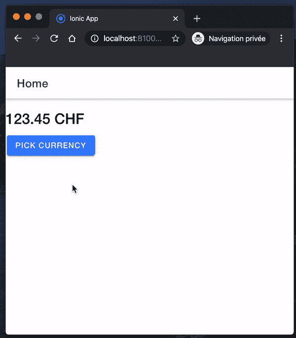
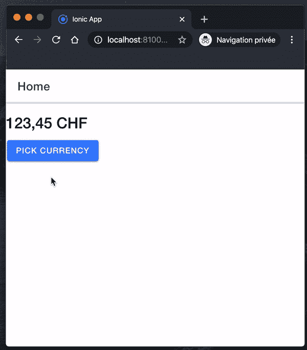

# 具有离子反应的货币拾取器和格式化器

> 原文：<https://itnext.io/currency-picker-and-formatter-with-ionic-react-ede8e2ff53df?source=collection_archive---------3----------------------->

## 为用 Ionic 和 React 开发的应用程序构建一个货币选择器和格式化程序


在 [Unsplash](https://unsplash.com/s/photos/free?utm_source=unsplash&utm_medium=referral&utm_content=creditCopyText) 上由 [Pawel Janiak](https://unsplash.com/@pawelj?utm_source=unsplash&utm_medium=referral&utm_content=creditCopyText) 拍摄

我每天分享[一招](https://medium.com/@david.dalbusco/one-trick-a-day-d-34-469a0336a07e)直到原定的瑞士新冠肺炎隔离期结束的日期，2020 年 4 月 19 日。离第一个里程碑还有一天。希望更好的日子就在前面。

我在为今天的博客帖子寻找一个主题想法，我想到也许我可以分享我从[领带追踪器](https://tietracker.app.link/)中学到的一些东西⏱️，一个简单的，开源的，免费的时间追踪应用程序，我用 [Ionic](https://ionicframework.com/) 和 [React](https://reactjs.org/) 开发的。

这就是为什么我与你分享我的解决方案，开发一个自定义的货币选择器和格式化程序。


# 开始

如果您还没有 Ionic React 应用程序，您可以按照本教程使用他们的 CLI 创建一个示例应用程序。

```
ionic start
```

出现提示时，选择“React”，您的应用程序名称，例如模板“blank”。

# 货币列表

我们打算开发一个自定义的货币选择器，这就是为什么我们需要一个货币列表。为此，我们可以下载 [Xsolla](https://github.com/xsolla/currency-format) repo 上提供的一个，因为它是免费的，并根据 MIT 许可证进行许可。

```
curl https://raw.githubusercontent.com/xsolla/currency-format/master/currency-format.json -o public/assets/currencies.json
```

我使用`curl`是因为我使用的是 Macbook，但重要的是将货币列表保存在 assets 文件夹中，因为它必须随应用程序一起提供。

# 类型脚本定义

我们需要一个 TypeScript 定义来处理我们刚刚下载的列表。这就是为什么我们在`./src/definitions/currency.d.ts`中创建以下接口。

```
export interface Currency {
    name: string;
    fractionSize: number;
    symbol: {
        grapheme: string;
        template: string;
        rtl: boolean;
    };
    uniqSymbol: boolean;
}

export interface Currencies {
    [currency: string]: Currency;
}
```

注意，我不确定使用子文件夹`definitions`是不是最好的做法，这只是我做的事情。我不认为这有多大关系，我只是喜欢把我的代码分成包。

# 模态:货币选择器

为了开发我们的 picker，我建议我们使用一个模型。它应该显示可用货币的列表(货币名称和缩写)，允许用户过滤这些，并最终让他/她选择一个。

我们创建了一个新的组件`./src/components/CurrenciesModal.tsx`,它接收当前所选货币的属性，以及一个关闭模型并传递用户选择的函数。

```
interface Props {
    closeAction: Function;
    currency: string;
}
```

它也包含两种状态。货币列表和一个过滤后的列表，当组件安装时，等于所有列表。

```
const [currencies, setCurrencies] = 
      useState<Currencies | undefined>(undefined);
const [filteredCurrencies, setFilteredCurrencies] = 
      useState<Currencies | undefined>(undefined);
```

为了初始化这些，我们使用了`useEffect`钩子，并读取了之前下载的 JSON 数据。

```
useEffect(() => {
    initCurrencies();
    // eslint-disable-next-line react-hooks/exhaustive-deps
}, []);

useEffect(() => {
    setFilteredCurrencies(currencies);
}, [currencies]);

async function initCurrencies() {
    try {
        const res: Response = 
                   await fetch('./assets/currencies.json');

        if (!res) {
            setCurrencies(undefined);
            return;
        }

        const currencies: Currencies = await res.json();

        setCurrencies(currencies);
    } catch (err) {
        setCurrencies(undefined);
    }
}
```

为了继续过滤，我们实现了一个函数，它读取用户输入并调用另一个函数，该函数有效地将过滤器应用到我们作为状态对象维护的列表上。

```
async function onFilter($event: CustomEvent<KeyboardEvent>) {
    if (!$event) {
        return;
    }

    const input: string = ($event.target as InputTargetEvent).value;

    if (!input || input === undefined || input === '') {
        setFilteredCurrencies(currencies);
    } else {
        const filtered: Currencies | undefined = 
                        await filterCurrencies(input);
        setFilteredCurrencies(filtered);
    }
}
```

最后，我们实现了我们的模态图形用户界面，其中包含货币`searchbar`和`items`的`list`。

```
<IonSearchbar debounce={500} placeholder="Filter"
              onIonInput={($event: CustomEvent<KeyboardEvent>) => onFilter($event)}></IonSearchbar>

<IonList>
    <IonRadioGroup value={props.currency}>
        {renderCurrencies()}
    </IonRadioGroup>
</IonList>
```

总的来说，我们的组件如下所示:

```
import React, {useEffect, useState} from 'react';

import {
    IonList,
    IonItem,
    IonToolbar,
    IonRadioGroup,
    IonLabel,
    IonRadio,
    IonSearchbar,
    IonContent,
    IonTitle,
    IonHeader, IonButtons, IonButton, IonIcon
} from '@ionic/react';

import {close} from 'ionicons/icons';

import {Currencies} from '../definitions/currency';

interface Props {
    closeAction: Function;
    currency: string;
}

interface InputTargetEvent extends EventTarget {
    value: string;
}

const CurrenciesModal: React.FC<Props> = (props: Props) => {

    const [currencies, setCurrencies] = 
          useState<Currencies | undefined>(undefined);
    const [filteredCurrencies, setFilteredCurrencies] = 
          useState<Currencies | undefined>(undefined);

    useEffect(() => {
        initCurrencies();
        // eslint-disable-next-line react-hooks/exhaustive-deps
    }, []);

    useEffect(() => {
        setFilteredCurrencies(currencies);
    }, [currencies]);

    async function initCurrencies() {
        try {
            const res: Response = 
                  await fetch('./assets/currencies.json');

            if (!res) {
                setCurrencies(undefined);
                return;
            }

            const currencies: Currencies = await res.json();

            setCurrencies(currencies);
        } catch (err) {
            setCurrencies(undefined);
        }
    }

    async function onFilter($event: CustomEvent<KeyboardEvent>) {
        if (!$event) {
            return;
        }

        const input: string = 
              ($event.target as InputTargetEvent).value;

        if (!input || input === undefined || input === '') {
            setFilteredCurrencies(currencies);
        } else {
            const filtered: Currencies | undefined = 
                  await filterCurrencies(input);
            setFilteredCurrencies(filtered);
        }
    }

    async function filterCurrencies(filter: string): 
                   Promise<Currencies | undefined> {
        if (!currencies) {
            return undefined;
        }

        const results: Currencies = Object.keys(currencies)
            .filter((key: string) => {
                return ((key.toLowerCase().indexOf(filter.toLowerCase()) > -1) ||
                    (currencies[key].name && currencies[key].name.toLowerCase().indexOf(filter.toLowerCase()) > -1));
            })
            .reduce((obj: Currencies, key: string) => {
                obj[key] = currencies[key];
                return obj;
            }, {});

        return results;
    }

    return (
        <>
            <IonHeader>
                <IonToolbar color="primary">
                    <IonTitle>Picker</IonTitle>
                    <IonButtons slot="start">
                        <IonButton 
                          onClick={() => props.closeAction()}>
                          <IonIcon icon={close} slot="icon-only"> 
                          </IonIcon>
                        </IonButton>
                    </IonButtons>
                </IonToolbar>
            </IonHeader>

            <IonContent className="ion-padding">
                <IonSearchbar debounce={500} placeholder="Filter"
                 onIonInput={($event: CustomEvent<KeyboardEvent>) => onFilter($event)}></IonSearchbar>

                <IonList>
                    <IonRadioGroup value={props.currency}>
                        {renderCurrencies()}
                    </IonRadioGroup>
                </IonList>
            </IonContent>
        </>
    );

    function renderCurrencies() {
        if (!filteredCurrencies 
            || filteredCurrencies === undefined) {
            return undefined;
        }

        return Object.keys(filteredCurrencies)
                     .map((key: string) => {
            return <IonItem key={`${key}`}
                            onClick={() => props.closeAction(key)}>
                <IonLabel>{filteredCurrencies[key].name} ({key})
                </IonLabel>
                <IonRadio value={key}/>
            </IonItem>
        });
    }

};

export default CurrenciesModal;
```

# 页面:主页

我们的提货人准备好了，我们现在可以使用它。为此，我们将它集成到应用程序的主页面中，即`home`页面。我们还添加了一个状态来显示当前选择的货币，我用`CHF`初始化了它，因为它是瑞士的货币。

此外，我们还实现了一个功能，根据用户使用上述模型选择的货币来更新货币。

```
import React, {useState} from 'react';
import {IonContent, IonHeader, IonPage, IonTitle, IonToolbar, IonModal, IonButton, IonLabel} from '@ionic/react';

import CurrenciesModal from '../components/CurrenciesModal';

const Home: React.FC = () => {

    const [currency, setCurrency] = useState<string>('CHF');
    const [showModal, setShowModal] = useState<boolean>(false);

    function updateCurrency(currency?: string | undefined) {
        setShowModal(false);

        if (!currency) {
            return;
        }

        setCurrency(currency);
    }

    return (
        <IonPage>
            <IonHeader>
                <IonToolbar>
                    <IonTitle>Home</IonTitle>
                </IonToolbar>
            </IonHeader>
            <IonContent>
                <IonModal isOpen={showModal} 
                 onDidDismiss={() => setShowModal(false)}>
                    <CurrenciesModal currency={currency}
                                     closeAction={updateCurrency}>
                    </CurrenciesModal>
                </IonModal>

                <h1>123.45 {currency}</h1>

                <IonButton onClick={() => setShowModal(true)}>
                    <IonLabel>Pick currency</IonLabel>
                </IonButton>
            </IonContent>
        </IonPage>
    );
};

export default Home;
```

如果您实现了上面的代码，现在您应该能够运行应用程序并选择货币。



# 格式化货币

能够选择一种货币固然很好，但是能够使用它就更好了😉。

为了格式化我们的金额，我们将使用标准的内置对象 [Intl。NumberFormat](https://developer.mozilla.org/en-US/docs/Web/JavaScript/Reference/Global_Objects/NumberFormat) 现在很好地被任何浏览器支持。

```
function formatCurrency(value: number): string {
    if (currency === undefined) {
        return new Intl.NumberFormat('fr').format(0);
    }

    return new Intl.NumberFormat('fr', 
           { style: 'currency', currency: currency }).format(value);
}
```

注意，在上面的函数中，我硬编码了法语，因为法语是我的母语。这可以替换为您选择的语言，或者如果您正在使用带有以下动态语言的 [i18next](https://www.i18next.com/) 。

```
import i18n from 'i18next';

function formatCurrency(value: number): string {
    if (currency === undefined) {
        return new Intl.NumberFormat(i18n.language).format(0);
    }

    return new Intl.NumberFormat(i18n.language, 
           { style: 'currency', currency: currency }).format(value);
}
```

最后，我们用函数调用替换值`123.45 {currency}`的静态显示。

```
<h1>{formatCurrency(123.45)}</h1>
```

总之，我们的主页现在应该包含以下代码:

```
import React, {useState} from 'react';
import {IonContent, IonHeader, IonPage, IonTitle, IonToolbar, IonModal, IonButton, IonLabel} from '@ionic/react';

import CurrenciesModal from '../components/CurrenciesModal';

const Home: React.FC = () => {

    const [currency, setCurrency] = useState<string>('CHF');
    const [showModal, setShowModal] = useState<boolean>(false);

    function updateCurrency(currency?: string | undefined) {
        setShowModal(false);

        if (!currency) {
            return;
        }

        setCurrency(currency);
    }

    function formatCurrency(value: number): string {
        if (currency === undefined) {
            return new Intl.NumberFormat('fr').format(0);
        }

        return new Intl.NumberFormat('fr', 
           { style: 'currency', currency: currency }).format(value);
    }

    return (
        <IonPage>
            <IonHeader>
                <IonToolbar>
                    <IonTitle>Home</IonTitle>
                </IonToolbar>
            </IonHeader>
            <IonContent>
                <IonModal isOpen={showModal} 
                          onDidDismiss={() => setShowModal(false)}>
                    <CurrenciesModal currency={currency}
                                     closeAction={updateCurrency}>
                    </CurrenciesModal>
                </IonModal>

                <h1>{formatCurrency(123.45)}</h1>

                <IonButton onClick={() => setShowModal(true)}>
                    <IonLabel>Pick currency</IonLabel>
                </IonButton>
            </IonContent>
        </IonPage>
    );
};

export default Home;
```

瞧，我们的货币选择器和格式化程序都在 Ionic React 应用程序中实现了🎉。



# 摘要

爱奥尼亚和 React 在一起真的很好玩。结帐[领带追踪器](https://tietracker.app.link)当然，您的[拉动请求](https://github.com/peterpeterparker/tietracker)来改进应用程序是最受欢迎的😁。

呆在家里，注意安全！

大卫