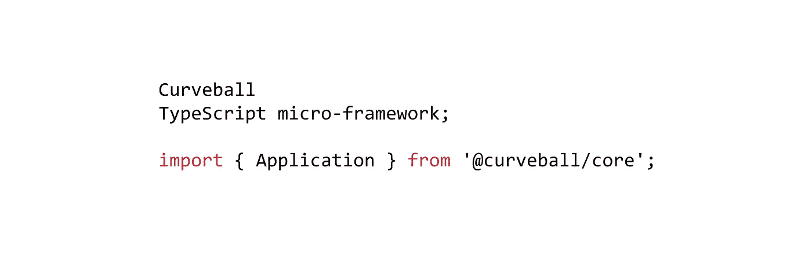

# curve ball——一个打字稿微框架

> 原文：<https://itnext.io/curveball-a-typescript-micro-framework-1b04ebe50720?source=collection_archive---------3----------------------->



我从事 Node.js 开发已经有一段时间了，我想尝试编写一个框架。虽然这不是我的第一次，但这可能是我人生中的一个仪式。

通过今天发布它，我想看看这是否值得在未来投入时间，或者我是否应该将精力集中在其他地方。

这个项目被称为曲线球，这是它与众不同的特点:

# 项目目标

我是微框架的忠实粉丝。《快递》出来的时候很棒，但是现在感觉有点过时了。 [Koa](https://koajs.com/) 由 express 背后的团队编写。Koa 在面向承诺的代码库中更有意义，而不是面向回调的，这不是唯一的改进。团队等待发布稳定版本，直到 Node.js 发布稳定的`async` / `await`支持。

我会推荐大家去看看。我怀疑你在使用 Koa 一段时间后会想回到 Express。

一段时间以来，Koa 一直是我选择的框架，但也有一些东西是我喜欢的。我认为写一些检查这些框的东西会很有趣。

1.  曲球是一个非常小的球，就像 Koa。
2.  它很大程度上遵循了 Koa 架构和 API 设计，有一些微妙的变化。中间件看起来会非常熟悉。
3.  完全是用打字稿写的。
4.  它包含了现代的 HTTP 特性，内置了对 HTTP/2 Push 和`103 Early Hints`的支持，并以一种感觉像是框架的一部分的方式集成了这些特性。
5.  很容易在框架内部“模拟”HTTP 请求，而不必通过真正的 HTTP 堆栈。

第 3-5 点是我从其他我看过的框架中漏掉的，也是为什么我认为它可能对其他人有用。

一些例子:

# 你好世界

```
import { Application, Context } from '@curveball/core';const app = new Application();
app.use((ctx: Context) => { ctx.response.body = 'Hello world! You used the following HTTP method: '  + ctx.request.method;});
app.listen(4000);
```

# 路由器

```
import { Application } from '@curveball/core';
import router from '@curveball/router';app.use(router('/contact', ctx => { ctx.response.body = 'Contact us!';});
app.listen(4000);
```

# HTTP/2 推送

无论何时你可以访问`Context`对象，你也可以推。对于 HTTP/1 连接，推送将被忽略。

```
app.use(ctx => async { ctx.response.body = 'Hello world!'
  await ctx.response.push( pushCtx => { // This function is not called unless the client indicated 
    // they support push.
    // You get a special Context object that has a request and
    // response.
    pushCtx.request.path = '/assets/foo.css';
    pushCtx.response.type = 'text/css';
    pushCtx.response.body =  'body { background: blue; }'; });})
```

上面的例子允许您以编程方式生成推送，这允许您进行某些优化，而这些优化对于基于截取`Link:`头的 HTTP/2 推送实现来说是很难做到的。

但是，如果您想要推送一个请求和响应，使其通过整个中间件堆栈，那么您可以使用子请求来实现:

```
app.use(ctx => async { ctx.response.body = 'Hello world!'
  await ctx.response.push( pushCtx => { pushCtx.request.path = '/assets/foo.css';
    // Handle does an internal sub request and calls every 
    // middleware.
    return app.handle(pushCtx); });});
```

# 发送 103 早期提示响应

```
app.use(ctx => async { ctx.response.body = 'Hello world!'
  ctx.response.sendInformational(103, {
    'Link' : [
      '</style.css> rel="prefetch" as="style"',
      '</script.js> rel="prefetch" as="script"',
    ]
  });});
```

# 中间件升级

如果您来自 Express，您也将获得 Koa 会给予您的所有好处。所以这并不是曲线球的卖点。

尝试用 express 编写以下中间件:

```
app.use( async (ctx, next) => { // Let the entire middleware stack run
  await next();

  // HTML encode JSON responses if the client was a browser.
  if (ctx.accepts('text/html') 
    && ctx.response.type ==== 'application/json') { ctx.response.type = 'text/html';
      ctx.response.body = '<h1>JSON source</h1><pre>' +  
        JSON.stringify(ctx.response.body) + '</pre>'; }});
```

# 去哪里打弧线球

可以在 [Github 项目页面](http://github.com/curveballjs/core)找到。

# 我能怎么做呢？

如果我是唯一的用户，这个项目就玩完了，我可能会停止工作，把我的项目转换回 Koa。

如果你认为这值得维护，我很想知道。[在推特上给我发信息](https://twitter.com/evertp)，或者给我写邮件！

如果你有兴趣帮忙，有很多事情可以做。我不想成为唯一的失败点。

感谢你一路走到了最后！