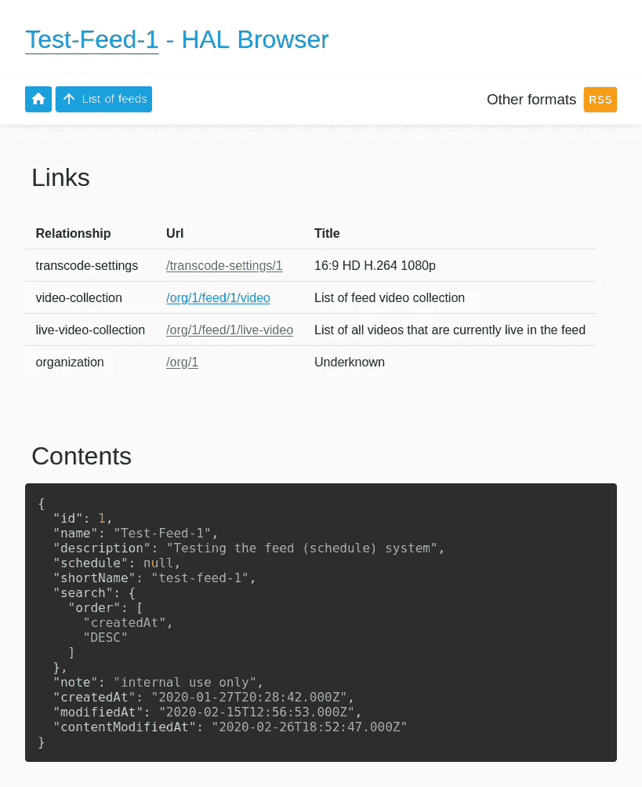

# curve ball——一个具有一流 AWS Lambda 和 HTTP/2 推送支持的类型脚本微框架

> 原文：<https://itnext.io/curveball-a-typescript-microframework-with-first-class-aws-lambda-and-http-2-push-support-6efeba66ca45?source=collection_archive---------1----------------------->

自 2018 年年中以来，我们一直在开发一个新的微框架，用 typescript 编写。该框架与 [Express](https://expressjs.com/) 竞争，并从 [Koa](https://koajs.com/) 获得大量灵感。叫做[曲球](https://github.com/curveball)。

如果你只与 Express 合作过，我觉得对大多数人来说，这个项目会感觉像是一个巨大的进步。Express 实际上是在 Node.js 的早期编写的，那时 Promises 和 async/await 还不常见，所以最大的变化是始终使用 async/await 中间件。

如果你是从 Koa 来的，那应该已经很熟悉了。与 Koa 相比，主要区别如下:

*   曲球是用打字稿写的
*   它具有强大的内置支持 HTTP/2 push。
*   原生支持在 AWS Lambda 上运行服务器，无需使用[奇怪的黑客](https://github.com/awslabs/aws-serverless-express/blob/master/src/index.js)。
*   Curveball 的请求/响应对象与 Node.js `http`库解耦。

在 [Bad Gateway](https://badgateway.net/) 过去几年里，我们已经在各种各样的(主要是 API)项目中使用了这种方法，它对我们来说非常有效。我们还发现，它往往是一种相当“粘性”的产品。接触到它的人也倾向于在他们的下一个项目中使用它。

好奇？以下是一些常见任务的示例:

# 例子

## 你好世界

```
import { Application } from '@curveball/core';

const app = new Application();
app.use( async ctx => {
  ctx.response.type = 'text/plain';
  ctx.response.body = 'hello world';
});

app.listen(80);
```

一切都是中间件，中间件可能是也可能不是`async`。

## AWS Lambda 上的 Hello world

```
import { Application } from '@curveball/core';
import { handler } from '@curveball/aws-lambda';

const app = new Application();
app.use( ctx => {
  ctx.response.type = 'text/plain';
  ctx.response.body = 'hello world';
});

exports.handler = handler(app);
```

## HTTP/2 推送

```
const app = new Application();
app.use( ctx => {
  ctx.response.type = 'text/plain';
  ctx.body = 'hello world';

  ctx.push( pushCtx => {

    pushCtx.path = '/sub-item';
    pushCtx.response.type = 'text/html';
    pushCtx.response.body = '<h1>Automatically pushed!</h1>';

  });

});
```

对`ctx.push`的回调只有在客户端支持推送的情况下才会被调用，因为它创建了一个新的“上下文”，任何中间件都可以被附加到它上面，甚至通过执行一个“子请求”来调用所有的中间件。

## 基于资源的控制器

控制器是可选的和固执己见的。单个控制器应该只管理一种类型的资源或一条路由。

```
import { Application, Context } from '@curveball/core';
import { Controller } from '@curveball/controller';const app = new Application();class MyController extends Controller { get(ctx: Context) { // This is automatically triggered for GET requests } put(ctx: Context) { // This is automatically triggered for PUT requests }}app.use(new MyController());
```

控制器是可选的和固执己见的。单个控制器应该只管理一种类型的资源或一条路由。

## 按指定路线发送

推荐的模式是每条路由只使用一个控制器。

```
import { Application } from '@curveball/core';
import router from '@curveball/router';

const app = new Application();

app.use(router('/articles', new MyCollectionController());
app.use(router('/articles/:id', new MyItemController());
```

## 控制器中的内容协商

```
import { Context } from '@curveball/core';
import { Controller, method, accept } from '@curveball/controller';

class MyController extends Controller {

  @accept('html')
  @method('GET')
  async getHTML(ctx: Context) {

    // This is automatically triggered for GET requests with
    // Accept: text/html

  }

  @accept('json')
  @method('GET')
  async getJSON(ctx: Context) {

    // This is automatically triggered for GET requests with
    // Accept: application/json

  }

}
```

## 发射误差

```
function myMiddleware(ctx: Context, next: Middleware) {

  if (ctx.method !== 'GET') {
    throw new MethodNotAllowed('Only GET is allowed here');
  }
  await next();

}
```

要发出一个 HTTP 错误，可以设置`ctx.status`，但是更容易的是抛出一个相关的异常。

该项目还附带了一个[中间件](https://github.com/curveball/problem/)来自动生成 [RFC7807](https://tools.ietf.org/html/rfc7807) `application/problem+json`响应。

## 在中间件中转换 HTTP 响应

使用 express middlewares，很容易在处理请求之前做一些事情，但是如果你想在中间件中转换响应，这只能通过复杂的黑客来实现。

这是因为响应会立即写入 TCP 套接字，一旦写入套接字，响应就会消失。

因此，要做诸如 gzipping 响应之类的事情，Express 中间件作者需要模拟响应流并截取发送给它的任何字节。这一点在 express-compression 源码中可以看得很清楚:[https://github . com/express js/compression/blob/master/index . js](https://github.com/expressjs/compression/blob/master/index.js)。

曲球不会这样做。响应体被缓冲并可由中间件使用。

例如，下面的中间件寻找一个 HTTP Accept 头`text/html`，并自动将 JSON 转换成一个简单的 HTML 输出:

```
app.use( async (ctx, next) => {

  // Let the entire middleware stack run
  await next();

  // HTML encode JSON responses if the client was a browser.
  if (ctx.accepts('text/html')
   && ctx.response.type ==== 'application/json') {
     ctx.response.type = 'text/html';
     ctx.response.body = '<h1>JSON source</h1><pre>' +    
       JSON.stringify(ctx.response.body) + '</pre>';
  }

});
```

在 express 中实现同样的事情会非常复杂。

您可能想知道这是否对大文件的性能不利。你是完全正确的，这个问题还没有解决。

然而，不是直接写入输出流，这样做的目的是允许用户在`body`属性上设置一个回调，所以写主体不会被缓冲，只是被延迟。实现这些中间件的复杂性不会改变。

## HTML API 浏览器

Curveball 还附带了一个 [API 浏览器](https://github.com/curveball/hal-browser)，可以自动将 JSON 转换成可遍历的 HTML，并自动解析 HAL 链接和 HTTP 链接头。

每个导航元素都是完全基于响应中的链接生成的。

要使用它:

```
import { halBrowser } from 'hal-browser';
import { Application } from '@curveball/core';

const app = new Application();
app.use(halBrowser());
```

设置完成后，当浏览器访问时，您的 API 将开始呈现 HTML。



## 发送信息响应

```
ctx.response.sendInformational(103, {
  link: '</foo>; rel="preload"'
})
```

安装:

```
npm i @curveball/core
```

文档可以在 [Github](https://github.com/curveball/core) 上找到。在[组织页面](https://github.com/curveball)可以看到中间件列表。

# 稳定发布

我们目前正在进行第 11 个测试版，很快就要发布稳定版了。在这一点上，变化将是微小的。

如果你对这个项目有想法或反馈，听听会很有帮助。不要犹豫留下评论、问题或建议作为 Github 问题。

还有一件大事要做，那就是完成[网站](https://curveballjs.org/)。我们有一个伟大的设计，它只需要被推到终点线。

【https://evertpot.com】原载于 2020 年 2 月 27 日[](https://evertpot.com/curveball-typescript-framework-update/)**。**