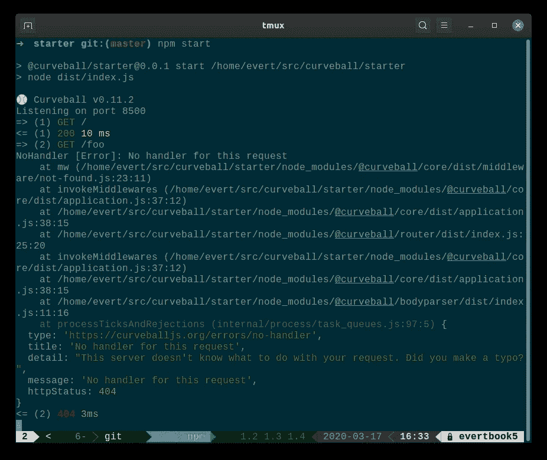

# 曲线球—三月更新

> 原文：<https://itnext.io/curveball-march-updates-10e0ea96f808?source=collection_archive---------6----------------------->


Curveball 是 Typescript 最新的微框架。

自从上一个[大公告](https://evertpot.com/curveball-typescript-framework-update/)以来，已经有许多新的 curveball 用户，也有一些框架变化。

我觉得列出我们这个月一直在做的一些事情会很好。

# 初学者模板

可能是最重要的，curveball 现在有了一个[起始模板](https://github.com/curveball/starter)。这个模板被设计得尽可能的小，但是仅仅足够在几分钟内得到一个工作的 Curveball 应用程序。

黄金路径看起来是这样的:

```
git clone https://github.com/curveball/starter.git <project_name>
cd <project_name>
npm i
npm run build
npm start
```

我们在[网站](https://curveballjs.org/)上取得了一些进展。这其实是我们现在很乐意分享的东西。感谢 LFO 工业公司的伟大设计。他们还制作了我们的标志和品牌标识！

在未来，该网站需要为所有的核心插件托管一个坚实的教程和文档。注意这个空间。

# Accesslog 插件使用 ANSI 颜色

[accesslog](https://github.com/curveball/accesslog) 有两个主要目的:为生产系统发出有用的日志，以及让开发者能够看到他们的控制台上发生了什么。

对于后一种情况，`accesslog`中间件现在可以检测它是否在终端中运行，并发出颜色，从而更容易发现错误。



# 条件请求助手

[核心](https://github.com/curveball/core)包现在有许多针对条件请求的帮助函数。

这些助手使评估`If-Match`、`If-None-Match`、`If-Modified-Since`和`If-Unmodified-Since`的条件变得更加容易。

`result`变量将包含或者，或者，这是您可能想要返回的状态代码的建议。

将来，该实用程序将用于进一步使用[控制器](https://github.com/curveball/controller)来自动化条件请求。

*原载于 2020 年 3 月 17 日 https://evertpot.com**的* [*。*](https://evertpot.com/curveball-march-updates/)