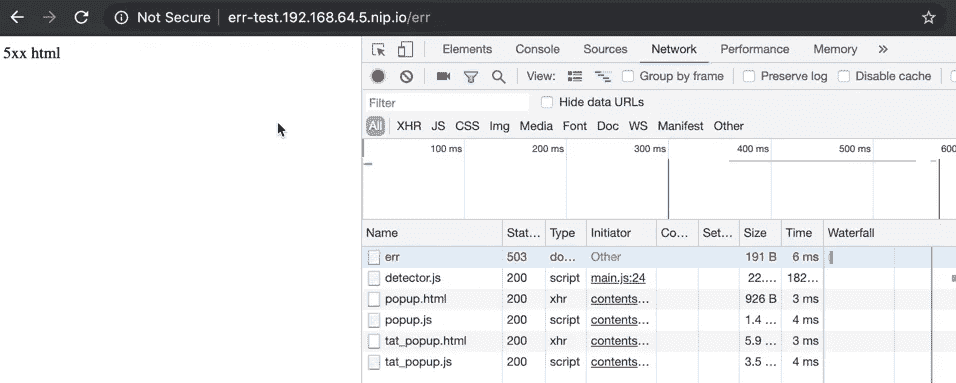

# Nginx 入口控制器的自定义错误页面

> 原文：<https://itnext.io/custom-error-page-for-nginx-ingress-controller-cca4cfa82bb9?source=collection_archive---------3----------------------->


有时我们不想使用 Nginx 入口控制器的默认错误页面。例如，作为基本安全需求的一部分，我们不能暴露 Nginx 服务器的指纹，如下所示。


## 测试应用程序

为了说明这一点，让我们创建一个实现了以下 HTTP 处理程序的示例应用程序。它接受一个 URL 参数，并根据这个参数返回 HTTP 状态。

```
func errHandler(w http.ResponseWriter, r *http.Request) {
 code := r.FormValue("code")t 
 status, err := strconv.Atoi(code)
 if err != nil {
  log.Printf("Failed to convert status:%v", err)
  w.WriteHeader(500)
  fmt.Fprintf(w, "Unknown code")
  return
 } w.WriteHeader(status)
 fmt.Fprintf(w, "Code=%s", code)
}
```

构建 docker 映像，推入 docker hub，使用以下入口、服务和部署将其部署到我的测试 K3s 实例中。(*我已经从 K3s 中移除了默认的 traefik 入口控制器，使用默认设置部署了 nginx 入口舵图表。)*

```
apiVersion: extensions/v1beta1
kind: Ingress
metadata:
  annotations:
    kubernetes.io/ingress.class: nginx
    ingress.kubernetes.io/rewrite-target: /
  labels:
    app: err-status-test
  name: err-status-test
spec:
  backend:
    serviceName: err-status-test
    servicePort: 80
  rules:
  - host: err-test.192.168.64.5.nip.io
    http:
      paths:
      - path: /
        backend:
          serviceName: err-status-test
          servicePort: 8080
---
apiVersion: v1
kind: Service
metadata:
  name: err-status-test
  labels:
    app: err-status-test
spec:
  type: NodePort
  ports:
  - port: 80
    targetPort: 8080
    protocol: TCP
    name: http
  selector:
    app: err-status-test
---
apiVersion: apps/v1
kind: Deployment
metadata:
  name: err-status-test
  labels:
    app: err-status-test
spec:
  replicas: 1
  selector:
    matchLabels:
      app: err-status-test
  template:
    metadata:
      labels:
        app: err-status-test
    spec:
      containers:
      - name: err-status-test
        image: zhiminwen/error-test-app
        imagePullPolicy: Always
```

现在用错误代码 413 测试它，我们看到它像预期的那样工作，

```
curl -i "[http://err-test.192.168.64.5.nip.io/err?code=413](http://err-test.192.168.64.5.nip.io/err?code=413)"
HTTP/1.1 413 Request Entity Too Large
Server: nginx/1.15.10
Date: Sun, 05 May 2019 10:59:18 GMT
Content-Type: text/plain; charset=utf-8
Content-Length: 8
Connection: keep-aliveCode=413
```

## 默认 Nginx 默认后端有问题

要更新默认错误页面，请编辑 nginx-ingress-controller 的配置映射。插入一个带有 HTTP 状态码的新键`[custom-http-errors](https://kubernetes.github.io/ingress-nginx/user-guide/nginx-configuration/configmap/#custom-http-errors)`，我们要改变它的错误页面，比如，

```
apiVersion: v1
kind: ConfigMap
data:
  **custom-http-errors: 404,413,503**
  enable-vts-status: "false"
metadata:
  labels:
    app: nginx-ingress
    chart: nginx-ingress-1.6.0
    component: controller
    heritage: Tiller
    release: nginx-ingress
  name: nginx-ingress-controller
  namespace: kube-system
```

现在，再次启动测试命令，

```
curl -i "[http://err-test.192.168.64.5.nip.io/err?code=413](http://err-test.192.168.64.5.nip.io/err?code=413)"
HTTP/1.1 404 Not Found
Server: nginx/1.15.10
Date: Sun, 05 May 2019 11:36:04 GMT
Content-Type: text/plain; charset=utf-8
Content-Length: 21
Connection: closedefault backend - 404
```

这是**不是**我们想要的。Nginx 入口控制器正确地捕获了我们想要定制的 HTTP 状态代码。然而，默认的 Nginx“default-back end”*(图片:k8s.gcr.io/defaultbackend:1.4)*只是简单地返回 404 状态，而不管应用程序打算返回的实际状态代码。如果状态代码用于其他目的，这将导致问题。

## 自定义错误后端

阅读 Nginx 入口控制器[文档](https://kubernetes.github.io/ingress-nginx/user-guide/custom-errors/)，需要自定义错误后端来解决此问题。基本上，自定义错误后端应该处理从入口控制器传递的 HTTP 头值，如 X-Code、X-Format 等，并将状态代码直接返回给请求者。

> 自定义后端应该返回正确的 HTTP 状态代码，而不是`200`。NGINX 不会改变来自自定义默认后端的响应。

Nginx 入口控制器 Github repo 在路径`[images/custom-error-pages](https://github.com/kubernetes/ingress-nginx/tree/master/images/custom-error-pages)`下提供了自定义错误后端的示例实现。

由于我并不真的需要为其他平台进行交叉编译，所以我只编译了 Linux amd64 的二进制文件，修改了 Dockerfile，如下所示，

```
FROM alpine
COPY /rootfs /ADD custom-error-pages /
CMD ["/custom-error-pages"]
```

构建映像并推入 docker hub。在 K3s 中使用以下 CRD 重新部署 Nginx 头盔图

```
apiVersion: k3s.cattle.io/v1
kind: HelmChart
metadata:
  name: nginx-ingress
  namespace: kube-system
spec:
  chart: stable/nginx-ingress
  targetNamespace: kube-system
  valuesContent: |-
    defaultBackend:
      enabled: true
      name: default-backend
      image:
        repository: zhiminwen/custom-error-page
        tag: latest
```

## 再次测试

再次启动相同的 curl 命令

```
➜ curl -i "[http://err-test.192.168.64.5.nip.io/err?code=413](http://err-test.192.168.64.5.nip.io/err?code=413)"
HTTP/1.1 413 Request Entity Too Large
Server: nginx/1.15.10
Date: Sun, 05 May 2019 12:09:21 GMT
Content-Type: */*
Transfer-Encoding: chunked
Connection: close4xx html
```

我们有带有正确 HTTP 状态代码的自定义错误页面。

既然我们陷住了 503 状态，让我们按比例缩小副本，`k scale deploy err-status-test --replicas=0`

现在，如果我们再次访问该应用程序，我们将看到自定义错误页面，其状态代码显示为预期的 503。

