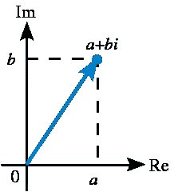
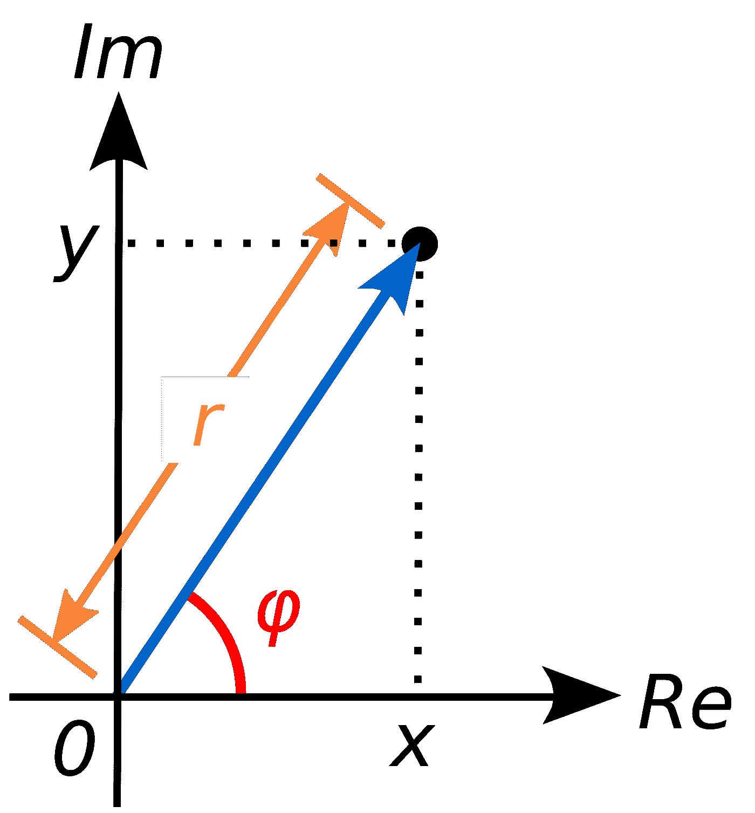
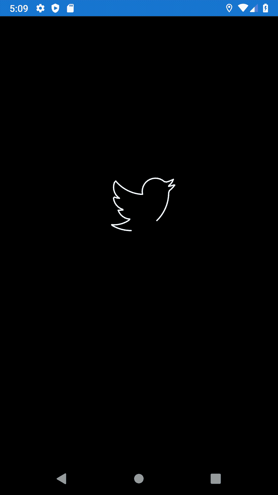

# 使用 SkiaSharp Part1 自定义图像进度条

> 原文：<https://itnext.io/custom-image-progressbar-using-skiasharp-part1-3e0b6d230058?source=collection_archive---------5----------------------->


绘制自定义进度图一直是一项具有挑战性的任务，因为它需要一点数学知识，这是很多开发人员不喜欢的。在这篇文章中，我们将看到如何使用 c#来制作和平 ok 蛋糕。

# 步骤 1:准备图像

我们需要将图像表示为一个点的数组，可能有很多在线工具可以将 svg 转换成这样的点数组

[](https://github.com/Shinao/PathToPoints) [## 石脑/路径点

### https://shinao.github.io/PathToPoints/从 SVG 路径中提取点或者生成它们…

github.com](https://github.com/Shinao/PathToPoints) 

为了简单起见，我创建了一个静态类图，其中包含我将使用的图像

# 步骤 2:创建一个静态类

在这项任务中，我们将进行大量的映射和对话。保持代码整洁的最佳方式是使用扩展方法。

# 步骤 3:将点转换成复数



复数是由**吉罗拉莫·卡尔达诺**引入的，作为解三次方程的一种尝试，不用深入细节，你可以把它想象成二维数字，

实数中的第一维(相当于 X)，第二维是虚部(相当于 Y)。

```
public static Complex[] ToComplex(this IEnumerable<Point> source)
        {
            var complex = source
              .Select(item => new Complex(item.x,item.y))
              .ToArray(); return complex;
        }
```

# 步骤 4:离散傅立叶变换

这部分是最有趣的，我们拥有的图像点数据是之前发生的一次绘图活动的结果。

我可以用一个函数来表示这幅画

```
Drawing(Canvas,Point)=Canvas.Points.Add(Point);
```

根据前面的函数，我们可以将 DrawingImage 函数表示为

```
Drawing(Canvas,Points)=Points.Foreach(point=>Drawing(Canvas,Point));
```

所以循环遍历这些点并一个一个地绘制它们应该会给你带来绘图动画效果吧？

不幸的是，事情没有这么简单，因为有一个参数丢失了，那就是你知道这些点是由某人一次一个地绘制的，但是你不知道绘制的顺序和它们之间的时间间隔。

因此，为了解决这个问题，我们需要从这个离散时间域转移到另一个时间可以一致的域，因此，我们将确定在恒定时间 T 可以发生多少绘图事件(多少点)，而不是试图确定绘图点之间的时间差，这个新的域被称为**频域**。

很可能在这两个域之间有一个众所周知的变换叫做傅立叶变换，在我们的代码中，我们将使用 Accord.net 库来完成它

[](http://accord-framework.net/) [## 雅阁。NET 机器学习框架

### Accord.NET 框架是一个结合了音频和图像处理库的. NET 机器学习框架…

accord-framework.net](http://accord-framework.net/) 

```
//Receive a List of Points and return a Frequency of waves
public static Complex[] DFT(this IEnumerable<Point> source)
        {
            var complex = source
           .Select(item => new Complex(item.x, item.y)).ToArray();

           FourierTransform2.DFT(complex,  
                               FourierTransform.Direction.Backward);
            return complex; }
```

# 步骤 5:设置 SkiaSharp 和绘图循环

SkiaSharp 是一个强大的 c# canvas 库，支持大多数平台(xamarin，uwp，Uno，…)。)

```
<forms:SKCanvasView PaintSurface="SKCanvasView_OnPaintSurface"/>
```

SkiaSharp 仅允许在 PaintSurface 事件中进行绘制，并且此事件仅在画布第一次准备就绪或使用 InvalidateSurface 方法无效时触发。

```
private  async void SKCanvasView_OnPaintSurface(object sender, SKPaintSurfaceEventArgs e)
        {
            time += CONSTANTS
            if (time > 2f * Math.PI)
            {
                time = 0;
                _path.Clear();
            }

            await Task.Delay(1);
            SkCanvasView.InvalidateSurface();
        }
```

这里我们有一个无限循环，因为我们在 PaintSurface 事件处理程序中调用 InvaliateSurface。

每次我们将时间增加一个常数值，并且我们将通过(2 *π)* 来约束时间，因此图像应该在 2 *π之前完全绘制。*

任务。延迟(1)；允许我们控制时间的速度，所以当我们延迟 1 毫秒时，我们说 1 毫秒的时间=绘制时间的常数。如果你这样做是为了反映真实的工作进展，你必须改变它，使之更有活力。

**现在我们需要计算常数**

> 如果我们有 2 个 *π(最大时间)*来画 N 个点，那么我们的常数应该是 2 *π/N.*

```
**CONSTANT =**(2f * Math.PI) / Count;
```

# 步骤 6:将波转换为给定时间的点

波和复数是同一事物的不同表现形式。在这一部分中，我将使用复数的表现形式，因为它更直接。



BY Complex _ number _ illustration . SVG:原上传者为英文维基百科的 Wolfkeeper .衍生作品:Kan 8 Edie(talk)—Complex _ number _ illustration . SVG，CC BY-SA 3.0，[https://commons.wikimedia.org/w/index.php?curid=5922759](https://commons.wikimedia.org/w/index.php?curid=5922759)

这里的 R 代表波的振幅，也就是波的高度。

*φ* 是波的相位，是同一时刻波与其处理器之间的角度。

现在我们可以用三角学计算(X，Y)

```
X=R.cos(*φ);*Y=R.sin(*φ);*
```

实际上，给定时间 T，前两个方程是正确的，但是在我们的例子中，时间和位置是不断变化的

```
x = item.Magnitude * Math.Cos(WaveOrder * time + item.Phase);                y = item.Magnitude * Math.Sin(WaveOrder * time +  item.Phase);
```

所以现在可以计算每个波的对应点，我们可以计算这个点对应的全频率给定时间

```
public static SKPoint ToPoint(this IEnumerable<Complex> drawingData,
            double time, double x, double y)
        {
            for (int i = 0; i < drawingData.Count(); i++)
            {
                var item = drawingData.ElementAt(i); x += item.Magnitude * Math.Cos(i * time + item.Phase); y += item.Magnitude * Math.Sin(i * time +  item.Phase); }return new SKPoint((float)x,(float)y); }
```

# 第七步:画出要点

```
private  async void SKCanvasView_OnPaintSurface(object sender, SKPaintSurfaceEventArgs e)
        {
            var canvas = e.Surface.Canvas;
            canvas.Clear(SKColors.Black);

            var point=  
              _complex.ToPoint(time,this.Width/2+100,this.Height/2); _path.Insert(0, point); canvas.DrawPoints(SKPointMode.Polygon,
              _path.ToArray()); time += (2f * Math.PI) / Count;
            if (time > 2f * Math.PI)
            {
                time = 0;
                _path.Clear();
            } 
            await Task.Delay(1);
            SkCanvasView.InvalidateSurface();
        }
```

您可以在这里找到功能齐全的代码

[](https://github.com/TheFo2sh/DFT/tree/master/DFT) [## 第二部分/DFT

### 此时您不能执行该操作。您已使用另一个标签页或窗口登录。您已在另一个选项卡中注销，或者…

github.com](https://github.com/TheFo2sh/DFT/tree/master/DFT) 

我要感谢丹尼尔·希夫曼，因为这段代码只是他的 javascript 的重构版本，你可以在这里找到他的视频教程

我强烈推荐你去看看他的书[代码的本质](https://amzn.to/3dSGTlN)，这是一本非常棒的书，将有助于理解代码和自然之间的关系以及灵感。

最后，你可以在[https://ko-fi.com/ahmedfouad](https://ko-fi.com/ahmedfouad)与我分享你的咖啡，并请在 twitter 上关注我以获得最新的更新

[](https://twitter.com/MCC_Ahmed) [## 艾哈迈德·福阿德

### 艾哈迈德·福阿德的最新推文(@MCC_Ahmed)。我是 PlanRadar 的一名软件工程师，目前住在维也纳…

twitter.com](https://twitter.com/MCC_Ahmed) [](https://ko-fi.com/ahmedfouad) [## 给艾哈迈德·福阿德买杯咖啡。ko-fi.com/ahmedfouad

### 我是 PlanRadar 的一名软件工程师，目前住在奥地利的维也纳。我的兴趣范围从技术到网络…

ko-fi.com](https://ko-fi.com/ahmedfouad) 