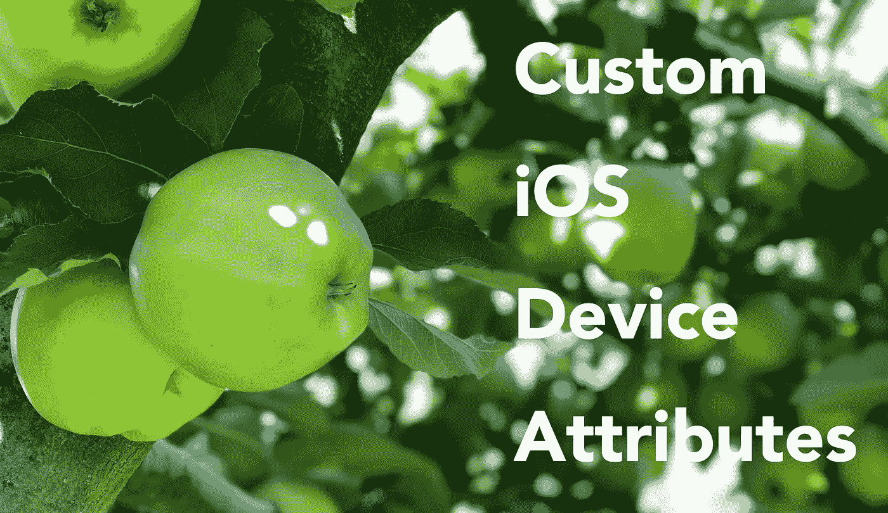
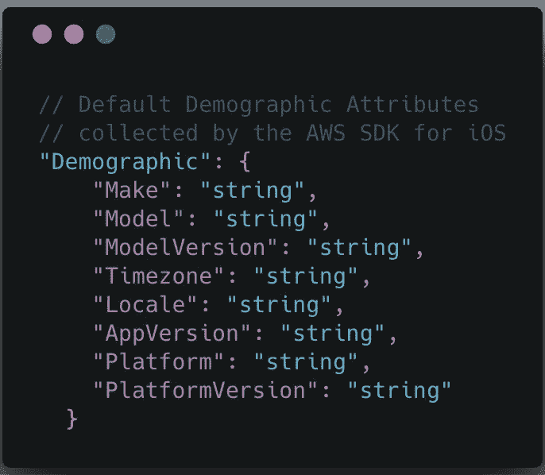
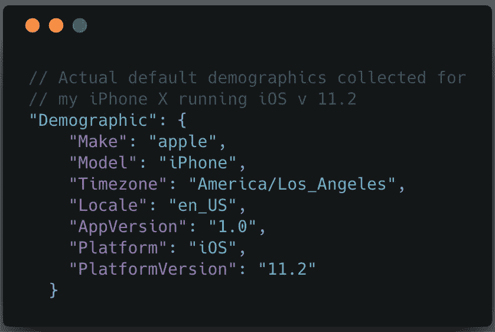
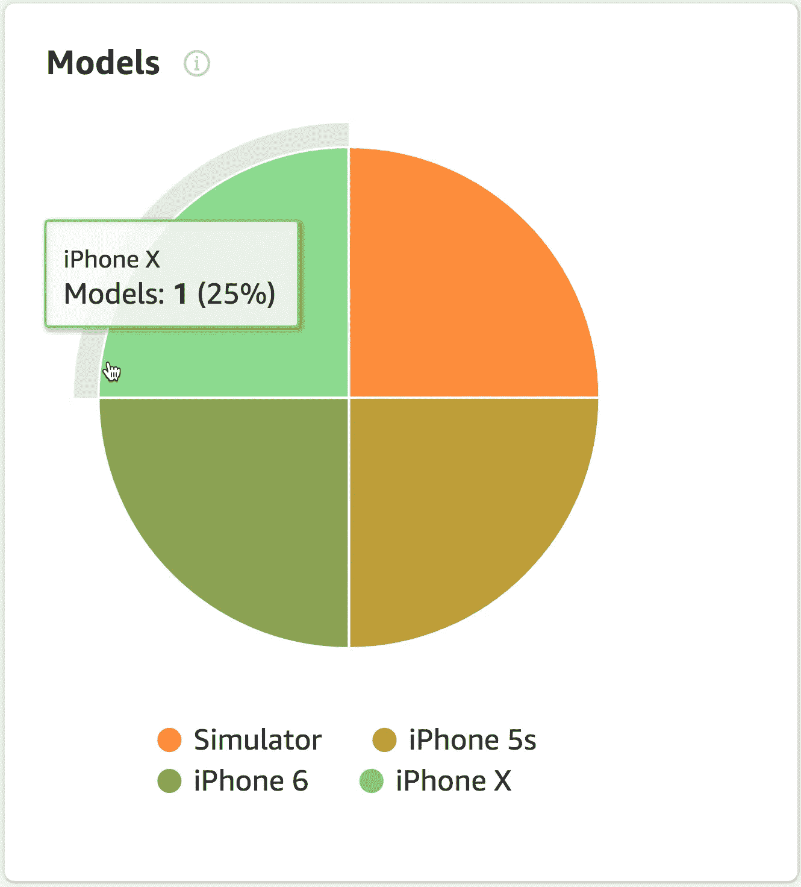
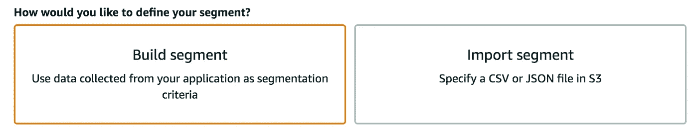

# 使用 AWS Amplify CLI 和 Amazon Pinpoint 定制 iOS 设备属性

> 原文：<https://itnext.io/custom-ios-device-attributes-using-aws-amplify-cli-and-amazon-pinpoint-2ace3ce0fef1?source=collection_archive---------0----------------------->

这是关于使用[*AWS Amplify*](https://aws-amplify.github.io/media/get_started?utm_source=da&utm_medium=blog&utm_campaign=denhills&utm_term=ios_native)*和*[*Amazon Pinpoint*](https://docs.aws.amazon.com/pinpoint/latest/userguide/welcome.html)将用户分析添加到您的 iOS Swift 应用程序的 3 部分系列的第 2 部分。在第 1 部分的[中，我们谈到了在你的 iOS 应用中收集基本的用户分析(人口统计和应用活动)。在本文中，我们将通过以**设备特定属性**的形式添加自定义用户设备分析来增强这一过程。然后，我们将使用这些额外的属性将我们的应用程序用户划分为共享设备模型特征，以便我们稍后可以通过相关内容吸引这些用户。](https://medium.com/@dmennis/integrate-analytics-into-your-ios-swift-applications-with-aws-amplify-20d31fe0a20e)

## 收集自定义设备特定属性

首先，我们来关注一下亚马逊 Pinpoint 在使用 iOS 版 AWS SDK 时自动收集的默认人口统计数据。Pinpoint 收集的标准默认人口统计属性如下所示:

Amazon Pinpoint 收集的标准人口统计属性

以下是为我的 iPhone x 收集的标准人口统计数据:

Pinpoint 为我的 iPhone X 收集的实际标准人口统计属性

注意我的 iPhone X 的人口统计数据是如何丢失标准的 *ModelVersion* 属性的？iOS 的 *ModelVersion* 人口统计属性应代表特定的 iOS 型号类型(例如，iPhone 8、iPhone X 或 iPad Mini 3)。对于任何移动开发人员来说，了解模型版本属性是非常重要的，因为您的应用程序可以从一个模型版本到下一个模型版本执行完全不同的操作。这对于解决 Android 碎片化问题至关重要，但对于 iPhones，开发者在为特定型号添加或取消应用功能时，需要知道这些细节。对于故障诊断，您需要明确知道哪些类型的电话遇到了问题，以便您可以在确切的设备上进行调试，并且还可以只联系那些设备上受影响的用户，希望在他们遇到问题之前。

由于 Amazon Pinpoint 目前没有将 *ModelVersion* 作为 iOS 设备的标准人口统计属性进行跟踪，让我们将该属性添加到我们的应用程序中。我们可以使用这个属性来根据特定的 iOS iPhone 型号对用户进行细分。

## 将 DeviceUitlity.swift 扩展添加到您的 Xcode 项目中

这个 *DeviceUtility.swift* 类是一个实用程序类，它定义了 UIDevice 扩展，该扩展将苹果的型号模式解码为可读的 iOS 设备类型。(例如，“iPhone7，1”指的是“iPhone 6s”)

现在，如果您还记得，在第一篇文章中，我们添加了一个*awsanalytisservice . swift*类，用于向 Amazon Pinpoint 发送分析事件。在向 Pinpoint 发送更新之前，我们将采用相同的类并修改它以调用 UIDevice 扩展并更新用户的设备默认型号版本属性。

将此函数添加到位于 *sendEvent* 方法下的*awsanalytisservice . swift*类中:

在 iOS 项目的 *AppDelegate.swift* 类中，调用*recordCustomProfileDemographics*函数，用 UIDevice 扩展返回的型号版本更新设备的 *ModelVersion* 属性。

以下是使用我们应用的更改运行应用程序后，[亚马逊 Pinpoint 控制台](https://console.aws.amazon.com/pinpoint/home)中人口统计分析页面的**模型**图中的结果:

**亚马逊 Pinpoint 型号**图表显示更新的 iOS 型号版本

在添加定制模型版本之前，模型图会显示一个彩色圆圈，其中 100%的用户都在一台 Apple“iPhone”上。这对于高级分析来说是可以的，但如果我们需要基于特定版本的 iPhone 联系这些客户，或者当我们需要更好地了解这些用户设备能够利用哪些功能时，这就没有用了。

现在我们正在收集 iOS 型号类型，让我们创建一个新的[亚马逊精确定位细分市场](https://docs.aws.amazon.com/pinpoint/latest/userguide/segments-building.html)，其中包含基于其 iPhone 型号版本的用户子集。由于 UIDevice 扩展可以处理所有 iOS 设备类型(至少在苹果于 9 月 12 日宣布新设备之前)，因此可以采用相同的过程来划分 iPad 型号。

## 基于 iPhone 型号版本属性细分用户

在本例中，我们的细分市场代表了基于类似 iPhone 型号的受众子集。例如，为了接触到在 iPhone X 上运行您的应用程序的用户，您可以为匹配型号版本“iPhone X”的应用程序用户定义一个细分市场。

**通过亚马逊 Pinpoint 控制台创建细分市场**

1.  在终端的项目目录中，使用 AWS Amplify CLI 启动 Amazon Pinpoint 控制台:*$ Amplify analytics Console*
2.  在导航菜单中，选择**段**。
3.  选择**新线段**。
4.  对于**段名称**，为您的段键入一个名称，以便以后识别。
5.  对于**您希望如何定义您的细分市场**，选择**构建细分市场**。

6.对于**,您希望使用哪种消息传递渠道？**选择你最有可能用来吸引细分用户的[渠道](https://docs.aws.amazon.com/pinpoint/latest/userguide/channels.html)。我们将在下一篇文章中讨论建立渠道和活动。对于本教程，我将使用短信。

7.对于**按标准属性过滤**，定义哪些用户正在使用型号为>的 iPhone X。您在此处看到的(2)台“iPhone”设备代表尚未使用我们的 UIDevice 代码更新的应用程序，因此我们只知道这些用户使用的是 iPhone。

8.(可选)对于**按自定义属性过滤**和**按用户属性过滤**，根据您添加到 Amazon Pinpoint 端点资源的自定义属性定义哪些用户属于该细分市场。

9.选择完标准后，选择**创建分段**。

当我们根据这些细分用户创建新的营销活动时，请将此细分市场放在手边。

## 最后的想法

在本文中，我们通过添加一个扩展来更新现有的 iOS 应用程序，以将 iOS 模型版本映射到人类可读的值，然后使用这些值来更新 Amazon Pinpoint 收集的标准人口统计属性。然后，我们创建了一个 Amazon Pinpoint 细分市场，过滤掉特定 iOS 型号的用户。

在下一篇文章中，我们将基于这一细分市场构建一个精确定位的活动，并向这些细分用户发送通知。

## 资源

[AWS Amplify CLI](https://aws-amplify.github.io/media/get_started?utm_source=da&utm_medium=blog&utm_campaign=denhills&utm_term=ios_native)