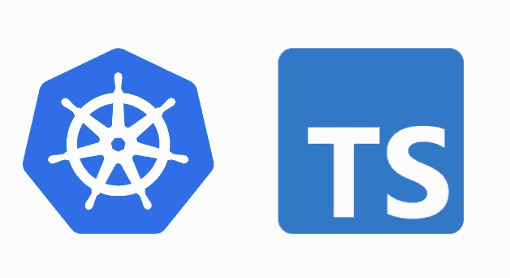

# 带有 TypeScript (JavaScript)的自定义 Kubernetes 运算符。

> 原文：<https://itnext.io/custom-kubernetes-operator-with-typescript-javascript-b69df89131fd?source=collection_archive---------0----------------------->

## 介绍

在本文中，我们将探索如何使用 typescript 创建一个示例操作符，并将其部署到我们的集群中，该操作符将是非常虚拟的，因为它将只部署基于 CRD 的一些资源，但是您可以定制它来做您可能需要或想要的任何事情，其想法是了解在 [Go](https://golang.org/) 和 [kubebuilder](https://github.com/kubernetes-sigs/kubebuilder) 的神奇土地之外做一个操作符所需要的一切。

如果您想查看过去探索其他替代框架和语言的文章，请访问:

*   [用 kubebuilder 和 kind aka kubernetes 操作器云原生应用](https://techsquad.rocks/blog/cloud_native_applications_with_kubebuilder_and_kind_aka_kubernetes_operators/)。
*   [测试运营商 SDK，为 Kubernetes 做预取机制](https://techsquad.rocks/blog/testing_the_operator_sdk_and_making_a_prefetch_mechanism_for_kubernetes/)。

你会注意到两者非常相似，这是因为 operator-sdk 使用了 kubebuilder。

本文的源代码在这里是 [TypeScript 操作符](https://github.com/kainlite/ts-operator/)，docker 图像在这里是，本文在这个例子中也是基于 JavaScript 中 Nodeshift 的[操作符。](https://github.com/nodeshift-blog-examples/operator-in-JavaScript)

**先决条件**

*   [种类](https://github.com/kubernetes-sigs/kind)
*   [码头工人](https://hub.docker.com/?overlay=onboarding)
*   草泽
*   [Node.js](https://nodejs.org/)
*   [打字稿](https://www.typescriptlang.org/)

# 让我们跳到这个例子

## 创建集群

我们将需要一个集群来运行和测试我们的操作符，所以 kind 非常简单，并且足够轻量，可以在任何地方运行。

## 创建我们的操作员

为我们的操作员创造一切必要的工作资源

## 部署我们的操作员

创建我们的自定义资源来查看操作人员的工作情况

## 来自操作员的日志

基于自定义资源的创建、更新和删除的示例日志

## 简单比较运算符-sdk vs 自定义运算符？

在 Go you 中，需要记住一些主要区别:

*   从框架中为 RBAC、控制器等生成代码。
*   构建、部署和管理您的操作员的现成工具。

在 typescript 或 JavaScript 中，您必须处理更多可以从 CI 系统轻松完成的事情，在这个示例中，我使用 github 操作来构建图像，并且这个示例已经配置了所有其他内容，以使 TypeScript 可以与 kubernetes 一起使用，作为一个示例，但您主要使用 API 并自己设置所有内容，还有更多差异，但这些是我注意到或引起我注意的主要差异。

## 构建和推送(docker 图像)

在这种情况下，我们不必这样做，它将通过使用他们提供的免费容器注册表的操作来管理，它将构建并推送与分支名称匹配的映像，请注意，它是完全透明的，您不需要在回购上配置任何东西，您可以在这里看到结果。

## 地方发展

额外收获:如果你想在开发或调试时在本地运行操作符，你可以用`ts-node`很容易地做到这一点，就像这样:我这样使用它的原因主要是假设零配置，这是可能的，因为 ts-node 被列为开发依赖项，docker 映像也可以通过一点配置来使用。

请注意，我没有从 resources 文件夹或 typescript 项目的设置中添加所有代码，我建议您直接在 repo 中检查以了解所有缺失的部分。

# 现在让我们看看代码

足够的话，让我们看看代码，我已经添加了评论，并改变了原代码一点

## `deployment.json`文件

这个文件基本上是我们创建自定义资源时部署的文件

## 最后是我们的客户资源

这就是我们如何告诉我们的操作员，我们需要我们的操作员为给定的任务创建一些资源

## 额外的

要了解更多细节，并了解一切是如何结合在一起的，我鼓励您克隆回购协议，测试它，并自己修改它。

# 清理

要从集群中清除操作员，您可以这样做

## 结束语

如果你想了解更多关于 Nodeshift 的例子，一定要查看链接，我希望你喜欢，在 [twitter](https://twitter.com/kainlite) 或 [github](https://github.com/kainlite) 上再见！

这篇文章的来源是[这里](https://github.com/kainlite/ts-operator/)

声明:我没有使用 OpenShift，但是所有的例子都可以很容易地翻译成一个普通的集群。

# 正误表

如果您发现任何错误或有任何建议，请给我发消息，以便解决问题。

此外，您可以在这里查看源代码和[生成代码](https://github.com/kainlite/kainlite.github.io)和[源代码](https://github.com/kainlite/blog)的变化

*原载于 2021 年 7 月 22 日*[*https://tech squad . rocks*](https://techsquad.rocks/blog/custom_kubernetes_operator_with_typescript/)*。*