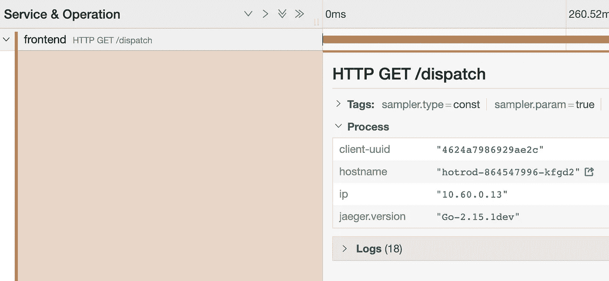
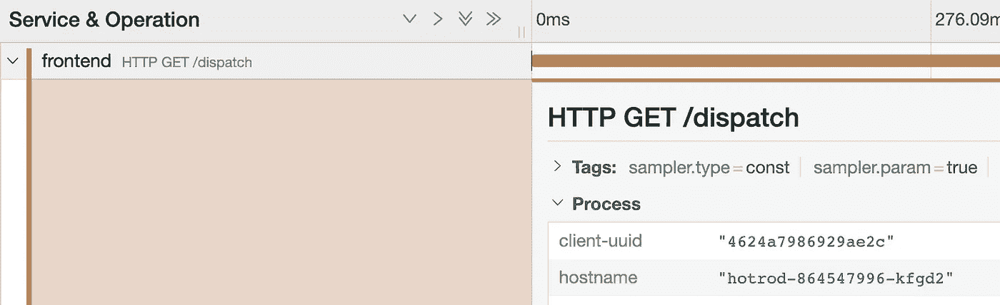
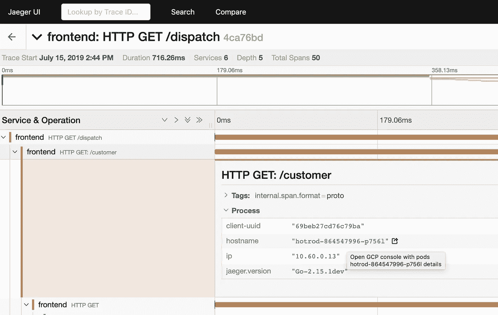
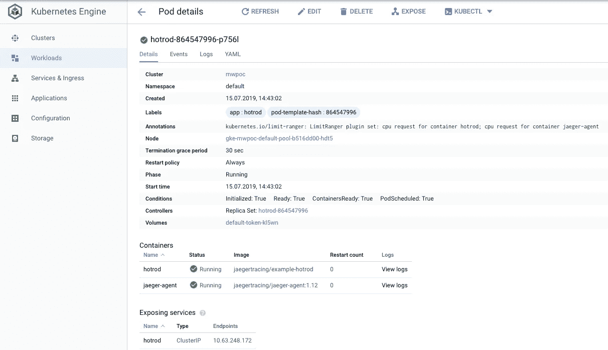
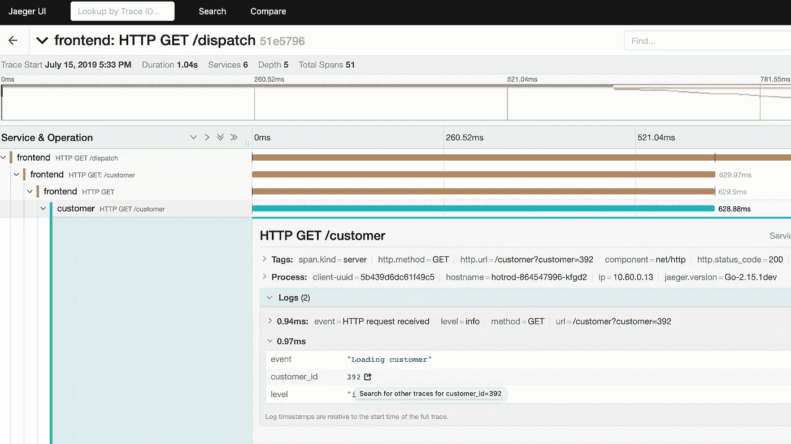
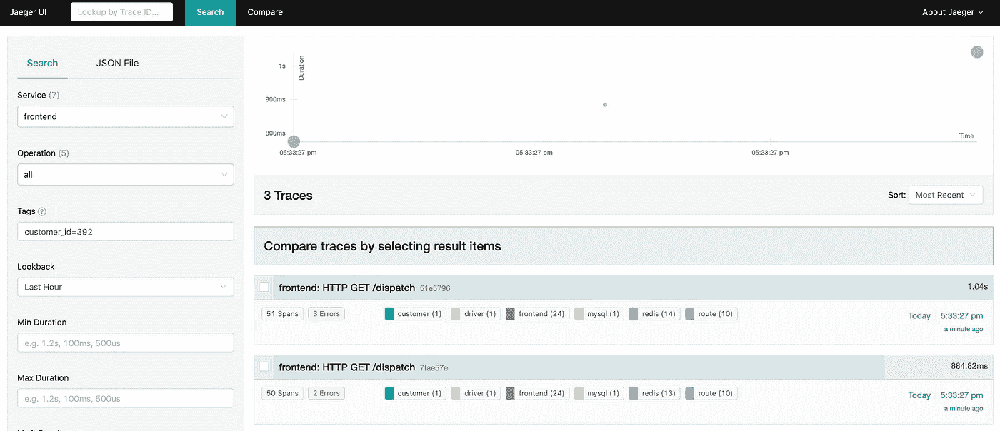

# Jaeger UI 中的自定义链接

> 原文：<https://itnext.io/custom-links-in-jaeger-ui-3479f72bb815?source=collection_archive---------1----------------------->


照片由 [JJ 英](https://unsplash.com/@jjying)在 [Unsplash](https://unsplash.com/)

[Jaeger](https://www.jaegertracing.io/) 是一个很棒的分布式追踪工具，最初由优步开发，现在由 [CNCF](https://www.cncf.io/projects/) 管理。在这篇文章中，我想展示 Jaeger UI 的一个小特性，我认为这个特性并不广为人知，但是在 Jaeger 和其他工具的日常工作中非常有用——基于 span 元数据(标签、进程、日志)的动态定制链接。

首先:非常感谢[Louis-étienne dor val](https://twitter.com/ledor473)，他在 Kubecon EU 2019 上做了一场精彩的演讲([视频](https://www.youtube.com/watch?v=JloanFIc-ms) / [幻灯片](https://static.sched.com/hosted_files/kccnceu19/b3/Deploy%2C%20Scale%20and%20Extend%20Jaeger%202019.pdf))，其中一张幻灯片提到了“标签上的链接”。演讲结束后，我开始寻找细节。我查看了 Jaeger 文档，但是我没有找到任何关于如何实现它的参考。在网上搜索也没有帮助。所以我在 [GitHub 资源库](https://github.com/jaegertracing/jaeger-ui)(代码和问题/PRs)中翻找，幸运的是在那里找到了答案。

# “自定义链接—我为什么需要它们？”

无论您是开发人员还是 SRE，在调查生产环境中的问题或者仅仅是分析您的系统如何工作时，您都会使用许多工具。跟踪、度量、日志、存储库、维基等。这需要在标签页、窗口、搜索或深入菜单之间进行大量切换。只需点击一个工具就可以进入另一个具有特定上下文的工具，这为您节省了大量宝贵的时间，并提高了整体 UX。

当与 Jaeger 一起工作时，在 traceview 面板上(让我们不要进入[讨论它是否是处理痕迹的正确位置](https://medium.com/@copyconstruct/distributed-tracing-weve-been-doing-it-wrong-39fc92a857df) …;-))我们从 span 标签/日志中获得大量元数据。如果我们可以直接从那个屏幕跳到另一个工具的相关页面(不仅仅是主屏幕)会怎么样？

好在 Jaeger UI 完全有能力帮我们搞定。

# “好的，让我们添加一些链接”

要定义自定义链接，我们需要更改传递给`--query.ui-config`的文件，这里描述的是。在 json 文件中，我们需要添加如下所示`linkPatterns`数组(示例取自 [this PR](https://github.com/jaegertracing/jaeger-ui/pull/223) ):

对于每个链接，您必须在一个`linkPatterns`数组中添加一个元素，参数如下:

*   类型:您决定将您的链接添加到哪个元数据部分:进程、标记、日志:



*   关键字——标记/流程/日志属性的名称，其值将显示为链接，例如，在上面的示例中，对于`process`类型，它可以是`hostname`
*   url-链接应该指向的 URL，它可以是外部站点或 Jaeger UI 中的相对路径
*   文本—链接的工具提示中显示的文本

url 和文本都可以定义为模板，Jaeger UI 将根据标签/日志数据动态替换值。

对于那些想尝试一下的人，我添加了一个循序渐进的教程。我只是假设您有一个安装了 Tiller 的 Kubernetes 集群。我用 GKE(因为下面的一个例子)，但甚至可以 minikube。我还假设你对耶格有基本的了解。如果没有，请转到文档中的[“入门”](https://www.jaegertracing.io/docs/1.13/getting-started/)，在那里您还可以找到关于 [HotRod](https://github.com/jaegertracing/jaeger/tree/master/examples/hotrod) 应用的信息。

首先，我们安装 Jaeger 和 HotRod app。我更喜欢使用 [jaeger-operator](https://github.com/jaegertracing/jaeger-operator) 来管理 jaeger 实例。让我们使用[官方舵图](https://github.com/helm/charts/tree/master/stable/jaeger-operator):

```
helm install stable/jaeger-operator --name jaeger-operator
```

当 jaeger-operator pod 启动并运行时，添加一个 jaeger 自定义资源，如下所示:

```
kubectl apply -f ./jaeger.yaml
```

Jaeger-operator 将获取 Jaeger 定制资源并安装 Jaeger 组件(通过如此简单的定义，所有组件将作为一个单元部署——一体化策略——这不适合生产使用，但非常适合此类教程)。

最后，根据以下要点添加 HotRod 应用程序(这样我们可以使用它来产生一些痕迹):

```
kubectl apply -f ./hotrod.yaml
```

jaeger-operator 的好处在于它可以自动将 jaeger-agent 作为边车注入到选定的部署中。您需要做的只是向部署添加一个注释，如下所示:

```
"sidecar.jaegertracing.io/inject": "true"
```

检查是否一切正常。要访问 Jaeger UI 和 HotRod 应用程序，请使用 kubectl port-forward:

```
kubectl port-forward svc/simplest-query 16686:16686kubectl port-forward svc/hotrod 8080:8080
```

提示:如果你按照步骤操作，端口转发可能会在 Jaeger pod 重新创建时中断(例如，因为 ui 配置改变)。在这种情况下，只需再次运行该命令。

转到 [http://localhost:8080/](http://localhost:8080/) 进行一些操作。然后转到 [http://localhost:16686/](http://localhost:16686/) 并点击“Find traces”——您应该会看到一个跟踪列表。好的，很好。所以现在我们来补充一些链接的例子！

当您检查 trace 和 span 之一时(例如，对于如下所示的前端服务),总会有一个带有关键字`hostname`的标签，其值为 HotRod app pod 的名称。



如果我们能从耶格用户界面直接跳转到 GCP 控制台页面，查看吊舱细节，会怎么样？好，我们开始吧。

我们可以修改我们的 Jaeger CR 定义，并为 ui 添加一些配置(开头给出的示例 json 应该“翻译”成 yaml)。下面是一个修改后的配置示例:

让我们再次部署它:

```
kubectl apply -f ./jaeger2.yaml
```

当然，您应该调整链接中的一些细节(如 GCP 项目名称或 GKE 集群名称)。让我们再次到 hotrod 应用程序，并'生产'一些痕迹。然后在 Jaeger UI 中，在所选跨度的详细信息上，我们可以看到一个新图标，该图标位于带有工具提示的`hostname`值旁边:



点击后，我们将转到 GCP 控制台的“Pod 详细信息”页面:



我们也可以用它在 Jaeger 里导航。假设我们正在调查一个跟踪，并希望看到同一客户的其他跟踪(在 hotrod 应用程序中，我们可以在日志中找到一个`customer_id`键)。下面是另一个链接定义的片段:

再次更新 Jaeger CR:

```
kubectl apply -f ./jaeger3.yaml
```

提示:你需要重新创建积家舱(缩小/放大或者删除积家舱),这样新版本的配置界面就会被选中。

去 HotRod app 制作一些痕迹然后去 Jaeger UI。您应该会看到类似下面的内容——链接在`customer_id`键旁边。



点击它，将会打开一个新的选项卡，其中包含已过滤的轨迹(左侧面板中的字段`Tags`将会填充适当的条件)。



还有许多其他可能的用例:显示特定服务指标的 Grafana dashboard 的链接，过滤附加事件的 Kibana 日志的链接，基于标签的请求 id 值的链接，基于版本值的 GitHub 存储库的链接。

希望这篇文章能成为你的 Jaeger UI 扩展的一个起点，这将使它与你的堆栈中的其他工具更加集成。

如果你喜欢你所读的(或者根本不喜欢)——请在这里或者通过 [Twitter](https://twitter.com/miwieczorek) 给我留下一些反馈。谢了。