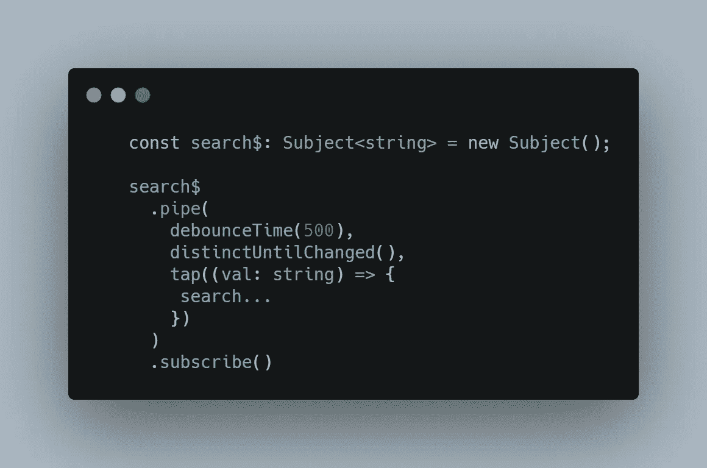
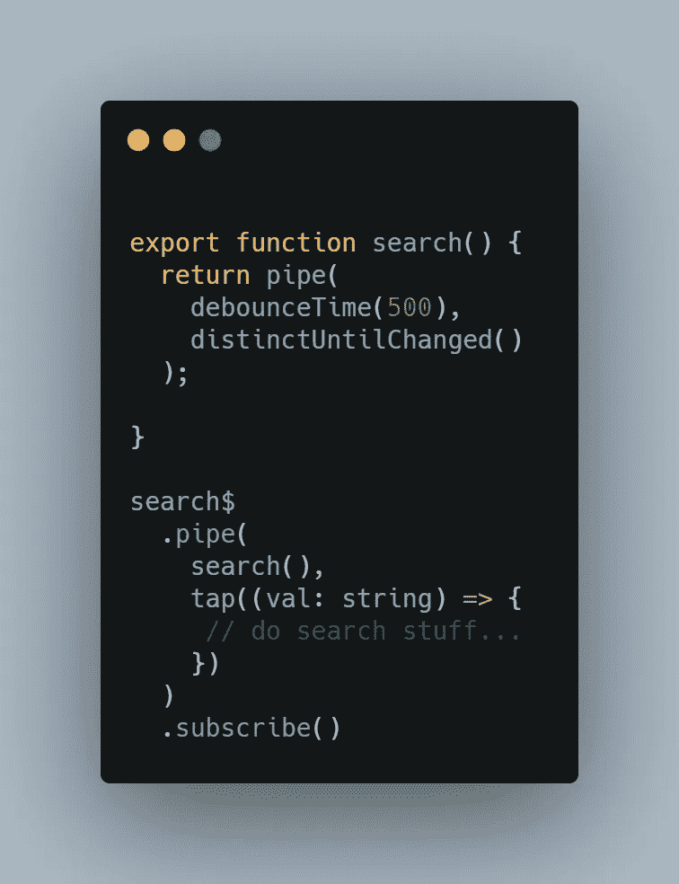
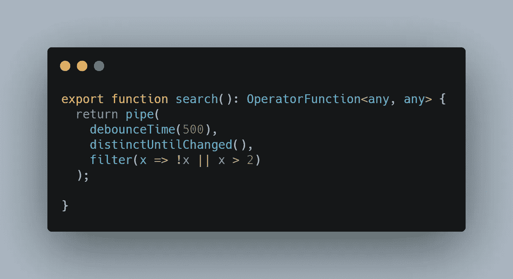
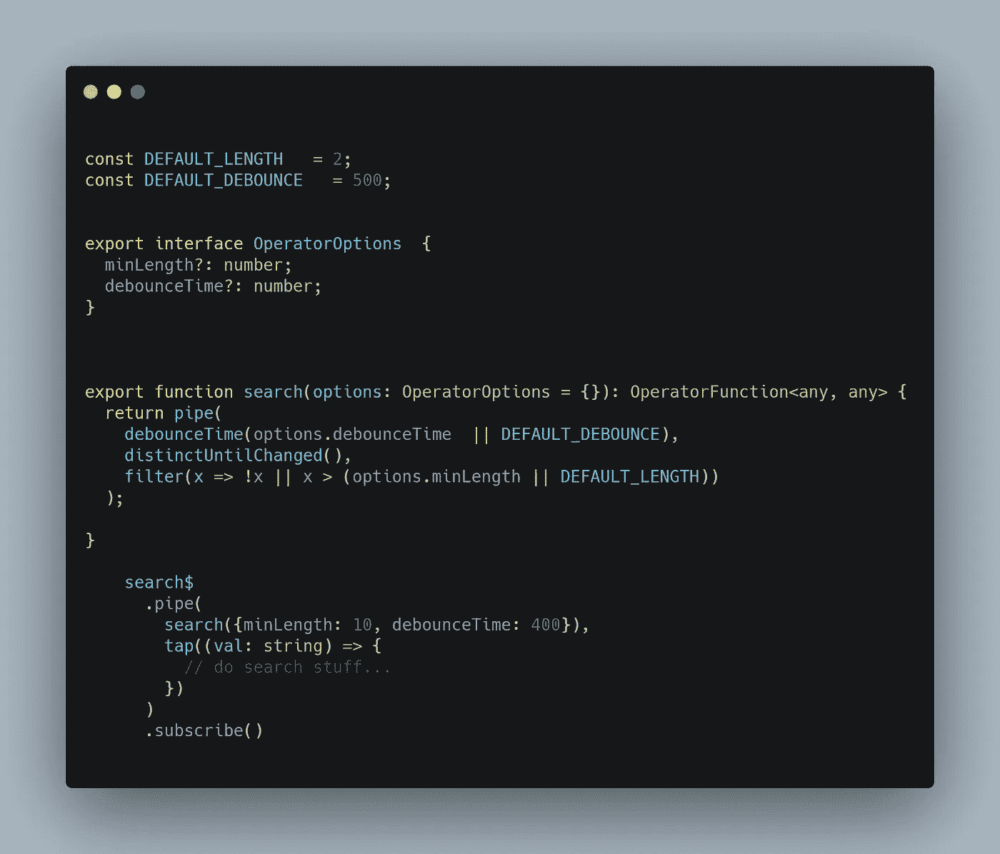

# 自定义 RXJS 运算符

> 原文：<https://itnext.io/custom-rxjs-operators-200c732a9039?source=collection_archive---------2----------------------->

当在 Angular 中工作时，我们习惯于在日常工作中使用 observables 和 pipes，但有时我们会遇到大量的代码重复，我们使用相同的操作符来获得类似的 UI 和 UX 感觉。

让我们使用一个搜索栏作为例子，因为它很容易理解，我们知道从结果中可以期待什么。

如果我们必须以经典的方式写下来，它会是这样的:

编写搜索管道的简单方法

这可能是创建搜索输入栏逻辑的最常见的方式，也是最简单的。
我们首先使用“debounceTime(500)”以便不在每次击键时发出，而是在 500 毫秒内发出一次。然后我们使用 distinctUntillChanged 以便不一个接一个地发出相同的搜索值。然后我们拥有的任何逻辑都可以在之后完成。这是可行的，但是随着你的应用程序的增长，你会有越来越多的具有完全相同逻辑的搜索栏，所以让我们自己制作一个包含逻辑的操作符。

与上图完全相同的逻辑，但不需要重写相同的逻辑

由于我的操作符返回 type: OperatorFunction <any any="">这一事实，我知道它将向我们的 tap/map/concatmap 发出值。</any>

我们现在可以给我们的操作添加一些很酷的特性，比如一个过滤器来“吞下”不符合我们要求的事件，对于我们的例子，我将使用最少数量的字符。

按字符长度过滤

filter 操作符不会传递没有通过我们的要求的值，在本例中，只有当值为空或超过 2 个字符时才通过。

但是等等…我们的下一个输入需要超过 4 个字符才能按预期进行搜索。所以现在我们需要给我们的操作符添加选项。

在上面的图片中，我们设置了传递选项的能力，它有一个 minLength 的键。如果我们将 minLength 键传递给它，我们的过滤器现在将检查该值是否超过 4 个字符。

创建自定义 RxJs 操作符应该是一种简单的方法，可以避免代码重复，能够轻松访问自定义选项，并为您的应用程序提供全面的相似感觉和体验。