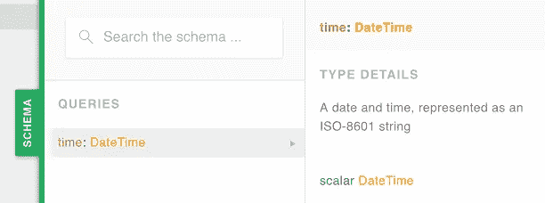

# GraphQL 中的自定义标量

> 原文：<https://itnext.io/custom-scalars-in-graphql-9c26f43133f3?source=collection_archive---------2----------------------->

GraphQL 提供了一小组预定义的*标量*类型:`Boolean`、`ID`、`Int`、`Float`和`String`。但是我们也可以定义自己的自定义标量类型。在本文中，我们将通过一个基于 Apollo 服务器的例子来看看如何做到这一点。

自定义类型的一个常见用途是表示日期和时间。对日期/时间值进行编码有不同的方式:作为 ISO-8601 字符串，例如`2018-09-16T17:27:33.963Z`。或者作为 Unix 时间戳，即类似于`1537118853`的数字，表示自*纪元*(1970 年 1 月 1 日)以来经过的秒数。或者也可以是从 epoch 开始的*毫秒*，例如`1537118853231`。

假设我们想使用 ISO-8601，因为它是一个标准，也更容易被人理解。

# (计划或理论的)纲要

我们可以像这样声明一个模式(假设我们的整个 API 由一个返回`time`值的查询组成):

```
type Query {
  time: String
}
```

但是这并没有真正告诉我们的客户，我们返回的`String`不仅仅是一个字符串，它是一个代表日期/时间值的 ISO-8601 字符串。

下面是我们如何声明并使用一个名为`DateTime`的自定义标量类型:

```
scalar DateTimetype Query {
  time: DateTime
}
```

这样我们就清楚了`time`的类型是`DateTime`。

不可否认的是，看着上面的类型定义，我们真的不能断定一个`DateTime`被表示为一个 ISO-8601 字符串。但是当我们开始实现我们的自定义标量实现时，我们会注意这一点。我们将提供一个将在模式文档中显示的描述。

例如，Github GraphQL API 定义了自己的 [DateTime](https://developer.github.com/v4/scalar/datetime/) 标量，其文档解释说它是“一个 ISO-8601 编码的 UTC 日期字符串”。

# 履行

在模式中定义自定义标量类型是不够的。我们还需要告诉 GraphQL 引擎在编写响应或读取请求时，如何从代码中使用的内部表示转换该类型的值。

例如，我们可以在代码中使用 JavaScript `Date`对象来表示日期/时间，但是在生成 GraphQL 响应时，我们希望将 JavaScript `Date`转换成 ISO-8601 字符串。

让我们看看这是如何在 Apollo Server 的 JavaScript 中实现的。

作为示例的起点，我们将使用[mirkonasato/GraphQL-examples](https://github.com/mirkonasato/graphql-examples)Github 存储库中的基本 graph QL 服务器和客户端项目。所以，如果你想在你的机器上尝试代码，那么就按照文件中的设置说明去做。

在`server`项目中，我们可以通过将`server.js`中的`typeDefs`值改为我们上面定义的模式来开始，即:

```
const typeDefs = gql`
  scalar DateTime

  type Query {
    time: DateTime
  }
`;
```

然后我们可以更改`resolvers`对象，通过返回一个新的 Date 对象来响应`time`查询:

```
const resolvers = {
  Query: {
    time: () => new Date()
  }
};
```

最后，我们进入正题:我们的定制`DateTime`实现。这也适用于`resolvers`对象，就像我们的模式中声明的任何其他自定义类型和字段一样:

```
const { GraphQLScalarType } = require('graphql');

const typeDefs = /*…*/;

const resolvers = {
  DateTime: new GraphQLScalarType({
    name: 'DateTime',
    description: 'A date and time, represented as an ISO-8601 string',
    serialize: (value) => value.toISOString(),
    parseValue: (value) => new Date(value),
    parseLiteral: (ast) => new Date(ast.value)
  }),

  Query: /*…*/
};
```

我们使用核心`graphql`库中的 [GraphQLScalarType](https://graphql.org/graphql-js/type/#graphqlscalartype) 类来创建一个新的自定义标量。

我们通过`name`和`description`，那应该是自圆其说。在`description`中，我们可以证明`DateTime`值是一个 ISO-8601 字符串。

然后，我们需要告诉 GraphQL 引擎如何`serialize`一个值，即在编写响应时将它从 JavaScript `Date`对象转换为 ISO-8601 字符串。因为我们知道`value`是一个 JavaScript `Date`，我们可以简单地使用它的 [toISOString](https://developer.mozilla.org/en-US/docs/Web/JavaScript/Reference/Global_Objects/Date/toISOString) 方法。

类似地，我们需要为*解析*一个值提供逻辑，即从 GraphQL 请求中读取它，在那里它将被编码为 ISO-8601 字符串，并将其转换为 JavaScript `Date`对象，以便在我们的代码中内部使用。

对于这种情况，我们实际上需要提供两个不同的函数:`parseValue`接收原始值，即一个 ISO-8601 字符串，而`parseLiteral`接收一个*抽象语法树* (AST)对象。AST 由 GraphQL 引擎在解析请求时生成。

在这两种情况下，我们都可以通过将`value`作为构造函数参数传递来创建一个新的`Date`对象，因为[日期构造函数](https://developer.mozilla.org/en-US/docs/Web/JavaScript/Reference/Global_Objects/Date)可以接受一个 ISO-8601 字符串作为参数。

这是让我们的示例正常工作所需的最少代码量。理想情况下，我们应该通过检查`value`实际上是预期的类型，如果不是，抛出一个错误，等等，使我们的代码更加健壮。但是对于这个例子，我们将保持简单。

对于真实世界的使用，[@ ok grow/graph QL-scalars](https://github.com/okgrow/graphql-scalars)库提供了许多现成的定制标量，包括更完整的 [DateTime](https://github.com/okgrow/graphql-scalars/blob/master/src/DateTime.js) 实现。

# 操场

如果我们启动服务器并打开位于 [localhost:9000](http://localhost:9000/) 的 GraphQL Playground，我们现在应该在模式文档浏览器中看到我们的`DateTime`标量:



此时，我们可以发送一个查询:

```
query {
  time
}
```

我们应该收到这样的回应:

```
{
  "data": {
    "time": "2018-09-17T10:46:55.328Z"
  }
}
```

这表明 GraphQL 响应包含一个 ISO-8601，尽管在我们的`time`解析器函数中，我们返回了一个 JavaScript `Date`对象。我们的`DateTime`标量正在执行转换。

# 客户

这就是更新的服务器。客户呢？

默认情况下，客户端将接收到字符串形式的`time`字段，正如我们在上面的 JSON 响应中看到的。

要将字符串转换成 JavaScript `Date`对象，我们还需要将我们的自定义`DateTime`实现插入到我们的客户端代码中。事实上，我们可以用其他语言编写客户端，比如 Android 的 Java 和 iOS 的 Swift。因此，这些客户端需要自己的特定于语言的自定义标量实现。例如，Java 版本可以将字符串转换成一个`java.util.Date`实例。

这是使用自定义标量的缺点。它们不受开箱即用的支持，我们需要使我们的定制逻辑对任何想要使用它们的项目可用。或者简单地让客户端以普通字符串的形式接收`DateTime`值。

示例存储库包括一个使用 Apollo 客户端的简单 React 应用程序。事实证明，Apollo 客户端目前不支持自定义标量(问题[Apollo-feature-requests # 2](https://github.com/apollographql/apollo-feature-requests/issues/2))。因此，我们必须以字符串形式接收我们的`time`值，并在收到响应时手动转换它。例如在`src/queries.js`中有:

```
export async function getTime() {
  const {data: {time}} = await client.query({
    query: gql`
      query TimeQuery {
        time
      }
    `
  });
  return new Date(time);
}
```

这个例子的完整代码可以在[自定义标量](https://github.com/mirkonasato/graphql-examples/tree/custom-scalar)分支中找到，你也可以只查看[相关的变化](https://github.com/mirkonasato/graphql-examples/compare/custom-scalar)。

# 结论

如果每个客户端仍然需要自己的逻辑来正确解释它们，那么使用定制标量值得吗？还是坚持使用预定义的标量类型更好？这是你或你的团队的设计决策。

我个人认为，在任何情况下，服务器在其模式中使用自定义标量都是有价值的，可以更有意义地表示其 API。

*最初发表于*[*encoded . io*](https://encoded.io/graphql-custom-scalars/)*。*