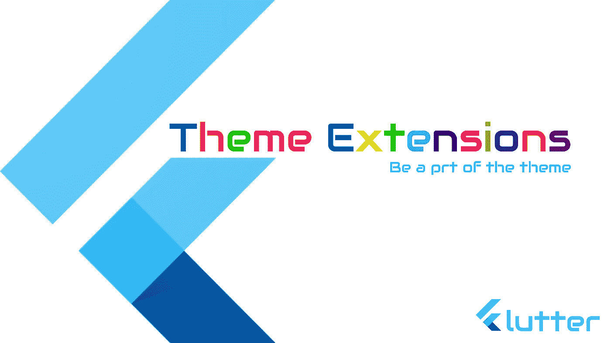

# 使用主题扩展自定义主题

> 原文：<https://itnext.io/custom-theme-using-theme-extensions-8afb67248d2b?source=collection_archive---------1----------------------->



颤振中的主题扩展

# **视频教程**

颤振中的主题扩展

主题扩展是在 Flutter 3 中引入的。

**但是什么是主题扩展呢？**

顾名思义，它有助于用我们自己的扩展来扩展内置的主题。

让我们来看一个例子

因此，当你创建一个 flutter 应用程序时，你的基本根部件将如下所示

```
 return MaterialApp(
      title: 'Flutter Theme Extensions',
      theme: ThemeData(
        primarySwatch: Colors.blue,
      ),
      home: const HomePage(),
 );
```

在这里，如果你想改变主题，你基本上可以自定义主题数据，但你不能添加你自己的属性，如下所示。

```
return MaterialApp(
      title: 'Flutter Theme Extensions',
      theme: ThemeData(
        primarySwatch: Colors.blue,
        'myColor': '#FFAABBCC' // won't work
      ),
      home: const HomePage(),
 );
```

但是如果我想要，我该怎么做呢？

扩展来了。

```
return MaterialApp(
      title: 'Flutter Theme Extensions',
      theme: ThemeData(
        primarySwatch: Colors.blue,
        extensions: <ThemeExtension<dynamic>>[
           // your colors and styles
        ],
      ),
      home: const HomePage(),
 );
```

让我们看看如何创建一个。创建一个名为“MyColors”的新类。

```
import 'package:flutter/material.dart';

@immutable
class MyColors extends ThemeExtension<MyColors> {
  //
  const MyColors({
    required this.success,
    required this.failure,
  });

  final Color? success;
  final Color? failure;

  @override
  ThemeExtension<MyColors> copyWith({Color? success, Color? failure}) {
    return MyColors(
      success: success ?? this.success,
      failure: failure ?? this.failure,
    );
  }

  @override
  ThemeExtension<MyColors> lerp(ThemeExtension<MyColors>? other, double t) {
    if (other is! MyColors) {
      return this;
    }
    return MyColors(
      success: Color.lerp(success, other.success, t),
      failure: Color.lerp(failure, other.failure, t),
    );
  }

  @override
  String toString() {
    return 'MyColors(success: $success, failure: $failure)';
  }

  static const light = MyColors(
    success: Color(0xFF28A745),
    failure: Color.fromARGB(255, 128, 7, 35),
  );

  static const dark = MyColors(
    success: Color.fromARGB(255, 226, 234, 8),
    failure: Color.fromARGB(255, 205, 127, 18),
  );
}
```

在上面的代码中，我只声明了两个变量 success 和 false。

并覆盖两个方法 **copyWith** 和 **lerp** 返回新的 MyColor。

为了方便起见，声明了两个方法“light”和“dark”用于不同的模式，并用每种模式的颜色进行了初始化。

# **用法**

现在在 UI 中，您可以像访问任何其他主题变量一样访问它。

```
 Widget build(BuildContext context) {
    final myColors = Theme.of(context).extension<MyColors>()!;
    return Scaffold(
      appBar: AppBar(
        title: const Text('Flutter Theme Extensions'),
      ),
      body: Container(
        alignment: Alignment.center,
        padding: const EdgeInsets.all(30),
        child: Column(
          children: [
            Text(
              'Hello Flutter',
              style: Theme.of(context).textTheme.bodyLarge,
            ),
            const SizedBox(height: 30),
            Container(
              width: 200,
              height: 200,
              color: _failure ? myColors.failure : myColors.success,
            ),
            const SizedBox(height: 30),
            TextButton(
              onPressed: () {
                setState(() {
                  _failure = !_failure;
                });
              },
              child: Text(_failure ? 'Failure' : 'Success'),
            )
          ],
        ),
      ),
    );
  }
```

在上面的代码中

```
final myColors = Theme.of(context).extension<MyColors>()!;
```

有助于获得 my colors**和 MyColors** ，然后你可以通过 myColors.success 和 myColors.failure 来访问我们的自定义主题颜色。通过这种方式，MyColors 成为了(上下文)小部件的一部分。

非常简单方便。

观看[视频教程](https://www.youtube.com/watch?v=7lFIDCnK6Dg&ab_channel=MobileProgrammer)以了解它的运行情况。

如果你觉得这篇文章有用，请鼓掌分享。

感谢阅读。