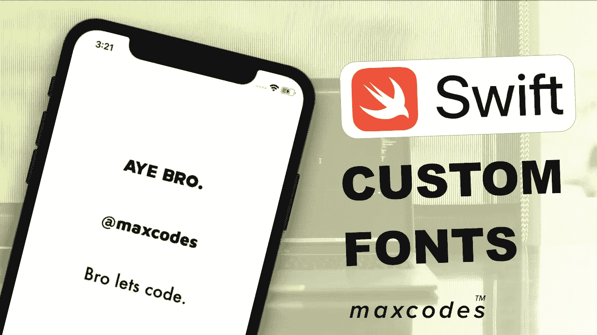
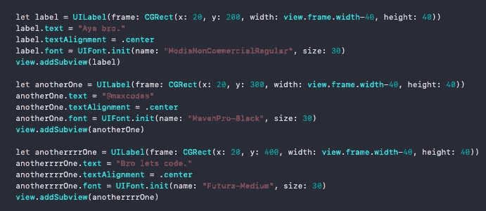
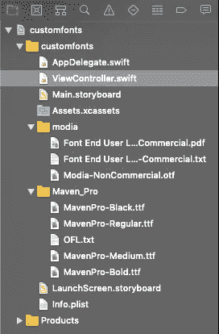
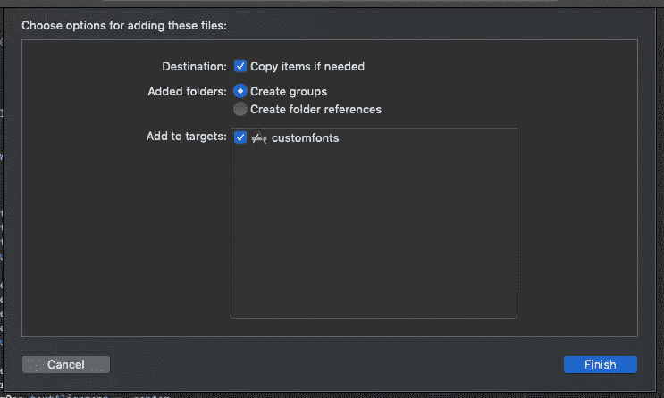
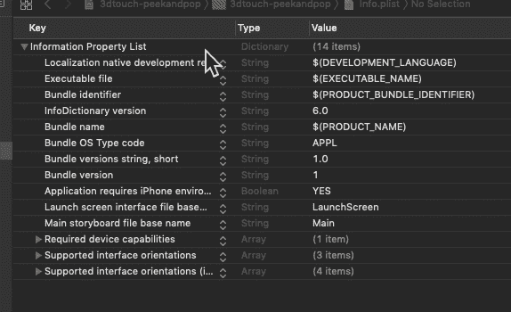
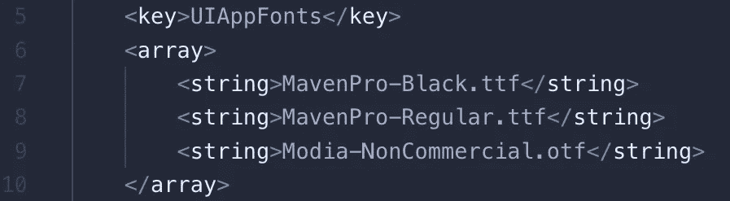

# 自定义 ui Fonts——让那些该死的自定义字体工作起来，为你的 iOS 应用增添趣味。

> 原文：<https://itnext.io/custom-uifonts-get-those-damn-custom-fonts-working-spice-up-that-app-32bf38654552?source=collection_archive---------3----------------------->

我在 youtube 上制作了一个关于这个主题的视频。

Xcode & Swift。除了字体之外，这两个工具都非常好用。如果你和我一样，你可能已经学会了如何在你的 iOS 应用程序中使用自定义字体，你也可能已经忘记了怎么做。这是你自定义字体的指南。保存这篇文章，每次忘记的时候都可以参考！让我们编码。👩‍💻👨‍💻

# 三步就够了。

# 第一步——在屏幕上贴上一些标签——我的物品和女孩。✅

一些标签。

好吧，很快的。注意它们有独特的字体名称。Futura-Medium 包含在 iOS/Xcode 中，因此可以工作。但是，前两个标签将显示为默认的系统字体文本。

让我们改变这一点。

# 步骤 2-在应用程序中添加自定义字体。✅

[*第一个标签是使用 ModiaNonCommercialRegular*](https://www.1001freefonts.com/search.php?q=modia&search=search)

[*第二个标签是用 MavenPro-Black。*](https://www.fontsquirrel.com/fonts/maven-pro)*Maven Pro****字体家族*** *包括四个* ***字体名称。***

将字体拖到你的项目中。

下载这些字体并将文件夹拖到 Xcode 项目中。你会看到这样一个屏幕。确保 ***添加到目标*** 被选中，否则无法工作。

项目文件结构和将字体文件夹拖到项目中时看到的屏幕。

# 第三步——将字体添加到你的信息列表中。✅

跟着这张 gif。只要完全按照我在 gif 中的做法去做，你就会成为 gucci to go。

不过，我来解释一下。

我们正在做的是在 info.plist 中添加 application array 提供的字体，然后添加我们希望包含在应用程序中的每种字体。

## 可选步骤:

如果您不喜欢 info.plist 编辑器，而更喜欢用原始标记编写 info.plist。这是代码。

# **古驰帮！🔥**

好了，从现在开始，你应该在你的 iOS 应用程序中使用自定义字体了。

如果你没有成功，我强烈建议[观看我在这篇文章](https://youtu.be/faiWTOKq5xo)上的 YouTube 视频，因为我用视频格式解释了这篇文章，这应该能让你上手。

如果你想第一个听说有限的免费课程优惠券(每月 10 英镑)，请随时订阅我的 [**每周开发内容电子邮件列表。**](https://www.maxcodes.io)

# Outro。😂

非常感谢你的支持。

每一次鼓掌、阅读和观看都帮助我每天做我喜欢的事情，帮助其他开发人员掌握他们的技术，就像我掌握我的一样。更多教程、内容和开发糖果请联系我和 iOS 社区，在 [Twitter](http://twitter.com/maxcodes1) 、[脸书](http://facebook.com/realmaxcodes)和 [Instagram](http://instagram.com/maxcodes.io) ！