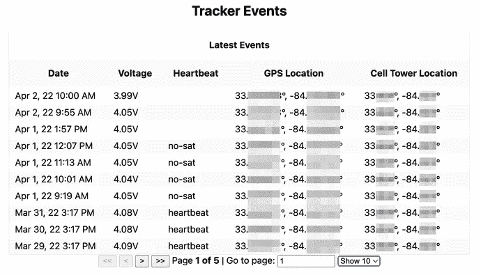
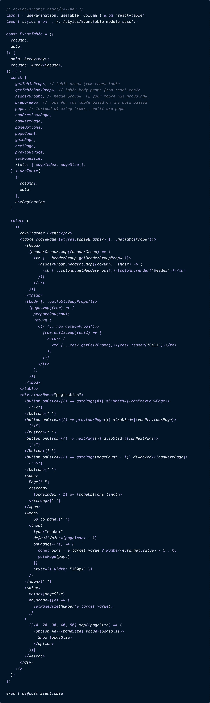
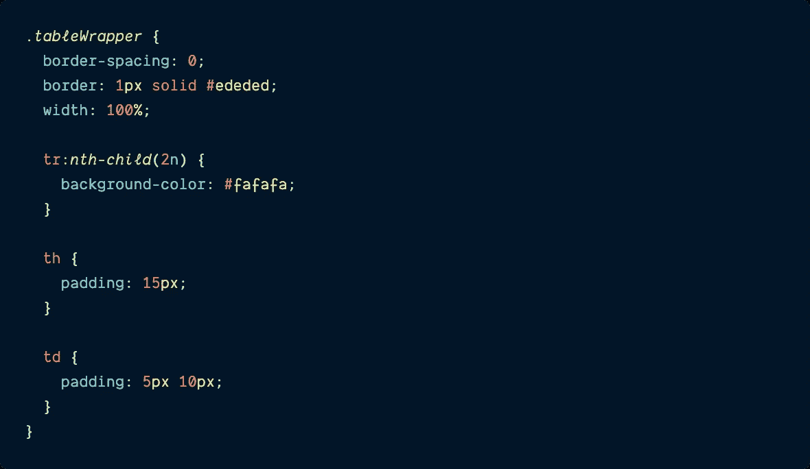
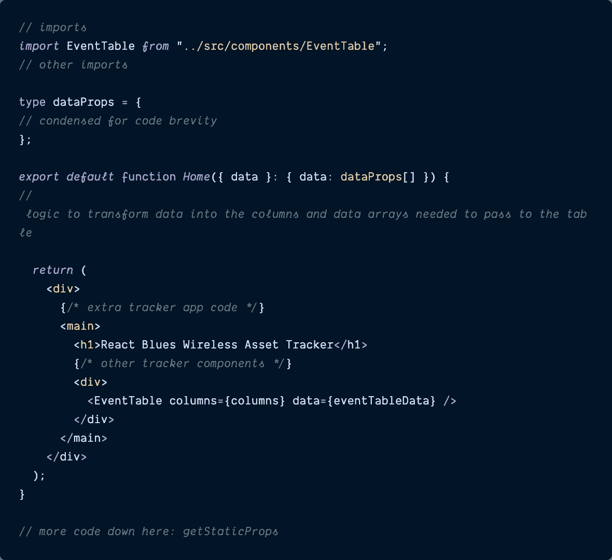
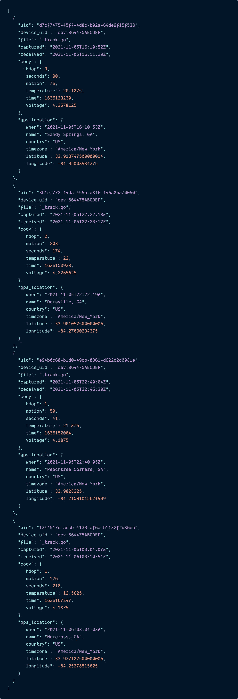
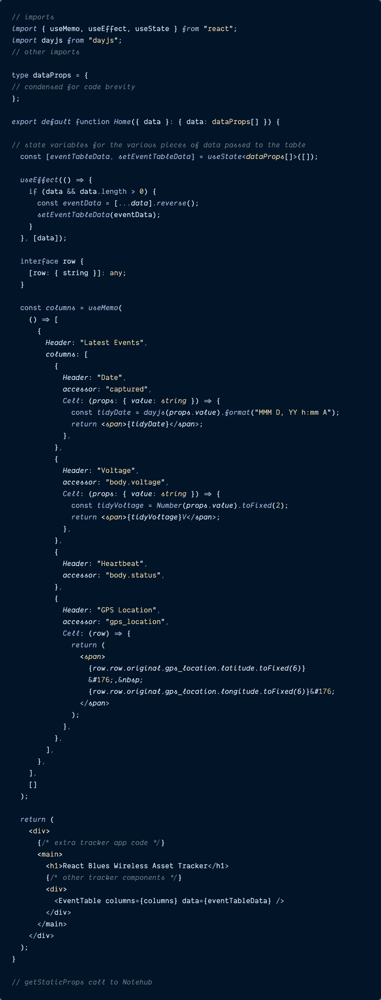

# 自定义和样式化 React 表中的复杂数据

> 原文：<https://itnext.io/customize-and-style-complex-data-in-react-table-4371d5562a13?source=collection_archive---------0----------------------->

## 有时，表格列和单元格需要来自多个对象特性的数据。


# 介绍

去年夏天，我开始为一家物联网(IoT)初创公司 [**【蓝调无线**](https://blues.io/?&utm_source=medium.com&utm_medium=web&utm_campaign=niedringhaus-effect&utm_content=ep-2) 工作，该公司旨在让物联网开发变得更简单——即使在没有可靠的互联网连接的情况下。Blues 通过 [**Notecards**](https://blues.io/products/notecard/?&utm_source=medium.com&utm_medium=web&utm_campaign=niedringhaus-effect&utm_content=ep-2) 来实现这一点——可以嵌入任何“边缘”物联网设备的预付费蜂窝设备，以 JSON 的形式将传感器数据传输到安全的云: [**Notehub**](https://notehub.io/?&utm_source=medium.com&utm_medium=web&utm_campaign=niedringhaus-effect&utm_content=ep-2) 。

前端 web 开发是我的专长，而不是硬件或固件开发，所以随着我对物联网开发越来越熟悉，我开始构建一个更简单的项目:一个使用 Blues[**note card**](https://shop.blues.io/products/note-nbgl-500/?&utm_source=medium.com&utm_medium=web&utm_campaign=niedringhaus-effect&utm_content=ep-2)、Blues[**note carrier AL**](https://shop.blues.io/products/carr-al/?&utm_source=medium.com&utm_medium=web&utm_campaign=niedringhaus-effect&utm_content=ep-2)和一个小型 [**锂离子聚合物(LiPo)电池**](https://www.adafruit.com/product/328) 为设备供电的[](https://www.hackster.io/paige-niedringhaus/low-code-gps-asset-tracker-and-map-display-b10419)

**在 Blues [**开发者体验文档**](https://dev.blues.io/guides-and-tutorials/notecard-guides/asset-tracking/?&utm_source=medium.com&utm_medium=web&utm_campaign=niedringhaus-effect&utm_content=ep-2) 的帮助下，我在不到半小时的时间内就将温度、电压和 GPS 定位数据从我的追踪器传送到了 Notehub 云端。这是一个好的开始，但是来自传感器的数据真正变得有用的方式是在某种用户界面上显示给用户。可能是地图、图表，或者对我来说是表格。**

**因此，我想从 Notehub 云中获取数据，并将其输入到一个定制的仪表板中，以跟踪和显示 Notecard 的位置和来自现实世界的数据读数。作为一名前端开发人员，React 是我目前选择的 JavaScript 框架，为了获得更多的 Next.js 经验，我决定构建一个 Next.js Typescript 驱动的仪表板，在这个过程中我学到了很多有趣的东西。在一系列博客文章中(我将在本文中链接到这些文章)，我将与你分享我发现的一些很酷的东西。**

> ***如果你错过了我关于使用 React 传单在 Next.js 中构建资产跟踪地图的前两期博客，你可以在这里阅读*[](https://www.paigeniedringhaus.com/blog/create-an-asset-tracker-with-next-js-and-react-leaflet)**。****
> 
> ****第二个关于制作数据可视化图表的有* [***这里有***](https://www.paigeniedringhaus.com/blog/build-and-custom-style-recharts-data-charts) *。****

***这篇文章将向你展示如何使用 React 表格库制作一个数据表，并定制单元格中显示的数据，用真实世界的位置数据填充。***

***这是最终仪表板的样子——底部的位置坐标和数据表是这篇文章的重点。***

# ***在 Next.js 应用程序中创建表格组件***

*****请注意:**本文不会介绍一个全新的 Next.js 应用程序的初始设置——那超出了本博客的范围。如果你是从零开始，我会推荐使用 [Next.js starter 应用程序和类型脚本文档](https://nextjs.org/docs/basic-features/typescript)。***

> ****如果你愿意，你也可以从 GitHub repo* [***这里***](https://github.com/paigen11/react-gps-asset-tracker-dashboard) *分叉并下载我的整个工作代码库。****

## ***安装表相关性***

***让我们通过向 Next.js 应用程序添加必要的表库来开始这篇文章。***

***尽管有许多以 React 为中心的表库和组件可供选择，但我还是选择了 [**React 表库**](https://react-table.tanstack.com/) ，因为它是一个“无头”表库，为您提供了一组轻量级、可组合和可扩展的钩子，用于构建强大的工具和数据网格体验。***

***“headless”部分意味着没有通过 React Table 呈现的标记或样式，因此您可以完全按照自己的意愿对其进行定制和样式化。一开始听起来可能有点奇怪，但你很快就会看到，它实际上最终真的很好。***

***因此，通过在终端中键入以下命令，在 Next.js 应用程序中安装 React Table。***

```
*$ npm install react-table*
```

> ******注意:*** *React 表兼容 React v16.8+，所以请确保你的 app 的 React 版本如果不是以上至少到这里。****

*****打字稿备注:*****

***如果您在项目中使用 Typescript(像我一样)，您还需要安装以下 dev 依赖项来避免 Typescript 错误:***

```
*$ npm install @types/react-table --save-dev*
```

***现在，我们准备开始使用 React Table 在应用程序中创建一个表来显示位置数据。***

## ***创建<eventtable>组件并对其进行样式化</eventtable>***

******

***我们将要构建的自定义样式的事件表。***

***对于我的表，我想显示**“events”**，这是 Blues Wireless 的 Notecards 生成并发送到其 cloud Notehub 的内容。每个事件都是一个单独的 JSON 对象，尽管在一个项目中存储了各种不同的事件类型，但是现在关注的是事件。***

***`**_track.qo**` **事件示例*****

***典型的`_track.qo`事件如下所示:***

```
*{
    "uid": "d7cf7475-45ff-4d8c-b02a-64de9f15f538",
    "device_uid": "dev:864475ABCDEF",
    "file": "_track.qo",
    "captured": "2021-11-05T16:10:52Z",
    "received": "2021-11-05T16:11:29Z",
    "body": {
      "hdop": 3,
      "seconds": 90,
      "motion": 76,
      "temperature": 20.1875,
      "time": 1636123230,
      "voltage": 4.2578125
    },
    "gps_location": {
      "when": "2021-11-05T16:10:53Z",
      "name": "Sandy Springs, GA",
      "country": "US",
      "timezone": "America/New_York",
      "latitude": 33.913747500000014,
      "longitude": -84.35008984375
    }
  }*
```

***包含`temperature`、`time`、`voltage`、`gps_location`坐标等数据。有用的东西，你可能想显示在一个容易阅读的表格，对不对？***

***没错。下面是我如何在 Next.js 应用程序中名为`EventTable.tsx`的新文件中构建一个可重用的表格组件。***

***我推荐将下面的代码复制粘贴到自己的组件文件中，也可以点击下面的文件标题，查看 GitHub 中的现场代码回购。***

***`[**EventTable**](https://github.com/paigen11/react-gps-asset-tracker-dashboard/blob/main/src/components/EventTable.tsx)`***

******

***让我们来看一下这个表格组件中发生的所有事情——乍一看，被破坏的道具数量可能有点多。***

***尽管来自`react-table`库的实际导入列表非常小——只有三个独立的方法，但是组件声明后，其中包含的功能深度会迅速扩展。***

*   ***`[**useTable**](https://react-table.tanstack.com/docs/api/useTable)`和`[**usePagination**](https://react-table.tanstack.com/docs/api/usePagination)` 组合起来构成了组件开始时被析构的所有属性，这是有意义的——毕竟，这是我们正在使用的一个表库。***

***从这两个钩子我们得到:***

*   ***`**getTableProps**`-react-table 中的桌面道具。***
*   ***`**getTableBodyProps**`-react-table 中的表体道具。***
*   ***`**headerGroups**` - headerGroups，如果您的表有分组。***
*   ***`**prepareRow**` -基于所传递数据的表格行。***
*   ***`**page**` -拥有分页表格所必需的。***
*   ***`**canPreviousPage**` -如果表格可以分页到前面的页面，则为布尔值。***
*   ***`**canNextPage**` -如果表格有未来页面可以分页，则为布尔值。***
*   ***`**pageOptions**` -对应于表格中可用页面的数组(适用于选择界面，允许用户键入页码，而不是使用按钮)。***
*   ***`**pageCount**` -基于当前页面尺寸值的可用页面数量。***
*   ***`**gotoPage**` -将页面索引设置为用户指定值的功能。***
*   ***`**nextPage**` -将页面索引增加 1 的功能。***
*   ***`**previousPage**` -将页面索引减一的功能。***
*   ***`**setPageSize**` -将页面尺寸设置为新值的功能。***
*   ***`**state: { pageIndex, pageSize }**` -当前设置表格的页面索引和页面大小。***

***咻！但是在所有的初始析构之后，`<EventTable>`组件只接受了两个初始数组属性:`columns`和`data`。注意，根据 React 表[文档](https://react-table.tanstack.com/docs/api/useTable)，这两个数组的值都必须被**记忆**。***

*   ***`**data**`是`useTable`钩子变成事件数据的行和页。***
*   ***`**columns**`是整个表的核心列配置对象(在这个数组中放置一个大头针——我们将在本文后面配置它)。***

***在那之后，这部分就全是 JSX 了。***

***`headerGroups`被映射以在表的顶部呈现任何标题——我们的表只有一个标题，但是你可以有多个标题来帮助可视化地显示列的分组。***

***然后，映射每个`page`，提取该页面中的每个`row`数据，并呈现该行中的每个`cell`。***

***随后是大量的按钮和一个自定义输入，添加它们是为了使分页以多种不同的方式成为可能；例如`canPreviousPage`、`nextPage`和`goToPage`。***

***最后，`pageSize`，或者每页显示的行数，也是动态的。***

***这是一个很大的 JSX，但是一旦一些初始的映射和迭代完成，这就相当简单了。***

***不过好的一面是，`react-table`库内置了所有这些功能*，我们需要传递的所有数据都是两个数组。就是这样。****

******样式化表格******

****现在一些非常简单的造型，使这张桌子看起来像样。正如我前面提到的，React Table 认为自己更像是一个无头的表实用程序库，因此，它不会对自己生成的任何表应用默认样式。****

****幸运的是，这也意味着*撤销*没有默认样式，所以只需几行 CSS 就可以让这个表格看起来很漂亮。****

****在 Next.js 应用程序中保存样式的地方(我把我所有的样式都保存在`styles/`文件夹中)，创建一个名为`EventTable.module.css`的新 CSS 或 SCSS 文件。****

> *****除了内置的* [***CSS 模块样式***](https://nextjs.org/docs/basic-features/built-in-css-support#adding-component-level-css) *之外，我在下一个项目中使用 Sass。*****
> 
> *****在这个特殊的 SCSS 文件中很少有 Sass 嵌套，所以我认为它很容易理解，但是如果你想在你自己的下一个项目中建立 Sass，你可以在这里按照 Next 的指示*[](https://nextjs.org/docs/basic-features/built-in-css-support#sass-support)**。******

*****`[**EventTable.module.scss**](https://github.com/paigen11/react-gps-asset-tracker-dashboard/blob/main/styles/EventTable.module.scss)`*****

**********

*****在这个 SCSS 文件中，我们创建了一个`tableWrapper`类来给表格添加一个浅色边框(`border: 1px solid #ededed;`)，将行的背景色在默认背景色或纯白与另一种灰白色(`background-color: #fafafa;`)之间交替，以获得更好的可读性，并给表格标题(`padding: 15px;`)和表格数据(`padding: 5px 10px;`)添加一些填充。*****

*****没有太多的风格，但它使一个足够漂亮的桌子与仪表板的其余部分的极简主义感觉相匹配。*****

> ********注意:****`*<EventTable>*`*的很多代码都是受到了* [***React 表文档***](https://react-table.tanstack.com/docs/examples/pagination) *中非常好的例子的启发，我强烈建议您去看看——它非常全面，涵盖了人们拥有的许多表用例。*******

## *****在应用程序中渲染表格*****

*****表组件完成后，是时候将它添加到主仪表板组件中了。将其导入到主`pages/`文件夹中的`index.tsx`文件中。*****

*****为了清晰起见，我压缩了这个文件中的代码，但是对于 GitHub 中的完整代码，你可以点击这里的文件标题。*****

*****稍后将处理表的实际数据和列——这只是为了让`<EventTable>`进入仪表板页面。*****

*****`[**pages/index.tsx**](https://github.com/paigen11/react-gps-asset-tracker-dashboard/blob/main/pages/index.tsx)`*****

**********

*****这是整个教程中最简单的部分之一:在文件顶部导入`<EventTable>`组件，然后将它弹出到下面的 JSX 中。*****

*****现在开始用事件数据填充这个表。*****

# *****为表提取数据*****

*****在我的第一篇 [**资产跟踪仪表板帖子**](https://www.paigeniedringhaus.com/blog/customize-and-style-complex-data-in-react-table/create-an-asset-tracker-with-next-js-and-react-leaflet) 中，我详细介绍了如何创建自己的资产跟踪器，以使用 Blues 无线硬件和数据获取功能为应用程序生成真实数据。*****

*****如果您想沿着这条路构建自己的跟踪器并将数据发送到 Notehub，请自便。*****

*****在这篇文章中，我将跳到我们已经通过 Next.js `getStaticProps` API 调用将数据拉入应用程序的部分。来自 Notehub 云的 JSON 数据如下所示:*****

**********

*****这个数组中的每个 JSON 对象都是一个单独的`_track.qo`运动事件，显示记事卡的当前位置和传感器读数。在这篇文章中，我们关心的对象部分是`gps_location.latitude`、`gps_location.longitude`和`body.voltage`值。这是我们的表需要的数据。*****

> ******如果您想保存设置您自己的资产跟踪器，您可以将这一小组事件粘贴到您的应用程序的* `*index.js*` *文件中，以模拟从 Notehub 获取的数据，用于测试目的。******

## *****转换 JSON 数据以适应定制的表格列和单元格*****

*****随着数据进入我们的应用程序，我们将操作它并创建一些新的列来显示在表中。这就是事情开始变得有趣的地方。*****

*******自定义单元格数据*******

*****如果您注意到传入的 JSON 数据的形状，`gps_location.latitude`和`gps_location.longitude`值是`_track.qo`事件中两个独立的属性，但是将它们作为逗号分隔的列表一起显示在单个数据单元格中更有意义。*****

*****同样地，`time`是纪元时间——一种非常机器可读的格式，人类很难破译。因此，对于我的表格单元格，最好将其格式化为对人们有意义的日期。*****

*****我们将这样做——和往常一样，您可以在 GitHub 中查看完整的代码。*****

*****`[**pages/index.tsx**](https://github.com/paigen11/react-gps-asset-tracker-dashboard/blob/main/pages/index.tsx)`*****

**********

*****为了实现这一点，我们将添加几个 React 钩子:`useState`、`useEffect`和`useMemo`，并且为了使格式化`time`更容易，我将库`[**dayjs**](https://day.js.org/)` 添加到我的项目中。不完全必要，但是很方便。*****

*******获取表格数据*******

*****在组件内部，用`useState`钩子创建一个新的状态变量来保存事件数据:`const [eventTableData, setEventTableData] = useState<dataProps[]>([]);`。*****

*****接下来，设置一个`useEffect`函数，该函数将在 JSON 数据通过`getStaticProps`调用被提取到页面加载组件时运行。当`data`出现时，我们获取数据，颠倒顺序，使最近的事件排在最前面——当看到这里的事件列表时，我认为这样更有意义:最近的事件排在最前面——并通过`setEventTableData`在组件的状态中设置这些事件。*****

*******配置各列*******

*****最后一步是定义表的列。*****

*****我们必须做的第一件事是将新定义的`columns`变量包装在一个`useMemo`函数中(如 React 表文档所定义的)，我还将给整个表一个名为`Latest Events`的标题。*****

*****然后我们可以设置`columns`数组:我想要一个用于`Date`戳，一个用于显示设备的`Voltage`，一个用于设备的`Status`(即事件是由实际运动引起的运动事件还是“心跳”事件——一个只是让你知道设备还活着的事件)，还有一个用于`GPS Location`，正如我之前说过的，我希望它是纬度和经度的组合。*****

*****这些标题中的每一个都将成为这些对象中的一个`Header`属性，并且它们后面会有一个`accessor`属性。通常情况下，`accessor`值是类似于`body.status`的简单值，这是从对象中获取实际值的方法。然而，如果`accessor`需要在设置前进行转换，这就是`Cell`功能发挥作用的地方。*****

*****[**单元格**](https://react-table.tanstack.com/docs/api/useTable#cell-properties) 是一种方法，可用于转换单元格中的道具，并完全自定义返回值，精确到 JSX。*****

*****例如，为了将时间戳日期修改成格式良好的字符串，我们从事件中获取`captured`值，然后使用`Cell`运行`dayjs`函数，并将日期格式化为名为`tidyDate`的新变量。然后我们返回`tidyDate`作为一个包裹在`<span>`标签中的 JSX。*****

*****类似地，要将纬度和经度值连接到一个单元格中，我们必须更深入地研究传递给`Cell`的属性，并提取嵌套在`gps_location`对象中的两个属性以返回到单元格中。*****

> *****`***Console.log()***` ***是你这里的朋友。********
> 
> *****在将这些复杂的数据单元格放在一起时，不要害怕去接触 `*console.log()*` *。只有通过使用它来查看数据和表中每一行的形状，我才能知道如何提取我需要的* `*GPS Location*` *列的值。******

*****就这样:我们的`columns`被定义了，我们的`data`也被定义了，将两者都传递给`<EventTable>`组件，我们就可以开始了。*****

# *****结论*****

*****大约 9 个月前，我开始为一家物联网初创公司工作，并学习如何管理和显示来自“边缘”设备的仪表盘读数。因此，我为此构建的第一个项目是一个仪表板，其中包括数据图表、显示设备位置的地图和列出所有事件的表格。*****

*****为了以所有的灵活性呈现一个表而不使用 cruft，我求助于 React Table library，这是一个无头的、高度可扩展的钩子集，它简化了复杂表的构建，处理诸如分页、页面大小等事情，而我们只需付出很少的努力。甚至修改一行中表格单元格数据的显示也是相对简单的。这是一个很棒的图书馆。*****

*****感恩节后的晚上，当我父母的车在车道上被偷时，这个仪表盘就派上了用场。如果你想听完整个故事并建立自己的追踪器，可以看看我为 Blues Wireless 制作的这个 [**博客帖子和视频**](https://blues.io/blog/gps-asset-tracker-with-blues-wireless-and-react/?&utm_source=medium.com&utm_medium=web&utm_campaign=niedringhaus-effect&utm_content=ep-2)——它详细描述了从硬件到软件到部署到网络的整个过程。*****

*****过几周再来看看——我会写更多关于 JavaScript、React、IoT 或其他与 web 开发相关的东西。*****

*****如果你想确保你不会错过我写的一篇文章，在这里注册我的时事通讯:【https://paigeniedringhaus.substack.com*****

*****感谢阅读。我希望您喜欢学习如何利用 React 表库来制作数据表，以显示来自物联网资产跟踪器的事件数据。表格可能很难正确显示，但它们是向用户显示各种数据的一种非常好的、直接的方式。*****

# *****参考资料和更多资源*****

*   *****[Hackster.io 原始资产跟踪项目](https://www.hackster.io/paige-niedringhaus/low-code-gps-asset-tracker-and-map-display-b10419)*****
*   *****[资产跟踪 GitHub 回购](https://github.com/paigen11/react-gps-asset-tracker-dashboard))*****
*   *****[反应表](https://react-table.tanstack.com/)库*****
*   *****蓝调无线[网站](https://blues.io/?&utm_source=medium.com&utm_medium=web&utm_campaign=niedringhaus-effect&utm_content=ep-2)*****
*   *****蓝调无线[开发者体验网站](https://dev.blues.io/?&utm_source=medium.com&utm_medium=web&utm_campaign=niedringhaus-effect&utm_content=ep-2)*****
*   *****关于[在 Next.js 应用程序中渲染地图的原始文章](https://www.paigeniedringhaus.com/blog/create-an-asset-tracker-with-next-js-and-react-leaflet)*****
*   *****关于使用 React Recharts 库定制样式图表和工具提示的后续文章*****

******最初发表于*[T5【https://www.paigeniedringhaus.com】](https://www.paigeniedringhaus.com/blog/customize-and-style-complex-data-in-react-table)*。******