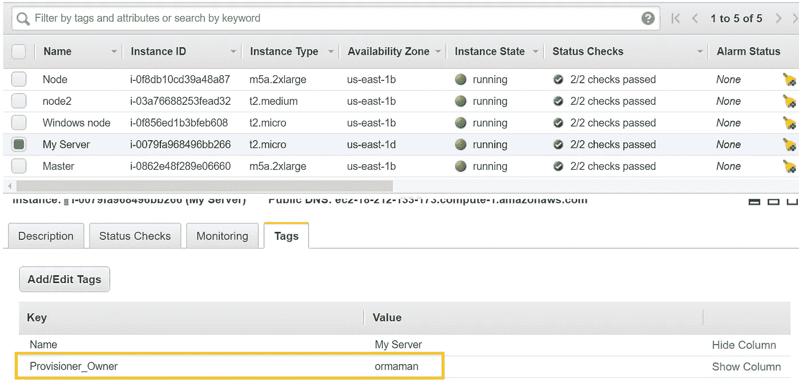
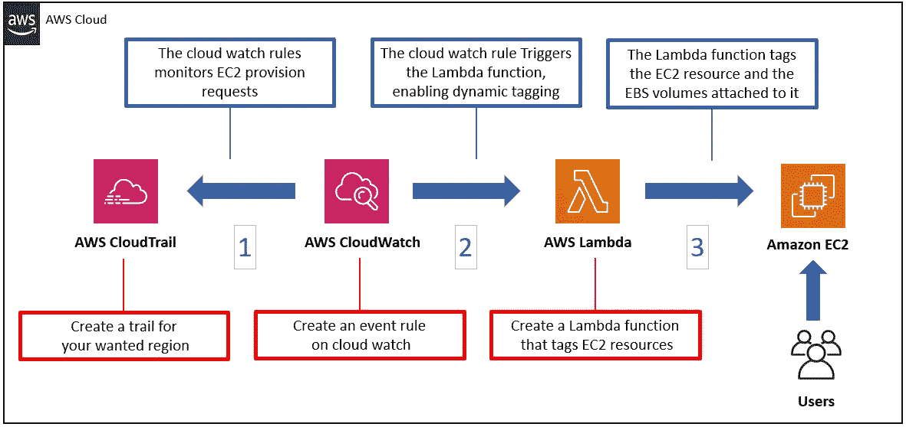
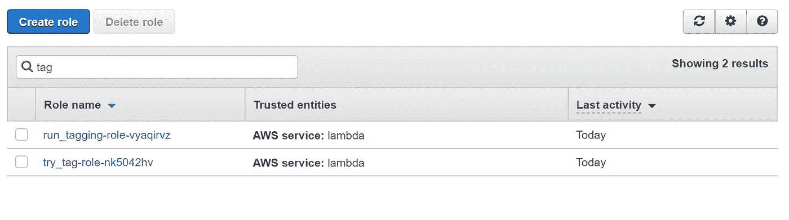

# AWS 中的定制资源自动标记

> 原文：<https://itnext.io/customized-resources-auto-tagging-in-aws-e3413375ceb4?source=collection_archive---------4----------------------->

# 背景

> 作为一名 DevOps 顾问，我经常发现自己收到大量&各种各样的客户请求，由于客户的特殊情况、目标和限制，其中一些请求非常复杂。
> 偶尔星星在排列，你发现自己处于这种“独角兽”的境地，最好形容为:
> ***乍一看很简单，但顺着路走就复杂了***

# *场景*

*我的一个客户，一家领先的全球网络安全公司(名称保密)请求我帮助解决一个与 AWS 相关的问题。*

*“我希望在创建资源时，每个 EC2 实例和卷都标记上供应器的身份。(例如-Tag-name:***Owner***Tag-Value:***GOB bluth***)"*

*“小菜一碟！”我心想，我以前在这方面做过类似的事情，不会有任何问题。*

**

*预配 EC2 实例后的期望状态*

# *问题是*

*尽管 AWS 提供了各种“自动标记”和“标记实施”的方法，但仍然没有针对自动动态标记情况的完整解决方案，这可以通过一个简单的 AWS 服务来解决(截至 2020 年 3 月)。*

# *解决问题的途径*

*在寻找可能的解决方案时，通过调查各种 AWS 服务，我没有发现任何一种服务对我的场景足够合适和准确。*

*咨询我的同事，甚至 AWS 的高级技术专家，我既找不到这个难题的精确解决方案，也找不到一个全面的解决方案。*

*在对潜在解决方案进行大量研究后，我得出结论，最好的方法是通过将多个服务组合成一个全面的解决方案来扩展 AWS 功能。因此，满足了我的客户需求。*

*在介绍该解决方案之前，我想与您分享一些有趣且有价值的资源，这些资源是我在寻找更多**标准**标记策略的过程中遇到的:*

**AWS 组织:-*[*https://docs . AWS . Amazon . com/organizations/latest/user guide/orgs _ manage _ policies _ tag-policies-effective . html*](https://docs.aws.amazon.com/organizations/latest/userguide/orgs_manage_policies_tag-policies-effective.html)*

**Via IAM policy-*[*https://stack overflow . com/questions/48426761/AWS-IAM-policy-to-enforce-tagging*](https://stackoverflow.com/questions/48426761/aws-iam-policy-to-enforce-tagging)*

**AWS 配置:-*[*https://docs . AWS . Amazon . com/config/latest/developer guide/tagging . html*](https://docs.aws.amazon.com/config/latest/developerguide/tagging.html)*

# *解决方案*

*首先，解决方案的部署本身并不复杂，我们将在本文后面看到。复杂的部分是调查所有可用的服务，并理解如何将它们组合在一起，形成一个功能性的、简单的、成本有效的、可审计的和持久的机制。*

*该机制由三个 AWS 服务组成:*

> **AWS 云迹**
> 
> **AWS 云手表**
> 
> **AWS Lambda**

*解决方案流程图描述如下:*

**

*解决方案流程图*

# *技术解决方案逐步程序*

*在接下来的部分中，我将一步一步地引导您如何启动并运行这个机制。*

# *云迹*

> ****定义*** *- AWS CloudTrail 是一项服务，可对您的 AWS 帐户进行治理、合规、运营审计和风险审计。使用 CloudTrail，您可以记录、持续监控和保留与您的 AWS 基础架构中的操作相关的帐户活动。CloudTrail 提供您的 AWS 帐户活动的事件历史，包括通过 AWS 管理控制台、AWS SDKs、命令行工具和其他 AWS 服务采取的操作。**

*1.转到“**云轨迹**”服务，选择“**轨迹**”部分，然后按“**创建轨迹**”按钮。*

*2.除了这些属性之外，将所有内容保留为默认值:*

***将轨迹应用于所有区域** —如果您只想要一个区域的轨迹，选择“否”*

***S3·比提** —选择一个能够代表贵公司命名惯例的名称*

*3.点击**创建**按钮。*

*在 CloudTrail 上创建踪迹*

# *希腊字母的第 11 个*

> ****定义****——AWS Lambda 是一种计算服务，让你不用配置或管理服务器就能运行代码。AWS Lambda 仅在需要时执行您的代码，并自动伸缩，从每天几个请求到每秒几千个请求。您只需为您消耗的计算时间付费，当您的代码不运行时，则不收费。有了 AWS Lambda，您几乎可以为任何类型的应用程序或后端服务运行代码——所有这些都无需管理。**

*1.转到“**功能**下的“**λ**维修”，按下“**创建功能***

*2.除了这些属性之外，将所有内容保留为默认值:*

***功能名称** —选择一个代表您组织命名惯例的名称*

***运行时** — Python 3.6*

*3.在**功能代码**部分粘贴以下[代码](https://github.com/ormam/metirials/blob/master/Auto_tagging_lambda_function)*

*4.按下**保存**按钮*

*Lambda 函数需要有合适的权限来标记 EC2 资源，因此我们将为其预定义的角色授予合适的策略。*

*5.进入 **IAM** 服务，点击**角色**。*

*6.在“**Roles”**下，查找以下角色名称约定:
“来自步骤‘2’的 Lambda 函数名称”**-role-**随机序列*

******

***角色名称的示例***

***角色名称的示例***

***7.点击**角色*****

***8.点击“**附加策略*****

***9.查找“ **AmazonEC2FullAccess** ”并将其附加到角色。***

***如何创建 lambda 函数并配置支持 IAM 的角色***

# ***云观察***

> ******定义****——cloud watch 以日志、指标和事件的形式收集监控和运营数据，为您提供运行在 AWS 和本地服务器上的 AWS 资源、应用和服务的统一视图。****

***1.进入"**云手表**服务，在"**事件**下点击"**规则**"并按下"**创建规则**按钮。***

***2.在“**事件源**”部分，将这些属性旁边的所有内容保留为默认值:***

*****服务名** — EC2***

*****事件类型** —通过云轨迹的 AWS API 调用***

***在单选按钮部分选择:“**特定操作”**，并在自由文本框中输入“**运行实例*****

***3.在“**目标**”部分，将这些属性旁边的所有内容保留为默认值:***

***在第一个组合框中选择-"**Lambda 函数**"***

***在第二个组合框中选择 Lambda 函数的名称***

***4.点击**配置详细信息**按钮***

***5.输入规则的名称***

***6.点击**创建规则*****

***在 CloudWatch 上创建事件角色***

# ***检查功能***

***请提供 EC2 实例并检查标记是否存在。***

***验证动态标记是否正常工作***

# ***结论***

***太好了，你做到了！***

***虽然 AWS 有很多很好的服务，旨在覆盖所有的技术场景和可能性，但仍然不可能预先预测任何情况。***

***凭借技术创造力和开放的思维，我们可以填补这些空白，创造出伟大的解决方案。***

***希望对你有帮助，***

***或者妈妈***

***[www.linkedin.com/in/ormaman](http://www.linkedin.com/in/ormaman)***