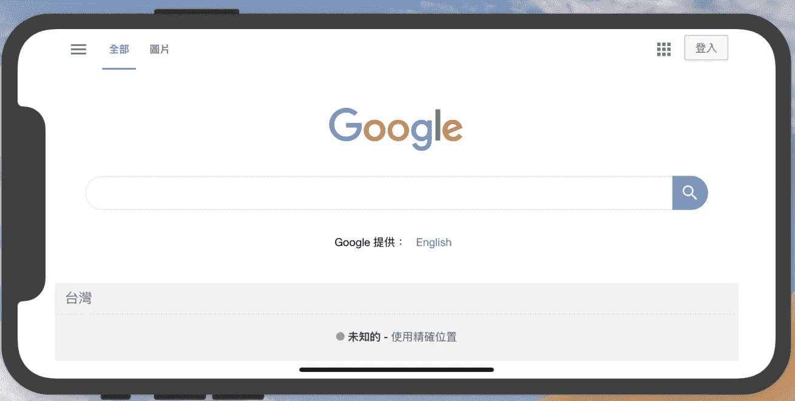
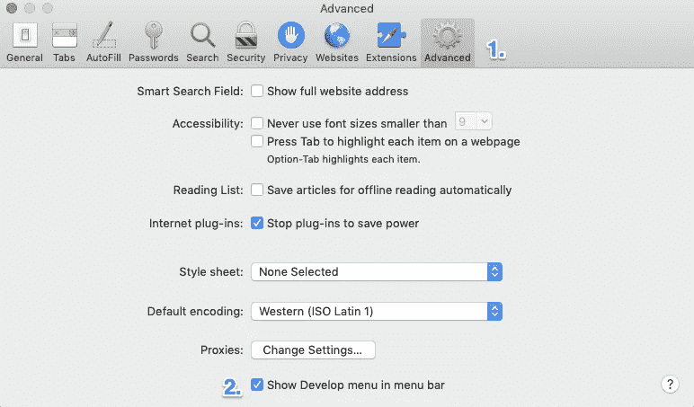
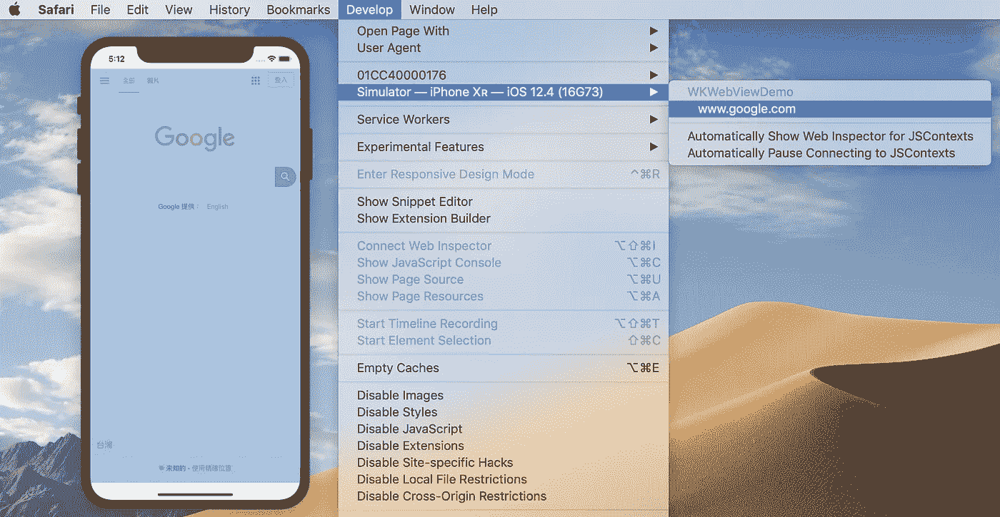
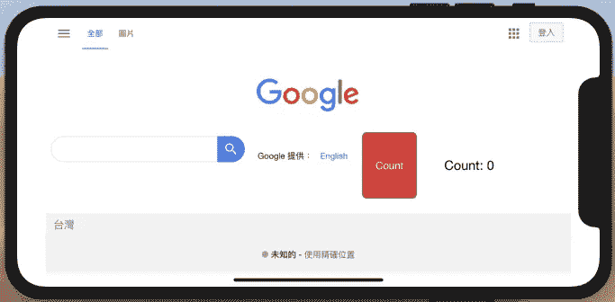
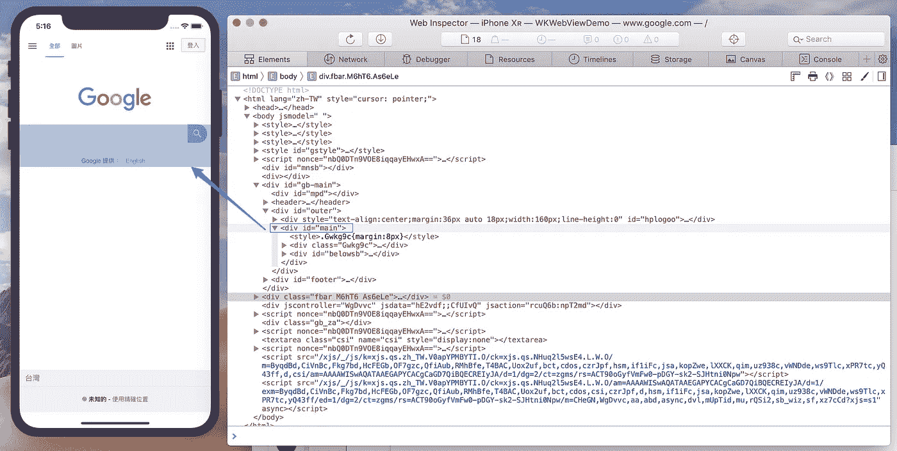
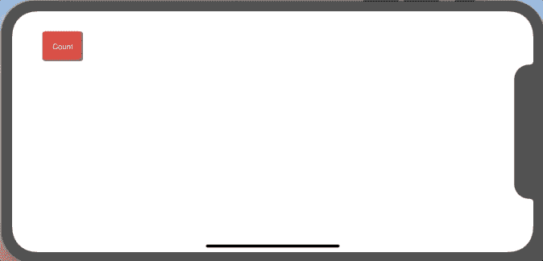

# 在 iOS 中自定义 WKWebView

> 原文：<https://itnext.io/customizing-wkwebview-in-ios-523d85c115f?source=collection_archive---------3----------------------->

运营团队不时希望实时更改他们的内容，而不是等待 iOS 应用程序的新版本更新。满足他们要求的两种最常见的方式是[远程配置](https://firebase.google.com/docs/remote-config/?gclid=Cj0KCQjwhdTqBRDNARIsABsOl9-1GRbNWuh8PB0moV6SevTd8D3dt2jj06x7rhj_FpK2gGvVazjZHr0aAl3eEALw_wcB)和 [WKWebView](https://developer.apple.com/documentation/webkit/wkwebview) 。与标题一致，我将只关注 WKWebView 并演示我们如何实现它。

## 显示网页内容

让我们从最基本的开始:展示一个网页内容。不多解释了。😗



## 使用 WKWebView 调试

我们可以借助 Safari 调试我们的 iOS 项目。打开 Safari 并按下⌘+，若要打开偏好设置，请在“高级”标签下，选中“在菜单栏中显示开发菜单”。



直到我们有了项目构建，我们才能使用 Safari 调试器。调试器正在开发→您的模拟器或设备。



## 使用 Javascript 修改 WebView

在这里，我将用 javascript 创建一个按钮和一个标签，并对其应用一些 CSS。



用 Safari 调试，找到了想要的`<div id="main">`。



我们可以使用简单的字符串或者从一个单独的 js 文件(在我的演示中是 *script.js* )中包含它来注入 javascript 代码。一旦我们有了 javascript 代码，我们就把它传递给`WKUserScript`，然后包装成`WKUserContentController`，最后用`WKWebViewConfiguration`来初始化`WKWebView`。

## 监听 javascript 事件并作出回应


我们可以通过向`WKUserContentController`添加脚本消息处理程序来监听 javascript 事件。并符合`WKScriptMessageHandler`协议。

最后，我们使用`evaluateJavaScript(_ :, completionHandler:)`发送回我们的 javascript 响应。加油🎉

## 使用本地 html



事实上，我们也可以使用本地 html 来呈现 WebView，如下所示:

```
**if** **let** url = Bundle.main.url(forResource: "index", withExtension: "html") {
    webView.load(URLRequest(url: url))
}
```

或者

```
let html = "<h1>WebView</h1>"
webView.loadHTMLString(html, baseURL: nil)
```

本质上，使用本地 html 是没有意义的，因为使用本地 swift 代码来生成您的 UI 会更加直接和高效。

## 源代码

你可以在这里找到完整的项目。另外，使用本地 HTML 的在[本地 html 分支](https://github.com/ji3g4kami/WKWebViewDemo/tree/localHTML)。

## 参考

*   [wk webview 终极指南](https://www.hackingwithswift.com/articles/112/the-ultimate-guide-to-wkwebview)
*   [使用 Javascript 和 Swift 的 iOS WKWebView 通信](https://medium.com/john-lewis-software-engineering/ios-wkwebview-communication-using-javascript-and-swift-ee077e0127eb)
*   [使用 WebKit 在 iOS 上操纵 JavaScript】](https://medium.com/capital-one-tech/javascript-manipulation-on-ios-using-webkit-2b1115e7e405)