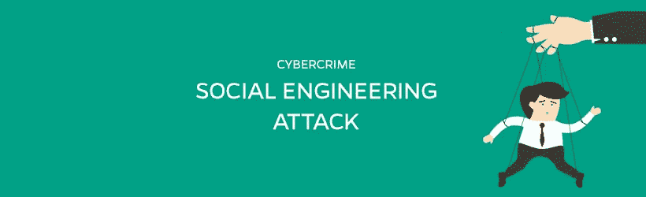

# 网络犯罪攻击 3:社会工程攻击

> 原文：<https://itnext.io/cybercrime-aanvallen-3-de-social-engineering-attack-57b83609f1f7?source=collection_archive---------0----------------------->

在过去的几个星期里，我用三个部分来描述最常见的袭击的启动和停止。以前，我治疗过[剂量攻击](https://www.linkit.nl/knowledge-base/170/Cybercrime_aanvallen_2_de_Denial_of_Service_DOS_attack)和[蛮力攻击](https://www.linkit.nl/knowledge-base/160/Cybercrime_aanvallen_1_de_Brute_force_attack)。今天是第三次也是最后一次社会工程攻击。

## 这是什么？

社会工程:实际上，没有一个好的翻译。行为上的影响我的认知是最重要的。通过操纵来获取这些信息来进行欺诈或犯罪行为。社会工程是有史以来，从希腊神话中看到特洛伊之马，最早描述的一种形式。

根据[国际刑警组织](http://www.interpol.int/Crime-areas/Financial-crime/Social-engineering-fraud/Types-of-social-engineering-fraud)的说法，社会工程还在增长。在过去的两年里，这是一个很大的高峰，2015 年，预计有 10 亿美元的损失。在 2016 年 4 月的《T6 Symantec 威胁报告》中，特别是[网络钓鱼量的增加是显着的。](https://en.wikipedia.org/wiki/Phishing)

## 不同的形状

现在的社会工程有很多种形式：从发送受感染的玫瑰 USB 闪存盘到与秘书建立长期的个人关系。以下是一些简短的描述:

**形**形

**说明**

**网络钓鱼**

最熟悉的形状。这种情况下，恶意软件将自己伪装成一个受信任的机构，并要求受害人通过电子邮件汇钱或提供机密信息。

**转储分区**

搜索(公司)垃圾以获取各种机密、财务或业务敏感信息。

**首席执行官欺诈**

黑客通过电子邮件假扮成公司的首席执行官以此来惩罚员工把钱转到一个特定的帐户。

**搁浅的旅行者舱**

黑客利用受害者的电子邮件地址向他的家人朋友或者熟人索要赎金。这是因为受害者在国外遇到了麻烦。

**百亭**号

留下带有诸如“T2”工资“T3”或“T4”组织 2017 年“T5”等标签的受感染 USB 闪存盘。引诱受害者使用 USB 闪存盘并在电脑上安装恶意软件。

## 这个方法

社会工程攻击通常是根据一个明确的场景进行的。黑客正在采取的步骤:

1.  **获取信息** 在这个阶段，黑客将收集所有可能的数据。利用受害者自己通过各种社交媒体渠道(LinkedIn、Facebook、Twitter 等)公开的信息来表达感激之情。)和提供定位信息的程序，如 Streetview 和 Funda。
2.  **建立关系** 根据所选择的社会工程形式，现阶段与被害人建立关系。这种情况经常发生的原因是为了表现出相同的兴趣爱好，最喜欢的节日或足球俱乐部。根据目标，我们还可以选择建立持续的友谊，甚至是性关系。
3.  **利用弱点** 黑客在这个阶段决定了什么时候可以最有效地利用废弃的知识。它利用已分析的信任和弱点。这些示例包括物理进入办公室、注销登录或隐藏自己的 WiFi 热点。
4.  **执行攻击** 在最后阶段，黑客通过实际执行攻击来达到最终目标。造成损害的方法是尽可能多的在受害者不知情的情况下进行，并尽可能少地留下(数字)痕迹。

    社会工程可能造成的损害与攻击类型有关，但可能导致:

*   通过登录信息入侵银行账户造成的财务损失。这些是由恶意软件留下的 USP 标签发送的。
*   通过向竞争对手传输非法获取的业务敏感信息来削弱竞争优势。
*   由于丢失了个人信息而造成的严重图像损坏，受害者未被怀疑是由受害者发起的。
*   黑客入侵 IT 基础架构后的物理损坏。

## 发现社会工程攻击

[测验分数 T1 的研究表明，大多数社会工程攻击发生在星期一至星期三上午 9 点到下午 10 点之间。在下午 1 点到 2 点之间通过社交媒体发起攻击。上面的解释是，IT 部门到了早上还没有机会删除所有网络钓鱼邮件，在“午饭后”期间，潜在的受害者最容易受到攻击。](https://www.proofpoint.com/sites/default/files/human-factor-report-2016.pdf)

在假期或大型活动(如大型大会或年度体育比赛)期间，特别要警惕社会工程。黑客利用了大量的人力资源。

## 一个具体的例子

在阿姆斯特丹的一家 IT 公司工作。在 rai 中，目前正在举行一个受欢迎的 IT 会议。很多人在推特上说她那天要去参加大会。黑客以免费获得的 VMware poloshirt 作为新 VMware 的代表登录到公司的前台，并表明他与 merel 有约。前台说 merel 不在。黑客回答说"是的我知道她在 IT 大会上处于领先地位但在回办公室的路上我能在这里等她吗？".多方面的科学创造了信任。10 分钟后，黑客会问，“我能在这附近吃个三明治吗？我今天忙得连饭都没吃。但在他做好准备后他知道在 25 公里范围内不可能发生这种事。前台说"不好意思我不在附近但你可以在我们公司的餐厅里吃个三明治我会告诉你的"。黑客可以使用一个三明治，并留下一些“和通行证”与恶意软件感染的 USB 棒。社会工程攻击成功。

防止社会工程攻击

整个社会工程都被各种形式的破坏和破坏所阻止。通过采取一些措施，可以大大减少漏洞。以下是最重要的内容:

*   为员工设置**指导**，包括前台、清洁工和管理层，作为整体安全政策的一部分。这些准则应包括:
*   如何处理电话询问信息？
*   如何处理电子邮件中的问题和附件？
*   在社交媒体上，哪些是真的，哪些不是真的？
*   我们如何处理废纸篓？
*   如何处理访客、清洁工和维修工？
*   在哪里以及如何报告可能的社会工程攻击。
*   对**教育**进行投资，使社会工程人员和管理人员对社会工程和 IT 安全有特别的认识。默认情况下，IT 安全研讨会应是新员工的入职过程的一部分。
*   **通过定期进行评估来验证**指南的有效性和范围。这可以是内部或外部 it 安全审核的一部分。
*   使用 [**生物识别**](https://www.linkit.nl/knowledge-base/120/De_rol_van_biometrie_binnen_multifactor_authenticatie) ，这种身份认证形式对社会工程攻击的脆弱性要小得多。
*   **经常向诸如[反钓鱼工作组(APWG)](http://www.antiphishing.org/) 等专门组织通报最近的社会工程攻击情况。**

## 结论是

人类仍然是最弱的一环。人们总是试图操纵别人来获取机密信息。在当今的数字社会中，使用社交媒体获取信息变得越来越容易。

系统的安全性还很高但一旦密钥、密码或密码落入了错误的人手里它就一文不值了。

但是，使用常识、警惕和遵守安全政策已经大大降低了社会工程攻击成功的可能性。