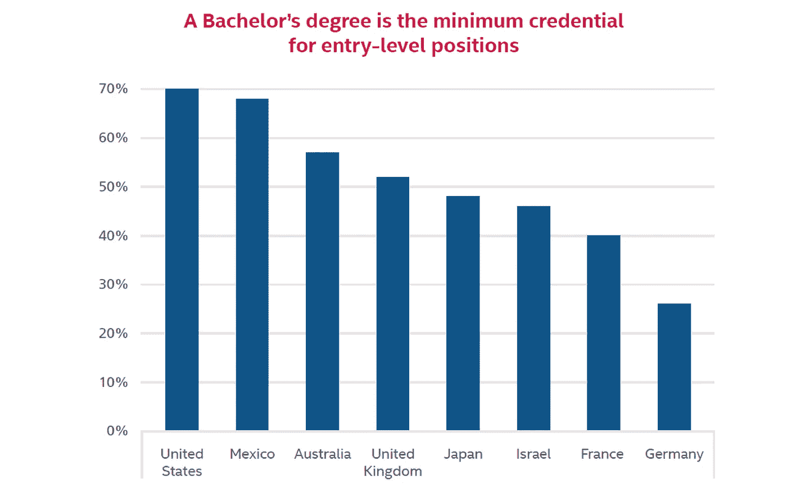
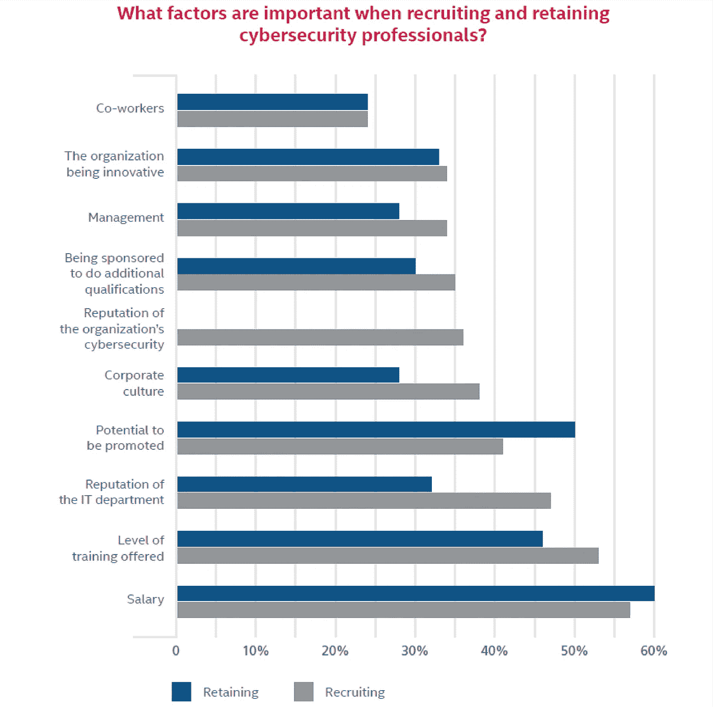

# 网络安全遭遇劳动力短缺

> 原文：<https://itnext.io/cybersecurity-suffers-from-workforce-shortage-d91112b9b94?source=collection_archive---------0----------------------->

“在过去的五年里，网络犯罪推动了网络安全市场的爆炸式增长，导致 100 万个网络安全职位空缺进入 2016 年。”网络安全风险投资公司的创始人兼首席执行官史蒂夫·摩根[描述了](http://cybersecurityventures.com/jobs/)。"所有迹象都表明，至少到 2021 年，网络安全劳动力短缺将持续下去."

尽管网络犯罪给全球经济带来的[年度成本](http://www.mcafee.com/us/resources/reports/rp-economic-impact-cybercrime2.pdf)超过 4000 亿美元，而且网络犯罪仍在继续惊人的增长，但这种短缺依然存在。网络安全风险投资公司最近的一份[报告](http://cybersecurityventures.com/hackerpocalypse-cybercrime-report-2016/)预测，到 2021 年，网络犯罪造成的损失将从 2015 年的 3 万亿美元上升到每年 6 万亿美元。

Randstad Technologies 的[网络安全劳动力报告](https://www.randstadusa.com/corp/technologies/randstad_cybersecurity_report_2016.pdf)关注了美国对网络安全人才需求高的 12 个市场，发现在 2014 年 6 月至 2016 年 6 月期间，需求同比激增 35%。

## 网络安全人员短缺

来自 McAfee 的最新报告也强调了网络安全劳动力短缺是公司和国家的一个关键弱点。该报告研究了影响网络安全人员的四个方面的问题

**1。网络安全支出**

市场报告估计，未来五年，全球网络安全年度总支出将增长 7.4%至 16%。网络安全方面的支出与网络安全劳动力的规模和增长相关。

**2。教育和培训**

虽然非传统方法可能是获得网络安全技能的更好方式，但传统学术机构是网络安全专业人员的主要培训来源。

**3。雇主动态**

招聘中的激励因素是工资、培训机会、雇主 IT 部门的声誉和晋升潜力。

**4。政府政策**

尽管在网络安全劳动力问题上的政治参与有所增加，但必须做更多的工作来建立网络安全人才库。

## **结论**

IT 发展，在这种情况下，网络威胁比以往任何时候都发展得更快，这突出了现在就做出改进而不是等到为时已晚的重要性。根据报告和行业现状，可以得出结论，为了克服目前的情况，国家和公司必须改善教育、劳动力多样性、培训机会、安全技术和数据收集。