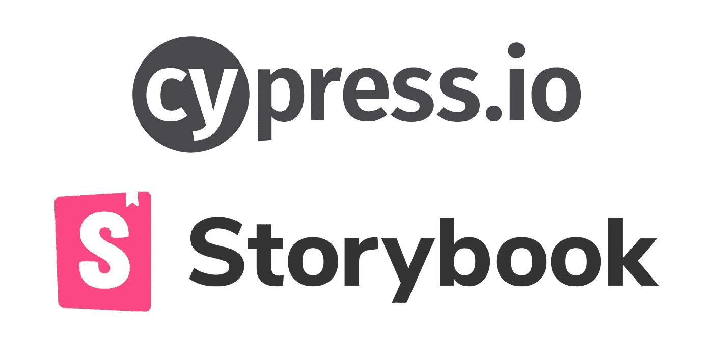

# Cypress 组件测试与故事书交互测试

> 原文：<https://itnext.io/cypress-component-testing-vs-storybook-interaction-testing-fe1f0270d30a?source=collection_archive---------1----------------------->



鉴于基于组件的库(Vue、React)和基于它们构建的框架(Nuxt、Next 等)的兴起，隔离地对组件进行[端到端测试](https://www.browserstack.com/guide/end-to-end-testing)至关重要。 [Cypress](https://docs.cypress.io/guides/overview/why-cypress) 宣布了其专用的[组件测试运行器](https://www.cypress.io/blog/2021/04/06/cypress-component-testing-react/)7.0 版本的 alpha 发布。它允许您在浏览器中运行您的测试，就像访问您的应用程序的人会使用它一样。这些测试可以放在组件文件旁边，目标是创建针对每个组件而不是整个应用程序的测试。

编写组件测试与我们所知的老柏树 e2e 测试非常相似，除了没有使用 ***cy*** *。visit()* 要导航到一个 URL，您将**挂载**()组件，并使用相同的 [API 命令](https://docs.cypress.io/api/table-of-contents)编写断言。由于本博客并不打算作为安装指南，请查看官方的 [Cypress 文档](https://docs.cypress.io/guides/component-testing/introduction#Project-Setup)以获得安装和使用的逐步说明。因为组件测试不需要页面路由或加载应用程序的其余部分，所以这些测试可以运行得更快、更可靠、开销更少。

然而，我认为，虽然 Cypress 组件测试强制开发模块化和可测试的组件，但它肯定错过了 UI 文档。如果你想为组件创建 UI 文档和风格指南，你仍然需要依赖一些工具，比如故事书。(*如果你不熟悉这个工具，你可以看看我的* [*文章*](https://kailaash.medium.com/storybook-for-vue-d1db1c288ed8) *做个介绍。简而言之:Storybook 让你以更少的开销独立地构建 web 应用程序的各个部分。*

此外，对于一个简单的组件，例如一个按钮，它会成为一个维护问题，因为它可能会有三四个文件用于不同的用例，如下所示。

1.  Button.js(组件)
2.  Button.unit.js(用于单元测试)
3.  Button.storybook.js (UI 文档)
4.  Button.cypress.js (Cypress 组件测试)

所以，如果你的应用已经使用了 Storybook，而不是使用组件测试运行器来测试每一个组件，为什么我们不 e2e 测试 Storybook 呢？这样，我们得到了两个世界的精华，即漂亮的 UI 文档和经过良好测试的组件风格指南。

# 为什么要测试故事书

在我们研究故事书测试策略之前，让我们讨论一下为什么测试故事书很重要。我是故事书的忠实粉丝。但是，像任何软件一样，如果不进行测试，它很容易腐烂。尽管它与您的 web 应用程序共享代码，但它有单独的配置、构建过程和代码路径。这很容易忽略对它的测试。原因之一是开发人员倾向于更多地关注单元和 e2e 测试，而不去测试故事书组件。

如果你的项目使用故事书，我们问这些问题是非常重要的:

1.  如果故事书构建失败了，如何发现它？
2.  如果你的故事书组件渲染失败，你会得到怎样的通知？

第一个问题的简短答案很简单。也就是说， [CI](https://storybook.js.org/tutorials/intro-to-storybook/react/en/deploy/) 应该失效。如果您的应用程序没有在 CI 中执行故事书构建，那么将它添加到管道中是至关重要的。关于第二点，答案是利用 Cypress 进行 e2e 测试。Storybook 中还有一个即将到来的[集成测试](https://storybook.js.org/blog/interaction-testing-sneak-peek/)特性，它似乎是组件测试的一个可行的替代方案。在接下来的小节中，让我们简单地讨论一下这些方法。

# 用纯柏树测试故事书

Storybook 本质上是一个独立的应用程序，有自己的构建配置。实际上，当我们处理应用程序、更新依赖关系等时，它可能会失败。让我们编写一个简单的测试来检测 Storybuild 构建何时失败，至少以最基本、最容易检测的方式(例如，当默认故事无法呈现时)。

我假设你已经在用 Cypress 测试你的应用了。首先，创建第二个 Cypress 配置(cypress.storybook.json ),它指向您的 storybook 服务器的 URL(在下面的例子中是:9000 ),并引用一个单独的集成文件夹，因此我们在纯 e2e 和 Storybook 测试之间引入了一个关注点分离。

```
//cypress.storybook.json{ 
  “baseUrl”: “http://localhost:9000",
  “integrationFolder”: “cypress/storybook”,
  ...
}
```

为了方便起见，在 package.json 中添加脚本。

```
//package.json
“scripts”: {
  “start:storybook”: “start-storybook -p 9000 -s public”,
  “cy:test:storybook”: “cypress run — headless -C   cypress.storybook.json”,
...
}
```

现在，在集成文件夹中创建一个 *storybook.spec.j* s 文件，如 *button.storybook.json* 文件中所设置的，并添加以下内容。

```
// button.spec.js
const getIframeBody = () => {// get the iframe > document > body
  return cy.get(‘iframe[id=”storybook-preview-iframe”]’)
  // and retry until the body element is not empty
  .its(‘0.contentDocument.body’).should(‘not.be.empty’)
  // wraps “body” DOM element
  // [https://on.cypress.io/wrap](https://on.cypress.io/wrap)
  .then(cy.wrap);
}describe(“Button”, () => {
  before(() => {
    cy.visit(“/”);
  }); it(“loads primary button with default text”, () => {
    getIframeBody().get(‘#root’).contains(‘button’, ‘Button’);
  });
});
```

你可能已经注意到了，这个测试使用了 iframes。在 Cypress 中使用 iframes 有点棘手。因为当 cypress DOM 命令到达 iframe 内部的#document 节点时，遍历操作就会停止。然而，正如这里的所记录的那样，可以创建一个自定义代码来使其工作。上述解决方案在它所做的意义上是最小的。但是它保证了一个立足点，如果我们想在未来增加更多的 Cypress Storybook 测试。该逻辑还可以扩展，甚至可以通过查询参数操纵旋钮等，或者使用 [cypress-storybook](https://github.com/NicholasBoll/cypress-storybook) 库为 storybook 添加 cypress 命令。该库直接调用故事书路由器，并提供命令来测试组件旋钮、标签等。

# 故事书交互测试

Storybook 最近宣布，他们正在开发一个[交互测试](https://storybook.js.org/blog/interaction-testing-sneak-peek/)功能，允许你编写交互脚本并检查故事本身的预期。这将使您能够在与开发 ui 相同的浏览器环境中跨 ui 运行功能测试。由[测试库](https://testing-library.com/)提供支持，它具有时间旅行能力，也有便于调试的永久链接。有了内置的测试设置，我们可以在故事本身内部编写交互测试。这也在 Cypress 和 Storybook 之间设置了一个清晰的关注边界，其中前者可以专注于纯 e2e 测试，而后者专注于组件文档和测试。

Cypress 和 Storybook 团队都在致力于扩展他们工具的表面，现在看起来有所重叠；Storybook 和他们的 Storybook 交互测试，Cypress 和他们的组件测试人员。如前所述，故事书交互测试目前正在积极开发中。一旦发布，我相信这将是测试隔离元件的方法。如果你的应用程序还没有使用 Storybook，现在是时候引入这个工具了，因为它简化了 UI 开发和文档。如果您的应用程序使用 Storybook，编写 Storybook Cypress 测试似乎是一个可行的选择。至于 Cypress 组件测试，我当然不会将它们用于 Storybook 中已经有 UI 文档的组件。我并不是说你根本不应该使用 Cypress 组件测试，但是如果你确实有 UI 文档或者构建一个设计系统，最好在一个已经隔离的环境上运行 Storybook 的交互测试。

**免责声明**:在写这篇博客的时候，Cypress [组件测试运行器](https://www.cypress.io/blog/2021/04/06/cypress-component-testing-react/)是一个 alpha 版本，Storybook 的[交互测试](https://storybook.js.org/blog/interaction-testing-sneak-peek/)正在积极开发中。在后续版本中，本博客中讨论的案例可能不真实。