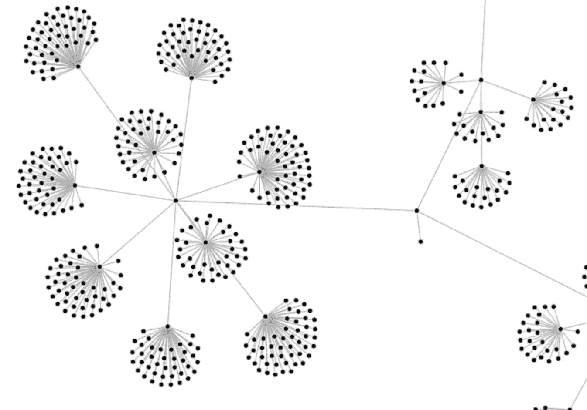
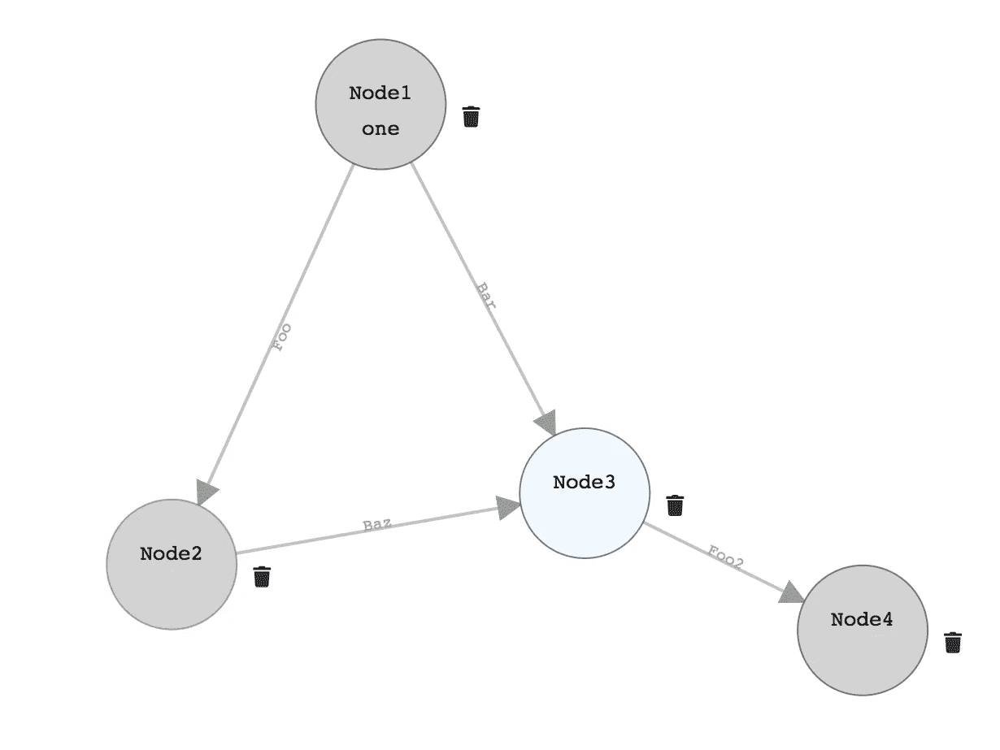

# D3-力定向图(假人的力实验)

> 原文：<https://itnext.io/d3-force-directed-graph-forces-experiments-for-dummies-20a5682935?source=collection_archive---------1----------------------->

以我们的大脑可以面对的方式可视化大量数据/数据流/实体关系的需求在 UX / UI 中是一个有趣的挑战，交互式图形在日常使用中，它们中的许多都是基于 d3 的。

**D3-力模块:**

> 使用速度 Verlet 积分的力导向图形布局。

“Verlet 集成”？

> Verlet 积分是一种用于[积分](https://en.wikipedia.org/wiki/Time_integration_method) [牛顿的](https://en.wikipedia.org/wiki/Isaac_Newton) [运动方程](https://en.wikipedia.org/wiki/Equations_of_motion)的数值方法。[【1】](https://en.wikipedia.org/wiki/Verlet_integration#cite_note-Verlet1967-1)在[分子动力学](https://en.wikipedia.org/wiki/Molecular_dynamics)模拟和[计算机图形学](https://en.wikipedia.org/wiki/Computer_graphics)中经常用来计算粒子的[轨迹](https://en.wikipedia.org/wiki/Trajectory)

好吧，但我的狭隘世界更偏向于前端。我能不能就做个假人，画自己的图？—肯定是的。

这是我创建的图表:

(我在造型上没下多大功夫，那不是我的目的)。

我列出了一些与 d3-force 相关的术语和定义，这里是 [repo](https://github.com/LironHazan/directed-graph-flow-experiments) 。

*   [**<defs>**](http://apike.ca/prog_svg_group_defs.html)元素用于定义 SVG 元素而不渲染。与“g”标签结合使用，它可以用来为包含许多元素的复杂图形创建模板。
*   `[**<marker>**](https://developer.mozilla.org/en-US/docs/Web/SVG/Element/marker)`元素定义了用于在给定的`[<path>](https://developer.mozilla.org/en-US/docs/Web/SVG/Element/path)`、`[<line>](https://developer.mozilla.org/en-US/docs/Web/SVG/Element/line)`、`[<polyline>](https://developer.mozilla.org/en-US/docs/Web/SVG/Element/polyline)`或`[<polygon>](https://developer.mozilla.org/en-US/docs/Web/SVG/Element/polygon)`元素上绘制箭头或聚合标记的图形。

> 为一组[节点](https://github.com/d3/d3-force#simulation_nodes)创建一个[模拟](https://github.com/d3/d3-force#simulation)，并合成所需的[力](https://github.com/d3/d3-force#simulation_force)。

*   **force simulation**:D3 . force simulation()用指定的 [*节点*](https://github.com/d3/d3-force#simulation_nodes) 数组创建一个新的模拟，没有 [forces](https://github.com/d3/d3-force#simulation_force) 。如果没有指定*节点*，则默认为空数组

> 一个*力*只是一个修改节点位置或速度的函数

*   **simulation.force** :如果指定了 *force* ，则为指定的*名称*分配 [force](https://github.com/d3/d3-force#forces) 并返回该模拟。
*   **“电荷”**力——就像静电荷一样，负电荷会将节点推开，(默认强度为-30)电荷力是全局的:每个节点都会影响所有其他节点，即使它们位于不相连的子图上(与多体()一起使用)。
*   **【居中】**力——居中力，将所有节点居中在给定位置⟨ [*x*](https://github.com/d3/d3-force#center_x) ， [*y*](https://github.com/d3/d3-force#center_y) ⟩.
*   “**链接”**力 **—** 链接力根据所需的[链接距离](https://github.com/d3/d3-force#link_distance)将链接的节点推在一起或分开。
*   **forceLink** :用指定的*链接*和默认参数创建一个新的链接力。如果没有指定*链接*，则默认为空数组。
*   **多体**力在所有[节点](https://github.com/d3/d3-force#simulation_nodes)之间相互作用。如果[强度](https://github.com/d3/d3-force#manyBody_strength)为正，它可用于模拟重力(吸引力),如果强度为负，它可用于模拟静电荷(排斥力)。
*   **alphaTarget** :通常用于拖放节点等交互，与 restart()一起使用，很难理解——因此很难解释什么是“alpha”概念，它在“减缓”节点转换中起作用，当通过将节点拖放到某个位置来改变布局时，为了获得“窒息”体验，根据 API 文档:alphaTarget 将当前目标 [*alpha*](https://github.com/d3/d3-force#simulation_alpha) 设置为范围[0，1]内的指定数字，并返回此模拟。

*   **tick** —模拟器[自动启动](https://github.com/d3/d3-force#simulation_restart)，在节点数据迭代触发 tick 事件后，在其处理程序 fn 上，节点和线获得计算的 x 和 y 位置。

参考资料:

 [## D3/D3-力

### 使用速度 Verlet 积分的力导向图形布局。-D3/D3-力

github.com](https://github.com/d3/d3-force)  [## 理解 D3.js Force Layout - 1:最简单的可能图形

### 斯蒂芬·托马斯街区 11550728 号

bl.ocks.org](http://bl.ocks.org/sathomas/11550728)  [## 使用 D3 的交互式动态力导向图

### 通过 D3 4.0 力模拟的导游

medium.com](https://medium.com/ninjaconcept/interactive-dynamic-force-directed-graphs-with-d3-da720c6d7811)  [## 了解原力

### 这篇文章最初于 2014 年 7 月发布在 Quora 上。

medium.com](https://medium.com/@sxywu/understanding-the-force-ef1237017d5)