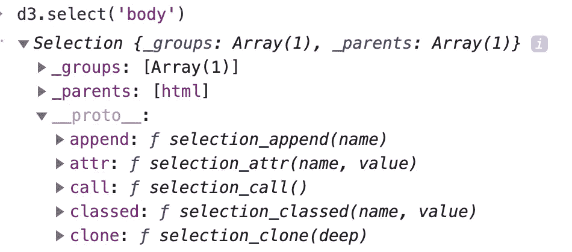
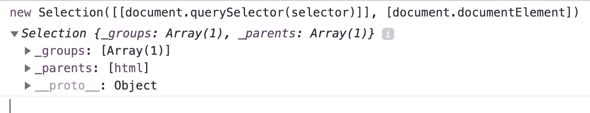
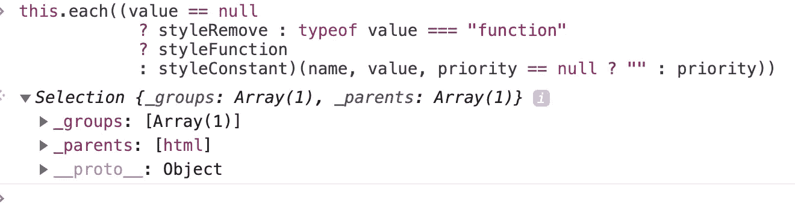

# D3 深度选择

> 原文：<https://itnext.io/d3-selections-in-depth-40b8b36ef738?source=collection_archive---------3----------------------->

## 输入→选择。到引擎盖下☕


想知道引擎盖下的工作原理吗？如果是这样的话，我假设你已经从 2013 年开始接触了下面的[迈克·博斯托克(d3 的创造者)的帖子](https://bost.ocks.org/mike/selection/)。

这篇文章解释了选择的实现。在 Javascript 中，艰难的 2013 年似乎是很久以前的事了，一般概念都是一样的。这篇文章将选择结构描述为数组的一个[子类。](https://github.com/d3/d3/blob/master/CHANGES.md#selections-d3-selection)但那是过去的事了，那时版本 3 是最新的。

今天返回的**选择**结构是一个**对象**。

选择成立:

*   选定元素(组)的数组。
*   根元素的数组。
*   [转换方法的访问器](https://github.com/d3/d3-selection/blob/4dcb3412318a6e2ecada79196b42336758d29133/src/selection/index.js)(用于更新和操作 DOM)。

## 让我们运行一些代码！

打开运行 d3 项目的浏览器开发工具控制台，执行下面的基本选择: **d3.select('body'):**



那么到底发生了什么？

[**选择(** '](https://github.com/d3/d3-selection/blob/4dcb3412318a6e2ecada79196b42336758d29133/src/select.js) *选择器'* [**)**](https://github.com/d3/d3-selection/blob/4dcb3412318a6e2ecada79196b42336758d29133/src/select.js) 是一个工厂函数，它返回一个**新选择**实例，如下所示:

```
**new *Selection***([[***document***.querySelector(*selector*)]], [***document***.**documentElement**])
```

当我们将选择器传递给 select()/selectAll()函数时，d3 将使用它在 DOM 中查询该元素。

它还将把查询结果放在一个数组中，并将它传递给选择器的构造函数。

我们可以看到，**选择** [构造函数](https://github.com/d3/d3-selection/blob/master/src/selection/index.js)得到了两个参数(组，父对象):

```
**function** *Selection*(groups, parents) {
  **this**.**_groups** = groups;
  **this**.**_parents** = parents;
}
```

选择实例现在将保存对所选元素组的私有引用。

选择方法可以访问组元素并返回新的或更新的选择引用(取决于方法)。

这种技术被称为**“方法链接”**，它通过返回选择实例(使用**“this”**)来实现。

如果我们深入挖掘，我们会看到转换函数返回 **selection_each** ，它迭代元素，执行用户回调(如果有的话)，并最终返回 **Selection** 引用( **this** )。

顺便问一下，你认识 d3.select()中的**函子**函数模式吗？如果是这样，你可能会喜欢这篇文章。

## 来源:

在您的一个 npm 项目中安装 **d3-selection** 包，并将其加载到一个简单的网页中，如下所示:

```
<**html lang="en"**>
<**head**>
  <**meta charset="utf-8"** />
  <**meta name="viewport" content="width=device-width, initial-scale=1"** />
  <**script src="node_modules/d3-selection/dist/d3-selection.js"**></**script**>
  <**link rel="stylesheet" href="style.css"** />
</**head**>
<**body**>
<**div**> text </**div**>
<**script**>
  d3.select(**'div'**)
          .**style**(**'color'**, **'tomato'**);
</**script**>
</**body**>
</**html**>
```

现在打开源代码选项卡，找到“d3-selection.js”源代码，并将断点放在 **select** ()函数上(第 876 行)。

将以下内容粘贴到控制台中:

```
**new** Selection([[document.querySelector(selector)]], [document.documentElement])
```



每当我们以声明的方式获得一个选择时，我们都会获得一个**新选择**引用，我们可以将数据加入其中，并添加我们想要转换的元素组。

向 **selection_style** 函数添加另一个断点(style 函数指向它),并在中断期间记录以下内容:

```
this.each((value == null
? styleRemove : typeof value === "function"
? styleFunction
: styleConstant)(name, value, priority == null ? "" : priority))
```

您将看到 style()方法最终将返回一个对我们使用转换后的 DOM 进行操作的**选择**的引用。



最后，由于我们大多数人使用 ES6 类语法，这里有一个我必须做的基本的可运行选择示例:)

我希望你喜欢这篇文章！

干杯，

利伦。