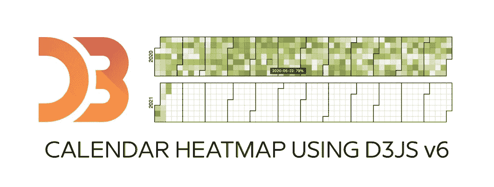
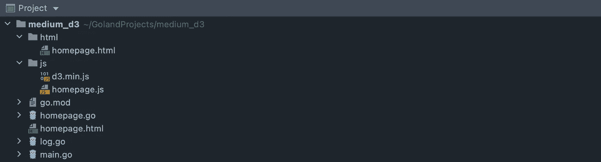
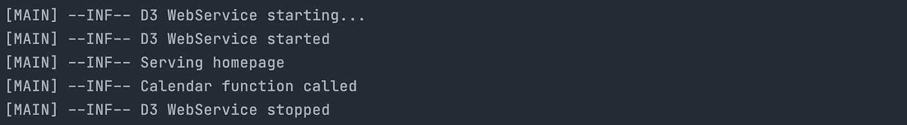
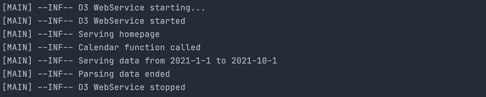
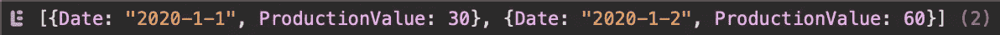
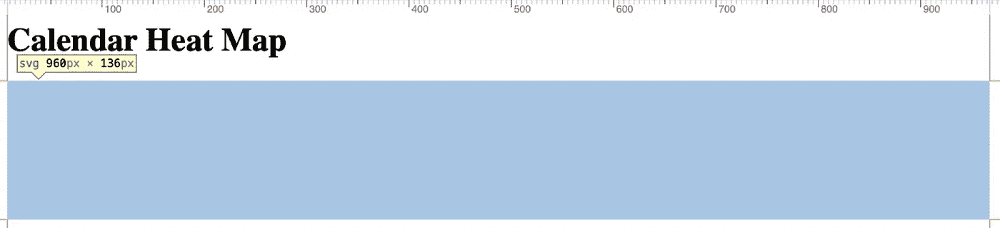
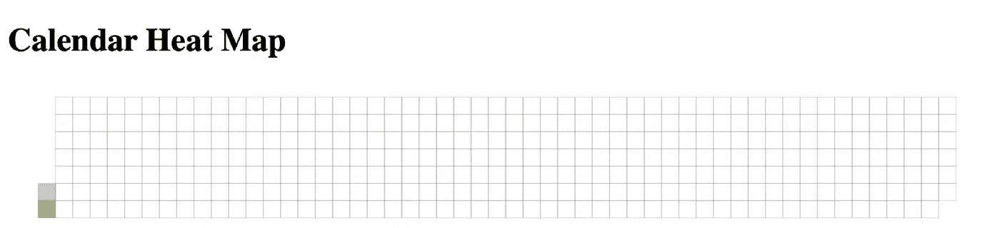
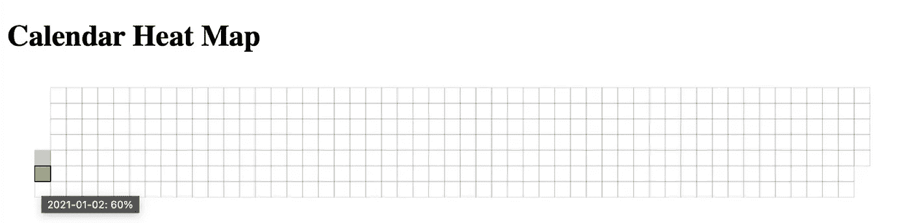
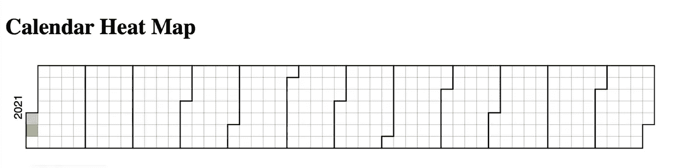
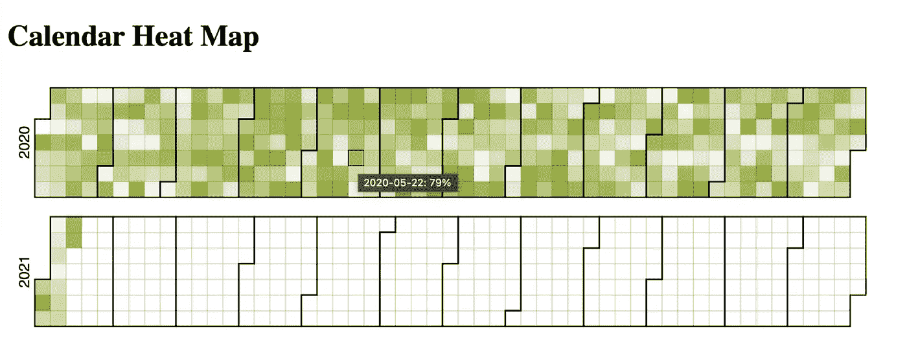

# 如何创建 D3js v6 日历热图

> 原文：<https://itnext.io/d3-v6-calendar-heat-map-c709fe20e737?source=collection_archive---------1----------------------->

## 使用 Go 后端，发送 JSON 数据

D3js 是一个 Javascript 库，用于对数据进行图形化处理。在 2020 年，它被升级到版本 6。

 [## D3.js -数据驱动的文档

### D3 是一个用 HTML、SVG 和 CSS 可视化数据的 JavaScript 库。

d3js.org](https://d3js.org) 

这给我们带来了一个小问题。官方示例库不使用 Javascript，而是使用特殊的 *Observable Notebook 语言。如今，要找到 D3js 图表的最新版本 6 示例并不容易。*

这就是这篇文章的原因。我无法找到第 6 版日历热图的工作示例，所以我决定制作一个。

请注意，这项工作是站在别人的肩膀上的。

在本文中，我们将使用我在 Amelia Wattenberger 的书中学到的策略，并在这些步骤的基础上进行构建:

1.  访问数据
2.  创建图表维度和比例
3.  画画布
4.  绘制数据
5.  设置互动
6.  绘制外围设备

截至 2021 年 1 月 9 日，我们将使用最新版本的 D3js，即版本 6.3.1。我们将使用 Go 作为 web 服务器来模拟一些伪真实世界的后端数据发送。我们将使用 Goland 作为 IDE。

如果你只需要 D3js 信息，你可以跳过*准备项目*。和往常一样，你会在文章末尾找到 Github 资源库的链接。

在这里，您可以找到有关在 Go 中创建 web 服务器的更多信息。

 [## 作为 web 服务器提供服务

### 提供 HTML、CSS 和 Javascript 文件

medium.com](https://medium.com/swlh/create-go-service-the-easy-way-iii-c84489cc1ee0) 

# 准备项目

在戈兰创建新项目，将其命名为 *medium_d3*

1.  创建两个新目录: **html** 和 **js** 。
2.  下载最新的 D3 库并保存到这个 **js** 目录中。在这个 **js** 目录下创建新文件`homepage.js`。
3.  在 **html** 目录下创建新文件`homepage.html`
4.  在主项目目录下新建三个文件:`main.go`、`homepage.go`和`log.go`

## 更新 main.go

下面是创建和运行 web 服务器服务的完整代码。如果你想知道每个部分的解释，请使用文章前面的链接。

## 更新日志. go

这个文件只负责记录到控制台，这里没有太多代码。

## 更新主页. go

这个文件只包含一个服务页面的函数和一个服务数据的函数。现在两个都空了。

使用内置 Goland 功能或使用命令`go get -u all`同步所有 Go 模块。运行`main.go`，不要忘记将其设置为打包模式。如果一切顺利，我们准备走得更远。

# 访问数据

切换到**homepage.html**并用下面的代码更新它。这里没有什么特别的，只是加载这两个 javascript 文件，创建 heading 和一个`
`元素，它将保存我们的日历热图。

切换到 **homepage.js** 并在下面插入代码。同样，没什么特别的，这段代码只是向`/get_calendar_data`发送一个 JSON 请求，并打印它返回的任何内容。

通过插入`d3.json`获取方法(建立在标准 javascript 获取方法上)，我们开始使用 D3 库。

现在切换到**主页。转到**并从基础开始。下面的代码创建了三个结构:`CalendarInput`用于传入数据，`CalendarOutput`用于传出数据，`CalendarData`用于数据本身。

功能是服务**homepage.html**文件并记录到控制台，只是为了知道它是否正常工作。

名为`getCalendarData()`的函数暂时将`calling itself`登录到控制台。

不是全部测试。在`[http://localhost](http://localhost.)`运行项目并打开浏览器。您应该会在屏幕截图上看到如下信息:我们的 web 服务器正在充当一个服务，服务主页工作正常，并且这个`getCalendarData()`函数像它应该的那样被调用。

现在用下面的代码更新这个`getCalendarData()`函数。一开始，我们解码来自 **homepage.js** 的 JSON 数据并处理错误。

如果成功，我们会将收到的数据记录到控制台中。然后，我们准备一些虚拟数据，并将其发送回浏览器。

如果您现在运行代码，您应该看到我们正确地解码了后端 Go 代码中的数据。

如果您在浏览器中打开控制台，您应该会看到，我们正在正确地发送回数据，并以 Javascript 代码对它们进行解码。现在我们可以生成日历热图。

# 创建图表维度和比例

导航到 **homepage.js** 。从现在开始，我们将长期在`then(data)`功能中工作。在`console.log()`函数之后添加一些代码。

这段代码将从我们的数据中创建一个地图。我们以后会用到这张地图。然后我们创建图表维度并进行缩放。

图表尺寸很简单，只有宽度和高度，没什么特别的。

使用`d3.scaleQuantize()`功能创建刻度。该功能将从 0 到 10 ( `.domain([0, 100])`)的数据值映射到颜色范围(`.range([“#f3f6e7”, ...)`)。

这意味着，例如，*生产值为 0 的*日期*将被映射到`#f3f6e7`，而*生产值为 100 的*日期*将被映射到`#89ab0f`。**

最终，这种缩放将创建出那张**多彩的**热图。

# 画画布

添加几行代码。这里没有什么特别的，代码是从**homepage.html**访问`calendar-heatmap`元素并添加一些维度属性。

这里有趣的是那段`.data(d3.range(parseInt(data[“Data”][0][“Date”]), parseInt(data[“Data”][0][“Date”]) + 1))`代码。您可以在此定义创建日历的开始和结束年份。

例如，您可以在这里输入`.data(d3.range(2020, 2022))`，它将显示两年:2020 年和 2021 年。在这种情况下，2022 年就像一个上限。

如果您现在刷新页面，您应该认为这里什么也没有，但是打开您的控制台，您应该看到画布在这里。

# 绘制数据

添加另一串代码，这将创建全年的矩形，并使用我们之前定义的`color`函数，使这些矩形变得漂亮。

有一件有趣的事。这个日历是基于星期一的。如果你想让它基于周日，你应该改变这两行代码。

如果您现在刷新浏览器，您应该会看到您的日历快完成了。

# 设置互动

在我们最终确定日历并使其漂亮之前，我们将添加两个互动。

当您将鼠标悬停在一个日期上时，第一个按钮将添加黑色笔划(当您将鼠标移出时，删除黑色笔划)。

第二个将添加一个简单的文本描述。请看下面的结果。

# 绘制外围设备

我们的日历看起来还不像日历，我们现在将修复它。

这段代码将为该日历添加一个文本描述。

下面的最后一段代码将为所有月份添加一些漂亮的笔画。

下面的截图是你工作的最终结果，使用最新的 D3 v6。

# 完成代码

为了让这个例子看起来更好，导航到你的**主页。转到**，替换生成这两行代码，生成两个虚拟数据…

…代码如下。这将从上一年的第一天开始生成数据。

然后导航到 **homepage.js** ，只更新一行，这样 2020 年的数据就会显示出来。

# 摘要

现在运行代码，您将看到最终结果:日历热图。

您正在使用 D3 库版本 6 来生成这个日历。另外，您还可以运行一个简单的 web 服务器。用 Go 写的。前端和后端之间的数据交换。

恭喜你。这是你工作的结果。

 [## petrjahoda/medium_d3

### 在 GitHub 上创建一个帐户，为 petrjahoda/medium_d3 的开发做出贡献。

github.com](https://github.com/petrjahoda/medium_d3)