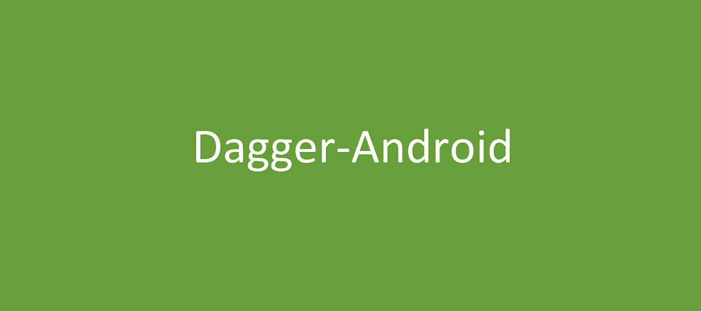

# 匕首技巧:有效使用匕首机器人指南

> 原文：<https://itnext.io/dagger-tips-guide-to-using-dagger-android-effectively-c3e5b2883b38?source=collection_archive---------3----------------------->



人们在阅读这个标题时可能会问我:“等等，Dagger-Android 不是已经停止开发了吗？不就是随着剑柄的引入变得过时了吗？”

技术上来说，是的。匕首机器人*被剑柄*取代。因此，如果你已经在使用 Hilt，那么对于最常见的情况(注入活动、片段、视图模型、工人)，你根本不需要考虑 Dagger-Android。

然而，由于我仍然看到`@ContributesAndroidInjector`不时出现，我觉得最好是写一篇文章，介绍它是如何工作的，它打算解决什么，如何使用它，以及如何不使用它(为了更好的可伸缩性)。

# 匕首机器人是什么？

Dagger-Android 是一种现场注入类(从 Dagger 2.20+开始不一定只是 Android 类)的方法，而不必在组件上定义`fun inject(target: MyConcreteClassTarget)`注入器方法——因为我们不知道类本身。

什么时候希望避免在组件中创建`fun inject(t: T)`？毕竟，这通常允许字段注入是类型安全的。

答案是，当你**不能**的时候。

如果使用模块化模式，其中`:app`包含`ApplicationComponent`(或`SingletonComponent`)，那么当`ApplicationComponent`可以看到应用程序中的任何`Activity`或`Fragment`时，子模块看不到`:app`，因此也看不到`ApplicationComponent`。所以，他们不能叫`component.inject(this)`！

另一方面，如果你要[定义一个](https://github.com/android/architecture-components-samples/blob/0c2e39d084cbc4ad082e701e0c6a8ff29a3aa737/GithubBrowserSample/app/src/main/java/com/android/example/github/di/AppInjector.java#L44) `[Application.ActivityLifecycleCallbacks](https://github.com/android/architecture-components-samples/blob/0c2e39d084cbc4ad082e701e0c6a8ff29a3aa737/GithubBrowserSample/app/src/main/java/com/android/example/github/di/AppInjector.java#L44)` [来自动完成它](https://github.com/android/architecture-components-samples/blob/0c2e39d084cbc4ad082e701e0c6a8ff29a3aa737/GithubBrowserSample/app/src/main/java/com/android/example/github/di/AppInjector.java#L44)，那就不能用标准方法了——因为你只看到超类，而看不到具体的类！

因此，如果想要在我们提供的限制下使用场注入，有两种选择:

1.  从定义注入目标的子模块中公开一个接口，并在 ApplicationComponent 上实现它——然后使访问它成为可能(例如，使用 ApplicationContext 进行查找),并将其转换为能够调用`(applicationContext as FeatureInjectorProvider).inject(this)`的接口
2.  通过定义一个允许注入特定子类(`fun inject(myClass: MyClass)`)的通用接口，使注入一个共享超类的任何子类(甚至可能是`Object`)成为可能，然后使用 map-multibinding 将它的`Class<?>`映射到可以注入它的类(这样我们就可以使用`Class<?>`作为一个键进行映射查找)——或者更确切地说，每个注入的类都需要它自己的`injector` *实例*， 我们需要 map-multi-bind *一些能够*创建*注入器的东西，这样我们就可以用它来创建注入器，然后用创建的注入器实例注入目标。*

**匕首-安卓是选项#2** 。“注射器”叫`AndroidInjector<T>`，能创造“注射器”的叫`AndroidInjector.Factory<T>`。

[地图-多绑定在](https://github.com/google/dagger/blob/6778a01ae5142ca25a07946250d008cfb8df216a/java/dagger/android/AndroidInjectionModule.java#L32-L36) `[AndroidInjectionModule](https://github.com/google/dagger/blob/6778a01ae5142ca25a07946250d008cfb8df216a/java/dagger/android/AndroidInjectionModule.java#L32-L36)`中声明，这是需要添加到 ApplicationComponent 的“神奇”模块，Dagger-Android 才能工作。

# 匕首-安卓怎么用？

从 2.20 开始，Dagger-Android 的“Android”部分有点用词不当，因为你可以为一个共享超类的任何 N 个子类定义一个`AndroidInjector`(其中所有类共享`Object`，所以任何类！)，这样就有可能为活动、片段、指挥控制器、工作管理器的工人等等定义`AndroidInjector`。

首先，组件需要添加前面提到的`AndroidInjectionModule`:

```
@Component(modules=[**AndroidInjectionModule::class**, MyModule::class])
@Singleton
interface SingletonComponent {
    // ...
}
```

然后我们实际上可以使用`@ContributesAndroidInjector`为任何`T`创建一个`AndroidInjector.Factory<T>`:

```
@Module
abstract class MyModule {
 **@ContributesAndroidInjector**
    abstract fun mainActivity(): MainActivity
}
```

这在内部生成一个可以注入`MainActivity`的子组件，实现`AndroidInjector<T>`，从而可以注入`MainActivity`。这是作为`Map<Class<T>, AndroidInjector.Factory<T>>`的地图多绑定。

有一点神奇之处:Dagger-Android 为我们提供的允许我们注入任何类的类叫做`DispatchingAndroidInjector<Object>`。这是自动注入到`DaggerApplication`中的，是`HasAndroidInjector`返回的类。

`DispatchingAndroidInjector`为我们做的是获取我们的类实例的`Class<?>`，尝试为给定的`Class<?>`找到`AndroidInjector.Factory<T>`，使用工厂创建注入器，然后注入我们的类。和`dispatchingAndroidInjector.inject(myClass)`一样简单调用，是`AndroidInjection.inject(this)`引擎盖下用的。

通过`@Inject`访问`DispatchingAndroidInjector<Object>`，就像任何其他依赖一样(或者从应用程序类如`HasAndroidInjector`)，我们能够在一个模块中现场注入任何具有相应`@ContributesAndroidInjector`的类。

Dagger-Android 提供了像`DaggerAppCompatActivity`和`DaggerFragment`这样的基类，它们将使用最接近的(通过片段查找- >活动- >应用程序)`AndroidInjector`调用`inject(this)`，能够注入我们提供的实例。

# 提供定义@ContributesAndroidInjector 的模块的最佳方式是什么？

一个非常常见的结构性*反模式*，直接继承自 Android/architecture-components-samples，就是创建`ActivityBuildersModule`、`ViewModelModule`、`FragmentBuildersModule`等模块。

在这种情况下，所有的活动/片段/视图模型都被收集到`:app`中定义的同一个全局模块中，因此每次新的活动(在多活动应用程序中)、新的片段或新的视图模型(如果使用 map-multibinding 而不是每个视图模型的`AbstractSavedStateViewModelFactory`)时，这 3 个文件每次都必须被修改！

此外，由于 Dagger-Android 的性质，忘记修改至少 1 个(这 3 个中的任何一个)模块将导致运行时异常，所以随着时间的推移，这显然会有点痛苦。

***更好的方法是为每个屏幕定义一个模块(这里假设是单活动 app)。*** 在这种情况下，每个屏幕都定义了一个新的模块，它描述了屏幕的依赖关系(片段的 android 注入器，以及 ViewModel 的 In-map 绑定，如果使用的话)，这个`@Module`在当前编译模块的内部。

然后使用`includes=[]`将屏幕的模块包含到为整个编译模块定义的顶层模块中，如下所示:

```
// compilation module: :features-authentication@Module(**includes = [
    LoginScreenModule::class, 
    RegisterScreenModule::class,
]**)
object AuthenticationModule {
}
```

然后，这个顶级模块是唯一包含在描述特性的模块中的模块(因为它必须以某种方式添加到 ApplicationComponent 中):

```
// compilation module: :app@Module(includes = [
 **AuthenticationModule::class**,  
    /*...*/
])
object FeaturesModule {
}
```

这个聚合模块包含在 ApplicationComponent 中，因此我们不需要经常接触它:

```
// compilation module: :app@Component(modules = [
    AndroidInjectionModule::class,
 **FeaturesModule::class,**
    // ...
])
@Singleton
interface ApplicationComponent {
    // ...
}
```

这样，每个已安装的屏幕对于其自己的模块来说都是本地的，并且与将所有屏幕聚集到不同编译模块中的多个全局模块中相比，移除屏幕/添加新屏幕明显更加直接，并且错误空间更小。

# 真的可以用 Dagger-Android 用@ContributesAndroidInjector 对任何类进行字段注入吗？

是的，Dagger-Android 从 2.20+开始允许对任何类进行字段注入，只要定义了一个`@ContributesAndroidInjector`，所以它实际上更少是关于注入“Android 组件”，而更多是关于以这样一种方式注入动态类型，即注入器本身的确切类型对于注入目标是未知的。

它非常强大，如果不使用辅助注射和 map-multibinding 来创建辅助工人，它可以用于现场注射工人。

# 结论

希望这有助于理解 Dagger-Android 是如何工作的。

当然，现在在 2021 年，人们很可能会使用 Dagger-Hilt，因为 Dagger-Hilt 解决了必须使用`@AndroidEntryPoint`注入活动/片段的问题(并通过它处理注入 Android 组件的调用)，ViewModel 通过一个全局`ViewModelProvider.Factory`处理，使用`@HiltViewModel`自动将任何 ViewModel 类映射多重绑定到它(甚至允许访问`SavedStateHandle`，而不需要手动依赖辅助注入)，WorkManager 的工作人员也通过`@HiltWorker`和`HiltWorkerFactory`自动注入。

所以对于 Android 的类型，一般不再需要这种动态调度字段注入。

不过，希望这篇文章有助于理解 Dagger-Android 是如何工作的，并可能展示如何在仍然依赖于功能模块化代码库中的全局注入器的情况下更好地构建模块。