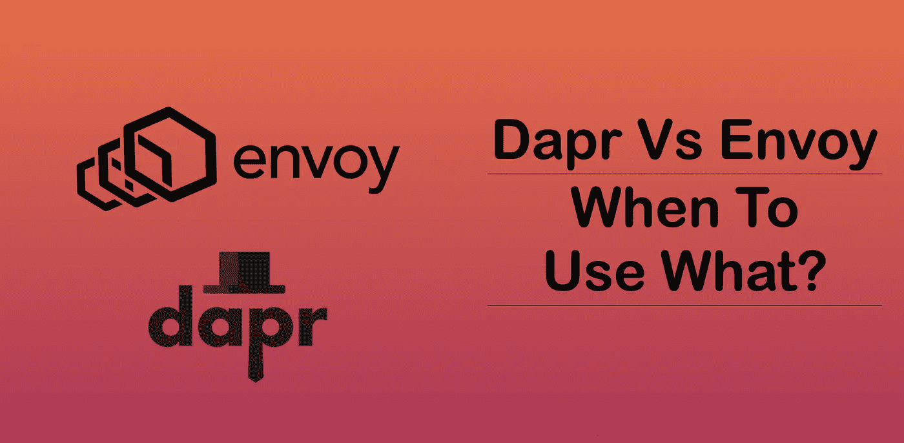
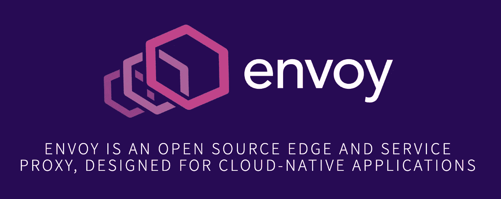
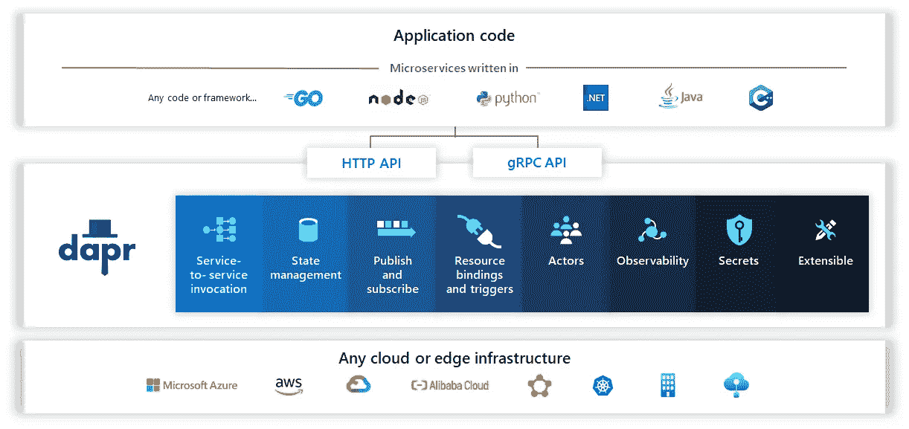

# dapr Vs Envoy——何时使用什么？

> 原文：<https://itnext.io/dapr-vs-envoy-when-to-use-what-6c2ac3caaed2?source=collection_archive---------3----------------------->

## 微服务边车的故事！

来源—作者提供的图片

EnvoyProxy & Dapr 作为一种框架，通过让开发人员专注于业务逻辑来实现更顺畅的微服务采用，已经获得了很大的欢迎。尽管 Envoy 和 Dapr 是为解决不同的问题而构建的，但两者之间有一些明显的相似之处。

在本文中，我将简要介绍这两个框架，并建议它们的合适用法。

所以让我们开始吧！

# 什么是 EnvoyProxy？

图片鸣谢:[https://www . envoy proxy . io](https://www.envoyproxy.io/)

正如我在流行的[文章](https://betterprogramming.pub/using-envoy-proxy-to-improve-reliability-security-and-observability-of-microservices-85032e08d3f4)中描述的那样

[Envoy](https://www.envoyproxy.io/) 是 Lyft 创建的一个开源代理。随着世界朝着分布式微服务架构的方向发展，从业者在两个主要领域观察到运行操作的困难:

*   建立工作关系网
*   可观察性

Envoy 试图通过使网络对应用程序更加透明来解决这些问题。它还提供了一种更好地收集统计数据的方法，以便更容易地调试和跟踪问题。

> 今天，最常见的部署特使代理的方式是将应用程序作为一个边车。

# 什么是 Dapr？

来源—[https://docs.dapr.io/concepts/overview/](https://docs.dapr.io/concepts/overview/)

Dapr 是一个可移植的、事件驱动的运行时，它使任何开发人员都可以轻松构建在云和边缘上运行的弹性、无状态和有状态的应用程序，并支持语言和开发人员框架的多样性。

它使您能够使用任何语言和任何框架构建基于微服务的应用程序，并在任何地方运行它们。

> 像 EnvoyProxy 一样，Dappr 也作为 sidecar peroxy 部署在应用程序旁边。

你可以在这篇来自[达努什卡](https://medium.com/u/a927ff67ee5?source=post_page-----6c2ac3caaed2--------------------------------)的[文章](https://medium.com/event-driven-utopia/5-reasons-why-you-should-use-microsoft-dapr-to-build-event-driven-microservices-cb2202c579a0)中阅读更多关于 Dapr 的内容！

# 比较

这是两者之间的比较—

# 什么时候使用 EnvoyProxy？

*   特使代理主要集中在隔离网络和应用程序。它通过以平台无关的方式提供通用特性来抽象网络。
*   因此，如果您只想解决微服务架构中的网络问题，那么 Envoy 将是您的正确选择。

# 什么时候用 Dapr？

*   Dapr 专注于提供一个最佳实践框架，用于将微服务应用程序构建成开放、独立的构建块，使您能够使用自己选择的语言和框架构建可移植的应用程序。
*   因此，如果您的重点是在状态管理、秘密管理、消息队列等应用程序中实现可移植性。那么 Dapr 可能是你的正确选择。

# 嘿，如果你喜欢这个故事，看看[中级会员](https://deshpandetanmay.medium.com/membership)！只要 5 美元/月！

*你的会员费直接支持我和你阅读的其他作家。你也可以在媒体上看到所有的故事。*

# [现在就成为中等会员吧！](https://deshpandetanmay.medium.com/membership)