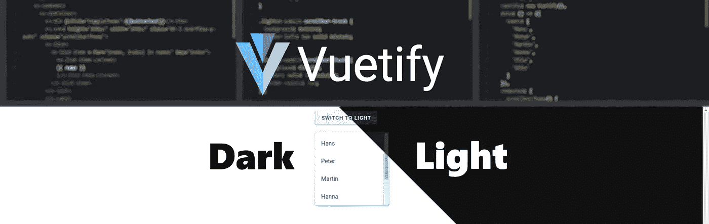
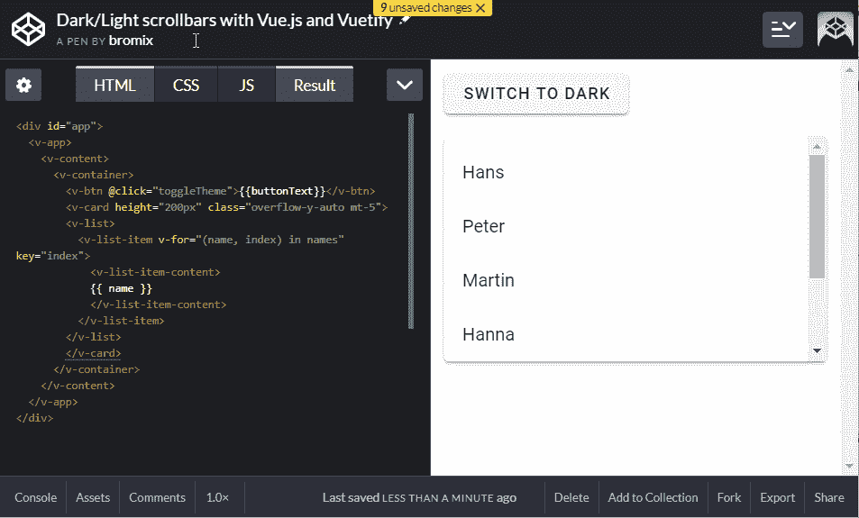
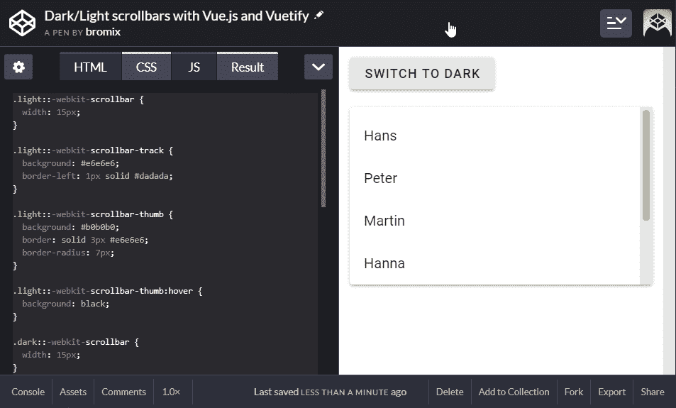

# 带有 Vue 和 Vue 化的运行时深色和浅色滚动条

> 原文：<https://itnext.io/dark-and-light-scrollbar-at-runtime-with-vue-and-vuetify-3809076e547d?source=collection_archive---------3----------------------->



[Vuetify](https://vuetifyjs.com/) 提供[材质设计规格](https://material.io/design/)的 [**深色**和**浅色**变体](https://vuetifyjs.com/en/customization/theme)。默认情况下，Vuetify 使用**亮**主题，但可以很容易地更改为**暗**主题。

那么，如果我们有可滚动的内容，并在**暗**和**亮**之间切换，会发生什么呢？



对，没什么！Vuetify 没有改变滚动条的样式，在我看来，框架要做到这一点并不容易(甚至不可能)。

但是根据你的需要设计滚动条是可能的。所以让我们先试试那个。

*预先一个重要的信息，以便显示滚动条，必须定义一个高度或宽度，否则不能显示与内容相关的滚动条。详细信息我推荐以下链接:* [*CSS 溢出*](https://www.w3schools.com/css/css_overflow.asp) *。*

下面是一个基于[How TO-Custom scroll bar](https://www.w3schools.com/howto/howto_css_custom_scrollbar.asp)文档的自定义滚动条示例。我们只使用了 3 个选择器(滚动条本身，跟踪和拇指)

```
/* width */
::-webkit-scrollbar {
  width: 15px;
}

/* Track */
::-webkit-scrollbar-track {
  background: yellow;
}

/* Handle */
::-webkit-scrollbar-thumb {
  background:navy;
}

/* Handle on hover */
::-webkit-scrollbar-thumb:hover {
  background: blue;
}
```

如果我们应用这种样式，包含内容的元素看起来应该与此类似。


正如你所看到的，我们改变了滚动条的外观，但它在两个主题变体中保持不变。

# Stackoverflow 去帮忙…

经过一番研究，我在 2013 年的 Stackoverflow 上看到了这个答案。它通过使用 jQuery 的一些很好的函数(我们最后不需要这些函数)在运行时切换样式，解决了这个问题。

## 这些信息对我们有什么帮助？

Vuetify 是建立在 Vue 之上的，Vue 提供了一个强大的特性，通过条件将类和样式绑定到元素。这意味着我们可以根据条件为一个元素指定一种或另一种样式。

# 准备

首先，我们根据前面的信息为滚动条定义了两组样式。

```
.light::-webkit-scrollbar {
  width: 15px;
}

.light::-webkit-scrollbar-track {
  background: #e6e6e6;
  border-left: 1px solid #dadada;
}

.light::-webkit-scrollbar-thumb {
  background: #b0b0b0;
  border: solid 3px #e6e6e6;
  border-radius: 7px;
}

.light::-webkit-scrollbar-thumb:hover {
  background: black;
}

.dark::-webkit-scrollbar {
  width: 15px;
}

.dark::-webkit-scrollbar-track {
  background: #202020;
  border-left: 1px solid #2c2c2c;
}

.dark::-webkit-scrollbar-thumb {
  background: #3e3e3e;
  border: solid 3px #202020;
  border-radius: 7px;
}

.dark::-webkit-scrollbar-thumb:hover {
  background: white;
}
```

接下来，我们需要一些逻辑来切换亮暗主题。注意计算函数 **scrollbarTheme()** ，我们将使用它根据当前主题改变滚动条的样式。该函数将根据当前主题返回要使用的类的名称。

```
new Vue({
  el: '#app',
  vuetify: new Vuetify(),
  data: () => ({
    names: [
      'Hans',
      'Peter',
      'Martin',
      'Hanna',
      'Ella',
      'Eila'
    ]
  }),
  computed: {
    scrollbarTheme() {
      return this.$vuetify.theme.dark ? 'dark' : 'light';
    },
    buttonText() {
      return !this.$vuetify.theme.dark ? 'Switch to dark' : 'Switch to light'  ;
    }
  },
  methods: {
    toggleTheme() {
      this.$vuetify.theme.dark = !this.$vuetify.theme.dark;
    },
  }
})
```

我们最后需要的是示例应用程序的视图。我们为 Vuetify 的卡片添加了一个绑定到 **scrollbarTheme** 的类。在运行时，Vue 将对计算函数中的任何变化做出反应，并将返回的类名应用于组件。

```
<div id="app">
  <v-app>
    <v-content>
      <v-container>
        <v-btn [@click](http://twitter.com/click)="toggleTheme">{{buttonText}}</v-btn>
        <v-card height="200px" class="mt-5 overflow-y-auto" :class="scrollbarTheme">
        <v-list>
          <v-list-item v-for="(name, index) in names" key="index">
            <v-list-item-content>
            {{ name }}
            </v-list-item-content>
          </v-list-item>
        </v-list>
        </v-card>
      </v-container>
    </v-content>
  </v-app>
</div>
```

让我们试一试。正如你在下面看到的，主题和滚动条的外观都在改变。完整的例子在 [codepen](https://codepen.io/bromix/pen/MWwEmmP) 上，如果你想尝试改变的话。



这种解决方案有一个缺点。我们不能对所有组件应用全局样式。我们必须为我们想要拥有这种行为的特定组件设置类绑定。

一个可能的解决方案是编写一个定制的组件，它将基于主题应用正确的类(例如一个名为 *v-scrollable* 的组件)并使用它作为可滚动内容的容器。

这是一个基于 Vuetify 主题定制滚动条的简化解决方案。希望这对你们中的一些人有所帮助。最重要的是，它展示了 Vue 可以用来轻松解决复杂问题的简单方法。

我希望你喜欢这篇文章，给我一些掌声和改进的建议。