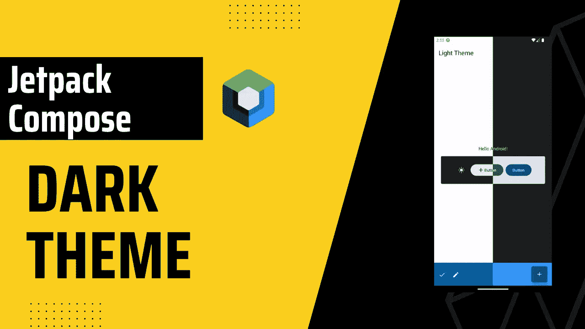
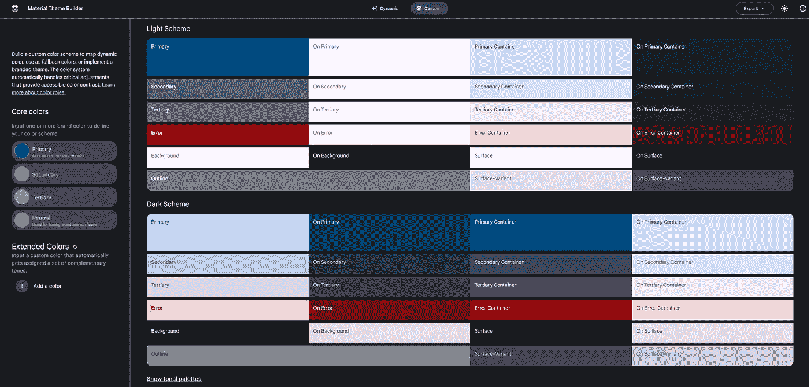
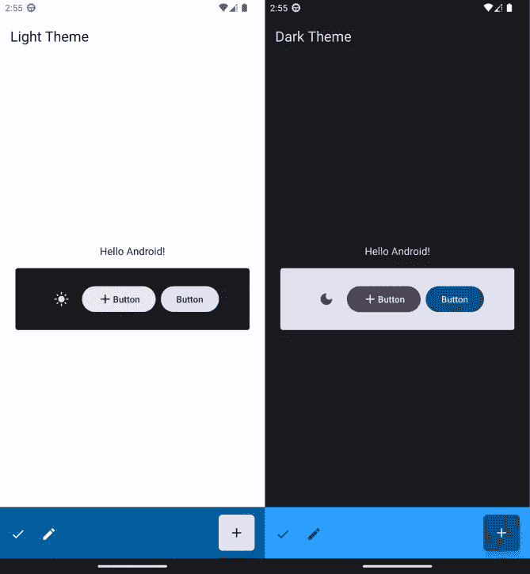

# 喷气背包中的黑暗主题由材料 3 组成

> 原文：<https://itnext.io/dark-theme-in-jetpack-compose-with-material-3-757e45118259?source=collection_archive---------0----------------------->



使用 Jetpack Compose 创建和处理主题非常容易。在这篇博客中，我们将看到实现它的“简单”和“困难”的方法。

最简单的方法是让系统决定我们的主题，这意味着如果用户在手机中设置了“黑暗模式”或“黑暗主题”，我们的应用程序也将处于黑暗模式。

另一方面，难的方法，顾名思义，需要更多的工作，但并不真的很难。我们必须手动检查用户想要什么，并据此设置主题。

在我们开始之前，我将使用这个网站来建立我的主题。很有用，很好用。



材料 3 主题构建器[材料设计](https://m3.material.io/theme-builder#/custom)

# **目录**

1.  [简单易行的方法](#cc40)
2.  [敬酒不吃吃罚酒](#eba0)

# 入门指南

首先，让我们添加材料 3 依赖。您可以在[合成材料 3 发布页面](https://developer.android.com/jetpack/androidx/releases/compose-material3)上看到最新的 M3 版本。

```
def material3_version = "1.0.1"
implementation "androidx.compose.material3:material3:$material3_version"
```

可选地，如果你已经在使用材料 2，你可以跟随[这篇博客](https://material.io/blog/migrating-material-3)迁移到材料 3。

# 设置颜色

我已经将颜色代码从[材料 3 主题构建器网站](https://m3.material.io/theme-builder#/custom)复制到`ui.theme/Color.kt`。

现在我们准备好出发了。让我们看看简单和困难的方法。

# 休闲小站

添加完颜色后，让我们前往`ui.theme/Theme.kt`并设置我们的颜色。

[最后一部分，文章链接](https://arkadiuszchmura.com/posts/how-to-change-system-bar-colors-in-compose/)

就是这样！就这么简单。您可以使用`MaterialTheme.colorScheme.<Color>`在项目的任何地方访问主题颜色，例如`MaterialTheme.colorScheme.onPrimaryContainer`

现在我们来测试一下。



# 艰难的道路

因为我们已经有了我们的颜色和主题，我们可以跳过这一部分。

让我们添加[数据存储](https://developer.android.com/topic/libraries/architecture/datastore)依赖关系。

```
implementation "androidx.datastore:datastore-preferences:1.0.0"
```

现在，我们准备创建我们的数据存储 util 类。

之后，我们将创建视图模型来处理状态。这个视图模型非常简单，我们只需保留`isDarkThemeEnabled`状态变量并监听变化。

最后，我们将在 UI 中实现我们的逻辑。这节课会稍微长一点，所以让我们一部分一部分地解释。

首先，我们创建我们的`themeViewModel`和`dataStoreUtil`对象。

接下来，我们得到`systemTheme`，它简单地检查系统主题是否是黑暗主题。这是必要的，因为当用户打开应用程序时，我们的数据存储是空的，我们还没有任何数据，所以我们得到用户的系统主题。我们可以跳过这一部分，直接设置 false 而不是`systemTheme`由你决定。

之后，我们创建`theme`变量，它从数据存储中返回保存的值。

最后，我们将主题的`darkTheme`值设置为`theme`变量，以便应用正确的主题颜色。

现在让我们看看我们的 UI 部分。

同样，我们首先创建变量。我们将`switchState`变量设置为`themeViewModel.isDarkThemeEnable`，这样每当我们切换开关时，我们的 UI 都会被重新组合。`coroutineScope`用于将主题偏好保存到数据存储，因为`saveTheme`函数是一个`suspended`函数。

最后，每当用户切换开关时，`onCheckedChange`被触发。在`onCheckedChange`中，我们更改了两个`switchState`变量，并将主题偏好保存到数据存储中，这样无论何时用户重启应用程序，我们都能够“记住”并相应地设置主题。

就是这样！现在让我们看看结果。

最后，我希望它是有用的。👋👋

## 完整代码

你可以联系我，

*   [领英](https://www.linkedin.com/in/burak-fidan/)
*   [Github](https://github.com/MrNtlu)
*   [推特](https://twitter.com/BurakFNtlu)