# 扑之前先飞镖

> 原文：<https://itnext.io/dart-before-you-flutter-part-1-71b40e499880?source=collection_archive---------0----------------------->

到目前为止，Flutter 已经获得了开发人员社区的所有关注，您一定已经看到了该框架在几乎所有地方出现，并且想要探索更多关于它的内容，因为您是开发人员，这就是开发人员应该做的，尝试新的东西，对吗？！

嗯，为移动应用程序构建令人惊叹的用户界面的乐趣在报告中显而易见，该报告详细介绍了 GitHub 上增长最快的开源项目是基于 Flutter 和 Dart 构建的。随着 Flutter 的流行，Dart 在编程语言领域占据主导地位也就不足为奇了。我们当然是为此而来！

但是 Dart 有什么好酷的？

## 易于学习

事实是，你只是没有意识到，但你已经知道达特了。打赌？由于其不令人惊讶的面向对象和语法，如果您有任何使用面向对象语言(如 C++、C#或 Java)的经验，您可以在几天内或立即使用 Dart。

PS:如果你觉得很难，请不要杀我，也许可以从编程中使用的核心概念和术语开始。

## 编译和执行

Dart 在编译和执行方面非常灵活，具有超前的编译器，允许几乎所有的 Flutter 都用 Dart 编写。另一方面，说到实时编译器，Dart 又是答案。

## 针对用户界面优化

如果对使用 Dart 捕获用户界面代码的强大支持，而不需要标记语言，还不是有史以来最酷的事情，那么我不知道什么才是。句号。

事实证明，Dart 是开发人员喜欢 Flutter 的一个重要原因。

# 探索 Dart:尊重神圣的“Hello World”程序

与大多数其他语言一样，Dart 也首先运行 *main()* 程序。编译器寻找 *main()* 函数，并执行该函数中编写的代码。如果没有找到 *main()* ，您将得到一个错误，您的应用程序将无法运行。

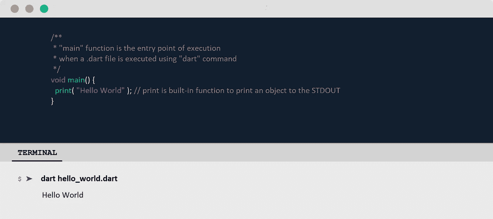

[https://github . com/kaymo min/Dart-before-you-Flutter/blob/master/hello _ world . Dart](https://github.com/kaymomin/Dart-before-you-Flutter/blob/master/hello_world.dart)

好吧好吧，我知道*Hello World 很主流，但是把问候个性化为“Hello *，* insert whatever *”*怎么样？*

*dart:io 库为非 web 应用程序提供输入/输出支持。我们导入 dart:io 是因为我们编写的程序需要用户输入。*

*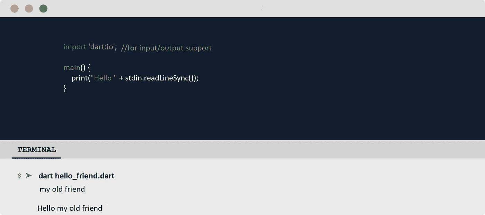*

*[https://github . com/kaymo min/Dart-before-you-Flutter/blob/master/hello _ friend . Dart](https://github.com/kaymomin/Dart-before-you-Flutter/blob/master/hello_friend.dart)*

## *对象:现实和飞镖*

*现实中，一切都是对象。从我们吃的食物到我们拥有的东西，所有的一切。知道每个对象都有一些特征和行为。同样，Dart 中的所有东西也被认为是一个对象。在 vocab 编程中，特征被称为**属性**，行为被称为**方法**。*

*猜猜看，我们将会在很多地方检查物品！*

# *数据类型和变量*

*从变量将保存的数据类型开始，用唯一的变量名后跟(=)符号，以及初始值本身。未初始化变量的初始值为 *null* 。因为在 Dart 中一切都是对象，这仅仅意味着 null 变量没有引用对象；它没有引用任何东西。*

*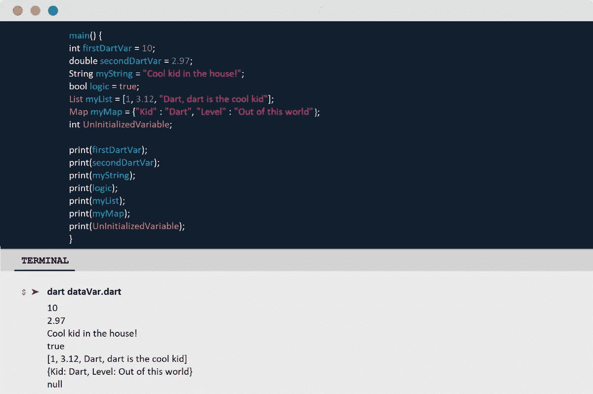*

## *值和引用*

*Dart 语言特别支持数字 *(int，double)* 、字符串、布尔值、列表、地图、集合、符文和符号。数据类型可以大致分为两类，即**值类型**和**引用类型。***

*Value 类型保存自身的数据/值。然而，对于引用类型，信息是对保存值的内存地址位置的某个对象的引用，而不是值本身。*

*在 Dart 中，所有数据类型都是**引用类型**。*

## *字符串插值*

*字符串插值只不过是一种连接、格式化和操作字符串的方法。字符串中未转义的“$”字符表示插值表达式的开始。*

*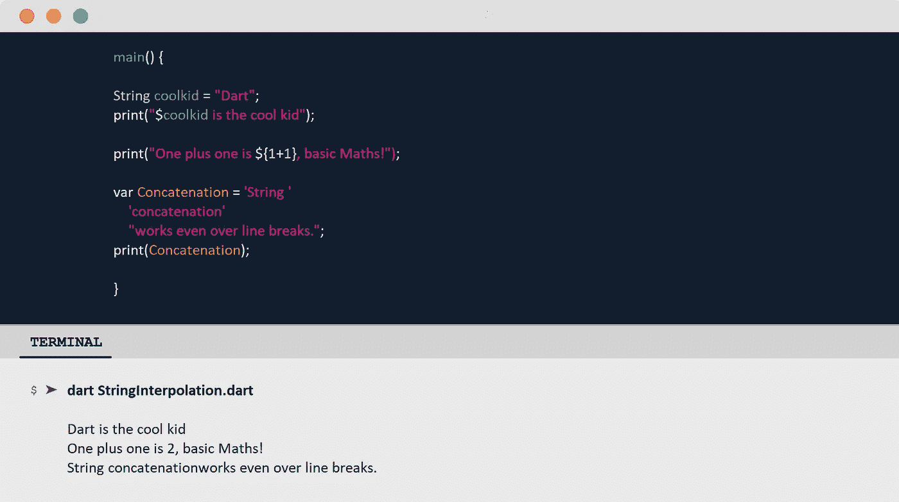*

*[https://github . com/kaymo min/Dart-before-you-Flutter/blob/master/string interpolation . Dart](https://github.com/kaymomin/Dart-before-you-Flutter/blob/master/StringInterpolation.dart)*

## *动态类型*

*如果您希望一个变量包含许多类型的对象，您可以使用“dynamic”关键字声明一个变量。顺便说一句，还记得我们说过对象有代表对象所知道的信息的属性吗？“*runtime type”*就是这样一个属性，它保存了关于变量数据类型的信息。*

*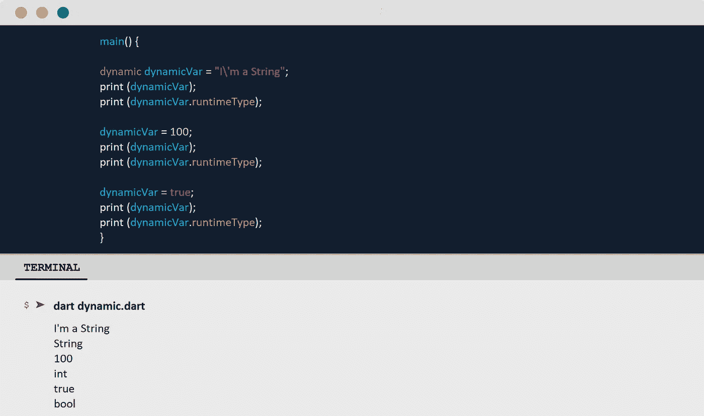*

*[https://github . com/kaymo min/Dart-before-you-Flutter/blob/master/dynamic . Dart](https://github.com/kaymomin/Dart-before-you-Flutter/blob/master/dynamic.dart)*

# *经营者*

*我们从学校认识很多运营商。它们是加法+，乘法*，减法-，等等。在这里，我们将集中讨论学校算术中没有涉及到的运算符。*

*因为不同的操作员执行不同的操作；因此，您需要知道您希望如何处理您的数据，以及每个操作符做什么才能选择正确的操作符。*

## *算术运算符*

*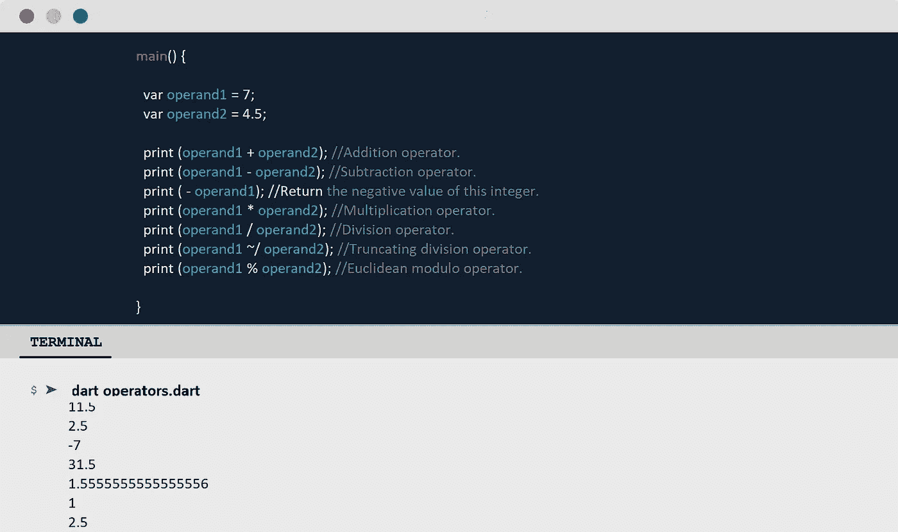*

*[https://github . com/kaymo min/Dart-before-you-Flutter/blob/master/operators . Dart](https://github.com/kaymomin/Dart-before-you-Flutter/blob/master/operators.dart)*

## *前缀和后缀运算符*

*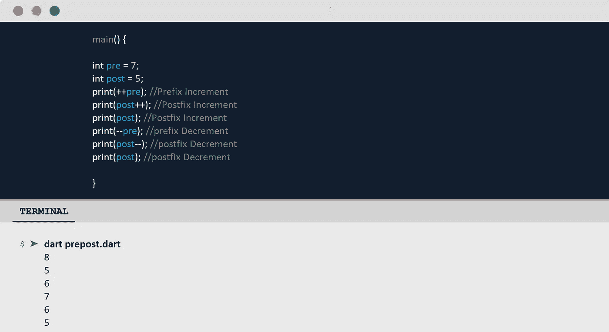*

*[https://github . com/kaymo min/Dart-before-you-Flutter/blob/master/prepost . Dart](https://github.com/kaymomin/Dart-before-you-Flutter/blob/master/prepost.dart)*

## *关系和等式运算符*

*关系运算符在数值类型的操作数之间执行比较，例如，*小于*，而*大于*。相等运算符比较任何类型的操作数。两个运算符都会产生一个*布尔*类型的结果。*

*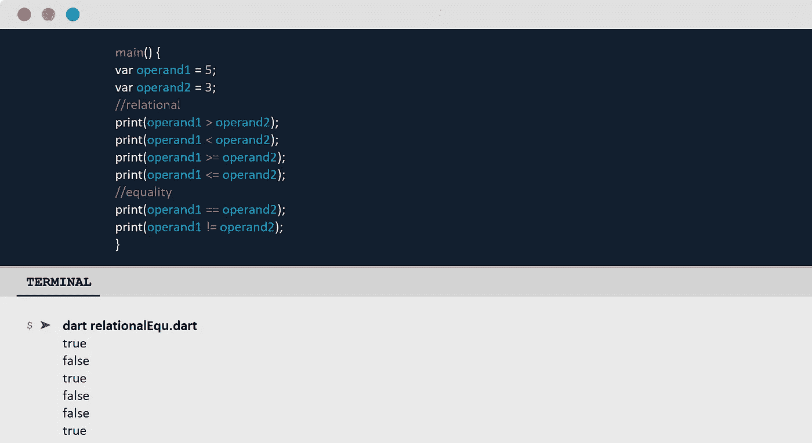*

*[https://github . com/kaymo min/Dart-before-you-Flutter/blob/master/relational equ . Dart](https://github.com/kaymomin/Dart-before-you-Flutter/blob/master/relationalEqu.dart)*

## *逻辑和复合赋值运算符*

*我们知道赋值操作符的用途；给操作数赋值。它们是我们到目前为止看到的所有运算符和我们尚未讨论的运算符的修改版本。这里，复合赋值操作符将其他操作符与赋值操作符“=”组合在一起。*

*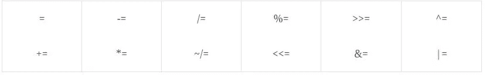*

*逻辑运算符执行逻辑*和*以及逻辑*或*的逻辑运算。它们接受布尔类型的操作数并产生布尔类型的结果。*

*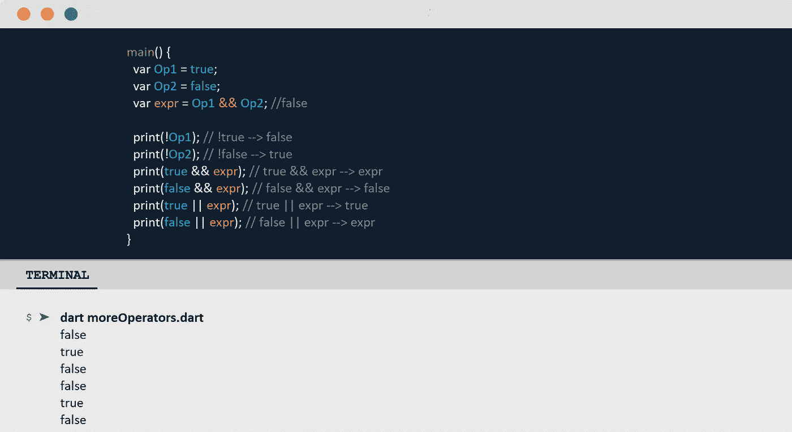*

*[https://github . com/kaymo min/Dart-before-you-Flutter/blob/master/more operators . Dart](https://github.com/kaymomin/Dart-before-you-Flutter/blob/master/moreOperators.dart)*

## *最后一个:按位和移位操作符*

*按位和移位运算符对整数类型的单个位执行运算。它们都处理以二进制形式存储的数字。然而，操作数和结果可以是十进制的，而操作是二进制的。*

*一些按位运算符是&、|、^和~。*

*并且，Dart 支持的一些移位操作符是<< and >>。*

*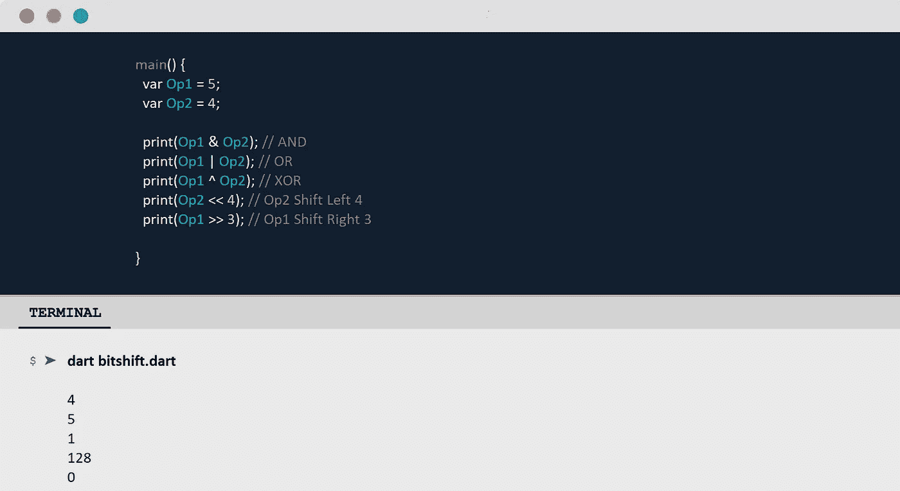*

*[https://github . com/kaymo min/Dart-before-you-Flutter/blob/master/bit shift . Dart](https://github.com/kaymomin/Dart-before-you-Flutter/blob/master/bitshift.dart)*

*这部分到此为止。我强烈推荐通读 Dart 文档[dart.dev/guides](https://dart.dev/guides)并继续查看下一篇的空间。[🎯](https://emojipedia.org/direct-hit/)*