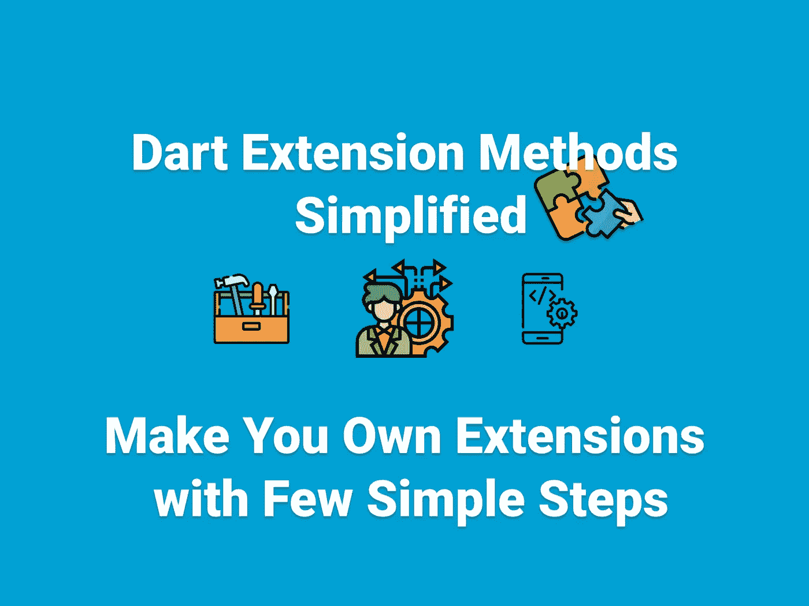

# 省道延伸方法

> 原文：<https://itnext.io/dart-extension-methods-72387e32d9a5?source=collection_archive---------3----------------------->

## 用几个简单的步骤制作你自己的扩展



Dart 有这么多很酷的特性，使得这种语言使用起来非常有趣，其中许多是新手所不知道的。我写这篇文章是为了给出一个非常简单的例子，但是你可以用它做很多事情。它只是被你的想象力所限制。事不宜迟，我们开始吧！！

让我们创建我们的扩展页面，并为其编写一些扩展。首先，让我们获得一个全局上下文，这样我们就可以在扩展中使用它。为了响应，我们需要上下文，为了获得关于`main.dart`的全局上下文，我们需要一个`GlobalKey`。所以让我们加上这一行。

```
final GlobalKey<NavigatorState> appKey = GlobalKey<NavigatorState>();
```

现在有了这个，在 MaterialApp 上我们可以添加`navigatorKey`并到达全球范围。最后应该是这样的。

这样一来，我们就可以专注于我们的扩展了。让我们创建一个基本的响应式设计模式和一些有用的字符串扩展。

我们成功地创建了扩展。现在让我们在需要的时候使用它们。这里有一些简单的东西，所以你可以看到它的用法有多简单。

仅此而已。我们可以成功地使用我们自己的扩展。你可以做各种你经常使用的事情。

你可以在下面看到一个例子。👇 👇

[](https://github.com/SncOne/Dart-Extensions) [## GitHub-sn cone/Dart-扩展

### 此时您不能执行该操作。您已使用另一个标签页或窗口登录。您已在另一个选项卡中注销，或者…

github.com](https://github.com/SncOne/Dart-Extensions) 

**感谢您的阅读！**👏👏

如果你喜欢这篇文章，请点击👏按钮(你知道你可以升到 50 吗？)

另外，别忘了关注我，在你的社交网站上分享这篇文章！也让你的朋友知道吧！！