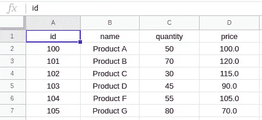

# Dart:使用 Google 工作表

> 原文：<https://itnext.io/dart-working-with-google-sheets-793ed322daa0?source=collection_archive---------0----------------------->

有时出于某些原因，我们选择不使用 Google Sheets 作为我们的数据源。因此，我们需要能够以编程方式读写数据，这可以通过 Google Sheets API 轻松实现。

在本教程中，我将通过使用 [gsheets](https://pub.dev/packages/gsheets/versions) 库向您展示如何在 Dart 中使用 Google Sheets。

在我们开始之前，如果你不知道如何获得证书和设置你的谷歌电子表格，看看我的[文章](https://medium.com/@a.marenkov/how-to-get-credentials-for-google-sheets-456b7e88c430)吧。

假设我们有一个名为“products”的工作表，其产品表如下所示。

# **基本用法**

在对工作表做任何事情之前，我们需要获取它。这是怎么做的。

现在，我们可以使用**工作表**来读写数据。基本操作的示例如下:

*   读取特定行/列值或特定单元值；
*   在特定行/列/单元中写入数据；
*   删除特定行/列。

下面是这些操作的一个片段。

非常简单明了:)

# 高级用法

好了，现在让我们试着做一些更高级更有趣的事情，让我们变一些魔术:)

我们从创建类 **Product** 和 **ProductManager** 开始。

还没有变魔术——需要注意的一件事是 **ProductManager** 有 **init** 方法获取电子表格和产品工作表。

在对工作表进行任何操作之前， **init** 方法必须至少完成一次。我将把这个方法的调用添加到所有的 **ProductManager** 方法中。

现在，让我们添加返回工作表中所有产品的 **getAll** 方法。

好了，现在是时候了——我们得到了所有产品的列表，但这还不神奇吗？

我会说不…它很难阅读，也不容易扩展。它使用固定的数据索引，如果我们要在表中添加一个新列，那么纠正我们在 **ProductManager** 中编写的所有方法将是一场噩梦。

所以，这次我们试着做点神奇的事情吧:)

让我们将表中的方法**添加到表**中，将工厂**添加到我们的类**产品**中。**

现在我们有了它们，我们可以使用内置在 [gsheets](https://pub.dev/packages/gsheets/versions) 中的映射来使事情变得更好。让我们重构 **getAll** 方法。

现在很神奇，不是吗？

这里发生了什么- **allRows** 方法获取所有行(默认情况下从第 2 行开始，但如果需要可以更改)并将它们映射到第 1 行(默认情况下，但如果需要可以更改)。结果，我们得到代表产品的 Map <字符串、String >字符串的列表，然后我们使用 fromGsheets factory 的**将它们映射到产品。**

如果我们要改变我们的表，我们只需要更新我们的类**产品**。

接下来，让我们添加 **getById** 方法。

看起来很酷，是吧？

这里发生了什么——我们通过行的键(该行的键是列 A 中的值)获取行，然后将其映射到行#1，结果我们获得了产品的映射表示，然后我们从该映射创建产品。

如果 products 表中没有这样的 id，我们得到 null。厉害！

现在，让我们添加获取/更新产品价格的方法。

我想不需要解释吧？很清楚，但这里可能有一件事会令人困惑——什么是 ***热切*** 论点，为什么在这种情况下为假。 ***eager*** 告诉是否应该将键自动添加到表中，如果它们中的任何一个不存在(默认情况下 ***eager*** 为真)。在这种情况下，如果缺少 id，我们不想插入 id，或者换句话说，为不存在的产品设定价格。

下一步是什么？现在我们需要可以用来插入新产品或更新现有产品的方法。事实上，我们可以添加一个方法来涵盖这两种情况。以下是片段。

这里发生了什么。在**插入**方法中，我们将产品转换成映射，并将该映射的值插入到键等于产品 id 的行中。如果没有具有该键的行，它将被添加(这是默认行为，可以通过传递 ***eager:false*** 来覆盖)。插入映射中值的顺序无关紧要，因为 [gsheets](https://pub.dev/packages/gsheets/versions) library 将根据第一行中键的顺序对它们进行排序。

您可能已经注意到我传递了***appendMissing:true***，在这种特殊情况下它并没有真正改变什么，但是如果 inserting map 包含的条目的键在第一行中不存在，它会自动将它们添加到工作表中(缺省情况下 append missing 为 false)。

现在，我们的**产品管理器**中还应该有一个特性，那就是删除产品。

简单又好看！

这就是本教程的全部内容，尽管还有许多其他的方法和特性，例如，如果您试图插入超出当前工作表边界的值，它不会抛出异常，只会在插入之前扩展工作表的边界。您可以在文档中了解它和其他特性。

谢谢！通话完毕:)

照片由[埃里克·诺帕宁](https://unsplash.com/@rexcuando?utm_source=medium&utm_medium=referral)在 [Unsplash](https://unsplash.com?utm_source=medium&utm_medium=referral) 上拍摄