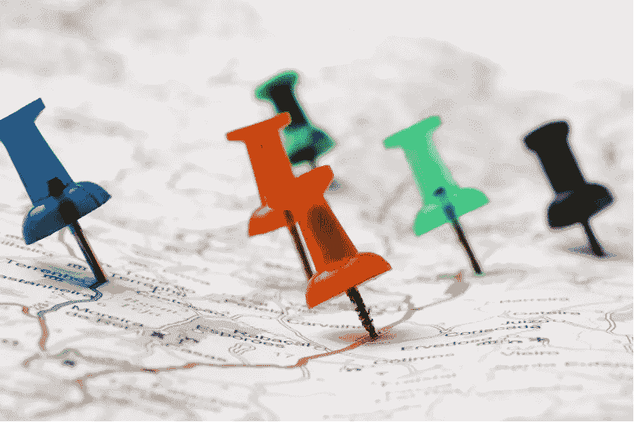
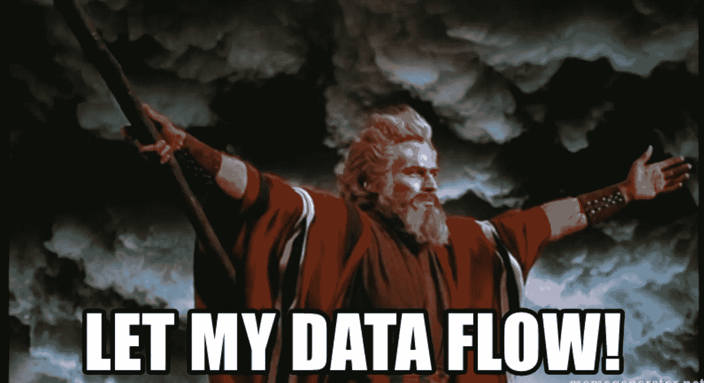

# 以数据为中心的思维

> 原文：<https://itnext.io/data-centric-thinking-1aa1e44cc7ec?source=collection_archive---------3----------------------->

战略路线图和数据:第一部分

商标和版权 20 世纪福克斯电影公司

# 前言

在我的职业生涯中，我收集了自己对数据重要性的看法，并拥有正确的心态来有效地处理数据。我将尝试从建筑的角度给出我个人的见解，这意味着在我们能够理解这个概念并希望接受它之前有一个结构布局。

这绝不是一个深入的研究，我只是试图提供一个关于什么是解决方案架构中数据策略的正确思想的个人见解，以及如何使这些策略起作用。

# 数据、战略、路线图:部分讲述的故事

在第一部分中，我们将重点定义基本概念，并阐述解决方案架构中以数据为中心的基础支柱。

在第二部分(作为后续文章)，我总结了关于拥有最佳结果的正确执行策略的想法:查看一些基础架构基础、数据架构、业务策略、对数据成熟度级别的见解，以及它如何链接在一起，使用**以数据为中心的**思想成功构建**数据战略路线图**。

长期战略=路线图

# “以数据为中心”意味着什么

让我们先来看看几个被广泛接受的解释:

a)业务**愿景**是指企业在未来某个时间点为自己设定的目标和目的(通常在愿景声明中描述，提出 5-10 年的长期成就)。

b)企业的**战略**是指企业为实现更大的**愿景**而采取的所有决策和行动。

c)**路线图**是一个战略计划，它定义了目标或期望的**结果**,包括为实现目标而必须执行的主要步骤和**里程碑**。

总之，**战略路线图**实际上是**商业愿景**细化为具体的短期**目标**，计划为**执行**战略，超过**时间**。

> 那么数据在哪里成为商业思维的核心组成部分呢？

对我来说，很明显，数据**已经是**(对于更细心的人来说，已经有一段时间了)关键业务资产**。**

一些关于全球数据洞察的出版物反复报道了将您的业务转变为数据业务的重要性。**信息是关键，而信息就是数据，因此它应被视为基本驱动力和任何长期业务战略的一部分。**

这种对数据角色的思维转变并不是一种新策略，甚至也不是一种新趋势:

最近发生的情况是，看着失败的战略，越来越多的决策者得出结论，数据是最重要的，所以它应该得到正确的优先考虑。

我能想到的最好的例子之一是在过去 10 年左右的“大数据”热期间，每个大型企业都在与时间赛跑，以集中收集和存储尽可能多的数据:主要是因为他们可以降低风险和节省成本，但也是因为使用它获得洞察力的感知价值(以及竞争优势)。所有这些都是在没有任何数据战略的情况下完成的**。**

可以预见的是，许多“数据湖”项目失败了，这在很大程度上是由于缺乏合格的战略:企业陷入了混乱，完全忘记了他们想要用这些数据做什么。水平可扩展的分布式存储的技术进步使“按原样”存储数据比以往任何时候都更加经济实惠，但它也成为一种昂贵的遗产，需要进一步的技术变革才能跟上业务需求。

一旦企业最终意识到如何执行适合数据湖的数据战略，技术范式就已经再次转变为更健康的数据处理方法(例如，包括集中治理、数据网格、数据结构等概念),他们的整个非数据中心路线图都必须废弃并重新规划。

在我看来，没有认识到数据是一项关键资产，没有创建一个支持数据的结构，而不是脱离业务数据需求的“基础设施优先”的方法，进一步加剧了纯数据湖设计的缺陷。

最坚实的基础建立在良好的数据之上

# “以数据为中心”的思想和架构基础

我们已经确定，企业需要比数据驱动更进一步:也就是说**数据应该驱动技术前景**而不仅仅是基于价值的**业务决策:**他们需要变得更加**以数据为中心**。

以数据为中心意味着什么，我们如何才能开发出与**业务愿景一致的**以数据为中心的文化**和**架构愿景**？**

首先，以数据为中心的架构的定义是，数据被视为一种**关键且永久的资产**，它支持用例应用程序以交付价值。

不是先完成结构和过程，然后让数据适应它们，**数据将指示支持结构和过程需要如何形成**以产生那些可交付成果:这意味着数据模型将先于用例(应用程序)的实现，并将在其整个生命周期内保持有效。当然，这本身是一个新的挑战(允许模型和元数据随着不断变化的需求一起发展)，但是这就是像 mdm 和模式治理这样的概念存在的原因，并且应该总是解决方案的一部分。

> 在以数据为中心的方法中，**数据必须驱动项目**、**设计、商业决策和文化**的发展。

这种方法不仅仅是另一种范式转变或仅仅是一个概念:它本身是一种策略，如果您的业务处于早期实施阶段，它将具有非常低的数据成熟度级别(稍后我将详细解释为什么这很重要)。

为您的企业选择以数据为中心的**战略需要对数据管理的应用方式有不同的理解，不同的架构维度必须是您的战略和路线图不可或缺的一部分:**数据架构****

商标和版权派拉蒙电影公司

# 数据架构:概念和工程

通常被误标为“数据策略”，也许是因为在架构术语中，它还定义了支持业务数据需求的策略和路线图，它实际上意味着其他东西:

数据架构是一组集成的需求，确保数据资产在系统中被存储、安排、管理和使用，以支持组织策略。

这个定义相当拗口，它实际上可以归结为调整所有不同的数据相关角色的需求和期望:业务、it、治理、所有者、利益相关者、客户等

> 理解数据是如何产生和存储的与理解数据是如何消费的同样重要。

为了有一个合适的数据架构，我们必须在适当的位置实现一组可以监督整个数据生命周期的业务流程，表现为某种形式的**数据治理层**(通常由 CDO 或 CDO 办公室扮演)。

然而，数据治理通常被视为对数据进行编目、标记和审计的额外官僚步骤。

当我们试图回答有关数据的问题时(例如:特别是在数据网格和数据结构场景中)，所提供的权限和控制是值得努力的，并且是绝对关键的，如下所示:

*   你的数据都在哪里？
*   谁拥有它？
*   在哪里使用，如何使用？
*   是否按照定义的模型保存？
*   它符合法规吗？

治理流程的其他好处是更加关注数据质量和数据操作，这有助于集成和自动化之旅。

要使数据架构获得成功，它必须将工程和架构概念整合到整体系统中**思考**，例如:

*   **解耦功能:**没有一个数据平台可以回答所有问题(通常被误解&昂贵)
*   **弹性数据管道:**工程组件的强度取决于其最薄弱的组件(内置监控和责任)
*   **适合工作的工具:**通常，当您的平台完全位于本地云中时，工具集的行为会有所不同，因此请谨慎评估
*   **购买与构建功能**:考虑可用的工具和服务，如由云原生方法提供的工具和服务，这些工具和服务可以用来代替难以构建和维护的定制解决方案。

# 数据架构:支柱

**数据架构**应基于以下支柱:

*   解决能力:解决一个商业问题
*   可扩展性:允许随着业务的发展而增长
*   可用性:数据应该尽可能地可访问和可用
*   灵活性:需要适应格式、来源和流程的变化
*   可用性

现代数据架构也应该是“云原生的”这不是关于数据或基础架构的实际位置，而是必须存在的设计原则:无服务器、平台即服务或 SaaS，能够充分利用现代云产品，包括它提供的所有工具、监控、安全性和语言，同时还提供灵活的预算。

> 分析应该遵循数据

对于一个成功的数据架构，为了能够遵循现代设计原则，**集中数据不再是唯一的选择**(它对数据仓库有很多不利之处，例如:报告用例)，而分析应该指向数据所在的位置。

# 未完待续…

关于以数据为中心的思想，以及数据战略和业务战略路线图如何遵循这一原则，还有很多要说的。

我把它分成了两篇文章。在第二部分中，我们将更深入地探讨如下内容:

*   什么是路线图
*   业务战略和数据成熟度
*   定义一个可实现的计划，并与业务交付能力相匹配
*   数据策略解决方案

