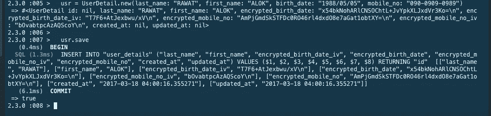
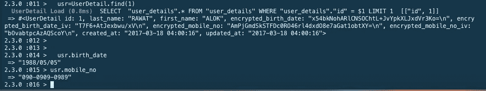

# Ruby On Rails 中的数据加密

> 原文：<https://itnext.io/data-encryption-in-ruby-on-rails-4512fea27893?source=collection_archive---------0----------------------->

## 在任何应用程序中，数据安全性都是主要关注点。因为我们存储了用户的个人数据，如出生日期、手机号码、地址、银行信息等。


[*点击这里在 LinkedIn*](https://www.linkedin.com/cws/share?url=https%3A%2F%2Fitnext.io%2Fdata-encryption-in-ruby-on-rails-4512fea27893) 上分享这篇文章

因此，您处于实施数据安全功能的正确位置。
这里我们使用的是 Ruby(4.2.5)和 Postgresql(用来存储用户的数据)。

Ruby On Rails 中有多种 gem 可用。但是我们要实现“attr _ encrypted”Gem。

第一步。添加数据加密 gem
在 GemFile 中添加一个 gem。

```
gem 'attr_encrypted'
```

**步骤 2。执行捆绑安装**

```
bundle install
```

**步骤 3。生成模型**

```
rails g model UserDetail
```

**步骤 4。在迁移文件中设置加密列。**

```
class CreateUserDetails < ActiveRecord::Migration
  def change
    create_table :user_details do |t|
      t.string :last_name
      t.string :first_name
      t.string :encrypted_birth_date
      t.string :encrypted_birth_date_iv
      t.string :encrypted_mobile_no
      t.string :encrypted_mobile_no_iv
      t.timestamps null: false
    end
  end
end
```

在迁移文件中，我们需要加密 birth_date 和 mobile_no，所以，我们必须在列名前添加「加密的 _」字符串。例如，出生日期。

所以，我们的迁移文件看起来像，

```
t.string :encrypted_birth_date
t.string :encrypted_birth_date_iv
```

iv 列用于提高数据安全性。

第五步。在型号中设置
在您的型号中，

```
class UserDetail < ActiveRecord::Base
    secret_key = ENV['DB_COL_ENCRYPTED_KEY']
    attr_encrypted :birth_date, :key => secret_key
    attr_encrypted :mobile_no, :key => secret_key
    validates_presence_of :last_name
    validates_presence_of :first_name
    validates_presence_of :birth_date 
end
```

**关于环境变量的设置，请查看以下文章。**http://qiita.com/alokrawat050/items/0d7791b3915579f95791
T22

第六步。如何访问视图或 rails 控制台中的加密字段
如果你需要访问视图或 rails 控制台中的加密字段，那么你只需要写列名(不需要写 encrypted_)。

在视图中，

```
<%= f.text_field :birth_date, class: 'form-control'  %>
<%= f.text_field : mobile_no, class: 'form-control'  %>
```

在控制器中，设置许可参数，

```
private
    def user_details_params
      params.require(:user_detail).permit(:id, :last_name, :birth_date, :mobile_no)
    end
```

**在 rails 控制台，**
rails c

1 .在 user_details 表中插入数据。



在上面的例子中，你可以看到当我们要保存数据时，它加密了列的数据(出生日期和手机号码)。

2.从 user_details 表中提取数据。



当我们获取数据时，我们只需要调用列名(不需要写 encrypted_)。

```
usr = UserDetail.find(1) usr.birth_date usr.mobile_no
```

你会得到解密后的数据。

享受编码。

**感谢&最诚挚的问候，
Alok Rawat**

*原载于*[*qiita.com*](https://qiita.com/alokrawat050/items/ff6dceec32baa0c8fa57)*。*