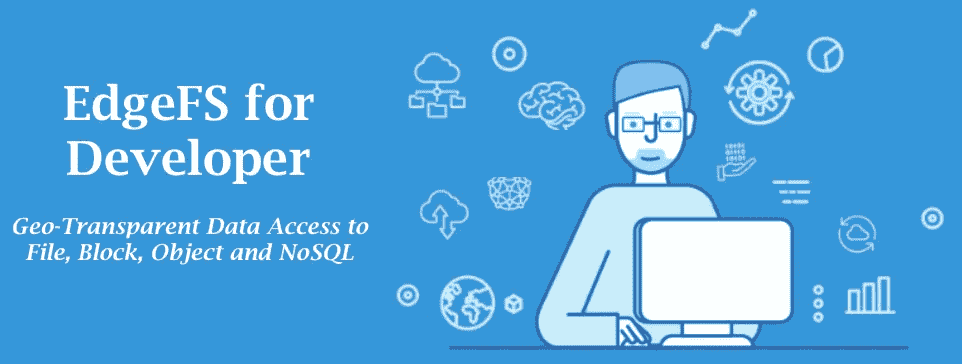
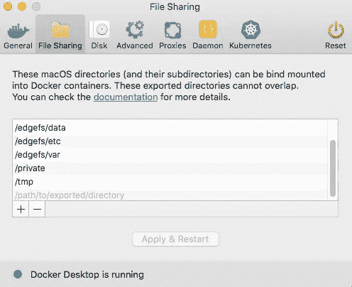
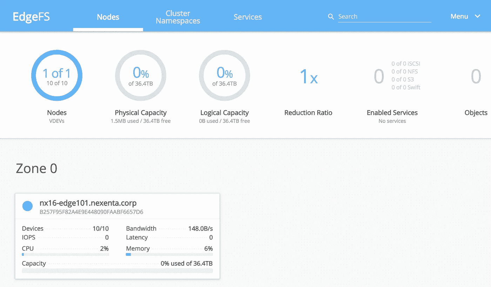
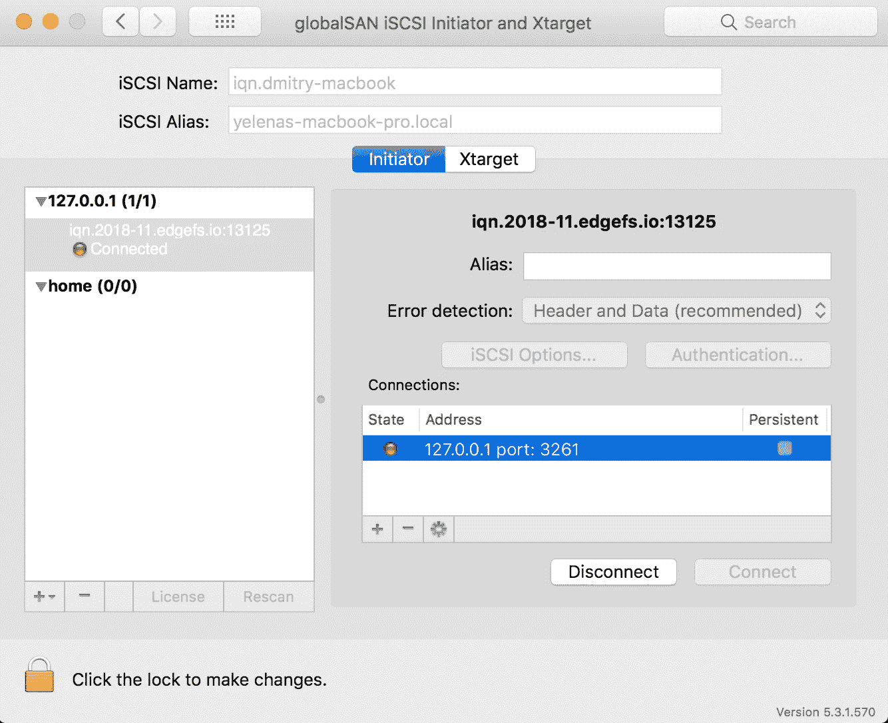

# 面向开发人员的 Mac 版 EdgeFS 数据地理透明

> 原文：<https://itnext.io/data-geo-transparency-with-edgefs-on-mac-for-developers-4e55d599a53f?source=collection_archive---------6----------------------->

在许多情况下，开发人员的工作效率实际上取决于应用程序访问生产前数据集的速度和效率。如果一个数据集在 TBs 里，在几百万条记录里呢？如果数据不断变化会怎样？如果网络断开，你在飞机上或者只是需要离线工作呢？

发现 EdgeFS 数据图层地理透明度！



什么是 EdgeFS？这是 CNCF 鲁克项目的一个新的存储提供商，你可以在 https://rook.io/docs/rook/master/edgefs-storage.html 了解更多信息。虽然它是一个横向扩展存储集群，但它仍然可以在所谓的“solo”模式下运行，这是一个单节点 Docker 容器，能够随着部署的增长而横向扩展，只需连接更多节点和/或地理上分散的集群段即可。

EdgeFS 的优势在于它能够将底层基础架构虚拟化为可扩展、高度可用的地理分布式存储系统。它的工作方式类似于“git ”,其中所有的修改都是全局不可变的、完全版本化的、自我验证的、分布式的，因此是容错的。因此，它支持对对象、文件、数据块和 NoSQL 数据库常用存储协议的跨云和地理上透明的高性能分布式访问。

在 Mac 上配置时，它可以利用本地目录，并将其作为更大数据集的远程访问点。有了浮动快照，通过 E-LRU 本地缓存按需获取数据，您应该能够在您的笔记本电脑上本地设置非常棒的迷你实验室，从而极大地减少网络 I/O。在我的一些实验中，我经历了高达 50 倍的数据读取节省。这得益于全局重复数据删除、传输中压缩和跨多个使用情形的不变性:文件、数据块、对象(S3、S3X 或 SWIFT)和 NoSQL。

# 我们开始吧！

用例将设置对数据集的远程访问，该数据集可通过离线模式下的 EdgeFS 提供的接口进行访问。为简单起见，我将重点介绍使用双向 ISGW(网段间网关)链接和本地透明 NFS 服务创建本地 S3 服务。

我将使用 Mac 版 Docker 桌面，但请注意这个错误:

[](https://github.com/docker/for-win/issues/426) [## 负载过重后，暴露的端口变得无响应

### Michael Friis 指示我在此提交一个问题(请参阅问题 30400 了解更多信息),我遇到了一个间歇性问题…

github.com](https://github.com/docker/for-win/issues/426) 

看来《edge》版本已经修复了这一点。确保切换到“边缘”版本！

但是，仍然要注意的是，在重负载的情况下，vpnkit-forwarder 进程仍然可能在内存压力下死亡，因此我建议您将 VM 的内存增加到 4GB。

创建/edgefs 目录并下载 docker-compose YAML 文件从此要诀:[docker-compose-embedded . yml](https://gist.github.com/dyusupov/c57f6f39e964a849801e4eef6aa6be26#file-docker-compose-embedded-yml)，重命名为 docker-compose.yml .创建如下所示的目录结构和通过 Docker 桌面首选项共享的目录:



创建一个保存 EdgeFS 本地数据的目录:

```
mkdir /edgefs/data/store1
```

并运行配置工具:

```
cd /edgefs
docker-compose run --rm -e CCOW_LOG_STDOUT=1 target \
    config node -n localhost -i eth0 -D /data/store1 -r 1
    -o '{"MaxSizeGB":10,"RtPlevelOverride":1,"DisableVerifyChid":true,"Sync":2}'
```

上面的命令将执行以下操作:

*   将 local /data/store1 目录映射到 EdgeFS 目标容器(-D)；
*   支持使用高达 10GB 的磁盘空间(MaxSizeGB)
*   将目录分区限制为 1(每个额外的分区分配额外的内存，所以保持在最小很重要)(RtPlevelOverride)；
*   在将数据块写入稳定存储之前，禁用数据块的额外网络验证，以节省一些 CPU 周期(DisableVerifyChid)；
*   因为我们只配置了 1 个分区，所以我们将默认本地站点复制设置为 1(-r)；
*   启用日志同步以在 linuxkit 崩溃时提供一致性(同步)。

如果您想要调整建议的配置，请传递“— help”标志。

现在您对配置满意了，启动它:

```
# docker-compose up -d
Creating edgefs_target_1
Creating edgefs_mgmt_1
Creating edgefs_s301_1
Creating edgefs_ui_1
Creating edgefs_nfs01_1
Creating edgefs_isgw01_1# docker-compose logs -f
```

## 初始化集群段“myspace”

状态为在线后，初始化集群并创建系统对象:

```
### initialize local cluster segment
efscli system init### initialize myspace/work/shared1
efscli cluster create myspace
efscli tenant create myspace/work
efscli bucket create myspace/work/shared1 -s 4M -t 1
```

EdgeFS 使用全局唯一的系统路径，格式为名称空间/租户/存储桶/对象。在上面，我们创建了一个“myspace/work/shared”桶，默认块大小设置为 4MB，启用了 NFS/S3 对象透明性。

我们还可以连接到 GUI，并通过漂亮的 UI 创建/监控/管理服务，方法是将 web 浏览器指向 [http://IPADDR:3000](http://10.16.100.101:3000/login) ，默认用户 admin，默认密码是 edgefs。



既然已经创建了集群名称空间段、租户和存储桶，我们就可以设置 S3 和 ISGW 服务定义了:

```
### NFS service with myspace/work/shared1 export
efscli service create nfs nfs01
efscli service config nfs01 X-MH-ImmDir 1
efscli service serve nfs01 myspace/work/shared1### S3 service servicing myspace/work tenant
efscli service create s3 s301
efscli service serve s301 myspace/work### ISGW endpont link
efscli service create isgw isgw01
efscli service serve isgw01 myspace/work/shared1
efscli service config isgw01 X-ISGW-Remote ccow://REMOTE_IP:14000
efscli service config isgw01 X-Status enabled
```

要配置双向 ISGW 链路，您需要了解 REMOTE_IP。可以配置的链路数量没有限制，这是一个完整的网状网络，因此您的本地设置可以同步地理分布的 EdgeFS 安装。

此时，docker-compose 脚本将在下一次策略重启时获取更改，服务应该可用。如果由于某种原因它没有启动，使用以下命令加速服务重启:

```
docker-compose logs -f nfs01         # monitor nfs service logs
docker-compose logs -f s301          # monitor s3 service logs
docker-compose logs -f isgw01        # monitor isgw01 service logsdocker-compose restart nfs01
docker-compose restart s301
docker-compose restart isgw01
```

# 确认

让我们从验证 S3 端点开始。最简单的当然是卷曲:

```
# curl -k [https://localhost:9443/shared1](https://localhost:9443/shared1)
<?xml version="1.0"?>
<ListBucketResult ae la" href="http://s3.amazonaws.com/doc/2006-03-01/" rel="noopener ugc nofollow" target="_blank">http://s3.amazonaws.com/doc/2006-03-01/"><Name>shared1</Name><Prefix></Prefix><Marker></Marker><MaxKeys>1000</MaxKeys><IsTruncated>false</IsTruncated></ListBucketResult>
```

现在，您可以将它指向您的应用程序，并开始在本地使用它。ISGW Link 将以透明的方式为您处理数据集的同步。如果您的数据集只需要同步全局名称空间元数据，请在`isgw01`服务配置中设置 MDOnly=true。这将实现高效的按需数据块提取，并在默认情况下将缓存的块保留 24 小时(可基于每个存储桶进行配置)。

现在让我们来验证 NFS 函数。在 Mac 上，没有简单的方法直接从通过 Docker 容器暴露的 NFS 服务器挂载 NFS 导出。有一种方法可以设置 SOCKS 代理，但实际上，您可能需要的是在 Docker 本身中向您的应用程序公开它，它会工作得非常好:

```
# docker run -it --rm -d --privileged=true --link nfs01 \
    --net=edgefs_default -e MOUNTPOINT=/mnt -e SERVER=nfs01 \
    -e SHARE=/work/shared1 outstand/nfs-client
b6b97c464e4b98899bfb575472a6aed61cb3f71cee80c3c6119be9a6f91a8043
# docker docker exec -it b6b ls /mnt
```

# 高级用法

地理透明，支持跨所有常用存储协议(文件、数据块、对象和 NoSQL)的全局重复数据消除。它实际上是一个数据存储层，旨在跨一组分布式站点、云、内部数据中心和边缘物联网设备进行扩展。

继续...继续读！

## 以有保证的一致性连接您的所有站点

通过 ISGW 链接，您可以启用复杂的数据 I/O 流同步模式。一个全局名称空间可以由数百个小型和大型 EdgeFS 安装组成，它们连接在一起。在我的例子中，/work/shared1 是我想在 REMOTE_IP 和这个设置之间同步的一个 bucket。但是我也可以很容易地添加另一个 isgw02 服务，并将其连接到 REMOTE_IP2 等等，这样我的更改将在两个方向上进行。

在不需要保留复制内容的情况下，我可以选择启用仅元数据同步，即在启用 E-LRU 缓存语义的情况下按需获取数据块:

```
efscli service config isgw01 X-ISGW-MDOnly true
```

如果我需要跨数据集提供某种一致性，我可以使用快照一致性组:

```
# docker-compose exec mgmt toolboxWelcome to EdgeFS Mgmt Toolbox.
Hint: type neadm or efscli to beginroot@55fce9350b63:/opt/nedge# **efscli object**
Objects operations, e.g. create, delete, listUsage:
  efscli object [command]Aliases:
  object, oAvailable Commands:
  create          create a new object
  delete          delete an existing object
  get             get a new object
  list            list objects
  put             put a new object
  show            show object
 **snapshot-add    add a new object's snapshot to snapview
  snapshot-clone  clone snapshot to object
  snapshot-list   list snapshots of specified snapview object
  snapshot-rm     remove snapshot from snapview
  snapview-create create a new snapview section
  snapview-delete delete a snapview object**
```

快照组(如 snapview)将在所有同步位置“浮动”,我无需担心我的工作状态。

## 使用 EdgeFS iSCSI 目标构建您的 SAN 设置

块设备是另一个值得探索的选项。如果我需要一个 iSCSI 设备，很容易创建一个服务，并订阅一个 iSCSI 设备桶。ISGW Link 将开始同步块设备的内容。

```
efscli service create iscsi isc01
efscli object create myspace/work/shared1/lun1 -s 128K \
    -o volsize=10g,blocksize=4096
efscli service serve isc01 myspace/work/shared1/lun1
```

现在，使用`docker-compose restart isc01`重新启动服务，并尝试找到您的 LUN(请注意，我将 isc01 服务端口更改为 3261，以避免与 globalSAN 冲突，因为它分配的是 3260):



EdgeFS iSCSI LUN 实际上只是对象，可通过 NFS、S3、S3X 或 SWIFT 接口访问:

```
curl -i http://localhost:9982/shared1/lun1
HTTP/1.1 200 OK
X-Powered-By: Express
x-amz-id-2: 90fc4c79c9b21ba4
x-amz-request-id: e9e301fcdfebb694
Content-Length: 0
Last-Modified: Sat, 16 Mar 2019 16:41:44 GMT
Accept-Ranges: bytes
**X-volsize: 10737418240**
**X-blocksize: 4096**
ETag: "BED78C44556C9B268C85B3DC1C2E12979CF264F81C06517A705E5137C531FBD70000000000000000000000000000000000000000000000000000000000000000"
Date: Sun, 17 Mar 2019 21:02:52 GMT
Connection: keep-alive
```

## NoSQL 数据库森林

最后，最有趣的选择是探索 NoSQL 风格的数据库。有一个 S3X 扩展 API 可以直接用于应用程序:

[](https://edgex.docs.apiary.io/#) [## Edge-X S3 兼容 API 蜂房

### 存放原料药的地方。

edgex . docs . apary . io](https://edgex.docs.apiary.io/#) 

API 提供对高级 EdgeFS 对象接口的访问，例如对键值存储、S3 对象追加模式、S3 对象读写模式和 S3 对象流会话(POSIX 兼容)模式的访问。

流会话包括由一个源对一个对象进行的一系列编辑，这些编辑在特定的有限时间内保存为一个或多个版本。流会话在打开时必须被隔离。也就是说，通过此会话工作的用户将看不到其他会话对此对象的更新。会话结束后，创建对象的新版本，并最终通过定向 ISGW 链接进行复制。

流会话允许对对象进行高性能的 POSIX 风格的访问，因此对于客户端应用程序来说，使用 HTTP/1.1 或 HTTP/2 持久连接扩展来最小化更新或读取之间的延迟是有益的。

若要启用，请在撰写脚本中取消对 s3x01 服务的注释，并在工具箱中执行以下命令:

```
efscli service create s3x s3x01
efscli service serve s3x01 myspace/work
```

以上将创建服务定义 s3x01 服务租户 myspace/work。这里有几个如何使用它的例子:

```
# create JSON Key-Value database mydb.json in bucket bk1
curl -X POST -H "Content-Type: application/json" \
    --data '{"key1":"value1"}' \
    "[http://localhost:4000/bk1/mydb.json?comp=kv&finalize](http://localhost:4000/bk1/mydb?comp=kv&finalize)"# create CSV Key-Value database mydb.csv
curl -X POST --data "value1" \
    "[http://localhost:4000/shared1/mydb.csv?comp=kv&finalize](http://localhost:4000/shared1/mydb.csv?comp=kv&finalize&key=key1)"# list keys and values
curl "[http://localhost:4000/shared1/mydb.json?comp=kv&values=1](http://localhost:4000/shared1/mydb.json?comp=kv&values=1)"
```

数据库按字母顺序索引，可以使用`key`、`maxresults`和`values`查询参数选择一个或多个匹配的关键字和值:

```
# curl "[http://localhost:4000/shared1/mydb.json?comp=kv&key=key1&maxresults=3&values=1](http://localhost:4000/shared1/mydb.json?comp=kv&values=1)"key1;value1
key11;value11
key12;value12
```

输出可以是 CSV 或 JSON 格式。也可以插入二进制格式的值(二进制值的大小不能超过 1MB):

```
# insert binary data
curl -X POST  -F "file=[@](http://twitter.com/docker)file.txt" \
    "[http://localhost:4000/shared1/mydb.blob?comp=kv&finalize&key=](http://localhost:4000/shared1/mydb?comp=kv&finalize&key=key2)file.txt"# read it back
curl "[http://localhost:4000/shared1/mydb.blob?comp=kv&values=1&maxresults=1&key=](http://localhost:4000/shared1/mydb?comp=kv&values=1&key=key2)file.txt"
```

也可以创建事务风格的键值流行为:打开、修改、修改、修改、提交。这种方法可以用于高效的日志或记录收集机制: ***使用 S3X 将数据直接流式传输到 EdgeFS！阅读更多关于如何做到这一点的 API 文档。***

# 摘要

EdgeFS 可以是一个非常强大的工具，用于改进 CI/CD 或日常开发人员的工作流程。凭借真正的数据地理透明性、文件、数据块、对象和 NoSQL 协议的有保证的一致性，EdgeFS 数据层可以实现一些以前你甚至认为不可能的使用情形。现在，任何类型和种类的数据都可以在分布的位置之间浮动，而不需要任何集中的元数据编排！

探索！如果您想启用额外的功能，请查看 docker-compose 注释掉的部分！或者更好的是，加入我们正在成长的社区，给我们反馈，帮助我们改善开发者体验！