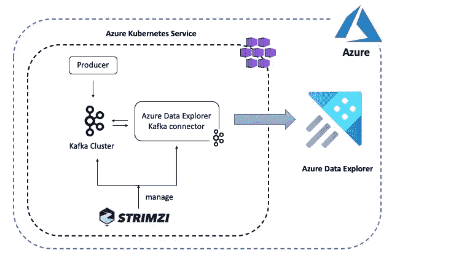
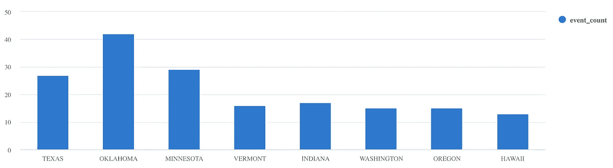

# 使用 Kubernetes 上的 Kafka Connect 将数据摄取到 Azure Data Explorer 中

> 原文：<https://itnext.io/data-ingestion-into-azure-data-explorer-using-kafka-connect-3b59e8b648b7?source=collection_archive---------2----------------------->

在这篇博客中，我们将回顾如何使用开源的[Kafka Connect Sink connector for Azure Data Explorer](https://github.com/Azure/kafka-sink-azure-kusto)将数据摄取到 [Azure Data Explorer](https://docs.microsoft.com/azure/data-explorer/?WT.mc_id=medium-blog-abhishgu) 中，Kafka Connect Sink connector 在 Kubernetes 上使用 Strimzi 运行。 [Kafka Connect](https://kafka.apache.org/documentation/#connect) 是一个使用源和接收器连接器在 Apache Kafka 和其他系统之间可扩展和可靠地传输数据的工具，Strimzi 提供了一种运行 Kafka 集群和 Kafka Connect workers 的“Kubernetes-native”方式。

Azure Data Explorer 是一种快速、可扩展的数据探索服务，允许您收集、存储和分析来自任何不同来源的大量数据，如网站、应用程序、物联网设备等。它有一个丰富的连接器生态系统，支持摄取到 Azure Data Explorer 中，如这里详述的。受支持的数据源之一是 Apache Kafka，sink connector 允许您将 Kafka 主题中的数据移动到 Azure Data Explorer 表中，您可以稍后查询和分析这些表。最棒的是，您可以通过配置以可扩展和容错的方式做到这一点！

以下是这篇博文中描述的场景的概述:



Azure Data Explorer Kafka 连接器从已配置的 Kafka 主题中提取数据，并对接收流程(成批)进行排队，最终将数据写入 Azure Data Explorer 中的表。在幕后，连接器利用了用于 Azure Data Explorer 的[Java SDK](https://github.com/Azure/azure-kusto-java)。

> *这篇博文的资源在 GitHub* 上有[](https://github.com/abhirockzz/kusto-kafka-connect-strimzi)

# *先决条件*

*你将需要一个 Azure 账号以及 Azure CLI 或 Azure 云壳。*

*下面是一些在 Azure 上设置 Azure Data Explorer 集群和托管 Kubernetes 服务的快速指南。我建议将下面的服务作为一个单独的 Azure 资源组[的一部分来安装，这样可以很容易地管理这些服务](https://docs.microsoft.com/azure/azure-resource-manager/management/overview?WT.mc_id=medium-blog-abhishgu)*

## *Azure 数据浏览器*

*您可以使用 Azure Portal 、 [Azure CLI](https://docs.microsoft.com/azure/data-explorer/create-cluster-database-cli?WT.mc_id=medium-blog-abhishgu) 或任何客户端 SDK(如 [Python](https://docs.microsoft.com/azure/data-explorer/create-cluster-database-python?WT.mc_id=medium-blog-abhishgu) )来设置 Azure Data Explorer 集群和数据库[。完成后，使用下面的查询创建一个表(名为`Storms`)和相应的映射(名为`Storms_CSV_Mapping`):](https://docs.microsoft.com/azure/data-explorer/create-cluster-database-portal?WT.mc_id=medium-blog-abhishgu)*

```
*.create table Storms (StartTime: datetime, EndTime: datetime, EventId: int, State: string, EventType: string, Source: string).create table Storms ingestion csv mapping 'Storms_CSV_Mapping' '[{"Name":"StartTime","datatype":"datetime","Ordinal":0}, {"Name":"EndTime","datatype":"datetime","Ordinal":1},{"Name":"EventId","datatype":"int","Ordinal":2},{"Name":"State","datatype":"string","Ordinal":3},{"Name":"EventType","datatype":"string","Ordinal":4},{"Name":"Source","datatype":"string","Ordinal":5}]'*
```

## *Azure Kubernetes 服务(可选)*

*我使用过 Azure Kubernetes 服务，但是这篇博文中的说明应该也适用于其他选项(比如在你的笔记本电脑上安装一个本地的 T2 集群)。您可以使用 [Azure CLI](https://docs.microsoft.com/azure/aks/kubernetes-walkthrough?WT.mc_id=medium-blog-abhishgu) 、 [Azure portal](https://docs.microsoft.com/azure/aks/kubernetes-walkthrough-portal?WT.mc_id=medium-blog-abhishgu) 或 [ARM 模板](https://docs.microsoft.com/azure/aks/kubernetes-walkthrough-rm-template?WT.mc_id=medium-blog-abhishgu)来设置 AKS 集群*

# *基础安装*

*首先安装 Strimzi 操作符，并使用它在 Kubernetes 上启动一个单节点 Kafka 集群。使用`Helm`安装 Strimzi 非常简单:*

```
*helm repo add strimzi https://strimzi.io/charts/
helm install strimzi-kafka strimzi/strimzi-kafka-operator*
```

*要确认成功安装:*

```
*kubectl get pods -l=name=strimzi-cluster-operator*
```

*您应该会看到集群操作员`Pod`处于`Running`状态*

```
*NAME                                        READY   STATUS    RESTARTS   AGE
strimzi-cluster-operator-5c66f679d5-69rgk   1/1     Running   0          43s*
```

*要部署单节点 kafka 集群(以及 Zookeeper):*

```
*kubectl apply -f [https://github.com/abhirockzz/kusto-kafka-connect-strimzi/raw/master/deploy/kafka.yaml](https://github.com/abhirockzz/kusto-kafka-connect-strimzi/raw/master/deploy/kafka.yaml)*
```

*等待群集启动:*

```
*kubectl get pod my-kafka-cluster-kafka-0 -w*
```

*Kafka Pod 应转换到`Running`状态，两个容器都应处于`READY`状态*

```
*NAME                       READY   STATUS    RESTARTS   AGE
my-kafka-cluster-kafka-0   2/2     Running   0          1m*
```

## *Kafka 连接集群设置*

*Kafka Connect 的 Strimzi 容器映像包括两个内置的文件连接器— `FileStreamSourceConnector`和`FileStreamSinkConnector`。出于本博客的目的，在 Docker Hub 上提供了一个定制的 Docker 映像，该映像以[Azure Data Explorer connector](https://github.com/Azure/kafka-sink-azure-kusto/releases/tag/v1.0.1)(版本`1.0.1`)为种子，并在`KafkaConnect`资源定义(`image: abhirockzz/adx-connector-strimzi:1.0.1`)中引用:*

```
*apiVersion: kafka.strimzi.io/v1beta1
kind: KafkaConnect
metadata:
  name: my-connect-cluster
spec:
  image: abhirockzz/adx-connector-strimzi:1.0.1
  version: 2.4.0
....*
```

*如果您想要构建自己的 Docker 映像，请使用 [Strimzi Kafka Docker 映像](https://hub.docker.com/r/strimzi/kafka)作为基础，并将 Azure Data Explorer 连接器 JAR top 添加到插件路径中。首先下载连接器 JAR 文件:*

```
*export KUSTO_KAFKA_SINK_VERSION=1.0.1
mkdir connector && cd connectorcurl -L -O [https://github.com/Azure/kafka-sink-azure-kusto/releases/download/v$KUSTO_KAFKA_SINK_VERSION/kafka-sink-azure-kusto-$KUSTO_KAFKA_SINK_VERSION-jar-with-dependencies.jar](https://github.com/Azure/kafka-sink-azure-kusto/releases/download/v$KUSTO_KAFKA_SINK_VERSION/kafka-sink-azure-kusto-$KUSTO_KAFKA_SINK_VERSION-jar-with-dependencies.jar)*
```

*然后，您可以使用这个`Dockerfile`来构建 Docker 映像:*

```
*FROM strimzi/kafka:0.19.0-kafka-2.4.0
USER root:root
COPY ./connector/ /opt/kafka/plugins/
RUN ls -lrt /opt/kafka/plugins/
USER 1001*
```

> **这个技巧已经在* [*Strimzi 文档*](https://strimzi.io/docs/operators/master/deploying.html#creating-new-image-from-base-str) 中有所说明*

## *证明*

*在安装连接器之前，我们需要创建一个 [Azure 服务主体](https://docs.microsoft.com/en-us/azure/active-directory/develop/app-objects-and-service-principals?WT.mc_id=medium-blog-abhishgu)，以便连接器验证并连接到 Azure Data Explorer 服务。您可以使用 [az ad sp create-for-rbac](https://docs.microsoft.com/cli/azure/ad/sp?view=azure-cli-latest&WT.mc_id=medium-blog-abhishgu) 命令:*

```
*az ad sp create-for-rbac -n "kusto-sp"*
```

*您将得到如下 JSON 响应——请记下`appId`、`password`和`tenant`,因为您将在后续步骤中使用它们*

```
*{
  "appId": "fe7280c7-5705-4789-b17f-71a472340429",
  "displayName": "kusto-sp",
  "name": "http://kusto-sp",
  "password": "29c719dd-f2b3-46de-b71c-4004fb6116ee",
  "tenant": "42f988bf-86f1-42af-91ab-2d7cd011db42"
}*
```

***向您的数据库添加权限***

*为刚刚创建的服务主体提供适当的角色。要分配`admin`角色，[请遵循本指南](https://docs.microsoft.com/azure/data-explorer/manage-database-permissions?WT.mc_id=medium-blog-abhishgu#manage-permissions-in-the-azure-portal)来使用 Azure 门户或在您的数据浏览器集群中使用以下命令*

```
*.add database <database name> admins  ('aadapp=<service principal AppID>;<service principal TenantID>') 'AAD App'*
```

*我们将 auth 相关的配置作为 [Kubernetes Secret](https://kubernetes.io/docs/concepts/configuration/secret/) 的种子—稍后您将看到这个`Secret`在哪里被引用。*

*用下面的内容创建一个名为`adx-auth.yaml`的文件。*

```
*apiVersion: v1
kind: Secret
metadata:
  name: adx-auth
type: Opaque
stringData:
  adx-auth.properties: |-
    kustoURL: <replace ADX Ingest URL>
    tenantID: <enter service principal tenant ID>
    appID: <enter service principal app ID>
    password: <enter service principal tenant password>*
```

*替换以下内容的值:*

*   *`kustoURL` : Azure Data Explorer 摄取 URL，例如`https://ingest-[cluster name].[region].kusto.windows.net`*
*   *`tenantID` -服务主租户 ID*
*   *`appID` -服务委托申请 ID*
*   *`password` -服务主体密码*

# *安装 Kafka Connect*

*创建`Secret`并启动 Kafka 集群创建:*

```
*kubectl apply -f adx-auth.yamlkubectl apply -f [https://github.com/abhirockzz/kusto-kafka-connect-strimzi/raw/master/deploy/kafka-connect.yaml](https://github.com/abhirockzz/kusto-kafka-connect-strimzi/raw/master/deploy/kafka-connect.yaml)*
```

*当您等待 Kafka Connect 集群启动时，请看一下这个`KafkaConnect`集群资源定义的片段。注意`externalConfiguration`属性，它指向我们刚刚创建的秘密。它作为[卷](https://kubernetes.io/docs/concepts/storage/volumes/)加载到 Kafka Connect `Pod`中，Kafka[FileConfigProvider](https://kafka.apache.org/26/javadoc/org/apache/kafka/common/config/provider/FileConfigProvider.html)用于访问它们。*

```
*apiVersion: kafka.strimzi.io/v1beta1
kind: KafkaConnect
metadata:
  name: my-connect-cluster
spec:
  image: abhirockzz/adx-connector-strimzi:1.0.1
  config:
    ...
    config.providers: file
    config.providers.file.class: org.apache.kafka.common.config.provider.FileConfigProvider
  externalConfiguration:
    volumes:
      - name: adx-auth-config
        secret:
          secretName: adx-auth*
```

*要检查 Kafka Connect 集群状态:*

```
*kubectl get pod -l=strimzi.io/cluster=my-connect-cluster -w*
```

*等待 Kafka Connect Pod 转换到`Running`状态。*

```
*NAME                                          READY   STATUS    RESTARTS   AGE
my-connect-cluster-connect-5bf9db5d9f-9ttg4   1/1     Running   0          1m*
```

## *创建主题并安装连接器*

*您可以使用 [Strimzi 实体操作符](https://strimzi.io/docs/operators/master/using.html#using-the-topic-operator-str)来创建`storm-events`主题。下面是`Topic`的定义:*

```
*apiVersion: kafka.strimzi.io/v1beta1
kind: KafkaTopic
metadata:
  name: storm-events
  labels:
    strimzi.io/cluster: my-kafka-cluster
spec:
  partitions: 3
  replicas: 1*
```

*要创建:*

```
*kubectl apply -f [https://github.com/abhirockzz/kusto-kafka-connect-strimzi/raw/master/deploy/topic.yaml](https://github.com/abhirockzz/kusto-kafka-connect-strimzi/raw/master/deploy/topic.yaml)*
```

*使用`kubectl get kafkatopic`查看您刚刚创建的主题以及内部 Kafka 主题*

```
*NAME                                                          PARTITIONS   REPLICATION FACTOR
consumer-offsets---84e7a678d08f4bd226872e5cdd4eb527fadc1c6a   50           1
storm-events                                                  3            1
strimzi-connect-cluster-configs                               1            1
strimzi-connect-cluster-offsets                               25           1
strimzi-connect-cluster-status                                5            1*
```

*下面是连接器(`KafkaConnector`)定义的片段——这只是一种为您想要安装的连接器捕获配置和元数据的方法。*

```
*apiVersion: kafka.strimzi.io/v1alpha1
kind: KafkaConnector
metadata:
  name: adx-sink-connector
  labels:
    strimzi.io/cluster: my-connect-cluster
spec:
  class: com.microsoft.azure.kusto.kafka.connect.sink.KustoSinkConnector
  tasksMax: 3
  config:
    topics: storm-events
    flush.size.bytes: 10000
    flush.interval.ms: 50000
    kusto.tables.topics.mapping: "[{'topic': 'storm-events','db': '[REPLACE DATABASE NAME]', 'table': 'Storms','format': 'csv', 'mapping':'Storms_CSV_Mapping'}]"
    kusto.url: ${file:/opt/kafka/external-configuration/adx-auth-config/adx-auth.properties:kustoURL}
    aad.auth.authority: ${file:/opt/kafka/external-configuration/adx-auth-config/adx-auth.properties:tenantID}
    aad.auth.appid: ${file:/opt/kafka/external-configuration/adx-auth-config/adx-auth.properties:appID}
    aad.auth.appkey: ${file:/opt/kafka/external-configuration/adx-auth-config/adx-auth.properties:password}
    key.converter: "org.apache.kafka.connect.storage.StringConverter"
    value.converter: "org.apache.kafka.connect.storage.StringConverter"*
```

> **`*flush.size.bytes*`*和* `*flush.interval.ms*` *属性协同工作，作为批处理的性能旋钮。请参考* [*连接器 GitHub repo*](https://github.com/Azure/kafka-sink-azure-kusto/blob/master/README.md#5-sink-properties) *了解这些和其他配置参数*的详细信息**

**注意单个属性(来自`Secret`)实际上是如何被引用的。例如，为了引用服务主体应用程序 ID，我们使用了:**

```
**aad.auth.appid: ${file:/opt/kafka/external-configuration/adx-auth-config/adx-auth.properties:appID}**
```

*   **`/opt/kafka/external-configuration`是容器内部的固定路径**
*   **`adx-auth-config`是`KafkaConnect`定义中的卷名**
*   **`adx-auth.properties`是在`Secret`中定义的文件名**
*   **`appID`是钥匙的名称**

> ***直接属性名已用于定义非敏感连接器配置(如* `*topics: storm-events*` *)。或者，可以将这些封装在一个* `*ConfigMap*` *中，将它们加载为一个* `*Volume*` *并引用它们(就像敏感属性使用一个* `*Secret*` *)。***

**将上述`KafkaConnector`的定义复制到本地文件`adx-connect-config.yaml`。确保在`kusto.tables.topics.mapping`属性中替换正确的数据库名称。要创建:**

```
**kubectl apply -f adx-connect-config.yaml**
```

**检查 kafka 连接日志`kubectl logs -l=strimzi.io/cluster=my-connect-cluster`。如果一切正常，您应该会看到类似如下的日志:**

```
**....
INFO [Consumer clientId=connector-consumer-adx-sink-connector-1, groupId=connect-adx-sink-connector] Resetting offset for partition storm-events-1 to offset 0\. (org.apache.kafka.clients.consumer.internals.SubscriptionState) [task-thread-adx-sink-connector-1]INFO [Consumer clientId=connector-consumer-adx-sink-connector-2, groupId=connect-adx-sink-connector] Resetting offset for partition storm-events-2 to offset 0\. (org.apache.kafka.clients.consumer.internals.SubscriptionState) [task-thread-adx-sink-connector-2]**
```

# **数据摄取正在进行**

**那么，我们一切都准备好了。我们只需要将事件发送到 Kafka 主题，这样我们就可以看到连接器的运行，并将数据接收到 Azure Data Explorer 中。**

**您可以使用这个方便的事件生成器应用程序(在 [Docker Hub](https://hub.docker.com/r/abhirockzz/adx-event-producer) 中可用)并将它部署到您的 Kubernetes 集群中—`Dockerfile`在 [GitHub repo](https://github.com/abhirockzz/kusto-kafka-connect-strimzi/raw/master/storm-events-producer/Dockerfile) 中可用，以防您想要引用它。**

**Kubernetes `Deployment`片段:**

```
**apiVersion: apps/v1
kind: Deployment
metadata:
  name: adx-event-producer
spec:
  replicas: 1
  ....
    spec:
      containers:
        - name: adx-event-producer
          image: abhirockzz/adx-event-producer
          imagePullPolicy: Always
          env:
            - name: KAFKA_BOOTSTRAP_SERVER
              value: my-kafka-cluster-kafka-bootstrap:9092
            - name: KAFKA_TOPIC
              value: storm-events
            - name: SOURCE_FILE
              value: StormEvents.csv**
```

**要部署生产者应用程序:**

```
**kubectl apply -f [https://github.com/abhirockzz/kusto-kafka-connect-strimzi/raw/master/deploy/producer.yaml](https://github.com/abhirockzz/kusto-kafka-connect-strimzi/raw/master/deploy/producer.yaml)**
```

**应用程序从 [StormEvents.csv 文件](https://github.com/abhirockzz/kusto-kafka-connect-strimzi/blob/master/storm-events-producer/StormEvents.csv)中提取记录，并将它们发送到 Kafka 主题。每个事件都是一个 CSV 记录，代表风暴发生数据(开始和结束时间、状态、类型等)。)，例如:`2007-01-01 00:00:00.0000000,2007-01-01 05:00:00.0000000,23357,WISCONSIN,Winter Storm,COOP Observer`。**

> ***生产者应用* [*等待 3 秒*](https://github.com/abhirockzz/kusto-kafka-connect-strimzi/blob/master/storm-events-producer/main.go#L65) *之间对卡夫卡进行后续的生产操作。这是有意的，以便您可以监视 Kafka Connect 日志并了解正在发生的事情。* `*StormEvents.csv*` *文件包含超过 50，000 条记录，因此可能需要一段时间才能将它们全部批处理并获取到 Azure Data Explorer***

**您可以使用`kubectl logs -f -l app=adx-event-producer`跟踪应用程序日志。如果一切正常，您应该会看到类似这样的内容:**

```
**...
sent message to partition 0 offset 0
event  2007-01-01 00:00:00.0000000,2007-01-01 00:00:00.0000000,13208,NORTH CAROLINA,Thunderstorm Wind,Publicsent message to partition 0 offset 1
event  2007-01-01 00:00:00.0000000,2007-01-01 05:00:00.0000000,23358,WISCONSIN,Winter Storm,COOP Observersent message to partition 0 offset 2
event  2007-01-01 00:00:00.0000000,2007-01-01 05:00:00.0000000,23357,WISCONSIN,Winter Storm,COOP Observer**
```

**`storm-events`主题现在将开始获取事件，这些事件将被接收器连接器拾取。如果您要跟踪连接器日志:**

```
**kubectl logs -f -l strimzi.io/cluster=my-connect-cluster**
```

**…您应该会看到类似以下内容的日志:**

```
**....
INFO Kusto ingestion: file (/tmp/kusto-sink-connector-17d03941-f8ca-498e-bc52-68ced036dc69/kafka_storm-events_0_0.csv.gz) of size (1722) at current offset (16) (com.microsoft.azure.kusto.kafka.connect.sink.TopicPartitionWriter) [Timer-6]INFO WorkerSinkTask{id=adx-sink-connector-0} Committing offsets asynchronously using sequence number 17: {storm-events-0=OffsetAndMetadata{offset=17, leaderEpoch=null, metadata=''}} (org.apache.kafka.connect.runtime.WorkerSinkTask) [task-thread-adx-sink-connector-0]INFO Kusto ingestion: file (/tmp/kusto-sink-connector-17d03941-f8ca-498e-bc52-68ced036dc69/kafka_storm-events_0_17.csv.gz) of size (1666) at current offset (33) (com.microsoft.azure.kusto.kafka.connect.sink.TopicPartitionWriter) [Timer-7]
....**
```

## **查询 Azure 数据浏览器**

**等待一段时间，直到数据在`Storms`表中结束。要进行确认，请检查行数并确认摄取过程中没有失败:**

```
**Storms | count. show ingestion failures**
```

**一旦有了一些数据，尝试几个查询。要查看所有记录:**

```
**Storms**
```

**使用`where`和`project`过滤特定数据**

```
**Storms
| where EventType == 'Drought' and State == 'TEXAS'
| project StartTime, EndTime, Source, EventId**
```

**使用`[summarize](https://docs.microsoft.com/azure/data-explorer/write-queries?WT.mc_id=medium-blog-abhishgu#summarize)` [运算符](https://docs.microsoft.com/azure/data-explorer/write-queries?WT.mc_id=medium-blog-abhishgu#summarize)**

```
**Storms
| summarize event_count=count() by State
| where event_count > 10
| project State, event_count
| render columnchart**
```

****

**这些只是几个例子。请看看 [Kusto 查询语言文档](https://docs.microsoft.com/azure/data-explorer/kusto/query/?WT.mc_id=medium-blog-abhishgu)或者探索关于如何使用[标量操作符](https://docs.microsoft.com/azure/data-explorer/write-queries#scalar-operators)、[时间表](https://docs.microsoft.com/azure/data-explorer/kusto/query/tutorial?pivots=azuredataexplorer&WT.mc_id=medium-blog-abhishgu#timecharts)等将 JSON 格式的样本数据摄取到 Azure Data Explorer 中的教程。**

# **清理资源**

**要删除连接器和/或 Kafka 集群:**

```
**kubectl delete kafkaconnect/my-connect-cluster
kubectl delete kafka/my-kafka-cluster**
```

**要删除 AKS 和 Azure Data Explorer 集群，只需删除资源组:**

```
**az group delete --name <AZURE_RESOURCE_GROUP> --yes --no-wait**
```

# **结论**

**这就是这篇博文的全部内容，希望你觉得有用！请注意，这是*而不是*将数据导入 Azure Data Explorer 的唯一方式。欢迎您参考文档并探索其他技术，如[一键摄取](https://docs.microsoft.com/azure/data-explorer/ingest-data-one-click?WT.mc_id=medium-blog-abhishgu)，使用[事件网格](https://docs.microsoft.com/azure/data-explorer/ingest-data-event-grid-overview?WT.mc_id=medium-blog-abhishgu)，[物联网中心](https://docs.microsoft.com/azure/data-explorer/ingest-data-iot-hub-overview?WT.mc_id=medium-blog-abhishgu)等。**

**请考虑探索以下主题作为额外的学习资源:**

## **资源**

*   **[使用 Strimzi 配置 Kafka Connect 集群](https://strimzi.io/docs/latest/#proc-configuring-kafka-connect-deployment-configuration-kafka-connect)**
*   **Strimzi [KafkaConnect 模式参考](https://strimzi.io/docs/latest/#type-KafkaConnect-reference)**
*   **Strimzi [KafkaConnector 模式参考](https://strimzi.io/docs/latest/#type-KafkaConnector-reference)**
*   **[刚刚够云架构师使用的 Azure Data Explorer】](https://techcommunity.microsoft.com/t5/azure-data-explorer/just-enough-azure-data-explorer-for-architects/ba-p/1636234)**
*   **[Azure Data Explorer connector 1 . x 的新特性](https://techcommunity.microsoft.com/t5/azure-data-explorer/azure-data-explorer-kafka-connector-new-features-with-version-1/ba-p/1637143)**
*   **[库斯托查询语言](https://docs.microsoft.com/en-us/azure/data-explorer/kql-quick-reference)**