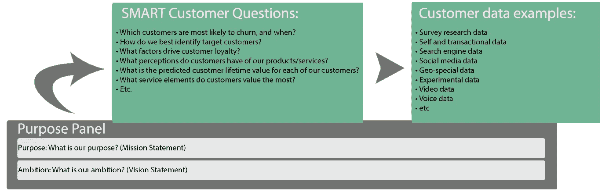
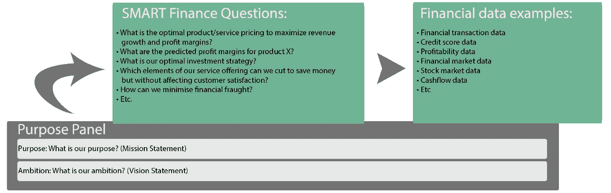
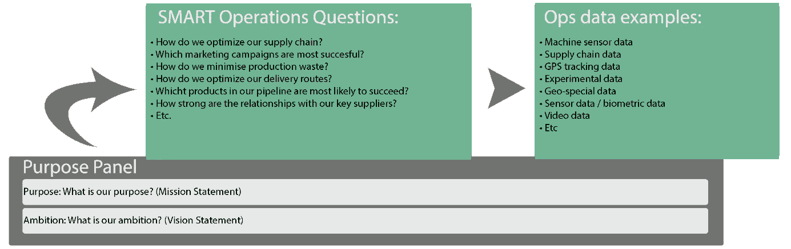
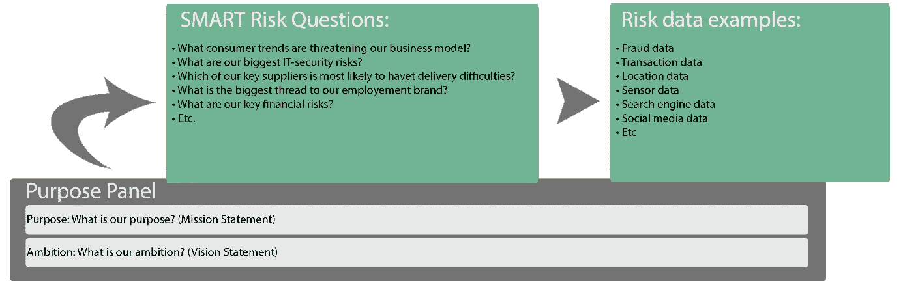

# 数据只是数据。从指标和智能问题中获得战略优势。

> 原文：<https://itnext.io/data-is-slechts-data-behaal-strategisch-voordeel-met-metrics-en-smart-questions-580a87c22887?source=collection_archive---------4----------------------->

这是智能数据系列的第三篇文章。系列中的其他文章如下所示:

> # 1:[关注更多数据或更智能地使用现有数据？大数据与智能数据](/focussen-op-meer-data-of-slimmer-gebruik-van-bestaande-data-big-data-vs-smart-data-5b9a306c873f)
> 
> *#2、* [智能数据以](/smart-data-begint-met-een-strategie-9b5ade9062c1?source=user_profile---------3----------------)策略开始
> 
> # 4:[通过分析将数据转换为有意义的见解](/transformeren-van-data-naar-betekenisvolle-inzichten-met-behulp-van-analyse-697772d6ddbf?source=user_profile---------1----------------)
> 
> # 5:[利用强大的报告功能充分发挥大数据的潜力](/benut-het-volledige-potentieel-van-big-data-met-behulp-van-krachtige-rapportages-1c27ca0b121e?source=user_profile---------0----------------)

在大数据周围的整个跳跃中，很容易忘记它只是“数据”。因此，数据可能比以往任何时候都多，但只有在“T10”战略阶段 t11 中的“智能问题”得到解答时，该功能才有用。我们越来越有能力充分利用大量数据，从而增强了我们对周围世界的了解。本系列文章中关于[智能数据](https://www.linkit.nl/knowledge-base/266/Focussen_op_meer_data_of_slimmer_gebruik_van_bestaande_data_Big_Data_vs_SMART_Data)的第三篇文章，是关于使用度量来度量数据的。在指标本身提供之前，我们将先了解目前的资料类型和新资料形式。

**数据类型**

数据科学和业务分析都使用结构化数据和非结构化数据。智能业务将现有数据集与非结构化或半结构化数据集结合使用，这些数据集既可以来自内部源，也可以来自外部源。

**结构化数据**

结构化数据通常被认为是过时和乏味的，但大多数具体的见解都是通过使用这种类型的数据正确获得的。数据位于记录或文件中的固定字段中，例如关系数据库和电子表格。以下是一些例子:

*   销售数据
*   财务数据
*   客户数据

结构化数据使用预定义的数据模型。确定数据存储、处理和打开方式的模型。为每个字段提供名称和关系，以便于使用、维护和分析数据。

**非结构化数据**

非结构化和半结构化数据是“热”的。大多数有价值的信息都来自于这些数据类型，这些数据类型不容易放置在列、行和字段中。这使分析过程变得困难和复杂。非结构化数据和半结构化数据的示例包括:

*   照片和图像
*   -视频
*   网站吗
*   文件、电子邮件、PDF、部落格及社交媒体等文字讯息

半结构化数据是非结构化数据和非结构化数据的交集。尽管存在一定程度的结构，但它并不是基于预定义的数据模型构建的。

**内部数据**

内部数据是指组织内已有的所有数据。数据的形象比外部数据差，因此内部数据的价值被普遍低估。内部数据示例包括:

*   客户反馈
*   客户和员工满意度调查结果
*   客户信息
*   销售数据
*   戴达先生

**外部数据**

外部数据是无限量的数据，可从组织外部访问。这既可以是私有数据，也可以是公共数据。以下是一些例子:

*   天气预报
*   法律和法规
*   推特消息
*   社交媒体设定档
*   Google 地图资料

上述数据类型中没有一种数据类型比另一种数据类型更有价值。从战略阶段的智能问题开始，帮助您找到最佳的结构化、非结构化、内部和外部数据源来回答这些问题，并最终成功地执行策略，这一点非常重要。

**新的数据形式**

如今，大部分的人类和计算机活动都留下了数据的痕迹。近年来，这种巨大的增长带来了新的数据形式。

**活动数据**

web 浏览器准确跟踪我们访问的网站，并跟踪我们访问这些网站的人数、访问这些网站的时间、访问网站的时间以及如何通过网站进行导航。

另一个这方面的趋势是所谓的[易腐食品](https://www.linkit.nl/knowledge-base/129/Growth_reaches_38_in_wearables_market)的增加。智能设备可收集有关步行、骑自行车或在健身房工作的数据。这些设备中的许多已连接到 internet，因此可以在线访问数据(无论是否公开)。

**通话记录**

我们的对话也越来越多。主要是社交媒体上的交流起着重要作用:

*   每天有 5 亿条微博被发布。也就是每秒有 6000 个
*   每天有 50 万新用户加入。每秒有 6 个
*   超过 100 万用户在[链接](https://blog.linkedin.com/2015/07/09/1-million-linkedin-publishers)上发布了内容
*   [WhatsApp](https://www.statista.com/statistics/260819/number-of-monthly-active-whatsapp-users/) 在全球拥有 12 亿用户
*   [WordPress](https://wordpress.com/activity/)每月发布 560000 条博客

**照片和图片中的数据**

数位相机和智慧型手机的制作与分享速度比以往更快。

*   [78%的人每周都看在线视频](https://blog.hubspot.com/marketing/video-marketing-statistics#sm.0001t3cuqkohydayy7z1tr696gzcy)，55%的人每天都这样
*   在[Facebook](https://techcrunch.com/2015/10/13/facebook-video-feed/)上，每天有 80 亿个视频被观看
*   [Snapchat](https://techcrunch.com/2015/11/09/snapchat-reaches-6-billion-daily-videos-views-tripling-from-2-billion-in-may/) 用户每天观看 60 亿个视频
*   [Instagram 的 T23 上有超过 8 千万张照片，而在](https://instagram-press.com/) [Flickr 上有超过 100 亿张](http://www.findmysoft.com/news/10-Fun-Facts-You-Should-Know-About-Flickr/)

**传感器和物联网(物联网)**

到处都是感应器！全球定位系统(GPS)是最早也是最著名的传感器之一。一个最近的例子是[现代汽车](https://www.linkit.nl/knowledge-base/127/Connected_Car_Auto_s_als_technologieplatform)，它完全配有传感器来测量汽车内部和周围的状态、性能和情况。只有通过[互联网或事物的增长](https://www.linkit.nl/knowledge-base/220/Internet_of_Things_in_Buildings_groeit_enorm)才能扩大这种趋势。

**通过使用数据和指标取得战略优势**

有了这些数据类型和形式，人们对大数据的大量和大量能力感到震惊是不合理的。但是，我们必须学习如何应对，因为它是大数据未来的一部分。运用智慧、常识和实际操作经验，将大资料转换成有价值的智慧型资料。

从制定智能问题(围绕客户、财务、运营和资源以及风险)的战略阶段开始，您就可以很好地了解回答这些问题所需的数据和指标。此搜索具有层次顺序:

1.内部结构化数据

2.内部半结构化数据

3.内部非结构化数据

4.外部结构化数据

5.外部非结构化数据

**客户数据需求**

收集客户数据的选项多种多样，包括质量、复杂性和成本。

客户资料需求(2015 年 11 月)

**金融数据需求**

一个组织的主要目标是盈利，这对于了解组织的财务状况是必不可少的。

财务数据需求(2015 年 11 月)

**操作数据需要**

操作过程和过程会生成大量数据，这些数据有助于做出更好的决策并提高效率。

数据需要行动(2015 年 11 月)

**风险数据需求**

为了保持竞争力，尽早发现问题和风险并加以缓解是非常重要的。

竞争和风险数据需求(2015 年 11 月)

**插槽**

要确定需要哪些数据，必须逐个处理已制定的智能问题。[Bernard marr](https://www.linkedin.com/in/bernardmarr/)的“战略委员会”为系统地推进此过程提供了一个极好的手柄，从而将数据转换为有价值的信息，从而实现组织目标。下一篇文章将在两周内发表，其中“Analytics”的“a”是核心内容。

*原始出版于*[*www . link . nl . T6*](https://www.linkit.nl/knowledge-base/281/Data_is_slechts_data_Behaal_strategisch_voordeel_met_metrics_en_SMART_questions)*上。*