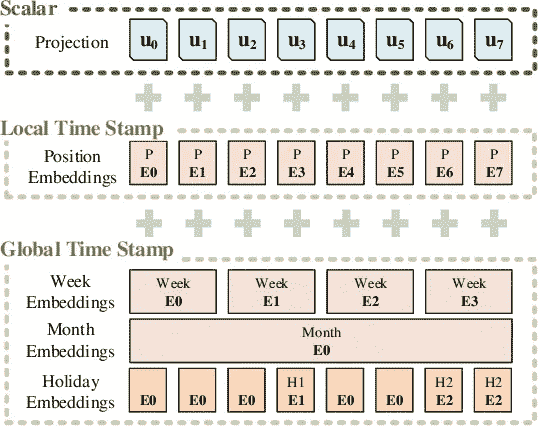
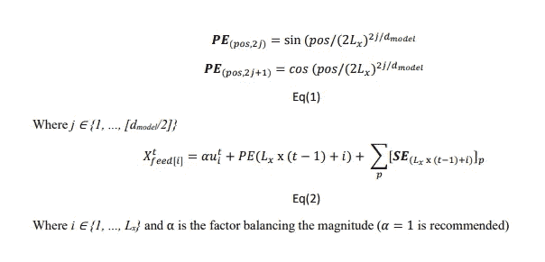
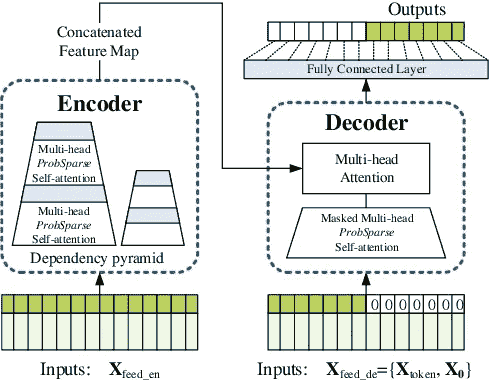
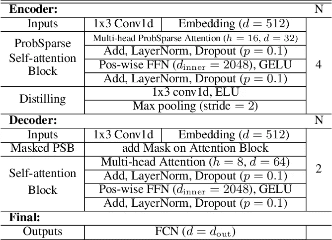
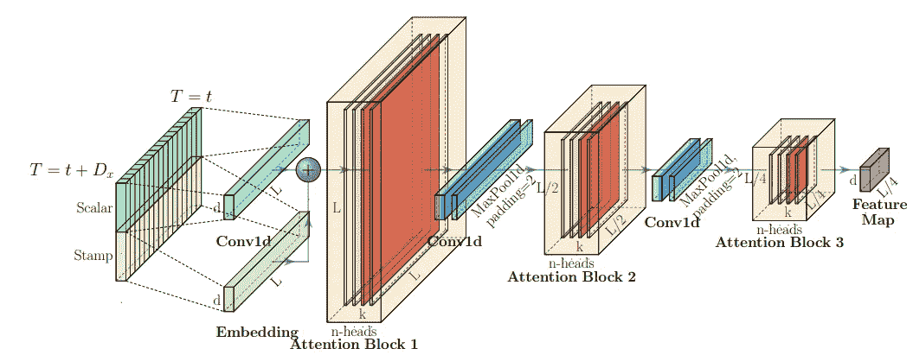

# 数据之旅 1 (Informer:超越长序列时间序列预测的高效转换器)

> 原文：<https://itnext.io/data-journey-1-informer-5cfd6a1d354f?source=collection_archive---------1----------------------->

## 这是我写的第一部分，是关于数据在最先进算法的预测过程中的旅程。我不确定是否有类似的文章；因此，我认为这是它自己的第一种。所以，我喜欢继续写这样的文章，从数据本身的新角度来看 ML。我还试图让这篇文章变得有趣和像故事一样，以吸引和理解大多数对机器/深度学习感兴趣的人。我会认为这是一个婴儿，所以请接受我的不成熟的道歉，并请告诉我你的建议，以改善这种类型的文章。

[来源](https://giphy.com/gifs/baby-eating-spoon-lfCTKCg4sw8rm)

> 在我看来，这篇文章对大多数从事时间序列数据预测、NLP 任务或任何序列数据的人来说都是很棒的。

[来源](https://giphy.com/gifs/time-story-storytime-Idz7cyLRe2bVm)

这篇文章是我们的时间序列数据的故事，这些数据是为基于 transformer 的模型训练的，在我的一篇[中型文章](https://rezayazdanfar.medium.com/informer-beyond-efficient-transformer-for-long-sequence-time-series-forecasting-4eeabb669eb)和[主要科学论文](https://arxiv.org/pdf/2012.07436.pdf)中作为 Informer 进行了说明。所以，我强烈推荐你阅读原研；如果你没有足够的时间，你只能阅读我的[中的文章](https://rezayazdanfar.medium.com/informer-beyond-efficient-transformer-for-long-sequence-time-series-forecasting-4eeabb669eb)来捕捉所有必要的要点。

[来源](https://giphy.com/gifs/perfect-loops-xjIsb648nX0pw8kdBd)

`I named the data BolBol just to make this article more like a story rather than anything else.😉`

BolBol 发现自己是一个多变量时间序列数据集，这意味着它有几个特征(变量)，这些特征(变量)在固定的时间步长(时间段)`it can be 1, 2, ... sec(s) or 1, 2, ... min(s) or even 1, 2, ... hour(s)`中作为时间的函数不断变化。

所以现在，BolBol 知道它的类型；这使得这条道路很容易提出。这种类型的数据可以用来预测未来。*未来预测*在大多数行业都至关重要，所以 BolBol 应该提出一个 ***高效模型*** ，能够*预测* ***长序列*** 。有很多序列算法，如 LSTMs、GRUs 等。

`What do you think? which model(s) should we use?! So confusing!!🤯`

[来源](https://giphy.com/gifs/confused-baffled-vh9isNb4S2Spa)

BolBol 刚刚谷歌了一下这方面的趋势，结果是目前主要基于注意力使用的变形金刚。因此，他决定接受基于变压器模型的培训。

[来源](https://giphy.com/gifs/black-and-white-text-google-xePnbnJiehT1e)

> 有必要在第一阶段了解数据集是如何 BolBol 的。虽然主要研究中使用了 4 个数据集，但我将介绍其中一个:

# 关于博尔博(ETTH 1)

BolBol 是一个多变量(包括油温等 7 个特征。)分辨率为 ***1 小时*** 的 2016 年至 2018 年(2 年)时间序列数据集，17421 个数据点。

ETT 是 ***电力变压器温度的缩写，*** 修改为 1 小时的分辨率，导致 ETTH。数据集及其描述在此公开发布[。](https://github.com/zhouhaoyi/ETDataset)

BolBol 分为*训练* / *验证* / *测试数据*三个子集，比例为 *14/4/4* *月，分别为*。输出是将要预测的 ***油温*** 。

还有一个`.py`文件，协助改变时间序列的*(例如*小时到分钟*)。这个文件可以在[*time features . py*](https://github.com/zhouhaoyi/Informer2020/blob/main/utils/timefeatures.py)中轻松找到。😉*

**

*[来源](https://giphy.com/gifs/hairlosangeles-hair-los-angeles-daniel-moon-majormoonn-VGoLO1BcG9WLJDQIoD)*

# *一般路径*

****在将*** 数据送入算法之前，对其进行预处理有一定的步骤，如*归一化*、*等*。而且，变压器包含两个部分:1 . ***编码器*** 2。**解码器解码器**。所以，简单地说，BolBol 首先应该是 ***编码*** 然后 ***解码*** 。*

**

*[来源](https://giphy.com/gifs/donnathomas-rodgers-581Zz0uzEYDMweow7D)*

# *1.数据准备*

## ***1.1 标准化***

*首先要用`**mean** of **0** and **standard deviation** of **1**`把 BolBol 变换成想要的 ***音阶*** 。下面的代码正在进行这种转换:*

## ***1.2 数据准备***

*BolBol 需要阅读；所以，我们需要写一个类，让 BolBol 达到`1-hour`的分辨率。在这里，`class`我们可以看到`*freq='h'*`，它通过使用`time_features.py`而成为可能。此外，我们可以很容易地看到序列、标签和预测的长度。`target='OT'`表示*油温*。*

## ***1.3 培训***

*BolBol 应该为*培训* / *验证* / *测试*阶段做好准备；因此，类`Dataset_Custom`被编写为执行如下:*

## ***1.4 预测***

*此外，BolBol 应该为预测阶段做好准备；所以，他写了如下的类`Dataset_Pred`:*

*到目前为止，博尔博找到了他的**师**进行*训练*、*验证*、*测试*，以及*预测*部分。但是，知道如何做一个模特的 ***吃货*** 是很关键的。*

## *1.5 统一输入表示法*

*BolBol 发现每个模型需要捕获的长依赖项的特征是**全局信息**如 ***分层时间戳*** ( *周、月、年* r)和 ***不可知时间戳*** ( *假日，事件*)。这两个问题导致**在* *编码器*和*解码器*之间出现一些不匹配。因此，一个 ***均匀输入*** 就是为了用**解决**问题而设计的。**

****

**图一。告密者输入表示综述。| [来源](https://arxiv.org/pdf/2012.07436.pdf)**

**输入的嵌入包括三个独立的部分:**

1.  *****一个标量投影*****
2.  *****本地时间戳*** ( *位置嵌入*)**
3.  *****全局时间戳*** ( *周、月、假日嵌入*)**

> **请注意，我没有举例说明方程，所以你可以在原始论文中找到它们的插图。顺便说一句，我刚刚在下面提到了这些等式:**

****

> **所以，此刻，波尔博尔准备给模特喂食；而现在的**型号**应该是**设计的**。记住，模型的细节可以在我的 [**中文**](https://rezayazdanfar.medium.com/informer-beyond-efficient-transformer-for-long-sequence-time-series-forecasting-4eeabb669eb) 或其[**原科学论文**](https://arxiv.org/pdf/2012.07436.pdf) 中找到。**

****

**[来源](https://giphy.com/gifs/construction-nIUav1AOaK06s)**

# **2.告密者网络**

****

**图二。线人模式概述| [来源](https://arxiv.org/pdf/2012.07436.pdf)**

**图二。正在示意性地说明告密者**。它展示了 BolBol 的**序列**应馈入编码器和解码器的 ***中，然后****编码器**的输入经过****解码器**中的多头关注**部分预测出 ***输出序列*** 的过程。*********

**

*表 1。[线人网络详细组件|来源](https://arxiv.org/pdf/2012.07436.pdf)*

*表 1。是*概述**中的***编码中的和**中的*解码*中的**部分；换句话说，BolBol 应该被编码和解码以完成它在算法中的过程。*

## *2.1 注意事项*

*本研究中对编码器的关注不同于“[关注所有你需要的](https://arxiv.org/abs/1706.03762)”中的关注机制；就是***prob sparse*******自我关注*** 。顺便说一下，在解码器中，**两个 *ProbSparse*** 和 ***完全注意机制*** 都在执行。你可以在我的 [**中篇**](https://rezayazdanfar.medium.com/informer-beyond-efficient-transformer-for-long-sequence-time-series-forecasting-4eeabb669eb) 或者 [**原创科技论文**](https://arxiv.org/pdf/2012.07436.pdf) 中看到它的区别。**

## **2.2 编码器**

****

**图 3。告密者编码器中的单个堆栈| [来源](https://arxiv.org/pdf/2012.07436.pdf)**

**BolBol 被编码器路线的复杂性搞糊涂了。首先，BolBol 将其自身准备为一个*均匀输入，然后它应该通过一个卷积层和嵌入，并通过**注意块 1** 。通过关注块后，应该会通过一个卷积的 1D 层和带`padding=2`的 MaxPool 1D 层(其效果可以看到在每个关注块中减半 L)。我们通常使用 MaxPool 层来减少数据量，因此，BolBol 应该会有一个较小的注意块(2 和 3)。在两个第一关注之后，除了第三个关注块(最后一个)，我们有了`Conv1d`和`MaxPool`，在第三个关注块中，我们有了一个特征图。***

## ***2.3 解码器***

***好了，博尔博已经**通过了**最复杂的*部分(*编码器*)。现在，他被*编码*并应该去 ***解码器*** 被*解码*并最终做出**预测**。****

*解码器的结构与图 2 中的[注意事项](https://arxiv.org/abs/1706.03762)相同。*

## *2.4 代码中的线人结构*

# *3.超参数*

*超参数很重要；因此它们可以通过`dotdict`功能或`argparse`进行设置。*

*或者就像下面这样:*

# *4.训练模型*

# *5.模型验证*

*已经编写了几个指标(MAE、MSE 等)来验证算法的性能，尽管这些指标已经编写为在 Python 库中导入。顺便说一句，你可以在下面找到这些:*

# *参考*

1.  *[周，h .*信息员:超越长序列时间序列预测的高效变压器*。在*的《AAAI 议事录*。2021.](https://arxiv.org/pdf/2012.07436.pdf)*
2.  *[github.com/zhouhaoyi/Informer2020](https://github.com/zhouhaoyi/Informer2020)*
3.  *[rezayazdanfar . medium . com/informer-beyond-efficient-transformer-for-long-sequence-time-series-forecasting-4 eeabb 669 EB](https://rezayazdanfar.medium.com/informer-beyond-efficient-transformer-for-long-sequence-time-series-forecasting-4eeabb669eb)*

*`I think it is good to say that BolBol is a type of bird in persian lands who is delicate. Also, in my personal life, there is someone who I've been calling BolBol and is important for me just as data is for a datascientist.`*

> *此外，我写这篇文章是为了**讲一个故事**；我意识到这个事实:它并不完美，因为它对我来说只是一个开始。所以，如果你能给我**你的想法**或**反馈**，我**会很感激**；可以在本文正下方掉一个**评论**或者**直接联系**我**通过 [**推特**](https://twitter.com/reza__yazdanfar) 或者 [**LinkedIn**](http://www.linkedin.com/in/rezayazdanfar) 。我会立即回复**😉；所以，感觉**自由**让我们来个****聊天**。😁😉😊*******