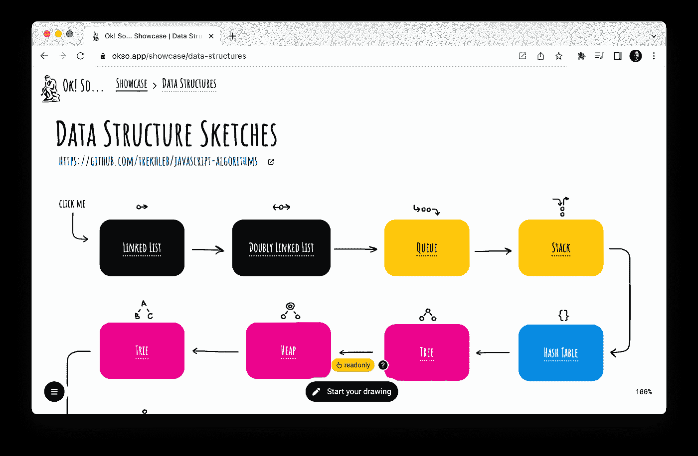
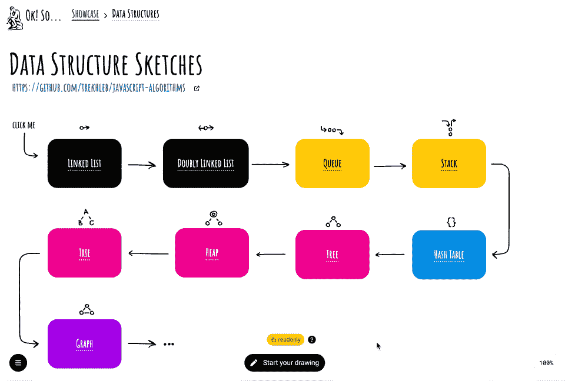
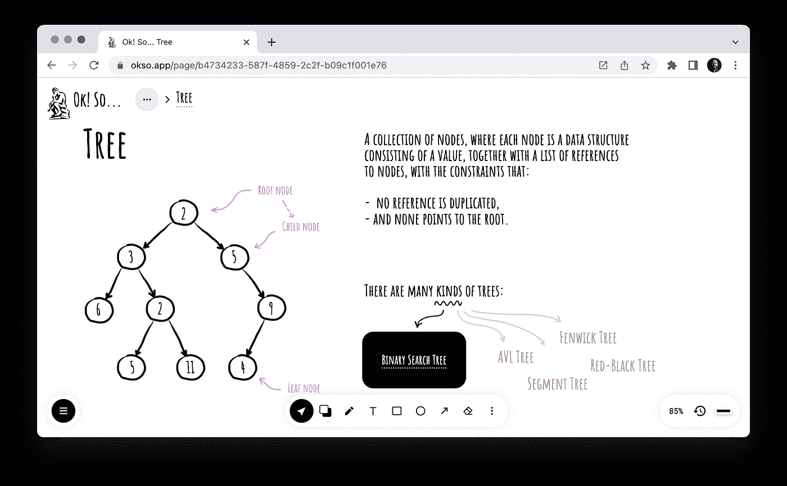
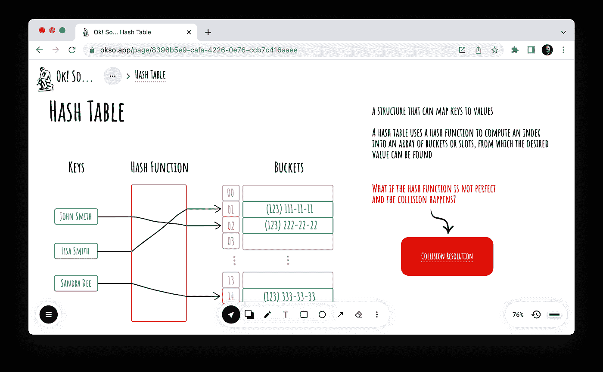
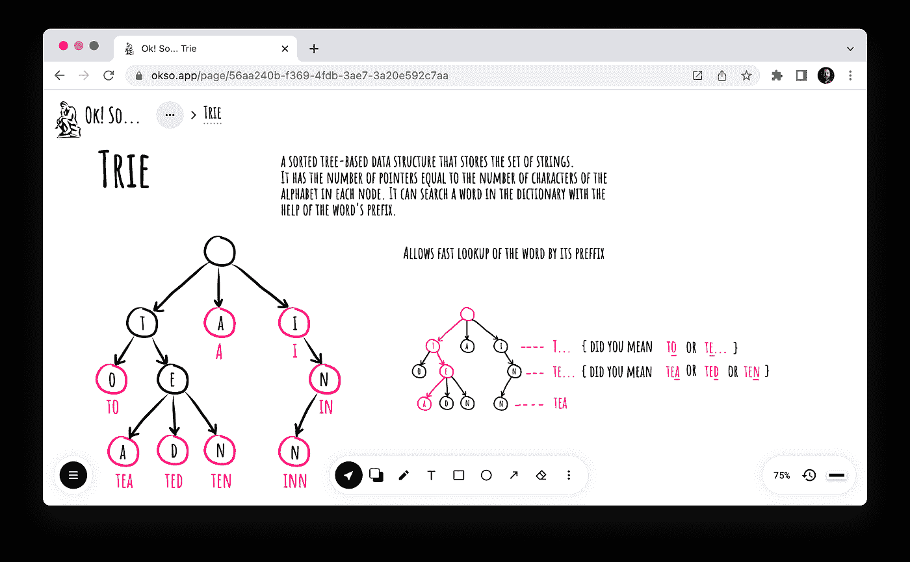
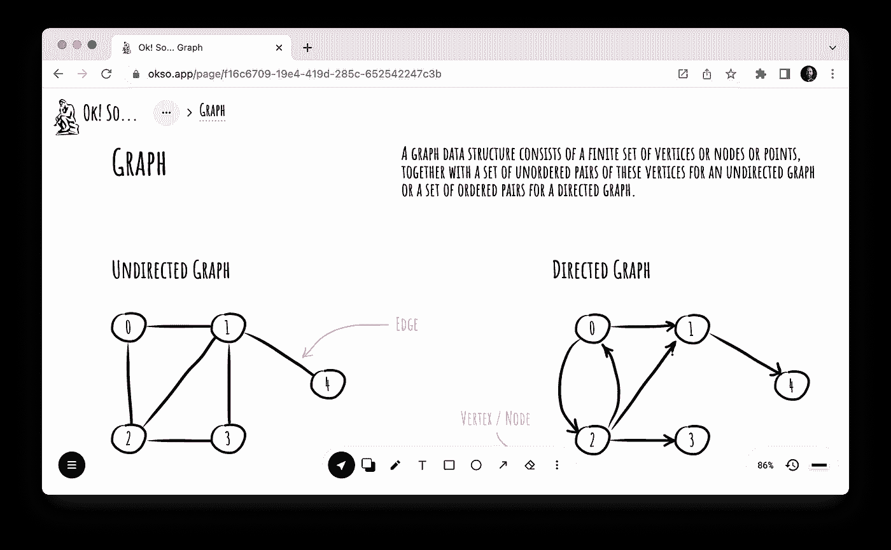

# 数据结构草图

> 原文：<https://itnext.io/data-structure-sketches-fccd2f24b234?source=collection_archive---------0----------------------->

最近我推出了极简主义在线绘画应用 [okso.app](https://okso.app/) 。我想让它成为一个人们可以对任何概念进行快速、即席、像餐巾一样的解释的地方，就好像你和你的朋友坐在一起，试图在午餐时向他/她解释一些事情。不要问我为什么需要，我只是在做实验。

> *Btw，这就是为什么 app 名字叫“Ok！所以……”因为通常这些是你拿起笔和纸(或白板)开始画画后的开场白。我没有看到研究和统计的开头语，所以我可能错了😀*

所以，我试图用草图解释的第一个概念是数据结构。事不宜迟，这里是互动✍🏻 [**数据结构草图**](https://okso.app/showcase/data-structures) 展示给你玩。

> *这里有一张* [*YouTube 版*](https://www.youtube.com/watch?v=yaOWTOWOWGk) *的 GIF 以防万一。*

当然，并不是所有的数据结构都包括在内。当然，这并不是全面的材料，而是一个为以下数据结构创建视觉提示和关联的备忘单:

*   链表
*   双向链表
*   长队
*   堆
*   哈希表(具有哈希冲突解决方案)
*   树(包括二叉查找树)
*   堆(包括平均堆和最大堆)
*   特里
*   图表

草图上的每个框都是可点击的，所以你可以挖掘你感兴趣的数据结构。例如`Heap → Max Heap`，或者`Heap → Min Heap`，或者`Heap → Array Representation`。

草图被分成所谓的页面，只是为了更容易掌握它们，所以用户一次只关注一个概念，他们看到概念之间的关系，因此，希望他们不会因为在一张图纸/页面上同时看到大量信息而不知所措。

每个页面都有一个链接，指向在 JavaScript 上实现数据结构的源代码示例。

这里有一些草图的例子。

**双向链表**

**树**

**哈希表**

**特里**

**图形**

你可以在✍找到完整的列表🏻 [**数据结构草图**](https://okso.app/showcase/data-structures) 展示。

我希望你觉得这个展示很有用，并且我希望它是对你的数据结构知识的一个很好的可视化的补充。