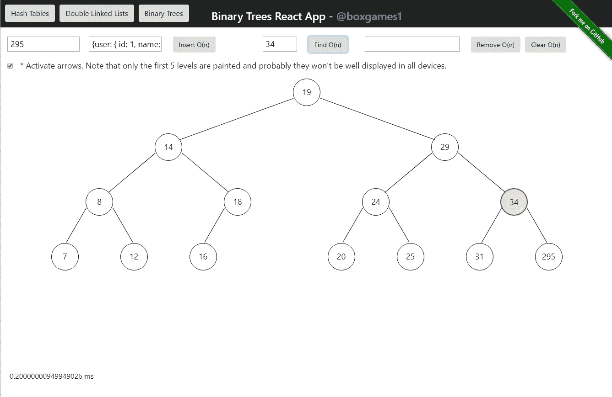

# JS 中的数据结构:二叉树反应应用

> 原文：<https://itnext.io/data-structures-in-js-binary-trees-react-app-5443b951a46b?source=collection_archive---------3----------------------->



应用程序的屏幕截图

这是 JavaScript 数据结构系列的第三部分。这是出版物的索引:

*   [第 1 部分(散列表)](/data-structures-in-js-hash-tables-app-with-react-b28b02a9e6b5)
*   [第二部分(双向链表)](https://medium.com/@alonso.oliverio/data-structures-in-js-part-2-double-linked-lists-150facd7a90d)
*   [第三部(二叉树)](https://medium.com/@alonso.oliverio/data-structures-in-js-binary-trees-react-app-5443b951a46b)

和前面一样，我用 React 创建了一个交互式 SPA 来理解二叉树的行为。

# 二叉树是如何工作的？

二叉树由二进制节点形成，在这种情况下，二进制节点具有一对{Key，Value}，一个到左节点的链接和一个到右节点的链接。

第一个节点名为 root，像每个节点一样，有两个子节点。根的左子节点中的节点的键总是小于根的键。左侧子对象的关键点总是高于根对象的关键点。在上面的图片中你可以看到。

在每次插入中递归地应用这些条件，直到找到一个具有实现它们的自由链接的节点。

叶子是没有孩子的节点。下面是节点类:

很简单。二进制树数据甚至更简单:

```
class BinaryTreeNode {
  constructor() {
    this.root = null;
  }
  …
}
```

唯一的参考是根。它充当每个方法的入口点。

好吧，让我们看看插入是如何工作的:

在第一个实例中，您用一个键/值对调用 insert 函数。它执行一些基本的检查，然后调用 insertNode 函数。它接收需要迭代的节点和要插入的节点。一旦该函数被调用，它将执行三重条件比较键:

*   新节点低于入口点。如果左边的子节点是空闲的，那么 newNode 被赋值，否则，递归地检查左边的节点。
*   新节点高于入口点。相同的工作流，但在正确的节点。
*   新节点键等于入口点键。在这种情况下，一个节点也具有所选的键，并且该值被覆盖。

第二种方法是独立的，因为它被反复调用，并且不需要在每次迭代中检查先决条件。让我们使用删除方法:

remove 方法检查先决条件，并使用 root 作为入口点和该方法返回值的接收者来调用 removeNode。

RemoveNode 像 insertion 一样递归工作，并且有一个类似的工作流。主要的区别出现在找到节点的时候。如果它是一片叶子，工作就完成了，在其他情况下，我们必须重新构建我们要删除的节点的子节点。

这种方法的圈复杂度是 2n，因为我们必须寻找和重建。现在让我们检查查找方法:

像 insert 方法一样，find 的复杂度为 O(log2 n ),因为你不需要遍历每一棵树的元素。算法很好理解。它递归地遍历 childs，直到找到想要的节点。

二叉树有 **4 条不同的路径**:

*   **为了**:接收一个入口点和一个要执行的函数，它递归地去左边的节点，然后是根(在它上面执行函数)，最后通过右边的节点。这些树目前的行为和排列。Inorder 会做一个排序路径，因为在左树中会有较小的键。
*   **前序**:相同的行为，但是首先在节点上执行函数，然后递归地在左右节点上执行。
*   **后序**:左右节点先递归运行，根是最后一个。

*   **等级顺序:**通俗易懂。从左到右。一旦它运行了整个级别，然后继续下一个级别，并迭代直到最后一个级别。这是理论，在实践中，我有一个长度为 2^(level-1).的数组用于每一层在级别中，每个节点都有一个索引来引用其子节点，并知道将它们存储在级别数组中的什么位置。

一个级别数组将填充 n 个元素，长度为 n 的元素为空。它们至少填充了 1 个元素。

让我们用一个例子来解释它们:


**按顺序** : 1 3 4 6 7 8 10 13 14

**预订** : 8 3 1 6 4 7 10 14 13

**后序** : 1 4 7 6 3 13 14 10 8

**等级顺序** : [ [8]，[3，10]，[1，6，''，14]，[''，''，4，7，' '，13，' ']]；

4 级 4 个阵列

在 n 级中，levelArray 具有 2^(n-1 长度。在第 4 级:2 =8，所以 8 个项目。

# 什么时候以及为什么应该使用二叉树？

有了每个节点中的一个<key>对，我们就可以在值中存储**所有的**，同时将键用于方法目的。在最坏的情况下，insert 或 find 的复杂度是 O(log2 n ),因为您不必遍历每个元素来找到您想要的元素。在上面的例子中，如果它是一个排序数组，你想找到元素 13，你应该在找到 13 之前遍历 6 个元素。在树中，你只需要通过根，10 和 14。二叉树的排序方法是节省大量搜索时间的关键。插入函数具有相同的行为和开销，而删除函数的开销要大一些，O(n ),因为你必须重建被删除节点的子节点。但是在数组中，你还必须处理 O(n)代价。</key>

这里唯一的限制是密钥的排他性。不能有重复的项目。但是，您可以在值中存储您想要的任何内容，因此根据您的需要，您可以存储类似于值数组的内容，并进行多次插入。在这种情况下，您应该修改该方法。

# 在哪里可以查看代码和应用程序？

应用程序存储在 Heroku:

 [## 二叉树反应 App @boxgames1

### 编辑描述

binary-trees-app.herokuapp.com](https://binary-trees-app.herokuapp.com/) 

代码在 Github 里。请随时给我发送变化，改进或任何你认为有趣的拉请求。我对合作持开放态度。

[](https://github.com/boxgames1/binary-trees-app) [## box games 1/二叉树应用程序

### 这个应用程序展示了二叉树的行为

github.com](https://github.com/boxgames1/binary-trees-app) 

你可以在推特上找到我 [(@Oliver_ap)](https://twitter.com/Oliver_AP)