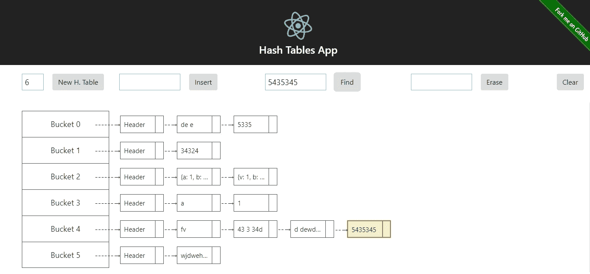
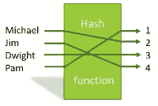
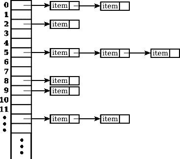

# JS 中的数据结构:带有 React 的哈希表应用程序

> 原文：<https://itnext.io/data-structures-in-js-hash-tables-app-with-react-b28b02a9e6b5?source=collection_archive---------6----------------------->



哈希表 React 应用的屏幕截图

在这一系列文章中，我想展示为什么经典数据结构对 JS 开发人员有用。在这种情况下，我将使用一个典型的链表散列表。

*   [第 1 部分(散列表)](/data-structures-in-js-hash-tables-app-with-react-b28b02a9e6b5)
*   [第二部分(双向链表)](https://medium.com/@alonso.oliverio/data-structures-in-js-part-2-double-linked-lists-150facd7a90d)
*   [第三部(二叉树)](https://medium.com/@alonso.oliverio/data-structures-in-js-binary-trees-react-app-5443b951a46b)

在 [Github repo](https://github.com/boxgames1/hash-tables-app) 中找到关于本文的所有文档和代码。

一个**散列表**是一个具有静态大小的简单数组。每个数组包含一个链表。列表包含不重复的元素。

在哈希表中，每次你对一个条目进行操作(插入、删除或查找)时，他都会被传递到哈希函数，该函数返回条目应该被放置的桶的索引。这意味着您节省了大量的迭代，因为您知道在哪个存储桶中对每个输入执行您的操作。



哈希函数示例

为了解释列表是如何工作的，我更喜欢从组成它们的节点开始。

```
class LListNode { constructor(value, next) { this.value = value; this.next = next; } // getters and setters….}
```

很简单吧？一个**链表节点**只是由它的值和下一个元素组成。

链表是一个节点链，从一个头节点开始。(我没有展示所有的方法，但是你可以在 [Github repo](https://github.com/boxgames1/hash-tables-app) 中查看它们)

```
class LList { constructor(values) { let current; this.header = new LListNode(null, null); current = this.header; for (const value of values) { let newNode = new LListNode(value, null); current.setNext(newNode); current = newNode; }}
  // Cost: O(1) begin() { return LListIterator[Symbol.iterator](this.header.getNext(), this); }
  // Cost: O(n) clone(node) { if (node === null) return null; else return new LListNode(node.getValue(), this.clone(node.getNext())); } // Cost: O(1)  insert(pos, val) { const newNode = new LListNode(val, pos.current().getNext()); pos.current().setNext(newNode); pos.next(); return pos; }
}
```

列表只有 header 元素作为类数据。每个方法都从那个节点开始迭代。

**insert** 方法需要一个插入新节点的位置。位置中的节点现在指向新节点，而新节点指向作为参数传递的下一个位置。erase 方法的工作原理非常相似，但是开销为 O(n ),而不是 O(1 ),因为它需要访问前一个节点，在这种类型的列表中，开销为 O(n)。

**克隆**方法从该数据结构的架构中获益，使用简单的递归算法链接每个节点以形成新列表。

**Begin** 返回指向第一项的迭代器(头的下一项)。


链表数据结构

列表迭代器应该访问每个列表的下一个节点，直到到达 null。

```
const LListIterator = { [Symbol.iterator]: (node, llist) => { let current = node; if (node === null) current = llist.header; return { next: () => { if (current === null || current.getNext() === null) { return { done: true }; } current = current.getNext(); return { value: current, done: false }; } }; } };
```

现在检查一下**散列表**是如何工作的。它有 3 个元素作为数据:

*   元素:计算表格中元素的总数
*   大小:表中的静态桶数
*   桶:包含链接列表的数组

```
class HashTable { constructor(size) { this.elements = 0; this.size = size; this.buckets = []; for (let i = 0; i < size; i++) { this.buckets.push(new LList([])); } }
  find(item) { let pos = this.hashFunction(item); return this.buckets[pos].find(item); }
  erase(item) { const pos = this.hashFunction(item); const list = this.buckets[pos]; const itemToErase = list.find(item); if (itemToErase !== list.end()) { list.erase(itemToErase); this.elements--; } }}
```



哈希表数据结构

另一方面，哈希表迭代器深入到每个桶中。这意味着，如果你在 bucket 0 中，它将充当一个链表迭代器，直到到达 Bucket 0 列表的最后一项，然后它将获得 next 并遍历 bucket 1 列表。

该零件的代码可在 [Github repo](https://github.com/boxgames1/hash-tables-app) 中找到

## 使用这种数据结构的真正价值是什么？

首先，使用前面提到的散列表有一个前提。它存储不重复的值。有很多真实的例子，你没有重复的值。例如:从具有唯一 id 的关系数据库中检索数据。您可以在一个节点中存储您想要的任何内容，因此您可以轻松地创建一个函数来查找属性

```
const hTable = new HashTable(10);
hTable.insert({
  id: 1,
  value: "Cat" 
});
hTable.insert({
  id: 56,
  value: "Dog" 
});
const value = hTable.findById(56); // This function is not implemented in the repo
```

*真实例子:*

在一个典型的**数组**中，如果你有 1000 个元素，你需要找到一个特定的元素，你必须遍历所有的元素。这是 O(n)成本，所以 O(1000)。

假设我们创建一个有 100 个桶的散列表，总共有 1000 个元素，就像前面的数组一样。根据列表和存储桶，您将拥有(平均)10 个元素。哈希函数的开销是 O(1 ),正如你所看到的,**在哈希表中查找元素的开销比在数组**中查找要好得多(~ 100 倍 aprox ),因为你必须遍历平均 10 个元素，而不是 10 个。

## React 哈希表应用程序

为了检查这个数据结构的行为，我创建了一个简单的 React 应用程序来显示实时变化。请随意叉回购，并作出您的改进。

这是在 heroku 部署的应用程序的链接:

 [## 哈希表 React App @boxgames1

### 编辑描述

floating-citadel-43507.herokuapp.com](https://floating-citadel-43507.herokuapp.com/) 

在 [Github repo](https://github.com/boxgames1/hash-tables-app) 中找到关于本文的所有文档和代码。

[](https://github.com/boxgames1/hash-tables-app) [## box games 1/哈希表-应用程序

### 这个简单的 React 应用程序展示了哈希表的行为和性能

github.com](https://github.com/boxgames1/hash-tables-app) 

在 twitter 上联系我 [(@Oliver_ap)](https://twitter.com/Oliver_AP)