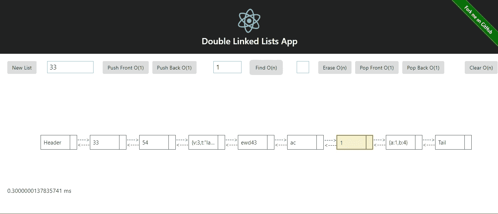
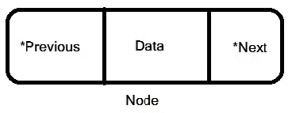

# JS 中的数据结构。第 2 部分:双向链表

> 原文：<https://itnext.io/data-structures-in-js-part-2-double-linked-lists-150facd7a90d?source=collection_archive---------4----------------------->



双链表 React App 截图

这是关于 JS 中的数据结构系列的第二部分。以下列表恢复了所有部分:

*   [第 1 部分(散列表)](/data-structures-in-js-hash-tables-app-with-react-b28b02a9e6b5)
*   [第二部分(双向链表)](https://medium.com/@alonso.oliverio/data-structures-in-js-part-2-double-linked-lists-150facd7a90d)
*   [第三部(二叉树)](https://medium.com/@alonso.oliverio/data-structures-in-js-binary-trees-react-app-5443b951a46b)

和上一篇文章一样，我将开始解释这个结构的基础。这就是节点。在这种情况下，双链接节点。

一个节点有三个数据元素:

*   **Value** :节点存储的值。使用无类型语言，JS 或其他类似 C++的模板允许这个元素是任何类型。
*   **前一个**:列表中的前一个元素。
*   **下一个**:列表中的下一个元素。



双重链接节点

很简单，对吧？让我们从列表本身开始吧。

```
class DLList { constructor(values) { this.header = new DLListNode(null, null, null); this.tail = new DLListNode(this.header, null, null); this.header.setNext(this.tail); this.elements = 0; } // Cost: O(1) erase(pos) { if (pos.assertIsValid()) { let curr = pos.current(); const prev = curr.getPrev(); const next = curr.getNext(); prev.setNext(next); next.setPrev(prev); curr = null; this.elements--; return DLListIterator[Symbol.iterator](next, this); } } // Cost: O(1) insert(pos, val) { const endVal = this.end().current(); if ( (pos.assertIsValid() || pos.current() === endVal) && this.find(val).current() === endVal ) { const curr = pos.current(); const prev = curr.getPrev(); const newNode = new DLListNode(prev, val, curr); prev.setNext(newNode); curr.setPrev(newNode); this.elements++; return DLListIterator[Symbol.iterator](newNode, this); } return DLListIterator[Symbol.iterator](null, this); } // Cost: O(n) find(item) { const iterator = this.begin(); while (iterator.current() !== this.end().current()) { if (iterator.current() !== null &&       iterator.current().getValue() === item) break; iterator.next(); } return iterator; } // Cost: O(1) end() { return DLListIterator[Symbol.iterator](this.tail, this); }... more methods
}
```

这是 G [ithub repo](https://github.com/boxgames1/double-linked-list-app) 的链接，里面有这个应用的所有工作代码。

双向链表是一个类，它聚合形成它自己的链接节点。它不允许重复值，正如您所看到的，该列表包含以下元素:

*   **Header** :列表的第一个节点，迭代器的入口点。
*   **Tail** :类似表头但在另一边的节点。拥有一些像 end()这样的具有恒定复杂度的通用方法会有所帮助。
*   **Elements** :一个简单的计数器，对列表中的当前元素进行快速廉价的检查。

头部和尾部不像普通节点那样计数，因为它们不是可擦除的。

尽管在单节点中，在双节点中，我们可以得到具有恒定复杂度的前一个，因此插入、擦除和结束方法也具有 O(1)复杂度。在这个结构中，仍然具有 O(n)复杂度的唯一方法是 find 和 clear。让我们做一个小比较:

最常见的基本方法(插入和擦除)现在具有恒定的复杂度，代价是在每个节点中添加对先前的引用。值得！现在唯一重要的部分来了:

# 什么时候以及如何使用双向链表？

正如前面指出的，这个列表不允许重复的元素，所以这是您的第一个限制。在查找存储数据时，数组通常是您考虑的第一个结构。列表以更低的成本为您提供更多的功能。在我看来，大多数 JS 开发人员丢弃(或忽略)了其他数据结构。

我开发的这个列表是建立适合你的项目的更好列表的基础。例如，如果您正在使用一个通常具有唯一 id 的关系数据库，那么您可以转换这个列表的值，将其转换为一个键值对，同时考虑到这个列表的“唯一”限制。这是一个典型的例子，你应该使用列表而不是数组，因为基类的方法复杂度是 O(1)而不是 O(n)。

在一个前端逻辑管理着大约 1000 个元素的网页中，你看不出有什么不同。但是，对于数百万条记录，您应该注意管理数据的最佳数据结构和策略。

您可以在此测试 React 应用程序:

 [## 双链表 React App @boxgames1

### 编辑描述

fathomless-river-23726.herokuapp.com](https://fathomless-river-23726.herokuapp.com/) 

Github Repo 的所有代码:

[](https://github.com/boxgames1/double-linked-list-app) [## box games 1/双向链表应用程序

### 这个应用程序展示了双向链表的行为

github.com](https://github.com/boxgames1/double-linked-list-app) 

在推特上联系我 [(@Oliver_ap)](https://twitter.com/Oliver_AP)