# Docker 中的实体框架开发环境

> 原文：<https://itnext.io/database-development-in-docker-with-entity-framework-core-95772714626f?source=collection_archive---------1----------------------->


[活动发起人](https://unsplash.com/@campaign_creators?utm_source=medium&utm_medium=referral)在 [Unsplash](https://unsplash.com?utm_source=medium&utm_medium=referral) 上的照片

我对 Docker 开发环境有点厌烦了吗？希望不会！这一次，我将展示一个非常引人注目的 Docker 用例，我认为它可以对几乎任何规模的开发团队产生立竿见影的影响。这是迄今为止我最喜欢的一张！

作为一名开发人员，在过去的 17 年里，我参与的项目多得数不清。如今，在本地下载代码通常是一件简单的事情，然后我们就可以走了。启动并运行一个本地数据库通常更麻烦。具体来说，我经常发现我需要安装特定数据库平台的特定版本，然后或者定位快照文件，运行脚本，或者让“那个家伙”来做这件事，他在过去的大约 100 年里为所有新的开始做这件事。所有这些都不理想。

使用 dev 容器和 Visual Studio 代码可以减轻所有这些痛苦，并通过一个`git clone`在本地下载数据库。

我认为使用 Docker 来配置和存储开发环境是一个非常强大的概念。这是“基础设施即代码”的下一次进化。当使用 Docker 时，我们基本上以“开发环境作为代码”结束。定义环境的代码随着 repo 一起移动，并且随着项目的增长而更新和改变。这意味着开发环境总是同步的，永远不会过时。

在这篇文章中，我将演示如何在 Docker 容器中设置数据库服务器，并用一些基本数据初始化它，以便团队中的新开发人员可以简单地`git clone`回购，并立即开始编码。*建立本地数据库没有额外的开销。*

这个例子的代码在我的 Github 上是[这里是](https://github.com/AndyWatt83/database-docker-dev-env)。

这篇文章将只关注数据库项目，但是请记住，我之前已经向[展示了如何使用. NET WebAPI](/net-development-in-docker-6509d8a5077b) 和 [Angular 前端](/angular-development-in-docker-with-dev-containers-49d2cabad445)来完成这项工作。这三者可以合并成一个完整的堆栈环境…请看这个空间。

一如既往，前提条件是:

*   [码头工人](https://docs.docker.com/get-docker/)
*   [Visual Studio 代码](https://code.visualstudio.com/download)
*   VSCode 的“[远程容器](https://marketplace.visualstudio.com/items?itemName=ms-vscode-remote.remote-containers)”扩展
*   运行 bash shell 的终端
*   如果你使用的是 Windows，[我推荐 WSL](https://docs.microsoft.com/en-us/windows/wsl/install-win10) ，尽管这不是必须的。

# 初始设置


照片由[克莱门斯范雷](https://unsplash.com/@clemensvanlay?utm_source=medium&utm_medium=referral)在 [Unsplash](https://unsplash.com?utm_source=medium&utm_medium=referral)

让我们从一个空目录开始。打开你的终端

```
mkdir database-docker-dev-env; \
cd database-docker-dev-env; \
code .
```

这将在空目录中打开 VSCode。VSCode 会在左下角告诉你它在哪个环境下运行。这有助于跟踪你的位置。此时，我们仍然在主机上，而不是在 docker 环境中。在我的情况下，这是 WSL。

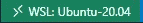

上面给了我们一个空文件夹——完全空白的画布。您可以通过按 F1 键并浏览菜单来自动设置这些开发容器，但这次我将使用一个相当定制的设置，所以我将手动设置。

这个解决方案需要两个 Docker 容器。

*   开发环境将在一个容器中运行，包含所有常见的开发依赖项，如 dotnet、vim 等。
*   另一个是数据库服务器。在这个例子中，我们将运行 Postgres。

我将使用 Docker Compose 进行编排。将以下内容复制/粘贴到终端中，以设置文件夹和所需文件。

```
mkdir docker; \
cd docker; \
mkdir database; \
mkdir dev-env; \
touch docker-compose.yaml; \
cd dev-env; \
touch Dockerfile; \
cd ..; \
cd database; \
touch database.env;
```

文件夹应该如下所示:

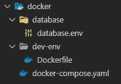

# Docker 设置


照片由[伊恩·泰勒](https://unsplash.com/@carrier_lost?utm_source=medium&utm_medium=referral)在 [Unsplash](https://unsplash.com?utm_source=medium&utm_medium=referral) 上拍摄

首先，我将演示如何配置所有 docker 的东西。

## 开发环境容器

让我们从构建开发环境容器开始。这将基于微软提供的标准 C#容器，通过一些扩展允许我们在容器中使用实体框架核心。

```
# [Choice] .NET version: 6.0, 5.0, 3.1, 6.0-bullseye, 5.0-bullseye, 3.1-bullseye, 6.0-focal, 5.0-focal, 3.1-focalARG VARIANT="6.0-focal"FROM mcr.microsoft.com/vscode/devcontainers/dotnet:0-${VARIANT}# [Choice] Node.js version: none, lts/*, 16, 14, 12, 10
ARG NODE_VERSION="none"RUN if [ "${NODE_VERSION}" != "none" ]; then su vscode -c "umask 0002 && . /usr/local/share/nvm/nvm.sh && nvm install ${NODE_VERSION} 2>&1"; fi# [Optional] Uncomment this section to install additional OS packages.
RUN apt-get update && export DEBIAN_FRONTEND=noninteractive \
&& apt-get -y install --no-install-recommends vimRUN dotnet tool install -g dotnet-ef
ENV PATH $PATH:/root/.dotnet/tools
```

上述 Dockerfile 文件是:

*   继承。基础映像中的 NET Core 6
*   安装 Vim(只是因为我喜欢它)
*   安装实体框架核心 cli 工具
*   将 cli 工具添加到 path 变量

这个例子就是这样。这将允许我们创建一个实体框架项目，并使用实体框架 cli 工具与数据库服务器进行交互。

## 数据库容器

我将使用 Postgres Docker 映像，因此不需要为数据库容器编写定制的 Docker 文件。我把这个部分[建立在翟立](https://zhao-li.medium.com/getting-started-with-postgresql-using-docker-compose-34d6b808c47c)[的这篇优秀文章](https://zhao-li.medium.com/)的基础上。需要一些配置，所以进入`database.env`并添加以下配置

```
POSTGRES_USER=docker_user
POSTGRES_PASSWORD=password
POSTGRES_DB=blog_database
```

## Docker 撰写

最后，通过将 docker 设置与 docker 合成文件绑定在一起，docker 设置就完成了。应该是这样的:

这实际上只是旋转一个 Postgres 容器并传入 env 变量。我还将数据库数据保存在一个名为`blog-database-data`的卷中。

对于`dev-env`容器，所有这些都是基于我们上面配置的映像旋转容器。

## 测试一下

在这一点上，我们可以启动它，看看它是否工作。在终端中，键入:

```
cd .. \
docker compose up
```

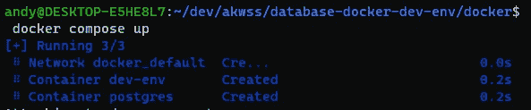

让我们首先确保 Docker 容器中的所有东西都是应有的。看看`dev-env`集装箱的内部

```
docker exec -it dev-env /bin/bash
```

当在容器中时，你可以说服自己`dotnet`和`dotnet-ef`安装正确:

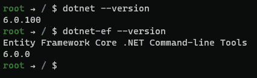

使用`exit`从开发者环境容器中出来，看看 Postgres 容器:

```
docker exec -it postgres /bin/bash
```

同样的——说服自己 postgres 已经安装并且可用

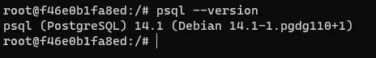

看起来不错！您现在可以`exit`Postgres 容器，并通过以下方式将所有容器拆除:

```
docker compose down
```

## VSCode 中的开发容器


[特雷弗·瓦诺伊](https://unsplash.com/@tvannoy?utm_source=medium&utm_medium=referral)在 [Unsplash](https://unsplash.com?utm_source=medium&utm_medium=referral) 上的照片

接下来，我们将配置 VSCode。回到终端并粘贴到(项目根文件夹中):

```
mkdir .devcontainer; \
cd .devcontainer; \
touch devcontainer.json;
```

在`.devcontainer.json`中粘贴以下内容:

这就是 Docker 设置的全部内容。所以在 VSCode 中按 F1，选择 rebuild 并在容器中重新打开。

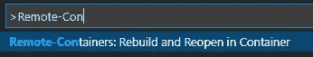

第一次会花一些时间，但在随后的创业中会快得多。加载完成后，您可以看到 VSCode 窗口的底部显示我们处于 Docker 环境中。


如果您在 VSCode 中打开一个终端，您将看到它已经在我们配置的环境容器中打开。

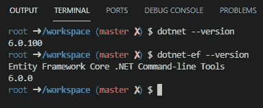

至此，所有的 Docker 工作都完成了。这篇文章的其余部分只是给出一个使用实体框架核心的例子来说明这一点。

# 实体框架示例


照片由[达科塔·鲁斯](https://unsplash.com/@dakotaroosphotography?utm_source=medium&utm_medium=referral)在 [Unsplash](https://unsplash.com?utm_source=medium&utm_medium=referral) 拍摄

我们已经完成了 Docker 方面的工作，但是我将继续使用实体框架构建一个小示例，并展示与 Postgres 实例的交互。我将使用 VSCode 中的**终端添加一个新的。NET 项目，并安装实体框架所需的包。**

```
dotnet new classlib --name Blog.Database; \
cd Blog.Database; \
dotnet add package Microsoft.EntityFrameworkCore; \
dotnet add package Microsoft.EntityFrameworkCore.Design; \
dotnet add package Microsoft.EntityFrameworkCore.Analyzers; \
dotnet add package Microsoft.EntityFrameworkCore.Relational; \
dotnet add package Npgsql.EntityFrameworkCore.PostgreSQL; \
touch BlogDbContext.cs; \
touch BlogPost.cs; \
rm Class1.cs; 
```

现在，让我们通过将以下代码粘贴到`BlogDbContext.cs`和`BlogPost.cs`来建立一个真正简单的代码优先数据库示例

回到 VSCode 上的终端，输入以下内容。

```
dotnet-ef migrations add initial; \
dotnet-ef database update;
```

上面的代码将测试数据发送到运行在另一个 Docker 容器中的 Postgres 数据库。我们当然可以证明这一点！

注意，在 Docker 环境中有一个限制，那就是我们不能访问其他 Docker 容器。这只能在主机上实现，因此您需要使用 VSCode 中的终端以外的终端。如果您在 VSCode 终端中尝试，您将看到 docker 不可用。

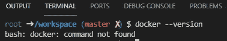

回到您的终端(不是 VSCode 中的那个！)

```
docker exec -it postgres /bin/bash
```

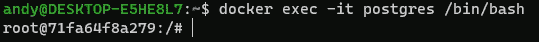

这将带您进入运行 Postgres 的 Docker 容器。然后键入:

```
psql --host=database --username=docker_user --dbname=blog_database
```

出现提示时输入密码。(提示——是`password`)

请注意，该信息与我们不久前设置的`database.env`中的细节相匹配。接下来，检查并确保已经创建了表:

```
\d
```

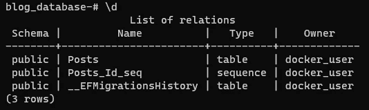

看起来不错！我们还可以证明测试数据已经完成了:

```
select * from "Posts";
```

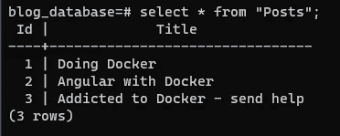

我认为这是一个很好的总结的地方。

现在，任何人都可以简单地拉动这个回购，旋转它，并开始使用应用程序，而不必考虑如何设置数据库。

我在这个例子中使用了 Postgres，但是完全相同的原理也适用于可以在 Docker 容器中运行的任何其他数据库平台。我认为这是一个非常令人信服的 dev 容器用例，但是和以前一样，我非常想在评论中听到人们的意见！让我知道你的想法，感谢你的阅读！


Joshua Hoehne 在 [Unsplash](https://unsplash.com?utm_source=medium&utm_medium=referral) 上拍摄的照片