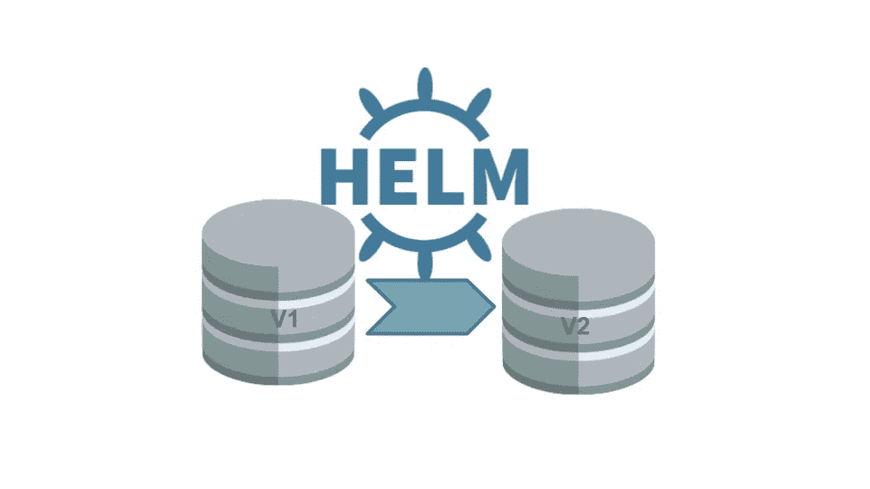

# 使用 Helm hooks 在 Kubernetes 上进行数据库迁移

> 原文：<https://itnext.io/database-migrations-on-kubernetes-using-helm-hooks-fb80c0d97805?source=collection_archive---------0----------------------->

> TL；DR:在应用程序安装或更新之前，您可以利用`pre-install`和`pre-upgrade` Helm 钩子来运行数据库迁移。继续阅读，了解为什么简单的解决方案可能不是好主意，以及使用头盔挂钩时的几个问题。



如果您的应用程序使用关系数据库，您的模式将随着时间的推移而发展。在部署应用程序的新版本之前，您必须确保数据库模式是最新的。本文不是关于如何生成和管理模式迁移(有多种工具可以处理)，而是如何将它们作为 Kubernetes 上应用程序部署过程的一部分。

# 在应用程序中运行迁移

您可以决定在服务启动时自动运行迁移。这似乎是个好主意:它保证了在应用迁移之前您的服务不会启动，并且消除了在过时的模式上运行应用程序的风险。
但是在 Kubernetes 上运行时，这就带来了几个问题:

*   每次创建或重新启动新的 pod 时，它都会尝试再次运行迁移。如果您的迁移脚本编写正确，这应该不是问题，但这不是一个干净的设计。
*   如果迁移需要一段时间(想象一下在一个巨大的表上添加一列)，那么您的 pod 可能会错过准备就绪检查，并在迁移完成之前被终止。您可以增加 pod 准备就绪检查的初始延迟，但是这样一来，就很难了解 pod 没有启动是因为它正在应用数据库迁移还是因为其他问题。
*   根据您的部署的中断预算(在部署期间的任何时间点可以添加/删除多少个单元)，您可能会同时运行两个相同的迁移，从而导致冲突和错误。

# 使用初始化容器

[初始化容器](https://kubernetes.io/docs/concepts/workloads/pods/init-containers/)是在你的容器中的常规容器启动之前运行完成的容器。这对于在应用程序启动之前执行任何必需的设置(例如下载一些机密或配置文件)非常有用。使用 init 容器来运行数据库迁移似乎是一个好主意，但是在应用程序启动期间，我们将面临与运行它们相同的问题:

*   如果同时创建多个 pod，则可以同时运行多个 init 容器
*   init 容器将在每次创建新的 pod 时运行

# 使用舵钩作为作业运行

## Kubernetes 乔布斯

首先，我们来看看 Kubernetes 的乔布斯。作业允许我们运行一个或多个 pod 来完成。与部署或复制集中的 pod 相反，K8s 会在 pod 终止时重新创建 pod 以保持所请求的 pod 数量运行，作业中的 pod 在退出时不会重新创建(除非它们失败并且作业被配置为在失败时重新启动)。
这对于运行只需要运行一次就能完成的任务来说非常棒，而运行数据库迁移对于他们来说是一个完美的用例。

现在的挑战是在部署新版本的应用程序之前自动运行作业。

## 头盔释放生命周期

[Helm](https://helm.sh/) 允许您将应用程序定义的所有 K8s 清单打包到一个*图表*中，以便一次性部署它们，并使用模板定制每个部署(例如，允许在多个环境中使用不同的参数部署同一个图表)。

Helm 还提供了[钩子](https://helm.sh/docs/topics/charts_hooks/)来决定在部署期间何时创建资源。我们可以利用它在创建/更新任何资源之前运行迁移作业。

我们的迁移工作看起来是这样的:

```
**apiVersion**: batch/v1
**kind**: Job
**metadata**:
  **name**: "{{ .Release.Name }}"
  **labels**:
  **annotations**:
    **"helm.sh/hook":** pre-install,pre-upgrade
    **"helm.sh/hook-weight":** "-1"
    **"helm.sh/hook-delete-policy":** hook-succeeded
**spec**:
  **template**:
    **metadata**:
      **name**: "{{ .Release.Name }}"
    **spec**:
      **restartPolicy**: Never
      **containers**:
      - **name**: db-migrations // we will have to build a dedicated
                            // docker image to run the migrations
        **image**: "database-migrations"
```

挂钩是使用注释配置的:

*   `**"helm.sh/hook":** pre-install,pre-upgrade`告诉 helm 在安装和升级应用程序之前运行此作业。
*   `**"helm.sh/hook-weight":** "-1"`用于定义 helm 应该以何种顺序创建实现相同钩子的资源。
*   `**"helm.sh/hook-delete-policy":** hook-succeeded`告诉 helm 在作业成功后删除它。

剩下的工作是一个常规的 pod 模板。

# 逮到你了

## 头盔挂钩抓到你了

您的迁移作业很可能需要一些配置和/或机密才能运行(至少需要数据库服务器地址和凭证)，但是该作业将在图表中的所有其他资源之前创建。

这意味着我们的作业将无法挂载图表创建的`configmap`。我们需要创建一个实现相同钩子的`configmap`。这里有一个`configmap`的例子:

```
**apiVersion**: v1
**kind**: ConfigMap
**metadata**:
  **name**: db-migrations
**annotations**:
    **"helm.sh/hook":** pre-install,pre-upgrade
    **"helm.sh/hook-weight":** "-10" // we use a smaller weight so it's
                                 // created before the job    
    **"helm.sh/hook-delete-policy":** hook-succeeded
**data**:
  DB_ADDR: {{ .Values.db.addr }}
  DB_NAME: {{ .Values.db.name }}
```

## 部署策略和回滚

默认情况下，Kubernetes 在更新部署时应用滚动更新策略。这意味着在部署过程中，会有 pods 同时运行应用程序的旧版本和新版本。**这将要求所有迁移至少向后兼容**以前的版本。

如果您需要使用`helm rollback`命令回滚到应用程序的先前版本，那么您正在重新部署的版本的迁移作业将再次运行。在回滚期间尝试将*向下*迁移到模式的先前版本可能会导致现有的 pod 失败。最后，如果您必须回滚到一个更旧的版本，您需要确保当前模式与您计划回滚到的版本向后兼容。