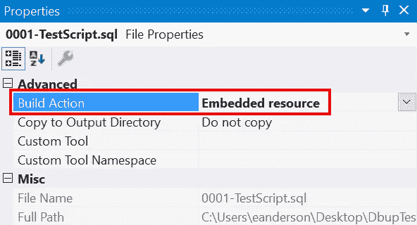
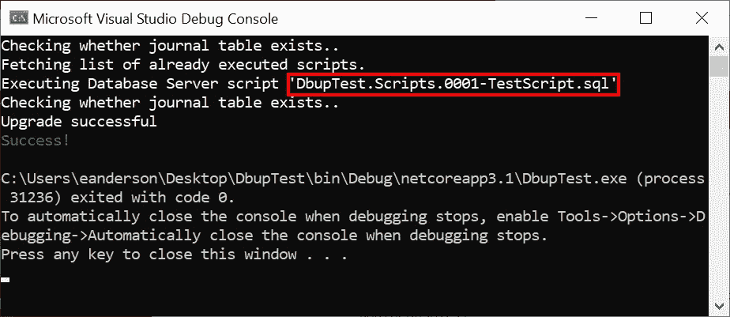

# 使用 DbUp 进行数据库迁移

> 原文：<https://itnext.io/database-migrations-with-dbup-ca57aa2b3a68?source=collection_archive---------3----------------------->

管理数据库模式可能是一个具有挑战性的问题。这也是一个没有放之四海而皆准的解决方案的领域(不确定是否真的适用于任何事情)。解决方案包括从手动脚本管理、特定于数据库供应商的选项(例如用于 Microsoft SQL Server 的 [DACPAC)到迁移。这篇文章将着眼于使用](https://docs.microsoft.com/en-us/sql/relational-databases/data-tier-applications/data-tier-applications) [DbUp](https://github.com/DbUp/DbUp) 的基于迁移的方法的选择之一。


## 样本数据库

我需要一个样本数据库，所以我找到了我的一个帖子，让[获得一个样本 SQL Server 数据库](https://elanderson.net/2018/09/getting-a-sample-sql-server-database/)，引导我下载并恢复微软的 WideWorldImporters 样本数据库。

## DbUp 控制台应用

DbUp 有多种使用方式，在这个例子中，我们将从. NET 核心控制台应用程序中使用它。从终端使用以下命令在您希望应用程序所在的目录中创建新的控制台应用程序。

```
dotnet new console
```

现在，我们可以使用下面的命令将 DbUp NuGet 包添加到示例项目中。在这种情况下，我们使用的是 SQL Server 包，但是有很多针对数据库提供者的包，所以请安装适合您的包。

```
dotnet add package dbup-sqlserver
```

接下来，在 Visual Studio 中打开项目(或任何编辑器，但在 Visual Studio 中设置此示例更容易)。在**程序**类中，用以下代码替换所有代码。我们将在下面看到一些代码。

```
using System;
using System.Linq;
using System.Reflection;
using DbUp;

namespace DbupTest
{
    class Program
    {
        static int Main(string[] args)
        {
            var connectionString =
                args.FirstOrDefault()
                ?? "Server=localhost; Database=WideWorldImporters; Trusted_connection=true";

            var upgrader =
                DeployChanges.To
                             .SqlDatabase(connectionString)
                             .WithScriptsEmbeddedInAssembly(Assembly.GetExecutingAssembly())
                             .LogToConsole()
                             .Build();

            var result = upgrader.PerformUpgrade();

            if (!result.Successful)
            {
                Console.ForegroundColor = ConsoleColor.Red;
                Console.WriteLine(result.Error);
                Console.ResetColor();
#if DEBUG
                Console.ReadLine();
#endif                
                return -1;
            }

            Console.ForegroundColor = ConsoleColor.Green;
            Console.WriteLine("Success!");
            Console.ResetColor();

            return 0;
        }
    }
}
```

下面的代码试图将 SQL Server 的连接字符串从终端传递给应用程序的第一个参数中提取出来，如果没有参数传入，则返回硬编码的值。这对我们的示例非常有用，但是我建议不要在生产中使用后备值。当您认为您的迁移已经成功运行，但是由于回退值而在错误的数据库上运行时，这总是糟糕的一天。

```
var connectionString = 
    args.FirstOrDefault() 
    ?? "Server=localhost; Database=WideWorldImporters; Trusted_connection=true";
```

下一部分是所有设置的地方，包括部署到哪个数据库，在哪里找到要运行的脚本，以及在哪里记录日志。DbUp 在这方面提供了很多选项，我建议查看更多信息部分下的[文档](https://dbup.readthedocs.io/en/latest/)以了解详细信息。

```
var upgrader =
    DeployChanges.To
                 .SqlDatabase(connectionString)
                 .WithScriptsEmbeddedInAssembly(Assembly.GetExecutingAssembly())
                 .LogToConsole()
                 .Build();
```

最后，下面是针对数据库实际执行脚本的地方。

```
var result = upgrader.PerformUpgrade();
```

该函数的其余部分处理向控制台显示脚本运行的结果。

## 添加脚本

请记住，我们使用的是嵌入式脚本选项，因此 DbUp 将查找所有以'结尾的嵌入式文件。sql。我在项目中添加了一个脚本目录，这样脚本就不会弄乱项目的根目录，但这不是必需的。不要以为文件的命名方式会控制脚本的执行顺序，所以要确保预先建立一个好的命名约定。对于我们的示例，我在脚本目录中添加了一个名为 **0001-TestScript.sql** 的文件。由于我们使用的是嵌入式脚本提供程序，所以在添加文件后，我们转到其属性并将**构建动作**设置为**嵌入式资源**是**的关键**。



在这种情况下，脚本文件本身除了选择一个值之外不做任何事情。

## 尝试一下

此时，我们可以在 Visual Studio 中点击 Run，它将执行我们的新脚本。输出如下所示。



如果我们再次运行应用程序，它会告诉我们不需要执行新的脚本。与我遇到的所有基于迁移的解决方案一样，DbUp 使用数据库中的一个表来记录已经运行的迁移。DbUp 的默认表是 **SchemaVersion** ，它由 Id、ScriptName 和 Applied 列组成。给定这种结构，重要的是要记住，如果您重命名已经在数据库上执行的脚本，DbUp 会将其视为不同的脚本，并再次执行它。

## 包扎

在 DbUp 的文档中有一个哲学部分，其中一点是数据库是一组转换的结果，而不仅仅是它的新状态与旧状态的对比。这一点是我为什么喜欢基于迁移的方法的关键。

查看 DbUp [文档](https://dbup.readthedocs.io/en/latest/)和 GitHub [repo](https://github.com/DbUp/DbUp) 了解更多信息。

*最初发表于* [*埃里克·安德森*](https://elanderson.net/2020/08/database-migrations-with-dbup/) *。*