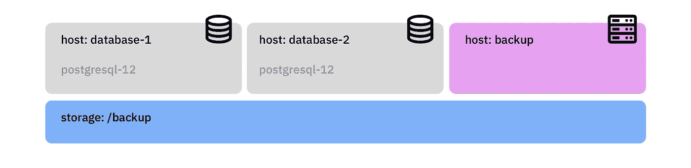
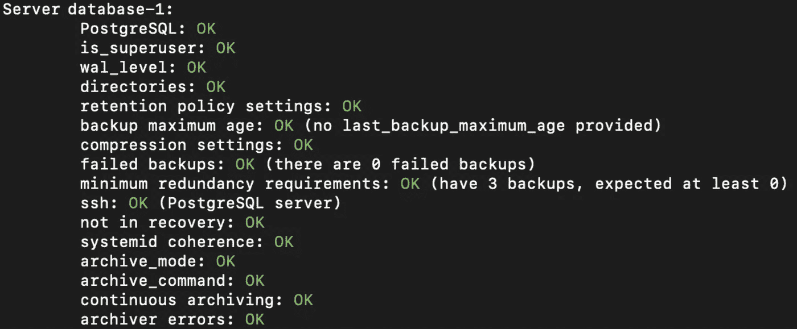
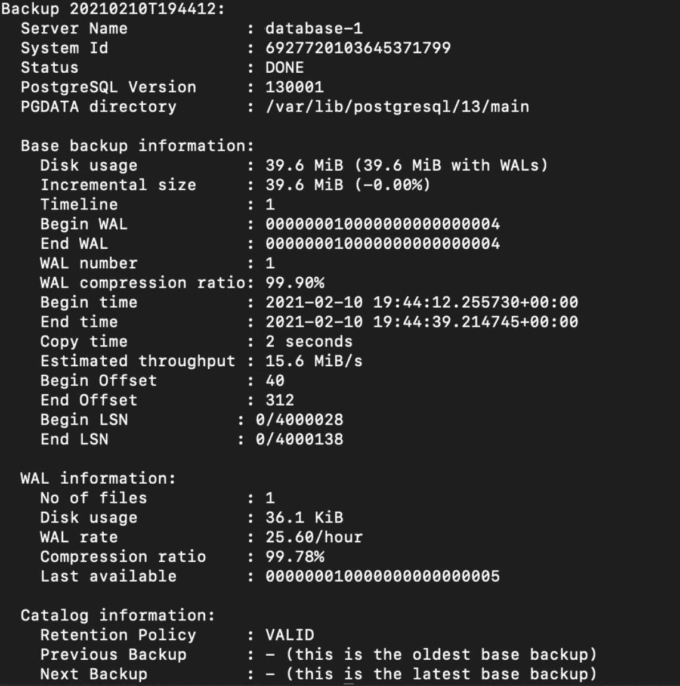
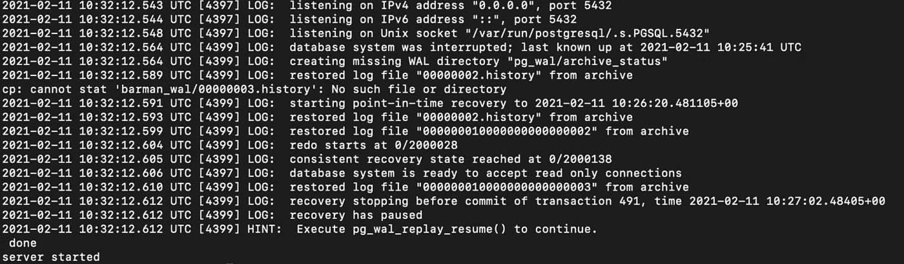
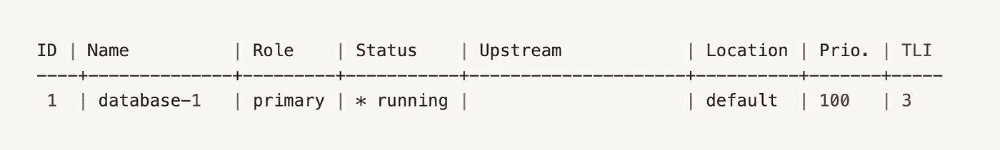
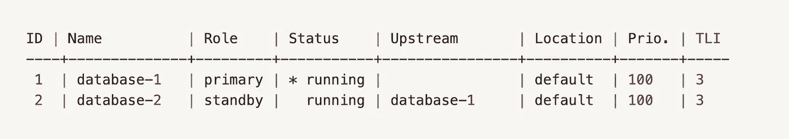
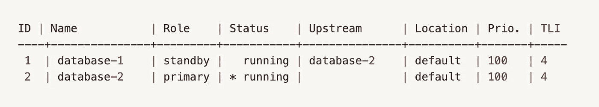
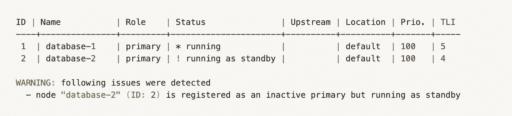

# PostgreSQL 12 数据库卓越运营

> 原文：<https://itnext.io/database-operational-excellence-with-postgresql-12-3e7b74737495?source=collection_archive---------4----------------------->

## 使用 Ubuntu 20.10 上的备份和恢复、复制和切换来掌握 PostgreSQL-12 数据库集群的 end-2-end 说明


PostgreSQL 号称*“世界上最先进的开源数据库”*理由非常充分。它的核心技术能力、性能和操作选项在所有商业巨头中首屈一指，非常适合需要存储和管理数据的初创企业或成熟企业。

本文从安装、配置、通过 [barman 2.11](https://www.pgbarman.org/) 进行备份和恢复、在 [Ubuntu 20.10](https://releases.ubuntu.com/20.10/) 上使用 [repmgr 5.0.0](https://repmgr.org/) 进行复制&切换等方面对这款出色的数据库产品提供了一个非常全面的视角。然而，本文关注的是“把事情做好”，所以它关注的是相关的步骤&命令，而不是背景和详细的解释。走吧，我们有很多要谈的！

# 介绍

我们将使用三台物理或虚拟机，`database-1`、`database-2`和一台`backup`机器，每台机器都运行在 ubuntu 20.10 上，并连接到安装在`/backup`上的附加存储



高层基础架构

# 装置

## 初始基础设施设置

确保在每台机器上都正确配置了 DNS 本教程不会引用任何 IP，而只会引用主机名。

## Postgres 安装

*   安装几个好友`sudo apt -y install vim bash-completion wget joe`
*   现在更新您的 apt 包定义`apt-get update`
*   安装 postgresql 12 `apt install postgresql`
*   安装酒保 cli `apt install barman-cli`
*   检查运行服务的状态`systemctl status postgresql.service`
*   检查 postgres 连接`su - postgres`
*   给 postgres 用户一个更强的密码`psql -c "alter user postgres with password 'MyStrongAdminP@ssw0rd'"`
*   在操作系统级别执行相同的操作(使用相同的密码)。作为根用户执行`passwd postgres`
*   之后重启机器
*   对机器重复这些步骤:`database-2`
*   在两台数据库服务器上，以用户`postgres`的身份，创建文件`~/.bash_rc`并添加以下内容

```
PATH=$PATH:/usr/lib/postgresql/12/bin
alias l='ls -al --color=auto'
```

*   也将这些行添加到您的`root`用户到两台服务器上的`~/.bashrc`

## Postgres 配置

*   这样配置`/etc/postgresql/12/main/postgresql.conf`:

```
# listen to any device and IP the machine has
listen_addresses = '*'# turn archive mode on and configure barman rsync archiving of WAL
archive_mode = on
archive_command = 'rsync -a %p barman@backup:/backup/barman/database-1/incoming/%f'
wal_level = replica# comment out the include_dir as this will prevent the server to startup during recovery
# include_dir = 'conf.d'
```

*   编辑`/etc/postgres/12/main/pg_hba.conf`并添加以下几行(这已经包括我们稍后为 repmgr 需要的复制配置)

```
host all all <your-c-net> trust
host repmgr repmgr <your-c-net> trust
host replication repmgr <your-c-net> trust
```

*   此时，创建您想要的任何初始数据库结构

## PostgreSQL 资源

[](https://www.digitalocean.com/community/tutorials/how-to-install-and-use-postgresql-on-ubuntu-20-04) [## 如何在 Ubuntu 20.04 | DigitalOcean 上安装和使用 PostgreSQL

### 关系数据库管理系统是许多网站和应用程序的关键组件。他们提供了…

www.digitalocean.com](https://www.digitalocean.com/community/tutorials/how-to-install-and-use-postgresql-on-ubuntu-20-04) 

# 通过酒保设置备份和恢复

*   在 ubuntu 20.10 上启动您的全新备份服务器
*   在`backup`上安装酒吧招待`apt-get install barman barman-cli`
*   分别在
    `database-1`和`backup`为 postgres 和 barman 用户创建私钥
*   在`database-1`上，切换到 postgres 用户`su - postgres`并生成一个密钥对:`ssh-keygen -b 2048 -t rsa -N "" -C "postgres@database-1"`
*   在`database-2`上，切换到 postgres 用户`su - postgres`并生成一个密钥对:`ssh-keygen -b 2048 -t rsa -N "" -C "postgres@database-2"`
*   在`backup`上，切换到酒保用户`su - barman`并创建一个密钥对:`ssh-keygen -b 2048 -t rsa -N "" -C "barman@backup"`
*   将 postgres 和 barman 的公钥分别附加到
    `~/.ssh/authorized_keys`

```
on database-1 as postgres : cat <database-2.server id_rsa.pub> >> ./ssh/authorized_keys
on database-1 as postgres : cat <backup.server id_rsa.pub> >> ./ssh/authorized_keyson database-2 as postgres : cat <database-1.server id_rsa.pub> >> ./ssh/authorized_keys
on database-2 as postgres : cat <backup.server id_rsa.pub> >> ./ssh/authorized_keyson backup as postgres : cat <database-1.server id_rsa.pub> >> ./ssh/authorized_keys
on backup as postgres : cat <database-2.server id_rsa.pub> >> ./ssh/authorized_keys
```

*   在每台机器上，使用各自的用户名和完整主机名连接到其他机器:

```
from database-1 as postgres user : ssh barman@backup
from database-1 as postgres user : ssh postgres@database-2from database-2 as postgres user : ssh barman@backup
from database-2 as postgres user : ssh postgres@database-1from backup as barman user : ssh postgres@database-1
from backup as barman user : ssh postgres@database-2this will add the respective hosts to the known_hosts file, which is necessary to make barman function properly
```

*   在`backup`上将文件`/etc/barman.conf`移动到`/etc/barman.conf.orig`并用以下内容重新创建:

```
[barman]
barman_home = /backup/barman
barman_user = barman
log_file = /backup/barman/barman.log
compression = gzip
reuse_backup = link
backup_method = rsync
archiver = on
immediate_checkpoint = true
basebackup_retry_times = 3
basebackup_retry_sleep = 30
last_backup_maximum_age = 1 DAYS[database-1]
description = "database-1"
ssh_command = ssh postgres@database-1
conninfo = host=database-1 user=postgres port=5432
retention_policy_mode = auto
retention_policy = RECOVERY WINDOW OF 7 days
wal_retention_policy = main
backup_options = exclusive_backup[database-2]
description = "database-2"
ssh_command = ssh postgres@database-2
conninfo = host=database-2 user=postgres port=5432
retention_policy_mode = auto
retention_policy = RECOVERY WINDOW OF 7 days
wal_retention_policy = main
backup_options = exclusive_backup
```

*   设置 WAL 传入—在`backup`上用`barman show-server database-1 | grep incoming_wals_directory`获取该目录:应该是`incoming_wals_directory: /backup/barman/database-1/incoming`
*   确保该路径与`archive_command`中的 postgresql.conf 相同
*   列出所有可用的备份服务器:`barman list-server`
*   检查 WAL 存档和我们服务器的所有其他部分:`barman check database-1`



*   用
    和`barman switch-wal --force --archive database-1`测试 WAL 存档
*   如果你看到这一行`WAL archive: FAILED (please make sure WAL shipping is setup)`:可能数据库还没有产生任何 WAL 文件，或者它们已经被删除，或者 rsync 失败。查看 PostgreSQL 日志以了解更多信息。但是如果 rsync 工作正常，基本上如果没有数据写入数据库，服务器就不会产生任何 WAL 文件，因此没有什么需要备份的。WAL 文件是在产生一定量的数据后创建的。我建议你创建一个表格，并插入一些数据。您可以使用`barman switch-wal --force --archive database-1`强制关闭当前 WAL 文件
*   建立基地备份:`barman backup database-1`
*   列出单台服务器的所有现有备份`barman list-backup database-1`

```
barman@backup:~$ barman list-backup database-1database-1 20210209T115342 - Tue Feb  9 11:53:45 2021 - Size: 70.7 MiB - WAL Size: 0 B
database-1 20210209T114450 - Tue Feb  9 11:44:53 2021 - Size: 70.7 MiB - WAL Size: 32.3 KiB
database-1 20210209T114054 - Tue Feb  9 11:40:58 2021 - Size: 70.7 MiB - WAL Size: 32.2 KiB
```

*   使用`barman show-backup server-a 20210209T115342`从特定备份中获取更多详细信息
*   使用 cron 计划备份:
*   `barman cron`每分钟(在服务器的基础上同时执行 WAL 归档操作，这也在那些服务器上强制执行保留策略)
*   每天午夜执行数据库备份

```
*  *    * * *   barman  /usr/bin/barman cron
0  0    * * *   barman  /usr/bin/barman backup database-1
```

*   删除`backup`上的`/etc/cron.d`

## 酒保资源

[](https://www.digitalocean.com/community/tutorials/how-to-back-up-restore-and-migrate-postgresql-databases-with-barman-on-centos-7) [## 如何在 CentOS 7 | DigitalOcean 上使用 Barman 备份、恢复和迁移 PostgreSQL 数据库

### PostgreSQL 是一个开源数据库平台，因其易用性而受到 web 和移动应用程序开发人员的欢迎

www.digitalocean.com](https://www.digitalocean.com/community/tutorials/how-to-back-up-restore-and-migrate-postgresql-databases-with-barman-on-centos-7) [](https://stackoverflow.com/questions/51472352/postgresql-how-to-take-incremental-backup-with-barman/51552776) [## Postgresql:如何用 Barman 进行增量备份

### 我后来发现这个伟大的教程解释了一步一步的过程。这是迄今为止最有帮助的一个。我是…

stackoverflow.com](https://stackoverflow.com/questions/51472352/postgresql-how-to-take-incremental-backup-with-barman/51552776) 

## 有用的酒保命令

`barman check database-1` -检查特定服务器的酒保配置
`barman status database-1` -显示特定服务器的状态
`barman backup database-1` -为特定服务器创建备份
`barman backup --reuse=link main` -强制增量备份
`barman list-backup database-1` -列出特定服务器上所有可用的备份
`barman show-backup database-1 <timestamp>` -显示备份内容
`barman show-backup database-1 latest` -显示最新可用的备份

# 灾难后恢复备份

*   连接到您的数据库模式`database-1`并删除一些数据、表格或数据库来模拟灾难
*   关闭`database-1` :
    `systemctl stop postgresql.service`上的目标 postgres 服务器
*   在`backup`作为用户`barman`检查最新的酒保备份`barman show-backup database-1 latest`



*   记下备份 ID 和备份结束时间
*   仍然在`backup`上，以用户`postgres`的身份运行以下命令来恢复该备份

```
barman recover \\
  --target-time "2021-02-10 19:44:39.214745+00:00" \\
  --remote-ssh-command "ssh postgres@database-1" \\
  database-1 20210210T194412 /var/lib/postgresql/12/main
```

*   预计备份结束时会显示消息:**您的 PostgreSQL 服务器已成功准备好进行恢复！**
*   作为`postgres`用户，在`database-1`上以恢复模式启动 postgres

```
# start postgresql manually to initiate the recovery
/usr/lib/postgresql/12/bin/pg_ctl -D /var/lib/postgresql/12/main start
```



*   重启第二个数据库框`database-2`
*   您从备份中还原了数据库服务器

# Postgres 群集硬重置

如果数据库备份无法恢复、损坏，并且我们必须在不重新安装数据库容器的情况下硬重置 pg 集群，请使用此过程。**注意！！！这将删除你所有的数据**

```
# list all existing pg clusters in the system
pg_lsclusters # drop the cluster (based on version and custer identifier)
pg_dropcluster 12 main# recreate the cluster
pg_createcluster 12 main
```

*   现在按照上面的过程配置`/etc/postgres/...`中的 PostgresQL 集群，因为所有最后的配置都被删除了
*   如果 Postgres 服务器在恢复后没有启动，请使用以下命令获取详细的启动日志

```
/usr/lib/postgresql/12/bin/postgres -d 3 -D /var/lib/postgresql/12/main/ -c config_file=/etc/postgresql/13/main/postgresql.conf
```

# 安装和配置代表经理

我们将使用 repmgr 来配置 postgres 节点`database-1`和`database-2`之间的复制

*   在两个数据库机器上，安装 repmgr `apt-get install postgresql-12-repmgr`
*   在`database-1`(我们的主节点)上，创建一个 repmgr 用户和数据库，作为`postgres`用户执行:`createuser --superuser repmgr` `createdb --owner=repmgr repmgr`
*   更改 repmgr 用户的默认搜索路径:
    `psql -c "ALTER USER repmgr SET search_path TO repmgr, public;"`
*   编辑`/etc/postgresql/12/main/postgresql.conf`并添加下面一行`shared_preload_libraries = 'repmgr'`这将在 PostgreSQL 启动时加载 repmgr 扩展。
*   在`database-1`上创建 repmgr 默认配置文件`touch /etc/repmgr.conf`并添加以下内容:

```
node_id=1
node_name=database-1
conninfo='host=database-1 user=repmgr dbname=repmgr port=5432'
data_directory='/var/lib/postgresql/12/main'
barman_host=backup
barman_server=database-1
restore_command='/usr/bin/barman-wal-restore -U barman backup database-1 %f %p'
pg_bindir='/usr/lib/postgresql/12/bin'
log_file='/backup/barman/repmgr.log'
```

*   在`database-1`上，编辑`/etc/default/repmgrd`并应用以下内容:

```
# disable repmgrd by default so it won't get started upon installation
# valid values: yes/no
REPMGRD_ENABLED=yes# configuration file (required)
REPMGRD_CONF=/etc/repmgr.conf# additional options
#REPMGRD_OPTS=""# user to run repmgrd as
#REPMGRD_USER=postgres# repmgrd binary
#REPMGRD_BIN=/usr/bin/repmgrd# pid file
#REPMGRD_PIDFILE=/var/run/repmgrd.pid
```

*   在`database-2`上创建 repmgr 默认配置文件`touch /etc/repmgr.conf`并添加以下内容:

```
node_id=2
node_name=database-2
conninfo='host=database-2 user=repmgr dbname=repmgr port=5432 connect_timeout=2'
data_directory='/var/lib/postgresql/12/main'
log_file='/backup/barman/repmgr.log'
```

*   在`database-2`上，编辑`/etc/default/repmgrd`并应用以下内容:

```
# disable repmgrd by default so it won't get started upon installation
# valid values: yes/no
REPMGRD_ENABLED=yes# configuration file (required)
REPMGRD_CONF="/etc/repmgr.conf"# additional options
#REPMGRD_OPTS=""# user to run repmgrd as
#REPMGRD_USER=postgres# repmgrd binary
#REPMGRD_BIN=/usr/bin/repmgrd# pid file
#REPMGRD_PIDFILE=/var/run/repmgrd.pid
```

*   为了让复制工作，`database-1`需要接受来自`database-2`的复制连接。副本正在请求复制信息，而不是相反。在`/etc/postgresql/12/main/pg_hba.conf`中的`database-1`上，确保存在以下配置(您应该已经有了)

```
host all all <your-c-net> trust
host repmgr repmgr <your-c-net>trust
host replication repmgr <your-c-net> trust
```

*   作为`database-1`上的`postgres`用户，向 repmgr `/usr/bin/repmgr -f /etc/repmgr.conf primary register`注册主节点`database-1`

```
INFO: connecting to primary database...
NOTICE: attempting to install extension "repmgr"
NOTICE: "repmgr" extension successfully installed
NOTICE: primary node record (ID: 1) registered
```

*   检查组合仪表的状态`/usr/bin/repmgr -f /etc/repmgr.conf cluster show`



*   从`root`开始在`database-1`重复运行:`/etc/init.d/repmgrd start`
*   设置第二个节点，切换到`database-2`并停止 postgresql `/etc/init.d/postgresql stop`
*   作为用户执行`postgres` : `/usr/bin/repmgr -h database-1 -U repmgr -d repmgr -p 5432 -F -f /etc/repmgr.conf standby clone --dry-run`

```
INFO: all prerequisites for "standby clone" are met
```

*   一旦成功，执行克隆操作`/usr/bin/repmgr -h database-1 -U repmgr -d repmgr -p 5432 -F -f /etc/repmgr.conf standby clone`

```
NOTICE: standby clone (using pg_basebackup) complete
NOTICE: you can now start your PostgreSQL server
HINT: for example: pg_ctl -D /var/lib/postgresql/12/main start
HINT: after starting the server, you need to register this standby with "repmgr standby register"
```

*   在此阶段，PostgreSQL 没有在备用节点中运行，尽管备用节点从主节点复制了 Postgres 数据目录(包括主节点数据目录中存在的任何 PostgreSQL 配置文件)。
*   现在在辅助节点上启动 postgresql 服务`/etc/init.d/postgresql start`
*   作为用户`postgres`，向 repmgr `/usr/bin/repmgr -f /etc/repmgr.conf standby register`注册第二个节点

```
INFO: connecting to local node "database-2" (ID: 2)
INFO: connecting to primary database
WARNING: --upstream-node-id not supplied, assuming upstream node is primary (node ID 1)
INFO: standby registration complete
NOTICE: standby node "database-2" (ID: 2) successfully registered
```

*   现在检查 repmgr 集群设置:
    `/usr/bin/repmgr -f /etc/repmgr.conf cluster show --compact`



*   您现在可以测试复制:在主服务器`database-1`上创建数据库、表、记录，并检查`database-2`上的即时更改→您将意识到 repmgr 使辅助服务器保持完美同步。干得好！

## Repmgr 资源

[](https://www.2ndquadrant.com/en/blog/how-to-automate-postgresql-12-replication-and-failover-with-repmgr-part-1/) [## 如何使用 repmgr 自动化 PostgreSQL 12 复制和故障转移—第 1 部分

### repmgr 是来自 2ndQuadrant 的开源工具集，是 PostgreSQL 相关技术和…

www.2ndquadrant.com](https://www.2ndquadrant.com/en/blog/how-to-automate-postgresql-12-replication-and-failover-with-repmgr-part-1/)  [## repmgr 命令参考

### 编辑描述

repmgr.org](https://repmgr.org/docs/4.0/repmgr-command-reference.html) 

# 手动转换配置

*   目标是使用 repmgr 从主服务器切换到辅助服务器，然后再切换回来
*   切换`sudo -u postgres /usr/bin/repmgr -f /etc/repmgr.conf cluster show --compact`前检查集群设置


*   执行切换，在`database-2` :
    `/usr/bin/repmgr standby switchover -f /etc/repmgr.conf`

```
NOTICE: executing switchover on node "database-2" (ID: 2)
NOTICE: local node "database-2" (ID: 2) will be promoted to primary; current primary "database-1" (ID: 1) will be demoted to standby
NOTICE: stopping current primary node "database-1" (ID: 1)
NOTICE: issuing CHECKPOINT
DETAIL: executing server command "/usr/lib/postgresql/12/bin/pg_ctl  -D '/var/lib/postgresql/12/main' -W -m fast stop"
INFO: checking for primary shutdown; 1 of 60 attempts ("shutdown_check_timeout")
INFO: checking for primary shutdown; 2 of 60 attempts ("shutdown_check_timeout")
NOTICE: current primary has been cleanly shut down at location 0/25000028
NOTICE: promoting standby to primary
DETAIL: promoting server "database-2" (ID: 2) using pg_promote()
NOTICE: waiting up to 60 seconds (parameter "promote_check_timeout") for promotion to complete
NOTICE: STANDBY PROMOTE successful
DETAIL: server "database-2" (ID: 2) was successfully promoted to primary
INFO: local node 1 can attach to rejoin target node 2
DETAIL: local node's recovery point: 0/25000028; rejoin target node's fork point: 0/250000A0
NOTICE: setting node 1's upstream to node 2
WARNING: unable to ping "host=database-1 user=repmgr dbname=repmgr port=5432"
DETAIL: PQping() returned "PQPING_NO_RESPONSE"
NOTICE: starting server using "/usr/lib/postgresql/12/bin/pg_ctl  -w -D '/var/lib/postgresql/12/main' start"
WARNING: unable to ping "host=database-1 user=repmgr dbname=repmgr port=5432"
DETAIL: PQping() returned "PQPING_NO_RESPONSE"
WARNING: unable to ping "host=database-1 user=repmgr dbname=repmgr port=5432"
DETAIL: PQping() returned "PQPING_NO_RESPONSE"
```

*   在 ubuntu 上，你可能会遇到命令`/usr/lib/postgresql/12/bin/pg_ctl -w -D '/var/lib/postgresql/12/main' start`的问题，所以你会看到几次`PQping() returned "PQPING_NO_RESPONSE"`直到它超时。为了弥补这一点，在尝试与`/etc/init.d/postgresql start`重新连接期间，在`database-1`上手动启动 postgres
*   现在检查 repmgr 集群设置:`sudo -u postgres /usr/bin/repmgr -f /etc/repmgr.conf cluster show --compact`



*   您会看到您的 repmgr 集群现在以`database-2`为主集群运行
*   作为用户`postgres` : `/usr/bin/repmgr standby switchover -f /etc/repmgr.conf`在`database-1`上执行切回
*   同样，在 ubuntu 上的这个场景中，postgres 可能不会在`database-2`上正确返回，在这种情况下，postgres 也以`/etc/init.d/postgres start`开始`root`
*   检查 repmgr 集群设置:`sudo -u postgres /usr/bin/repmgr -f /etc/repmgr.conf cluster show --compact`



*   警告消息表明，当用户`postgres`运行:`repmgr standby follow`时，我们必须在`database-2`跟踪主服务器
*   我们现在已经在集群上来回切换了主 repmgr 节点

# 清除 repmgr 配置并重新开始

*   在某些情况下，删除当前可能损坏的 repmgr 配置并重新开始可能更容易。在主节点上，作为用户`postgres`:

```
psql -c "delete from repmgr.events;" repmgr
psql -c "delete from repmgr.monitoring_history;" repmgr
psql -c "delete from repmgr.nodes;" repmgr
psql -c "delete from repmgr.voting_term;" repmgr
```

# 最后的想法

恭喜您，您现在已经设置了 PostgreSQL 的备份和完整复制，并且能够在主数据库节点和辅助数据库节点之间切换，不会对您的数据造成任何风险。

除了您现在拥有的，我建议使用`pg_dumpall | gzip > backup.gz`基于静态时间表(例如，每周日)进行完整的纯文本备份，因为您可能需要以纯文本格式完整转储您的整个数据库集群内容，以便在不同的操作系统、PostgreSQL 版本甚至不同的数据库产品上使用

还要记住，本文并没有介绍应用层如何处理切换。选项是使用负载平衡工具来实际决定客户机应该连接哪个数据库服务器，或者在应用层上创建和配置这种能力。

祝你邮购愉快！

*如果你喜欢这个故事，并想在 medium 上阅读成千上万个这样的故事，你可以成为 medium 会员，每月仅需 5 美元。如果你愿意支持我的写作，请使用我下面的推荐链接，我将免费获得你的一部分会员资格。*

【https://medium.com/@thomas.reinecke/membership】T5[T6](https://medium.com/@thomas.reinecke/membership)