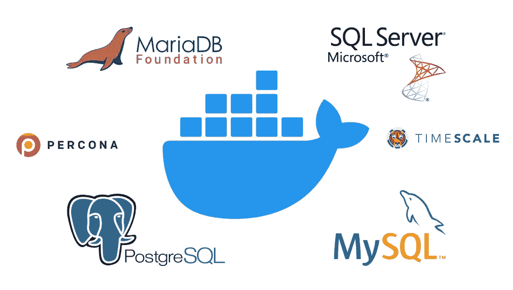

# 数据库性能提示

> 原文：<https://itnext.io/database-performance-tips-1de8b8024908?source=collection_archive---------1----------------------->

在为各种任务编写了几年程序之后，我想分享一些关于数据库的性能技巧。因为所有这些程序都有一个共同点。它们都与不同的数据库通信。不同的程序，不同的编程语言，不同种类的任务，不同的数据库。

但是这些技巧不是“基于数据库的”，所以本文不是关于调优数据库、创建表和建立索引。

这些提示是给那些正在编写程序的人的，他们必须与不同类型的数据库进行通信。

在这篇文章中，当我写“你”时，有时我指的是“你的程序”。因为在谈论我的节目时，我喜欢思考我自己。我喜欢看到程序像我一样做事情，做这做那。
所以当我谈论我的程序从数据库下载数据时(当与同事和朋友交谈时)，我总是这样说:“我打开连接，下载这个和那个，然后我处理数据”。但要明确的是，程序在做这个做那个，而不是我自己。

# 提示 0:考虑成本

我说的“考虑成本”是什么意思？

与数据库通信不是免费的。

当您打开与数据库的连接时，这需要时间。
当你要求数据时，这需要时间。
下载数据需要时间。

**时间**，在这种情况下，是成本，你必须支付，与数据库通信。在处理数据库通信时，总是要考虑时间。最后，如果用户等待 10 秒钟的结果，他就不会欣赏你超级优雅的 select 语句，或者超级黑魔法程序 hack。

你不会惊讶，我的第一个建议是什么。

# 技巧 1:不要与数据库通信

是，不与数据库通信。如果你能找到一些其他的方法，如何让你的程序正常运行，那就使用它。

让我给你举个例子。
比方说，你想从数据库中得到一些数据。当用户点击一个按钮时，他期望屏幕上出现一个数据表，也许是一个图表。你的程序打开一个与数据库的连接，让数据库做一些繁重的工作，从数据库接收工作结果，然后将结果返回给那个用户。

因此，我们有三个步骤，即“基于数据库”。打开连接，数据处理和结果传输到您的程序。假设对于一个用户的一个请求，这三个步骤需要 1 秒钟。

每当一个用户发出这个请求，数据库数据处理总共需要 1 秒钟。

因为你不负责数据库设计，你不知道确切的时间，你可以指望这 1 秒钟。因为，举个例子，1000 个用户同时做同样的事情，可能要 2 秒。也许 4 秒钟。谁知道呢。您可以测试它，但是您不能确定还有谁在与数据库通信，以及数据库现在正在执行什么任务。

**我解决这个“问题”的方法是什么？** 我在程序内存中缓存合理的数据。程序启动后，它请求数据，并将这些数据缓存在内存中。所以在开始的时候，上面的三个步骤都是一次性完成的。当用户请求数据时，无需与数据库通信。当 1000 个用户请求数据时，不需要与数据库通信。

**但是，…如果数据在变化呢？**
因为所有的数据都在变化，对吧？新用户被添加到曾经缓存过的表中，新产品被添加到曾经缓存过的表中，新订单、新设备等等。总是有新的东西。

解决这个问题的方法很简单。如果这些新数据是通过您的程序添加的，您可以将这些数据添加到数据库中，也可以添加到您曾经创建的缓存数据集中。问题解决了。

但是如果数据是从其他程序插入数据库的，你的程序必须知道数据库有新数据，对吗？我们有很多选择。其他程序可以通知您的程序。或者数据库本身可以通知您的程序，新的数据行已被添加(参见数据库通知和流)。如果有新的数据，你的程序可以询问另一个程序。您的程序可以定期缓存新数据。

总有一种方法，如何管理你的程序，以保持与数据库的通信尽可能低。

# 技巧 2:下载尽可能少的数据

第二个技巧简单明了。如果你的表有 40 列，而你只需要 2 列，不要下载 40 列。仅下载 2 个专栏。

不要用`select * from your_table`。
使用`select column_this, column_that from your_table`。

# 技巧 3:在数据库之外做繁重的工作

在这种情况下，起重是一项耗费大量时间的工作。

假设您需要一些数据，而 select 语句非常复杂。可能是来自 10 个不同表的一些连接。当您运行 select 时，您真的可以感觉到您的数据库在尖叫。假设这个选择需要 10 秒钟。
但是没有更好的方法，如何构造你的选择并且你不能改变数据库的结构。那么现在该怎么办呢？

我的建议很简单。从数据库的角度来看，我喜欢编写尽可能简单的语句。最简单的意思是，数据库没有问题，几乎可以立即工作。简单地说:我在语句执行后马上看到结果。

在这种来自 10 个不同表的连接的情况下，也许我会打开一个连接，并在这 10 个不同的表上尽可能快地执行 10 个不同的 select 语句(假设我们没有缓存这些数据)。
当然，只选择我需要的列。

如果这种方法更快，比如说 3 秒钟处理所有数据，我将使用它并在程序中处理数据库之外的数据。原因很简单:当我在程序中尽可能快地获得数据时，它现在就在我的手中进行计算。如果我能在 7 秒内完成这个计算，那么这个方法会更快。这样更好。在那 10 年里，我总是设法让它**比**快得多。
不是 7 秒，比如 70ms。或者类似的东西。

但是，如果这种方法不是更快，那么我坚持使用那个复杂的语句，或者尝试找到不同的东西。总有办法让事情变得更好。

给你一个反例。如果你想要一列的总和超过一百万行，从数据库下载所有一百万行，然后在程序中求和是没有意义的。当然，让数据库做加法是明智的。对于数据库来说，这是一项简单而快速的任务。上面的方法适用于复杂的语句，需要很长时间才能完成。

# 技巧 4:为一个“工作包”打开一个连接

随着时间的推移，当与数据库通信时，我使用了(并阅读了)不同的方法。
为了简单起见，我们可以将这些方法分为两类。

**方法 1:** 打开一个连接，当你的程序启动时，在程序运行的时候到处使用，当你的程序结束时再关闭。

**方法 2:** 仅在需要时打开与数据库的连接，然后在工作完成后关闭它。

我个人的偏好是这两者的混合体。因为我不喜欢无所事事时事情“开放”,所以我不使用第一种方法。当没有人请求数据时，为什么要保持与数据库的连接打开，例如 24 小时？
而且我也不使用第二种方法。当插入 10 行时，我不喜欢做 10 次同样的事情。在这种情况下，我不喜欢每次插入都打开一个新的连接。

对于混合方法，我的意思是:因为我是程序的作者，我知道程序在做什么，什么时候做。我为一些逻辑连接的插入、更新、删除和选择打开一个连接。当工作完成后，我知道——从程序的角度来看——将会有一段时间的通信无效，我会断开与数据库的连接。

从编程角度来看，术语“工作包”指的是一些逻辑上相关的工作，它们可以在一个批处理中完成。

给你举个例子。用户正在添加一个新产品，这也意味着另外 10 个表需要更新，一些数据应该发送回用户。这对我来说是一个“工作包”，所以我打开一个连接，完成所有的工作，然后关闭它。

# 摘要

如果你读到这里，对你来说应该是显而易见的，所有这些要点都是关于一件事情的。

尽可能保持数据库不做任何事情。

我个人从名字上看数据库。数据库是数据的**基础。**

数据库，对我来说，就是一个存储。存储，应该尽可能快地写入数据。存储，应该能尽快给我数据。而在此期间，默默哼唱，等待下一个任务。
我不喜欢用数据库来工作，那我可以在我的程序里管理。

这是我的口头禅:-)。

“嘿，数据库，这里有一些数据，储存起来，尽快做”。

“嘿，数据库，把那些数据给我，尽快做”。

“嘿，数据库，在此期间你不应该做任何事情”。

如果你是数据库新手，你可以从这本书中学到更多。

 [## 七周七个数据库，第二版

### 数据越来越大，越来越复杂，您处理数据的选择也越来越多。探索一些最…

pragprog.com](https://pragprog.com/titles/pwrdata/seven-databases-in-seven-weeks-second-edition/) 

如果你想了解更多关于我的数据库“方法”,你可以阅读下面由[彼得·贾霍达](https://medium.com/u/6f72c855da06?source=post_page-----1de8b8024908--------------------------------)写的文章

 [## Docker 中的基准数据库:MySQL、PostgreSQL、SQL Server

### 加上 MariaDB、Percona 和 TimescaleDB

itnext.io](/benchmark-databases-in-docker-mysql-postgresql-sql-server-7b129368eed7)