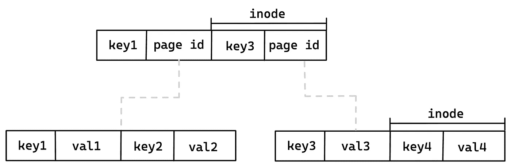
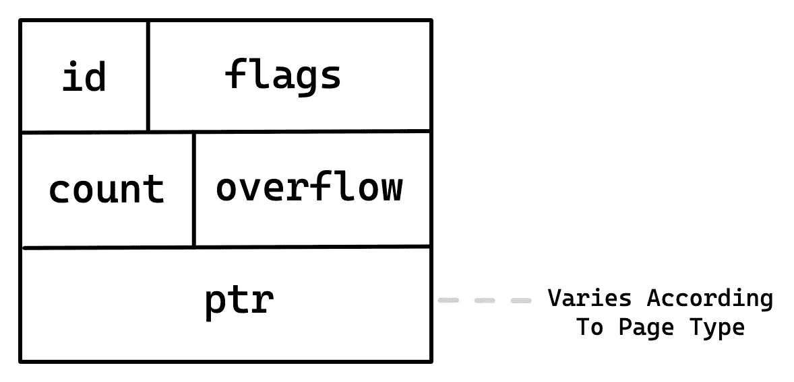
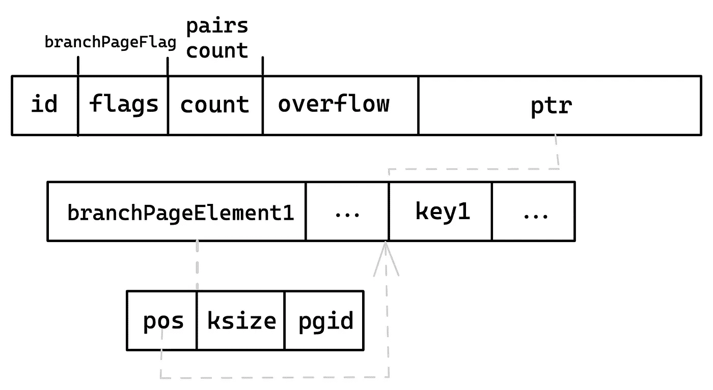
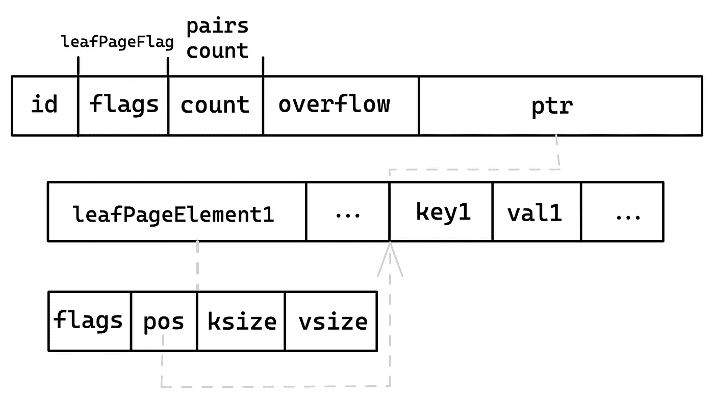
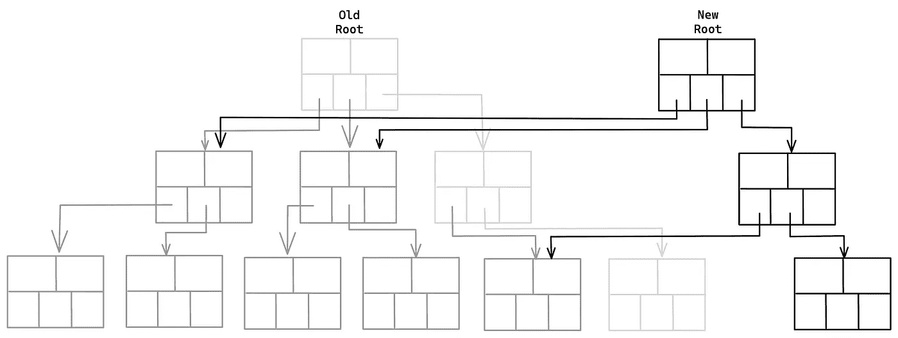
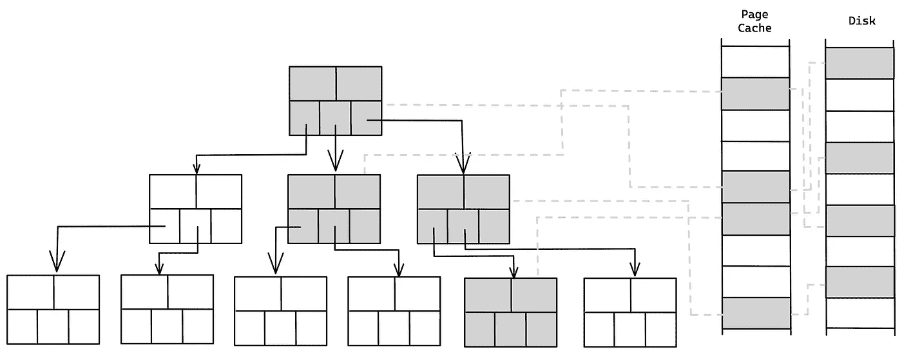

# 幕后的数据库:BoltDB 如何将数据保存到磁盘

> 原文：<https://itnext.io/databases-behind-the-scenes-how-boltdb-saves-data-to-the-disk-de8f1e3feda6?source=collection_archive---------1----------------------->

## 通过阅读源代码了解数据库如何将数据写入磁盘

马库斯·温克勒在 [Unsplash](https://unsplash.com?utm_source=medium&utm_medium=referral) 上拍摄的照片

大多数软件工程师不懂数据库。对于许多人来说，他们对数据库的唯一了解是它是否支持 SQL 或 NoSQL。

今天，我们将谈论数据库的概念。我们将看到从*写入*开始到提交到磁盘会发生什么。

我们将通过查看 BoltDB 来实现。一个用 Go 编写的轻量级数据库，用于在磁盘上存储数据。代码很简单，只有不到 5000 行代码，所以这是开始阅读数据库的好地方。

尽管 Bolt 是用 Go 编写的，但这篇文章将是语言不可知的。

# BoltDB 概述

BoltDB 是一个基于 B+树的 NoSQL 键/值存储引擎。BoltDB 中只有几种类型:`DB`、`Bucket`、`Tx`和`Cursor`。

`DB`是数据库的包装器。`Bucket`是键/值对的集合。`Bucket`操作在内部交易`Tx`中处理。取决于进程的只读或读写事务。`Cursor`用于按顺序遍历树中的键。

BoltDB 没有像成熟的数据库那样的查询语言。相反，所有操作都是通过事务本身内部的`Read`、`Put`和`Delete`函数进行的。

# 数据结构

## 记忆表征

为了定位记录，数据库系统使用*索引。**索引*建立在不同的数据结构之上，各有各的好处。最流行的是 LSM 树和 B 树及其变体。

Bolt 的底层数据结构是 B+树。这意味着 Bolt 适合于大量读取的应用程序。所有节点都包含名为`inodes`的键/值对。在分支节点上，该值是指向磁盘上的子节点的指针，在叶子节点上，它是实际值。

BoltDB 树不同于传统的树。子节点不持有指向同级节点的指针，这使得范围扫描更慢，有利于更少的空间。

BoltDB 树

再平衡也适用于“现实世界”的含义。它只包含合并和分割，没有旋转。此外，它会延迟到事务提交，以避免在事务回滚时撤消更改。

## 磁盘表示

当写入磁盘时，数据库必须开发一种如何在磁盘上放置数据的格式。页面是操作系统可以读写的最小数据量。它的大小通常为 4kb，并连续放置在磁盘上。数据库旨在使其数据与页面对齐，以最大限度地减少对磁盘的请求并提高性能。

在 Bolt 中，每个树节点对应一个或多个磁盘页面。每个页面都包含标题:id、标志、计数和溢出。

*   `flags`是页面的类型:`branch`、`leaf`、`meta`或`freelist`
*   `count`是键值对的数量
*   `overflow`是节点大时溢出的页数

以及指向页面类型特定数据的通用`ptr`字段。页面在磁盘上的布局如下:

页面布局

## 分支页面

分支页面分为两个部分:键和指向键的指针。指针有固定的大小，但是键可以变化。要找到一个键，我们可以很容易地定位指针并读取 *ksize* 字节。

分支节点布局

## 叶页面

叶页面类似于分支页面。最显著的区别是`pgid`被替换为`vsize`，并且值被添加到 keys 段。

叶节点布局

当一个节点被加载时，它必须首先被反序列化。BoltDB 没有把事情复杂化，使用二进制编码。当反序列化时，`flags`字段用于将适当的页面类型加载到`ptr`中。

当节点被保存回来时，它必须从节点表示转换成页面。因此数据被序列化为页面格式。

# 处理

酸代表原子性、一致性、隔离性和持久性。它是数据库的一组属性，保证事务得到可靠的处理。

*   原子性意味着要么所有事务都成功，要么都不成功。这确保了数据库不会处于未定义的状态。
*   一致性确保在事务完成后，根据所有定义的规则，写入数据库的任何数据都必须是有效的。
*   隔离保证所有的事务都是孤立发生的。任何交易都不会受到其他交易的影响。因此，事务不能从任何其他尚未完成的事务中读取数据。
*   持久性意味着一旦事务被提交，即使在系统出现故障的情况下，数据也将被保留。

BoltDB 事务符合 ACID。它使用写入时复制，所以当一个节点被修改时，BoltDB 会复制指向它的路径中的所有节点。然后，要应用更改，所要做的就是替换新分支的根。

这样，事务就被隔离了。在修改复制版本时，可以使用原始版本为多个读者服务。此外，事务是原子的，因为它的状态可以使用指针开关从无执行变为完成执行。

写入时复制

元数据在带有前面提到的标志`meta`的页面中被跟踪。元页面包含对根存储桶的页面 id 的引用。所以 BoltDB 通过重写元页来替换根指针。

# 页面管理

操作系统维护一个页面缓存来提高读取性能。对于常规的文件读取，调用通过缓存，但是页面可能在很久以前就已经从缓存中被逐出了。

页面缓存

许多数据库改为实现它们的缓存。BoltDB 不实现自己的缓存，而是使用`mmap`。使用`mmap`,页面在完成之前会单独保存在内存中，所以页面永远不会被驱逐。为了加快读取速度，需要更多的 RAM。

整个数据库是一个文件。使用`mmap`，必须指定映射的固定大小。文件可能会无限增长，因此必须相应地调用`mmap`。

`mmap`是一个系统调用，开销很大，所以 BoltDB 避免在每次写入后调用它。相反，它映射的内容比需要的多，因此需要调用的内容更少。从 32KB 到 1GB，增量是 2 的幂。1GB 之后，文件会以 1GB 为单位增长。

剩余空间的空闲页面由`freelist`管理。当一个事务被提交时，它从`freelist`请求空闲页面来写入修改过的节点。一旦事务完成或回滚，就可以回收页面。如果没有空闲页面，则使用更大的大小调用`mmap`。

# 把所有的放在一起

最后，我们可以将所有内容放在一起，以了解数据库事务在 BoltDB 中是如何工作的。

1.  要对数据库进行更改，需要打开一个读写事务。
2.  例如，调用`Put`并将`Cursor`移动到树中正确的节点和位置。
3.  要修改节点，必须先复制它。根据页面类型加载和反序列化相关页面。所有更改都在树上执行，直到事务提交。
4.  一旦调用了*提交*,树就会通过合并或分割重新平衡。
5.  `freelist`分配新页面。如果没有足够的页面，使用`mmap`重新映射文件。
6.  修改后的节点被序列化到页面中。页面被写入磁盘。
7.  根通过重写元页面来替换，指向新的元页面。

# 结论

我希望现在您对数据库是如何工作的有了更好的理解。最大的收获是认识到即使现代数据库很复杂，研究它们也不是那么困难。

如果你对数据库感兴趣，我推荐阅读我的关于 B 树和数据库的博客文章。我也推荐你自己阅读 BoltDB 的[源代码。](https://github.com/boltdb/bolt)