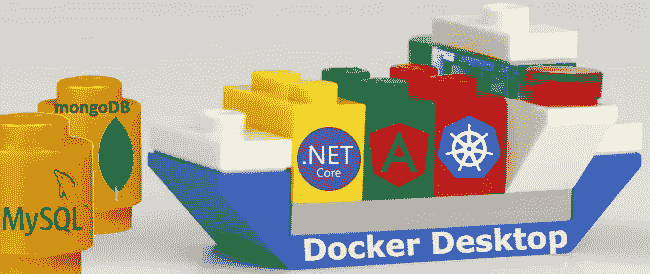
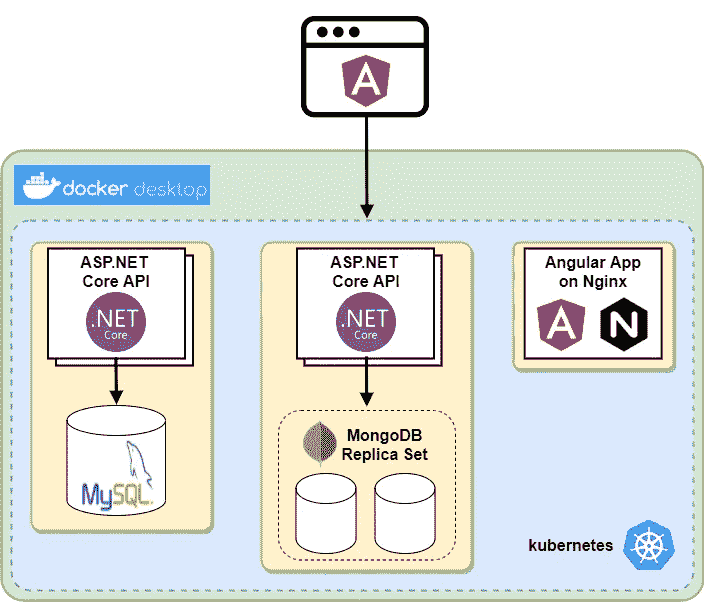
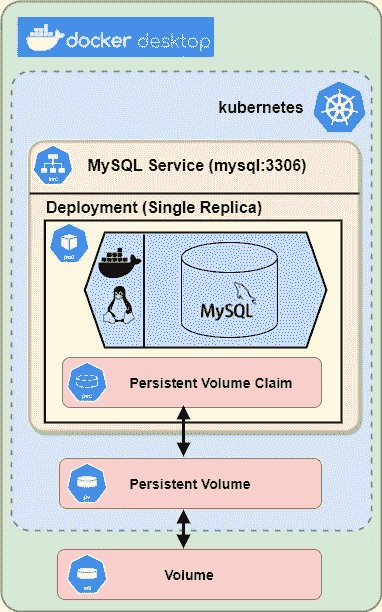
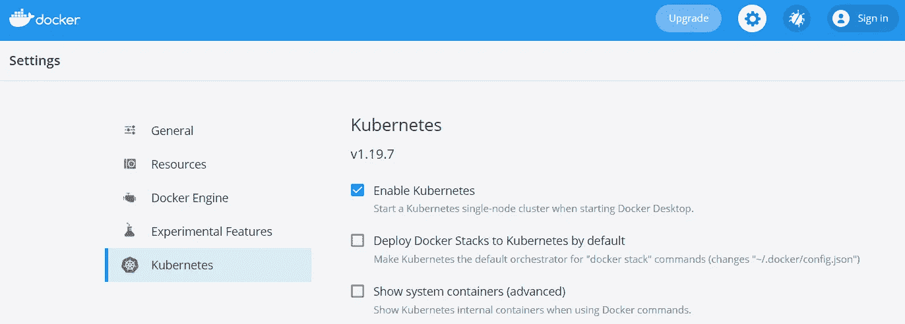
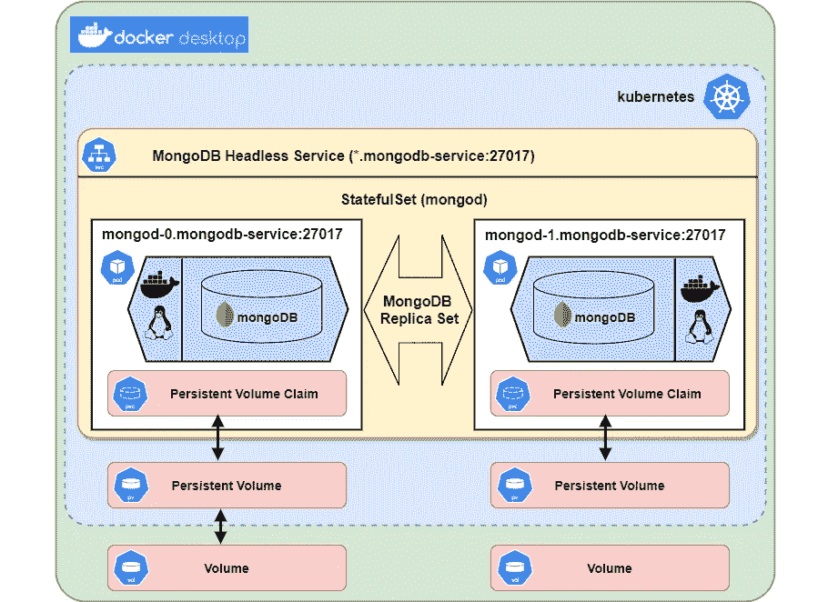
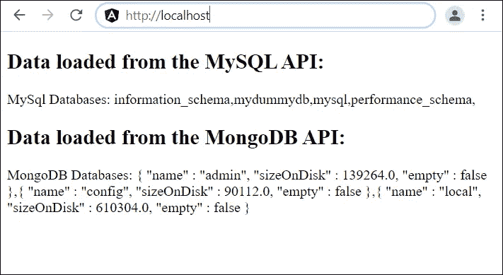

# 如何将 MySql & MongoDB 添加到一个 Kubernetes？网络核心微服务架构

> 原文：<https://itnext.io/databases-in-a-kubernetes-angular-net-core-microservice-arch-a0c0ae23dca9?source=collection_archive---------1----------------------->

## 如何使用持久卷在 Docker 桌面上的 K8S 中添加 MySQL DB 和 MongoDB 副本集，并从 ASP.NET 核心、C#和 Angular 访问数据库



在本指南中，您将**在基于微服务的云架构**中使用数据库。它从一个 **MySQL** 实例开始，继续到一个 **MongoDB 副本集**和一个**无头 Kubernetes 服务**。两个数据库都使用**持久卷**。数据库由**ASP.NET 核心后端服务**访问，并使用 **Angular 作为前端**。应用程序通过**入口控制器**公开。

*部件概述图:*



## 内容

1.  具有持久卷的 Kubernetes 中的 MySQL
2.  Kubernetes 中的 MongoDB 副本集作为 StatefulSet
3.  访问 ASP.NET 核心 REST-API 服务中的数据库
4.  从 Angular 调用 ASP.NET 核心 API
5.  将 Angular 应用程序和 ASP.NET 核心服务部署到 Kubernetes
6.  最后的想法和展望

# 1.具有持久卷的 Kubernetes 中的 MySQL

您将在 Docker 桌面上的 Kubernetes 中部署一个 MySQL pod。服务将使其在端口 3306 上可访问。您将使用 Kubernetes 持久卷，这样 MySQL 数据在 pod 重新启动或删除后仍然存在。

*Docker 桌面上 Kubernetes 的 MySQL 部署:*



## 准备

安装[Docker Desktop for Windows](https://hub.docker.com/editions/community/docker-ce-desktop-windows)并启用 Kubernetes:



## 创建部署

创建文件 mysql.yaml:

**应用 yaml:**

```
C:\dev\demo>kubectl apply -f mysql.yaml
```

## (可选)使用一个临时 MySQL 客户端容器来访问和测试 MySQL 部署

创建容器并连接到 MySQL 数据库服务器(在一行中输入命令):

```
C:\dev\demo>kubectl run -it — rm — image=mysql:5.6 — restart=Never mysql-client — mysql -h mysql -ppassword
```

创建新数据库:

```
mysql>create database testdb;
```

您可以删除 MySQL pod:

```
C:\dev\demo>kubectl delete pod -l app=mysql
```

Kubernetes 会自动重建豆荚。持久卷保证 sql 数据在删除和重新创建 pod 后仍然存在。

> 您必须保护您的 MySQL 配置，以便在生产环境中使用它。使用 Kubernetes 的秘密等。

***延伸阅读官方 Kubernetes 文档中的****:*[*运行单实例有状态应用*](https://kubernetes.io/docs/tasks/run-application/run-single-instance-stateful-application/) (MySQL)

# 2.Kubernetes 中的 MongoDB 副本集作为 StatefulSet

您将使用 StatefulSet 向 Kubernetes 部署两个 MongoDB pods。每个 pod 都使用自己的持久存储。然后将这两个实例配置为一个 MongoDB 副本集。

无头服务使实例可以在端口 27017 和确定性名称“mongod-0.mongodb-service”和“mongod-1.mongodb-service”上访问:



## 创建状态集

创建文件 mongodb.yaml:

应用 yaml:

```
C:\dev\demo>kubectl apply -f mongodb.yaml
```

## 配置 MongoDB 副本集

> 您将手动配置副本集。参见本文，了解如何使用 sidecar 容器进行自动配置:[在 Kubernetes 上运行 MongoDB，使用 StatefulSets](https://kubernetes.io/blog/2017/01/running-mongodb-on-kubernetes-with-statefulsets/)

连接到 mongod-0 pod:

```
C:\dev\demo>kubectl exec -it mongod-0 -c mongod-container bash
```

启动 mongo 客户端:

```
root@mongod-0:/# mongo
```

配置副本集(在一行中输入命令):

```
MainRepSet:PRIMARY> rs.initiate({ _id: “MainRepSet”, version: 1, members: [{ _id: 0, host: “mongod-0.mongodb-service.default.svc.cluster.local:27017” }, { _id: 1, host: “mongod-1.mongodb-service.default.svc.cluster.local:27017” } ]});
```

> 您必须保护您的 MongoDB 配置，以便在生产环境中使用它。使用 Kubernetes 的秘密等。

*延伸阅读:*[*MongoDB statefullset in Kubernetes*](https://deeptiman.medium.com/mongodb-statefulset-in-kubernetes-87c2f5974821)*by*[*Deeptiman Pattnaik*](https://medium.com/u/3a3e6395f78f?source=post_page-----a0c0ae23dca9--------------------------------)

# 3.访问 ASP.NET 核心 REST-API 服务中的数据库

您将创建一个 ASP.NET 核心 web API 来访问 MySQL 数据库，并创建第二个 ASP.NET 核心 web API 来连接到 MongoDB 副本集。最后，您将为每个 API 创建一个 docker 映像。

这篇文章关注的是数据库访问。所以我把其他方面说得很短。关于如何在 Docker Desktop with Ingress 上使用 K8S，使用 ASP.NET 核心 REST API 和 Angular 为云进行本地开发的详细信息，请参见我之前的帖子[。](https://levelup.gitconnected.com/kubernetes-angular-asp-net-core-microservice-architecture-c46fc66ede44)

用 ASP.NET 和 web 开发工作量安装 [Visual Studio 社区](https://visualstudio.microsoft.com/en/vs/community/)(免费)。

## 使用 MySQL 服务创建一个 API

创建一个 ASP.NET 核心 5.0 Web API 项目，并将其命名为“MySqlApi”。激活 Docker，使用“Linux”设置。禁用 HTTPS。

安装“MySQL connector”nu get 包。

*延伸阅读:*[【https://mysqlconnector.net/tutorials/connect-to-mysql/】T21](https://mysqlconnector.net/tutorials/connect-to-mysql/)

添加一个新控制器“MySqlController”:

该代码将查询并返回 MySQL 服务器中的所有数据库。

> 为了更容易理解，所有代码都放在一个方法中。请确保使用正确的配置等。在生产环境中运行时。

**将 API 归档**

在 Visual Studio MySqlApi 项目中，将项目资源管理器中的文件“Dockerfile”重命名为“dockerfile”(第一个字符小写)。然后右键单击 Docker 文件，选择“创建 Docker 映像”。这也会将图像推送到 docker。

## 使用 MongoDB 服务创建一个 API

创建第二个 Web API 项目，并将其命名为“MongoDbApi”。使用与“MySqlApi”项目相同的设置。

安装“MongoDB。驱动程序" NuGet 包。

添加一个新控制器“MongoDbController”:

代码将查询并返回 MongoDB 副本集中的所有集合。

像在 MySqlApi 项目中一样创建 docker 映像。

# 4.从 Angular 调用 ASP.NET 核心 API

您将创建一个 Angular 应用程序来加载和显示来自 ASP.NET API 的数据。最后，您创建一个 docker 映像，它使用 NGINX 为应用程序提供服务。

Node.js/NPM 下载安装[。

安装 Angular(我写这个指南的时候用的是 Angular 9):](https://nodejs.org/en/download/)

```
C:\dev\demo>npm install -g [@angular/cli](http://twitter.com/angular/cli)
```

创建应用程序:

```
C:\dev\demo>ng new DemoApp
```

调整`DemoApp\src\app`中的代码

将 HttpClientModule 添加到 **app.module.ts** :

调用 **app.component.ts** 中的 REST-API:

在**app.component.html**中显示加载的数据:

## 将 Angular 应用程序归档

创建文件`DemoApp\src\app\dockerfile`

确保文件“dockerfile”没有文件扩展名。这将使用 NGINX 来服务应用程序:

创建文件”。dockerignore”(开头带点):

打开命令提示符并构建 docker 映像(末尾的点很重要):

```
C:\dev\demo\DemoApp>docker build -t demoapp .
```

# 5.将 Angular 应用程序和 ASP.NET 核心服务部署到 Kubernetes

安装 NGINX 入口控制器(在命令行的一行中):

```
C:\dev\demo>kubectl apply -f [https://raw.githubusercontent.com/kubernetes/ingress-nginx/controller-v0.41.2/deploy/static/provider/cloud/deploy.yaml](https://raw.githubusercontent.com/kubernetes/ingress-nginx/controller-v0.41.2/deploy/static/provider/cloud/deploy.yaml)
```

创建 kubernetes.yaml:

应用 yaml:

```
C:\dev\demo>kubectl apply -f kubernetes.yaml
```

**大功告成！**在 http 端口 80 上打开浏览器，查看您的 Kubernetes 微服务是如何工作的:



# 6.最后的想法和展望

您为基于微服务的云架构创建了**工作基础**和**使用了两种不同类型的数据库**。

请确保**调整代码以在生产环境中使用** : C **改进代码**和**应用安全最佳实践**，使用 Kubernetes 的秘密和最新的安全映像。应用角度和。NET 核心设计模式、错误处理等。

见我的后续帖子 [**如何使用事件进行微服务间通信**](/how-to-build-an-event-driven-asp-net-core-microservice-architecture-e0ef2976f33f) 。

我会在接下来的文章中向你展示更多的内容:Kubernetes 的秘密，安全方面，如 SSL、日志、调试、CI/CD、导航图、(代码)质量、(自动)伸缩和自我修复等。

**查看我的其他故事如何:**

*   [在 Angular 中登录谷歌，使用 JWT。使用非对称(RSA)签名令牌进行 NET Core API 认证](https://levelup.gitconnected.com/how-to-sign-in-with-google-in-angular-and-use-jwt-based-net-core-api-authentication-rsa-6635719fb86c)
*   [使用 NSwag 自动生成 TypeScript 客户端访问. NET 核心服务 API，使用 OpenAPI/Swagger 描述 API](https://levelup.gitconnected.com/how-to-jwt-authenticate-with-angular-to-an-asp-net-4cfab5298d08)

如果您有任何问题、想法或建议，请联系我。