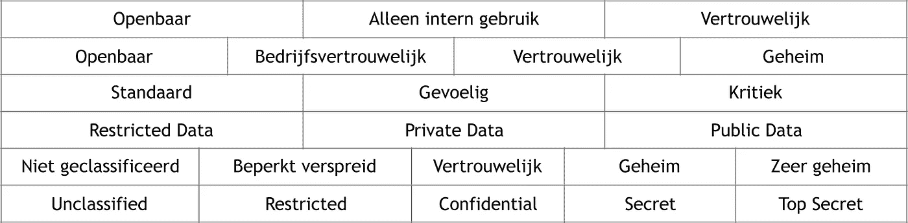
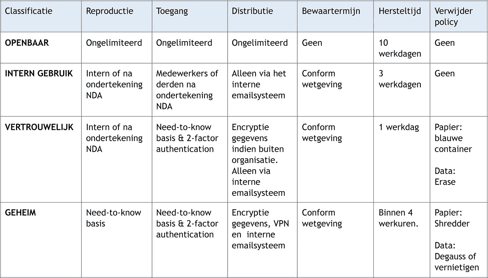
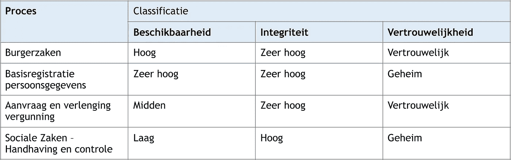

# 作为安全意识和 GDPR 法规遵从性的催化剂的数据分类

> 原文：<https://itnext.io/dataclassificatie-dcee9ac43b0?source=collection_archive---------2----------------------->

## 什么是数据分类，为什么这很重要？

> "我们真的需要这些销售数字在一个小时内！"
> 
> "把那封邮件留给你自己留着吧我不希望它放在别的地方"
> 
> “您可以将文档转换为 PDF 吗？，则无法对其进行调整。

只是三种无意识的数据分类形式，也就是为数据添加标签以赋予其价值。例如，这些标签为“公用”、“机密”或“机密”。分类决定了保护数据的措施数量。

# 为什么要进行数据分类？

数据是当今企业的命脉，因此制定使用协议非常重要。因为资料遗失所造成的损害可能会影响业务连续性。业务策略和法规应作为确定哪些风险是可接受的，哪些风险应采取哪些措施予以涵盖的基础。因为薪水要求的待遇和公司餐厅的菜单要求的不一样。

从 2018 年 5 月 25 日起在整个欧盟范围内保持的 [GDPR](https://www.linkit.nl/knowledge-base/245/GDPR_zijn_bedrijven_voorbereid_op_de_nieuwe_Europese_privacy_verordening) 要求企业和组织知道哪些(隐私)数据正在被处理、存储和销毁。这就要求严格的安全性。因此，GDPR 对于许多企业来说也是进入数据分类的关键。

# **不同分类**

数据分类迫使企业思考必须确保数据的机密性、完整性和可用性的程度。“机密”分类需要比“公开”更严格的安全措施。

在此过程中，有多种分类可供选择，具体取决于功能、风险和部署成本。使用的组合包括:

数据分类的组合。

# 如何确定分类级别？

要确定要分配的分类级别，请执行以下步骤:

**步骤 1**关键流程分析
主要是要绘制数据对业务有价值的关键流程图。这可以通过特定的问卷来确定。了解相关数据的一种快速方法是使用敏感数据发现工具，如地面实验室的[数据记录](https://www.groundlabs.com/data-recon)。

**步骤 2**分配数据所有者
分析数据后，可以分配数据所有者。假设谁对数据的业务需求最大。数据所有者负责指定所需的分类级别。

**步骤 3** :法律框架
作为第三步，将研究法律法规的要求。当前的隐私法(Wbp)和即将推出的[avg](https://autoriteitpersoonsgegevens.nl/nl/onderwerpen/europese-privacywetgeving/algemene-verordening-gegevensbescherming)/gdpr 对个人信息的处理和存储提出了严格的要求。因此，除了业务动机之外，法律还强制规定了特定的分类级别。

**步骤 4** :建立分类矩阵
当前三步完成后，可以在所谓的分类矩阵中定义所需的分类级别。下面是一个示例:

在**b**可用性、**I**完整性和**v**信息系统和应用程序的机密性的分类级别中指定了数据保护级别。此所谓 BIV 分类包含在匹配的[配置项【t18(ci)】中，并在组织内的](https://en.wikipedia.org/wiki/Configuration_item)[初始服务管理流程](https://wiki.en.it-processmaps.com/index.php/ITIL_Processes#ITIL_V3_Processes)中作为参考。

例如，HR 应用程序的 BIV 分类为 233(其中 000 表示最小值，333 表示最大值)。

**步骤 5**分配分类
是数据所有者分配分类的最后一步。这将生成流程分类表。以下是一个可以在荷兰城市中使用的虚构表格示例:

# **有什么好处？**

数据分类的最大好处是提高了警觉。一方面考虑在新系统部署时保护数据(分配 BIV 分类)，另一方面考虑在文档和电子邮件中的可见性。如果发现分类为“机密”，则发送者和/或接收者将立即清楚地知道需要对其进行不同的处理。

其他优点包括:

(1)了解数据可减少网络犯罪的有害影响。以加密[转换器](https://www.linkit.nl/knowledge-base/239/Dossier_Ransomware_Deel_I_Een_introductie)为例，越来越频繁地将组织中最重要的文件放在第一位。正确实施的数据分类有助于减少损坏并实现快速恢复。

(2)符合法规和认证要求:

*   GDPR 数据保护影响评估(DPIA)
*   GDPR 隐私影响评估(PIA)。
*   GDPR 文档位置。
*   GDPR 被遗忘的权利(保留、数据分类矩阵)。
*   ISO27001 (A.8.2 .信息分类)。

# **有什么缺点？**

在安全措施的情况下，总会有一个贸易壁垒。主要缺点包括:

*   *增加管理负担，*新数据必须始终先分类，数据所有者必须授予权限，做出决策等。
*   *追加投资*实施数据分类需要组织资金。
*   *部署时间*，数据分类不能单独设置，还必须满足其他安全措施。
*   *未完全控制*，由于云服务的增加，组织外部的数据安全性更难控制。
*   *没有完全复盖，*围绕数据分类的安全措施可能是单方面的。例如，由于 t14 加密 t15，组织可能需要使用[PGP](https://en.wikipedia.org/wiki/Pretty_Good_Privacy)邮件程序。如果接收方没有相同的版本，则加密将不起作用，或者只能对一个方有效。

# **托宁**

使用「资料分类工具」可以解决某些所述的缺点。市场上提供了多种工具，通常是基于手动分类或通过高级文件格式分析自动进行的。一些供应商将数据分类作为其 t20 数据丢失预防[t21(DLP)解决方案的一个集成部分提供。

Microsoft 最近在其 Azure cloud 平台中添加了一项数据分类服务，称为“t0”【azure 信息保护】。本服务在创建和修改数据时对数据进行分类、标记和保护。无论数据存储在何处，在数据的整个生命周期内都保持安全。

其他数据分类工具示例包括[数字守护者](https://digitalguardian.com/resources/data-security-knowledge-base/data-classification)和[抢占高级分类引擎](https://www.forcepoint.com/innovation/technology/forcepoint-advanced-classification-engine-ace) (ACE)。

# 结论和建议

数据分类是否会减少数据分岔？不，不仅仅是分类，而是信息安全策略的一部分。附加优势是符合 GDP 的坚实基础。成功的实施非常重要，但数据分类的选择源自组织的内部动机。

建议您尽可能提高数据分类标准。请不要选择不必要的分类级别，并尽可能降低每个系统的分类级别。分类过多或过高会导致不必要的投资和接受度降低。

在许多组织中，数据分类仍然不普及。但是已经采取了一些重大的技术步骤来尽量减少人为干扰。自动化是进一步收养的关键。

数据分类可提高安全性。员工不会再将机密文件储存在 USB 随身碟或个人资料匣中。创造意识仍然是非常有效的安全措施。

有关数据分类的详细信息，请参阅以下内容:

*   [国家信息安全总局基线概况(2012 年)](http://www.earonline.nl/index.php/Overzicht_Baseline_Informatiebeveiliging_Rijksdienst_%2528BIR_2012%2529)
*   [数据分类指南(CIO 平台荷兰)](https://www.cio-platform.nl/l/en/library/download/urn:uuid:4dd82ea3-333a-43a5-8229-c4bf6af7f059/2016+handreiking+dataclassificatie+cio+platform+nederland+%2528nl%2529.pdf?format=save_to_disk)
*   [大 27001](https://www.iso.org/isoiec-27001-information-security.html)