# Datadog — Azure API 管理日志

> 原文：<https://itnext.io/datadog-azure-api-management-logs-60f9d45d667a?source=collection_archive---------1----------------------->

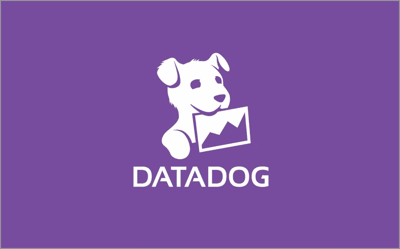

[来源](https://devclass.com/2019/12/05/datadog-serves-rum-brings-users-into-focus/)

Azure 资源通常与日志和 APM(应用程序性能监控)的 App Insights 有很好的集成。但有时您的监控堆栈是由第三方公司提供的，如 New Relic、Zabbix 或 Datadog。

在本指南中，我们将介绍如何将每个触及 Azure API 管理的请求记录到 Datadog 中。

## 什么是 Datadog？

Datadog 是一种针对云规模应用程序的监控服务，通过位于 SaaS 的数据分析平台提供对服务器、数据库、工具和服务的监控。[维基百科]

# 从 API 管理记录日志

我在[基地文档](https://docs.datadoghq.com/integrations/azure/?tab=azurecliv20#datadog-azure-function)中了解到这个测井流程。

# 台阶

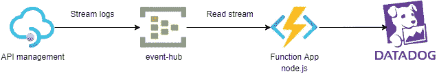

图表:Azure API 管理>事件中心>功能应用>数据狗

这种集成需要一些组件，所以让我们来手动配置一下:

> ***确保您将资源添加到同一个区域**

## **1。添加事件中心名称空间**

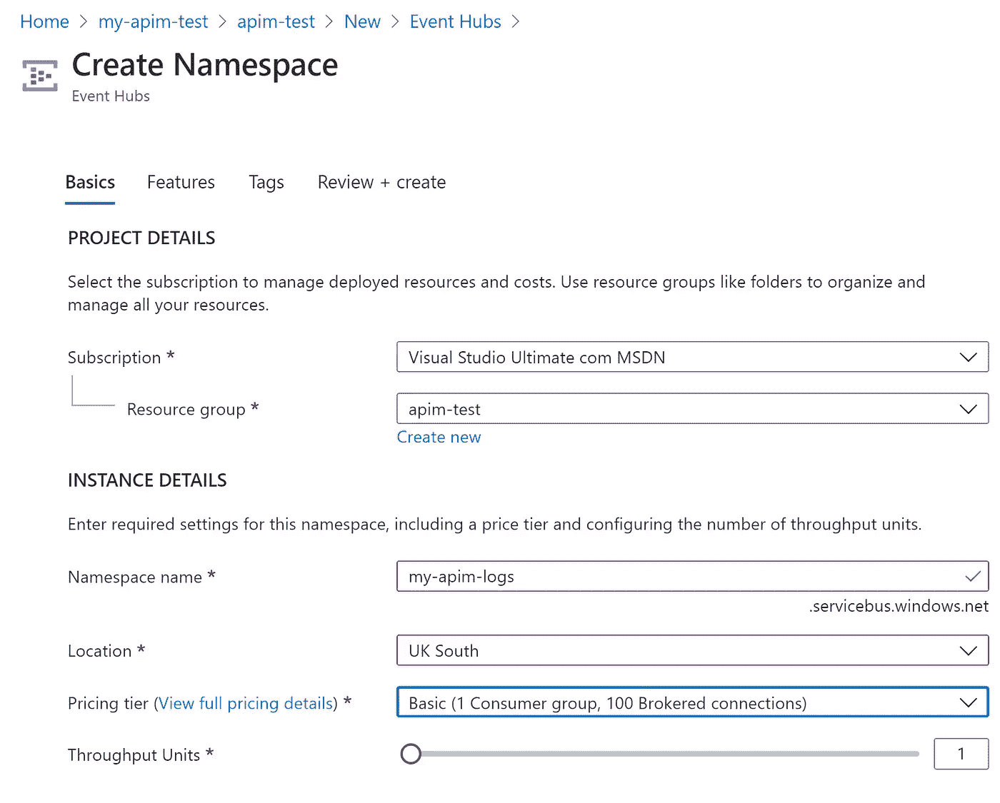

创建事件中心命名空间 Azure 页面

## **2。在名称空间中创建事件中心:**

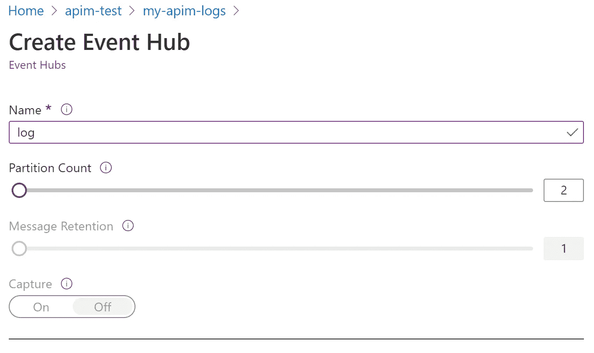

创建事件中心 Azure 页面

## **3。启用诊断记录:**

Azure 似乎正在向这种模式发展，在这种模式下，每个资源都将公开诊断设置，因此本教程可以用于其他资源类型的 Datadog 集成。

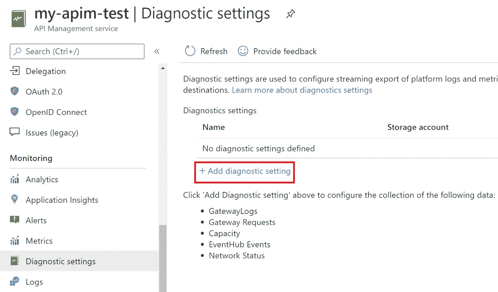

在 API 管理中启用诊断

启用诊断设置，将“网关日志”记录到我们创建的事件中心

至此，我们已经完成了一半的集成:

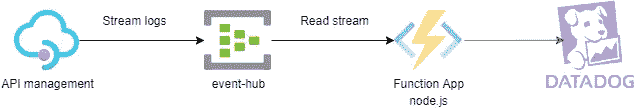

图表:Azure API 管理>事件中心>其他组件被禁用

## 4.创建功能应用程序:

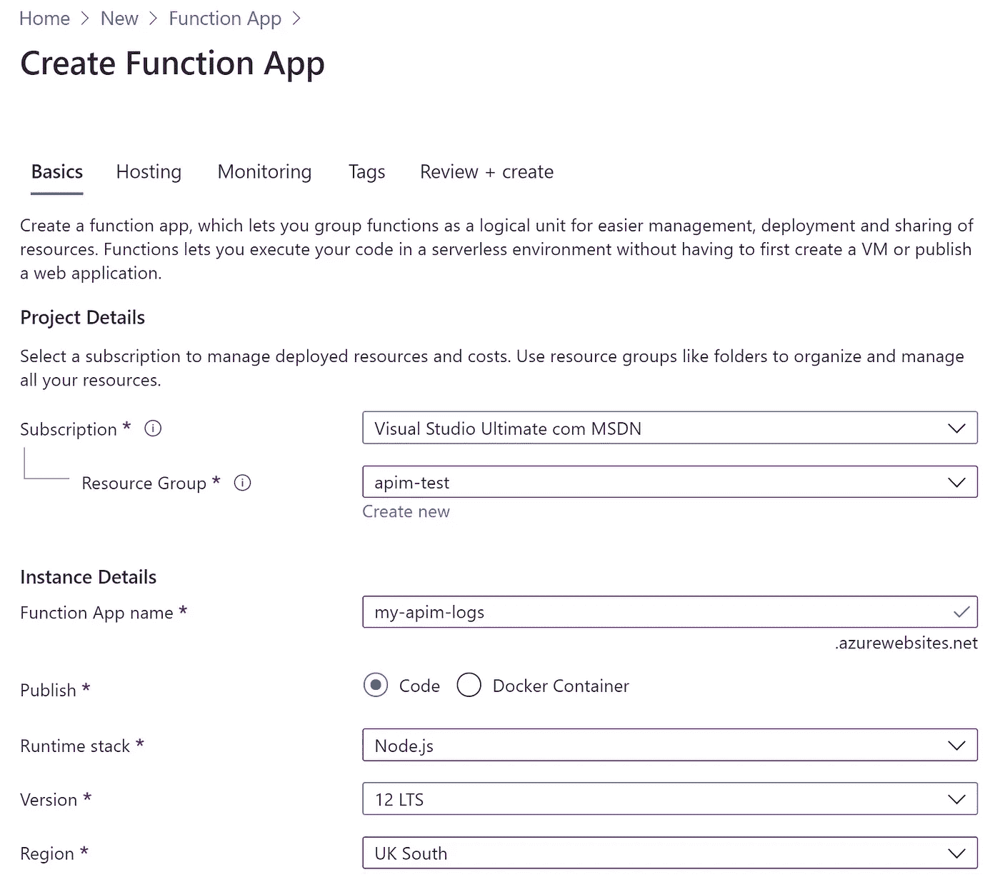

## 5.添加配置:

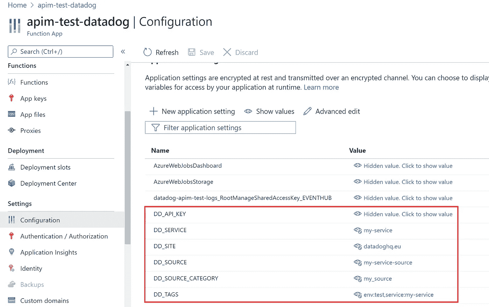

*   DD_API_KEY —数据狗的 API 密钥
*   DD_SITE —下面的函数使用它来决定使用哪个数据狗站点。(默认为美国)
*   下面的函数用于元数据:DD_SERVICE，DD_SOURCE，DD_TAGS，DD_SOURCE_CATEGORY

## 6.部署功能代码:

创建带有事件中心触发器的应用程序功能

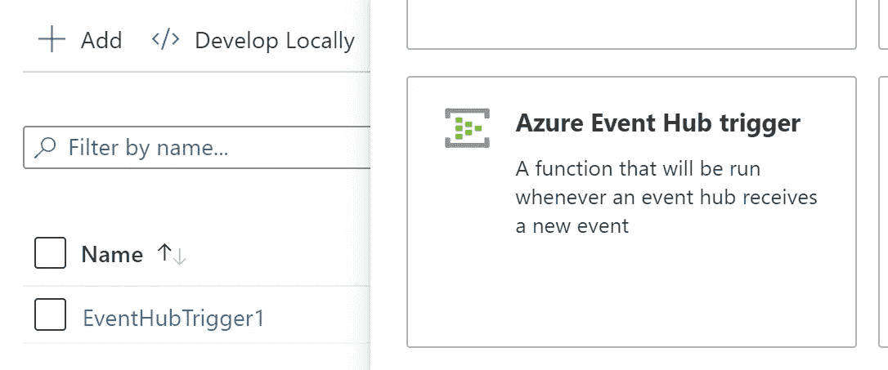

确保连接指向我们之前创建的事件中心:

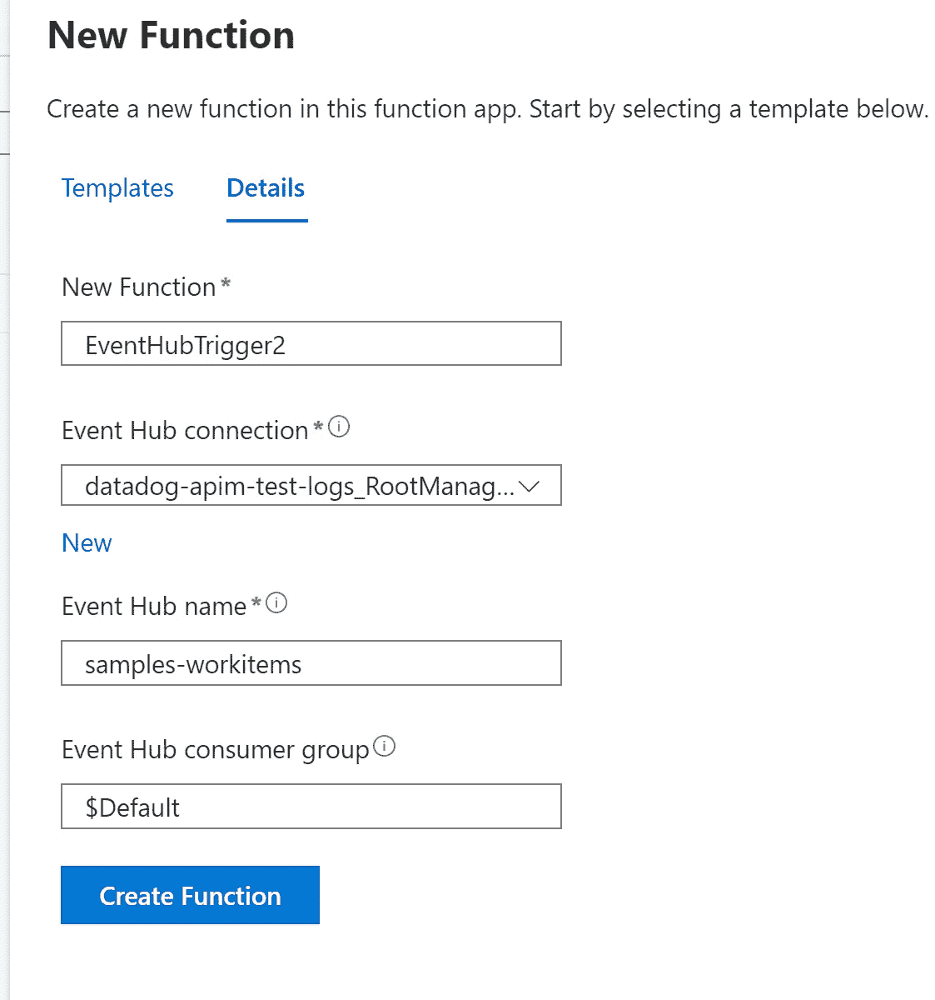

部署此代码:

来源于

## 7.单独测试功能

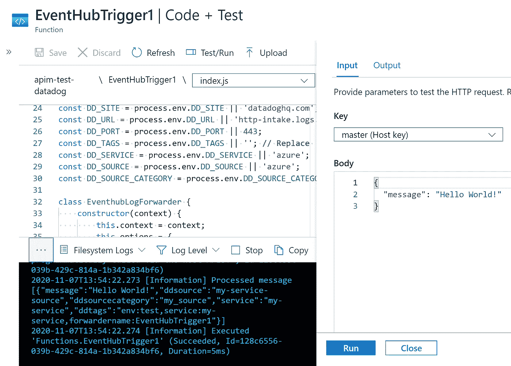

## 8.确认日志到达数据狗

通过在 API 管理实例中进行 API 调用来测试整个流程。

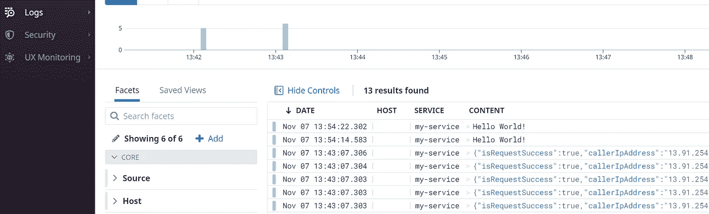

数据狗日志页面

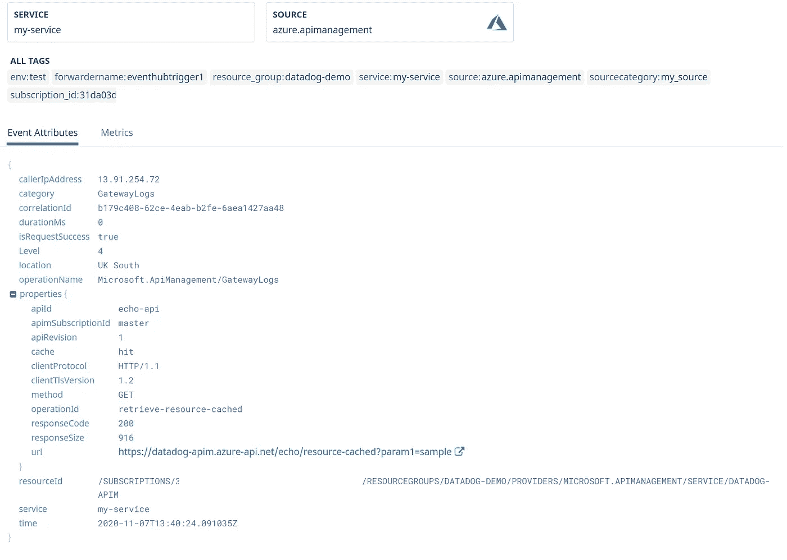

数据狗日志

# Terraform 自动化:

当然，我不会让您手动设置，以下是 Terraform 脚本:

Terraform 脚本，创建所有步骤并将它们链接在一起。

[在 Github 上](https://github.com/RaphaelYoshiga/ApiManagementLogsDatadog)

在这一点上，我还没有自动化 Node.js 函数的部署，因为这是最不复杂的部分，但是如果需要的话，这不会太难。

# 结论

这不是一个简单的集成，但我希望展示了将 API 管理日志与 Datadog 集成的可能性，并且像这样复杂的手动设置可以使用 Terraform 自动完成。